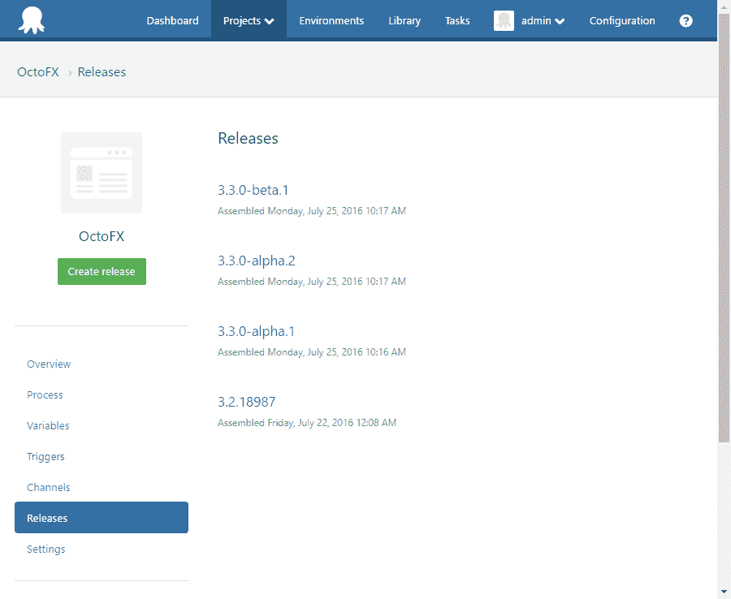

# 语义版本 2.0.0 - Octopus 部署

> 原文：<https://octopus.com/blog/semver2>

这篇文章是我们 Octopus 3.4 博客系列的一部分。在我们的[博客](https://octopus.com/blog/octopus34-blog-series-kickoff)或我们的[推特](https://twitter.com/OctopusDeploy)上关注它。

**Octopus Deploy 3.4 已经发货！阅读[博文](https://octopus.com/blog/octopus-deploy-3.4)和[今天就下载](https://octopus.com/downloads)！**

* * *

Octopus 3.4 包含对[语义版本 2.0.0](http://semver.org/spec/v2.0.0.html) 的支持。

SemVer 2.0.0 中的重大变化涉及:

*   预发布版本
*   构建元数据

## 预发布

在 [SemVer 1.0.0](http://semver.org/spec/v1.0.0.html) 中，预发布版本被限制为字母数字字符和破折号`[0-9A-Za-z-]`。

例如，`1.0.0-alpha`表示 alpha 预发布版本 1.0.0。

这一点的主要限制来自于[语义版本规范](http://semver.org/spec/v1.0.0.html)中的第 4 条:

> 优先级应该由字典式 ASCII 排序顺序决定。例如:1 . 0 . 0-α1 < 1 . 0 . 0-β1 < 1 . 0 . 0-β2 < 1 . 0 . 0-rc1 < 1 . 0 . 0。

假设您有上面提到的 alpha 预发布的多个版本:

```
1.0.0-alpha1
1.0.0-alpha2
1.0.0-alpha3
etc... 
```

一切都好；直到你到达`1.0.0-alpha10`。字典排序将*放在* `1.0.0-alpha2`之前。

一个常见的解决方法是使用类似于`1.0.0-alpha0001`的东西。不太优雅，对吧？哦，对了， [NuGet 将预发布标签限制在 20 个字符内](https://nuget.codeplex.com/workitem/3426)。所以这个解决方案并不理想。

来自[语义版本 2.0.0 规范](http://semver.org/spec/v2.0.0.html)条款 9:

> 预发布版本可以通过在补丁版本后添加连字符和一系列点分隔的标识符来表示。标识符必须只包含 ASCII 字母数字和连字符[0-9A-Za-z-]。

根据第 11 条:

> 具有相同主要版本、次要版本和修补版本的两个预发布版本的优先级必须通过从左到右比较每个点分隔的标识符来确定，直到发现如下差异:仅由数字组成的标识符在数字上进行比较，而带有字母或连字符的标识符在词汇上以 ASCII 排序顺序进行比较。数字标识符的优先级总是低于非数字标识符。如果前面的所有标识符都相等，则较大的预发布字段集比较小的预发布字段集具有更高的优先级。例如:1 . 0 . 0-α< 1 . 0 . 0-α1 < 1 . 0 . 0-αβ< 1 . 0 . 0-β< 1 . 0 . 0-β2 < 1 . 0 . 0-β11 < 1 . 0 . 0-RC . 1 < 1 . 0 . 0。

换句话说，我们可以

```
 1.0.0-alpha.1 
```

以至

```
 1.0.0-alpha.1.5.20 
```

优先级的工作方式如您所料:

```
 1.0.0-alpha.8
 1.0.0-alpha.9
 1.0.0-alpha.10 
```

## 构建元数据

在 SemVer 1.0.0 中，预发布标签的使用不一致。

在某些情况下，它们被用于版本控制(如上所述)。在其他情况下，它们用于将元数据附加到版本中。例如，我们从客户那里看到的一个常见模式是使用预发布标签来指示代码分支。

例如，包版本的

```
Acme.Web.1.0.0-featureA 
```

会指出这个包是从`featureA`代码分支构建的。

SemVer 2.0.0 引入了构建元数据。来自[规范](http://semver.org/spec/v2.0.0.html)的第 10 条:

> 构建元数据可以通过在补丁或预发布版本后附加一个加号和一系列点分隔的标识符来表示。标识符必须只包含 ASCII 字母数字和连字符[0-9A-Za-z-]。

这将添加版本的一个组件，该组件显式用于附加元数据。

例如:

```
1.0.0+featureA
1.0.0-alpha.1+31ef756 
```

这本质上是版本的一个组件，没有任何预定义的语义。你可以随意赋予它任何意义。章鱼部署应用的唯一解释是平等。即`1.0.0+featureA` `!=` `1.0.0+featureB` `!=` `1.0.0`。

重要的是要注意，在确定优先级时，元数据组件是*而不是*考虑的。对于只有元数据不同的两个版本，它们的优先级应该被认为是未定义的。

## 章鱼

### 放

在 Octopus Deploy 中，您现在可以使用 SemVer 2.0.0 版本作为发布号。



### 包装

Octopus Deploy 3.4 还将允许您使用使用 SemVer 2.0.0 版本的包。


#### NuGet 包

从 NuGet 3.5 beta 版开始，`nuget.exe pack`不支持用 SemVer 2.0.0 版本创建 nu get 包。

NuGet 团队打算在某个时候增加对 2.0.0 版本的支持。

对消费 SemVer 2.0.0 NuGet 包的支持已经添加到 Octopus Deploy 中。此外，我们还在[Octo.exe](http://docs.octopusdeploy.com/display/OD/Using+Octo.exe)中添加了使用 SemVer 2.0.0 版本创建 NuGet 包的功能。

`octo.exe pack --id=Acme.Web --version=1.5.0-alpha.1`

这意味着对我们各种 CI 插件(如 TeamCity，TFS)的“包”任务的支持也将可用。

这些包可以被推送到内置的 Octopus 包存储库中。MyGet 也接受 SemVer 2.0.0 版本的包。

截至本帖发布之日，我们还没有实现为 [OctoPack](http://docs.octopusdeploy.com/display/OD/Using+OctoPack) 创建 SemVer 2.0.0 包的能力(OctoPack 目前直接调用 NuGet.exe)。如果这是您特别想要的，请向我们提供反馈。

*祝语义版本部署愉快！*