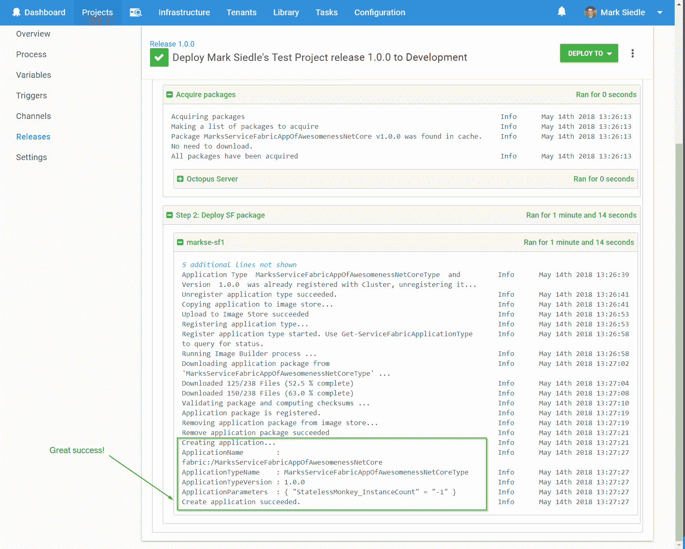

# 服务结构部署目标- Octopus 部署

> 原文：<https://octopus.com/blog/service-fabric-cluster-targets>

随着 2018.5 的[发布和](https://octopus.com/blog/octopus-release-2018.5) [Azure 服务架构集群目标](https://octopus.com/blog/paas-targets)的引入，我们认为这将是一个完美的机会，可以通过 Octopus Deploy 快速概述新的服务架构部署目标。

如果你刚刚开始，服务结构可能会有点让人不知所措😃尤其是如果您只是想获得创建灵活/可重复部署场景所需步骤的高级概述。这篇文章旨在通过展示 Octopus Deploy 的新 Azure 服务结构集群目标来解决这个问题！

## 服务结构和可预见的未来

Azure 最近[宣布](https://blogs.msdn.microsoft.com/appserviceteam/2018/03/12/deprecating-service-management-apis-support-for-azure-app-services/)从 2018 年 6 月 30 日起，他们将停止对服务管理 API 的支持。在这个声明之后(关于云服务的未来，社区有很多困惑——source:me = P ),已经确认云服务仍然会被支持，但是有一个明确的推动，将人们推向更新的资源管理世界。还有这样的陈述需要考虑:*“云服务在控制程度和易用性方面类似于服务结构，但它现在是一个遗留服务，建议新开发使用服务结构”* ( [来源](https://docs.microsoft.com/en-us/azure/app-service/choose-web-site-cloud-service-vm))。

随着 Service Fabric 成为 Azure 中新云服务开发的推荐路径，让我们看看使用您自己的 Service Fabric 集群进行设置和部署是多么容易。

## 在 Azure 上创建服务结构集群

Azure 让安全启动和运行服务结构集群变得非常容易。关于服务结构和资源的[文档在过去一年左右的时间里取得了长足的进步，对于任何想要查看快速入门指南和分步教程的人来说，这都是一个很好的资源。](https://docs.microsoft.com/en-us/azure/service-fabric/)

为了跳到有趣的部分，你可以得到一个通过 Azure 门户创建 Azure 服务架构集群的[的演练，或者，如果编写脚本更适合你的话，](https://docs.microsoft.com/en-us/azure/service-fabric/service-fabric-cluster-creation-via-portal)[通过 ARM 创建 Azure 服务架构集群](https://docs.microsoft.com/en-us/azure/service-fabric/service-fabric-cluster-creation-via-arm)。

对于这个例子，我们通过 Azure portal 方法手动创建了集群。

### 陷阱#1:初始等待时间

当在 Azure 上构建服务结构集群时，我们需要仔细观察集群的状态，并确保在尝试连接或部署任何东西之前它显示“就绪”。

~~这一点值得一提，因为在 Azure 上创建集群后，通常会有很长的等待时间，直到所有节点都已配置好，节点的“基线升级”也已完成，最终一切就绪。根据我们的观察，这个过程可能需要 1-6 个小时，这取决于某一天月亮和星星的排列😃~~

自从这篇博文发表以来，Azure 上的服务结构集群的启动时间已经显著改善，不到一个小时，有几次甚至不到半个小时。但是请记住，在尝试连接或部署任何东西之前，要等到状态为“就绪”😉*(2018 年 10 月 23 日编辑)*

一旦我们成功地创建了我们的集群，它应该像这样出现在我们的 Azure 门户中:

在这种情况下，我们已经在我们的集群上设置了[证书](https://octopus.com/docs/deployments/azure/service-fabric/connecting-securely-with-client-certificates)和 [Azure Active Directory](https://octopus.com/docs/deployments/azure/service-fabric/connecting-securely-with-azure-active-directory) 安全模式，这样我们就可以很容易地用任一种安全模式测试连接。

## 服务织物的包装

微软使它成为超级~~开发者~~演示友好的，可以通过 Visual Studio 部署到服务结构。

问题是，演示友好！=真实世界(*“好友不让好友右键发布”* amirite)。

当直接从 Visual Studio 部署 Service Fabric 应用程序时，微软只*部分*打包你所有的文件。在部署过程中，它们实际上*将*回调到您的源代码中用于`PublishProfiles`和`ApplicationParameters`(因此，默认情况下，您发布的包文件夹对除 Visual Studio 之外的任何东西都是无用的)。

为了解决这个问题，我们已经编写了特定的[打包文档](https://octopus.com/docs/deployments/azure/service-fabric/deploying-a-package-to-a-service-fabric-cluster)来帮助您在现实世界中部署(而不是来自实习生笔记本电脑上的过度开发的 IDE)。

> 这是一种比喻，莫蒂。他们是官僚。我不尊重他们。

对于本例，我们使用了打包文档的[自定义构建目标](https://octopus.com/docs/deployments/azure/service-fabric/packaging#custom-build-targets)部分来帮助我们复制服务结构包所需的`PublishProfiles`和`ApplicationParameters`，以确保我们拥有部署所需的*一切*。

有了我们的定制构建目标文件，我们现在可以构建/打包我们的 SF 项目了:

然后，我们应该会看到一个“pkg”文件夹，显示了`PublishProfiles`和`ApplicationParameters`(多亏了定制的构建目标文件)。这是服务结构从我们的包中需要的最终结构的示例。

我们现在可以使用一个永远友好的包文件名来压缩它，这个包文件名可以被 Octopus 使用。在这种情况下，我们创建了一个名为`MarksServiceFabricAppOfAwesomenessNetCore.1.0.0.zip`的文件，其中包含了上面提到的包输出，并且我们已经将它上传到了 Octopus 服务器的[内置包存储库](https://octopus.com/docs/packaging-applications/package-repositories/pushing-packages-to-the-built-in-repository)。

## 安装服务结构 SDK

因为微软喜欢他们的 GAC，所以在任何与部署相关的东西可以对服务架构起作用之前，我们的部署服务器需要安装[服务架构 SDK](https://g.octopushq.com/ServiceFabricSdkDownload) ，并且需要启用 PowerShell 脚本执行(完整说明可以在这里找到[)。](https://octopus.com/docs/deployments/azure/service-fabric/deploying-a-package-to-a-service-fabric-cluster)

## 是时候部署了

恭喜你。如果你已经走了这么远:

*   我们的 SF 群集说它“准备就绪”。
*   我们已经成功理解了创建独立服务结构包的打包说明。
*   我们已经在 Octopus 部署服务器上安装了 Service Fabric SDK，并如上所述设置了 PowerShell 脚本执行。

现在我们已经为部署世界做好了准备！(有趣的部分。)

在我们继续之前，如果您正在使用证书进行身份验证，请确保您已经[将证书添加到 Octopus 证书库](https://octopus.com/docs/deployments/certificates/add-certificate)中，以准备在您的新服务结构集群目标中使用它。

### 创建 Octopus 服务结构集群目标

我们现在可以将我们的服务结构集群作为 Octopus 中的一个成熟的部署目标，这将使我们能够与 Azure 上的集群进行通信。

首先，我们前往`Infrastructure > Deployment Targets`，点击`Add Deployment Target`，从列表中选择`Azure Service Fabric Cluster`:

接下来，我们填写 Azure 上的服务结构集群的详细信息，记住根据需要选择正确的安全模式。在这种情况下，我们引用先前上传到我们的证书库的证书:

我们点击`Save`，然后等待健康检查完成。如果一切顺利，我们的 Octopus 服务器将使用安装在服务器上的 Service Fabric SDK 对 SF 集群运行健康检查(使用我们定义的安全模式参数),并将发现我们的目标是健康的:

我们现在可以通过角色引用这个部署目标作为我们部署过程的一部分，就像任何其他目标一样！

### 部署到我们新的服务结构集群目标

对于本例，我们已经创建了一个测试项目，并希望**部署一个服务结构应用**包，因此我们从可用步骤模板列表中键入“Fabric ”,并找到我们想要的步骤:

【T2 

然后，我们需要选择该步骤将部署到的角色(分配给我们的目标的角色)，并选择我们之前上传的服务结构包，包括发布配置文件的路径:

点击`Save`，我们准备部署！

运行部署后，我们可以看到 Azure SF PowerShell cmdlets 成功地将我们的包部署到我们的 Azure Service Fabric 集群:

:呜呜:

## Azure 部署目标

关于这些新的 Azure 目标，真正酷的事情是现在存在于*基础设施*关注点和*部署过程*关注点之间的明确分离。现在，您可以独立于项目的部署流程来设置和监控您的 Azure 基础设施，这简化了您的部署并使其更容易推理。

我们的新 Azure 目标从`2018.5`开始提供。要了解更多细节，你可以查看完整的 [2018.5 博客帖子](https://octopus.com/blog/octopus-release-2018.5)，其中包括一个由真正的加拿大人制作的精彩视频。

如果您有任何想法/反馈，请告诉我们，一如既往，祝您部署愉快！