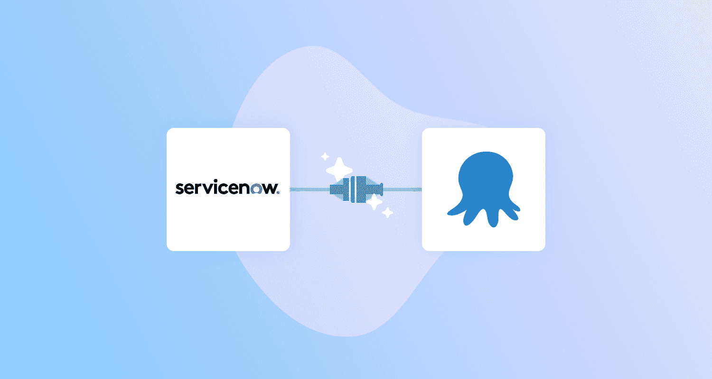
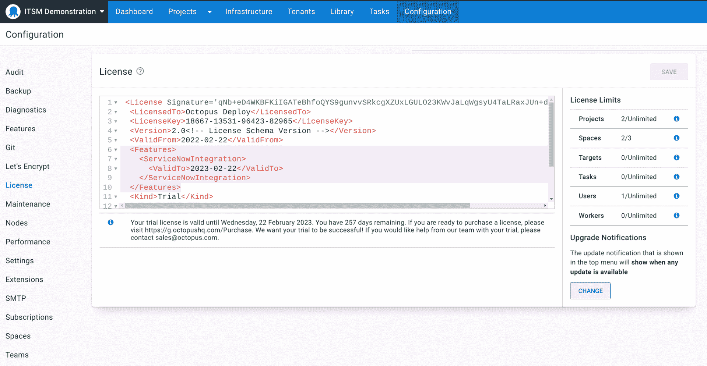
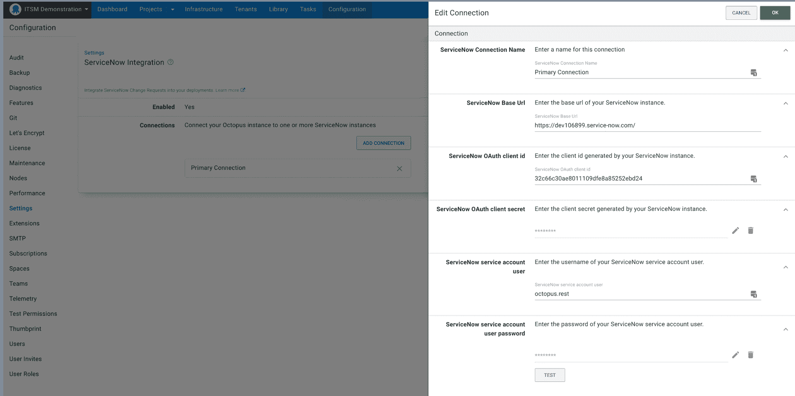
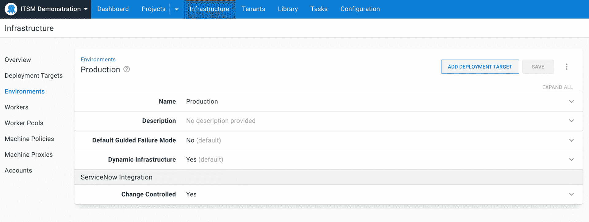
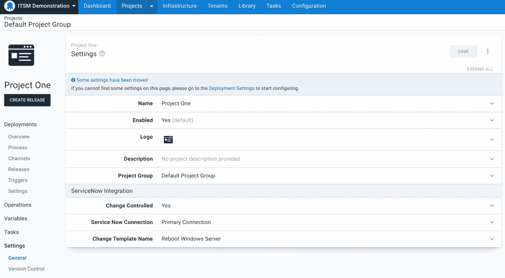
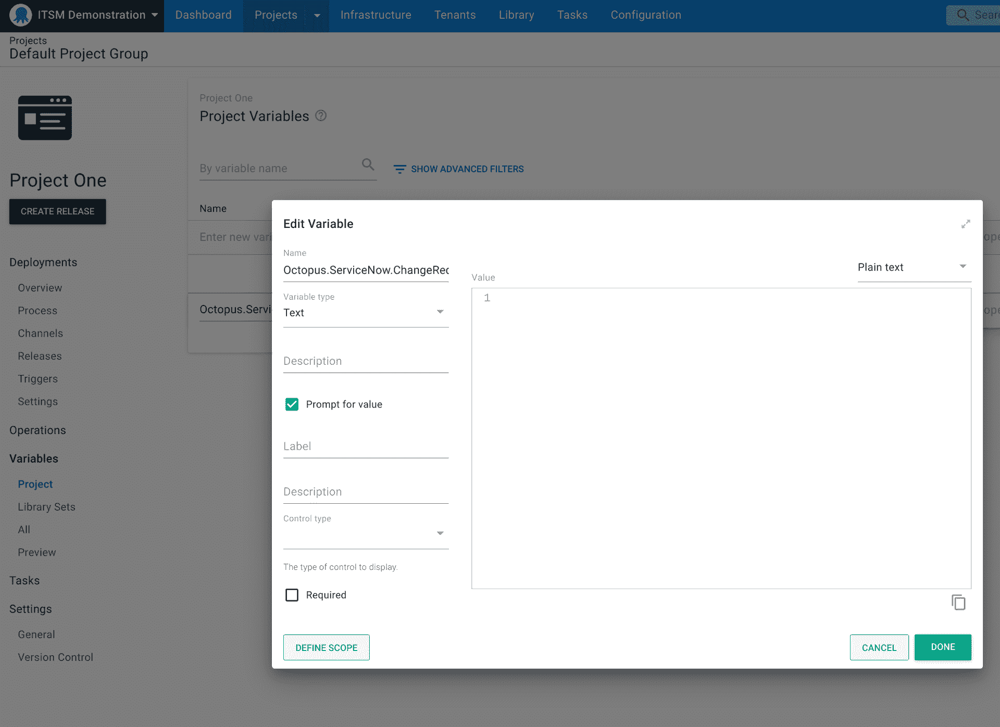
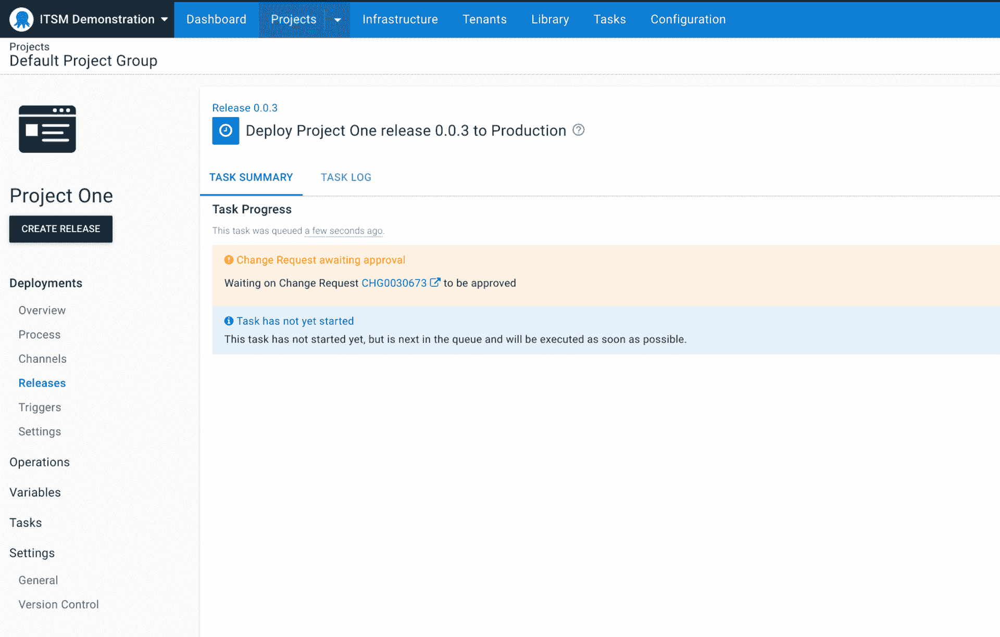
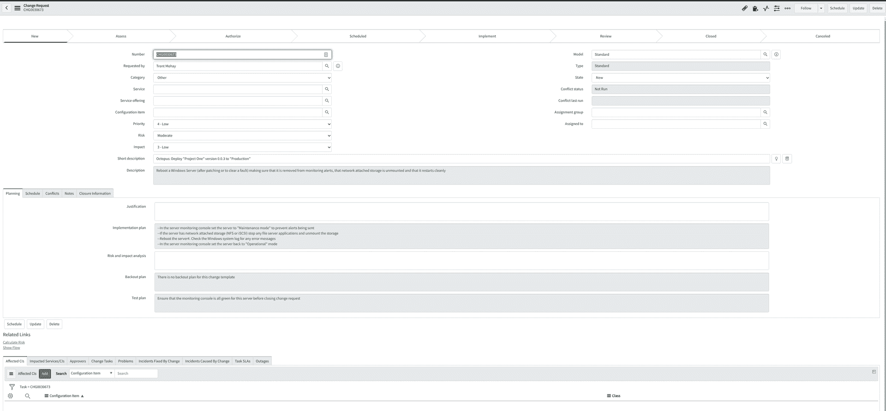
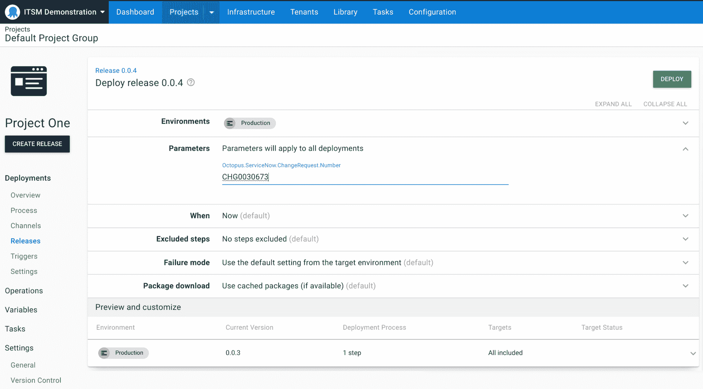

# Octopus Deploy 的 ServiceNow 集成:早期访问预览- Octopus Deploy

> 原文：<https://octopus.com/blog/servicenow-integration-eap>

我们的 ServiceNow 集成作为早期访问预览版(EAP)提供。

这种集成通过确保您的任务关键型部署仅根据批准的 ServiceNow 变更请求执行，简化了开发运维团队的变更管理流程。这降低了因未经批准的部署而导致系统停机的风险，并通过对高风险部署实施批准检查来帮助保护您的业务关键型应用程序。

这种集成将 Octopus 部署与变更请求联系起来，并自动创建带有预填充细节的标准变更请求，帮助您更高效地与变更管理团队合作。通过我们的集成，每个受控部署都有一个变更请求，以便您的 CI/CD 和发布管理流程符合公司政策和法规要求。有了部署的完整审计日志，变更经理还可以确保所有部署都在适当的控制级别下执行。

我们的 ServiceNow 集成让您能够:

*   轻松配置您的工作流程，将 Octopus 与一个或多个 ServiceNow 连接集成。
*   通过提示变量将部署链接到现有的变更请求，以便您可以手动将部署与变更请求相关联。
*   通过更改请求标题上的字符串匹配链接手动创建的更改请求。
*   在部署时自动创建标准变更请求。
*   使用变更模板自动创建标准变更请求，以减少手动工作并控制要填充的信息。
*   查看和导出受控部署的审核日志，以便轻松实现合规性和部署后协调。

在本文中，我将介绍我们的 ServiceNow 集成，并向您介绍如何开始。

## 简化变更管理的需求

对于开发运维团队来说，大规模管理部署管道既复杂又耗时，当您添加变更管理时，这变得更加困难。通常有严格的变更流程，要求进行彻底的审查，以获得发布新版本应用程序的批准。

变更顾问委员会可以被视为减慢开发团队的路障。(阅读我们关于[为什么变革顾问委员会可能不起作用以及如何改进它们的帖子](https://octopus.com/blog/change-advisory-boards-dont-work)，了解更多信息。)

## 无需人工干预的批准

我们实施 ServiceNow 集成的一个原因是为了在人工干预之外提供更好、更自动化的审批流程。

我们注意到手动干预被用于批准，但它们不是为此目的而设计的。创建手动干预是为了在常见用例中暂停部署并等待用户交互，比如 DBA 审查工具生成的增量脚本，或者 web 管理员审查 Azure Web App 部署中的 stage 槽。

因此，使用手动干预进行审批存在局限性。很难对多个批准者进行建模，您不能在整个部署中重用同一个批准，不能强制 CAB 或更改批准，并且很难强制批准手动干预的人。

我们的 ServiceNow 集成不是人工干预的替代，而是对人工干预的增强。手动干预仍可用于其预期目的，并为那些需要批准的人提供一种更容易和更有效的方式来在 Octopus 中实现自动化。

## ServiceNow 和 Octopus 带来了更好的变更管理

我们希望通过帮助您将 Octopus 与 ServiceNow 集成来减少摩擦并简化您的开发团队的生活，从而使变更管理变得更加容易。

我们在 Octopus 中的 ServiceNow 集成减轻了手工填写变更请求的痛苦，手工填写变更请求既耗时又容易出错。在部署中，您可以自动创建变更请求，从而更容易实现最佳实践。

### Octopus 内置的变更管理

ServiceNow 集成设置很简单，因为所有东西都内置在 Octopus 中。这种集成使用 ServiceNow 提供的文档化 API，以最大限度地减少摩擦，而无需下载单独的 ServiceNow 应用程序。

设置完成后，可以在您的部署中自动创建更改请求，或者您可以使用现有的更改请求，直到有人提供批准，部署才会继续。变更请求处于实施阶段后，Octopus 会自动识别批准并继续部署。部署过程中不需要手动干预。

### 跨项目和环境重用批准

有时，同一个变更请求会在您的部署过程中使用，因此同一个 ID 会被多次使用。手动干预不允许变更请求被使用两次。

借助我们的 ServiceNow 集成，您可以使用提示变量在多个部署中重用变更请求。在变更请求处于实现阶段之后，您可以简单地将 ID 从一个部署复制到另一个部署。如果您手动选择一个，Octopus 会自动识别批准并继续部署。如果没有，Octopus 会为您创建一个。

### 使用集成的最低配置

ServiceNow 集成不需要在 ServiceNow 中进行太多设置。你所需要的只是一个特殊的 Octopus 许可证，它对[早期访问预览(EAP)用户](https://octopusdeploy.typeform.com/servicenow-eap)是免费的。

设置许可证后，您只需在 ServiceNow 中配置 2 项内容即可开始:

*   使用 OAuth 创建 web 服务用户帐户
*   创建用户并分配权限

任何人都可以创建一个免费的个人开发实例(PDI ),在功能齐全的 ServiceNow 中使用。

## ServiceNow 集成入门

[https://www.youtube.com/embed/MWrhD78xzyw](https://www.youtube.com/embed/MWrhD78xzyw)

VIDEO

在[注册了 EAP](https://octopusdeploy.typeform.com/servicenow-eap) 之后，您需要配置一些设置来开始与 ServiceNow 集成。

导航到**配置**，然后**许可**，添加客户成功团队提供的许可密钥。

接下来，点击**设置**并导航至 **ServiceNow 集成**。**通过复选框启用**service now 集成，并添加一个连接。

您需要从 ServiceNow 提供一个基本 URL、OAuth 客户端 ID 和客户端机密。基本 URL 可以在您的 ServiceNow 菜单中找到。

要获得 OAuth 客户端 ID，请进入 ServiceNow 中的**应用注册表**，并将外部客户端的 **OAuth API 端点**设置为全局。然后，您可以将该 ID 粘贴到 Octopus 中的**设置**选项卡中。

接下来，您需要创建用户并分配权限。在 ServiceNow 的**用户**部分，您可以创建一个服务帐户并为该用户分配角色。给你的密码可以粘贴到 Octopus 中。

您给予用户的权限非常重要，应该符合您组织的指导原则。我们不建议给用户通用权限。

## 配置您的环境和项目

配置 ServiceNow 集成后，您需要配置您的环境和项目。两者都需要启用 ServiceNow，ServiceNow 集成才能工作。

### 配置您的环境

要设置您的环境，请转到 **Infrastructure** 并选择您希望 ServiceNow 使用的环境。在 **ServiceNow Integration** 下拉菜单下，选择**变更控制**复选框。

对所有适用的环境重复此操作。

### 配置您的项目

要设置您的项目，请转到**设置-常规**，在副标题 **ServiceNow 集成**下，勾选**变更控制**旁边的复选框。然后选择要使用的连接。您可以使用之前设置的连接，或者如果您有多个不同业务单位的连接，您可以为项目选择正确的连接。

如果您的组织在其变更流程中有名称模板，您也可以提供变更模板名称。这是可选的，如果不需要，您可以将其留空。如果包含变更模板名称，它将用于在部署时自动创建标准的变更请求。

## 为可重用的变更请求设置提示变量

如果您想要重用变更请求或使用现有的变更请求，您需要为 ServiceNow 设置一个提示变量。

如果您不打算重用变更请求，那么没有必要设置它。

在你的项目中，在**变量**部分，寻找**章鱼。ServiceNow.Change.Number** 。您可以选择**打开编辑器**来更改标签和描述，这样更容易使用。

## 在部署中创建新的变更请求

转到您设置的环境并导航到**部署**窗口。要创建新的变更请求，请将**参数**字段留空。

点击**部署**后，出现**任务总结**画面，显示消息`Change Request awaiting approval`。然后，将为创建的变更请求显示一个变更请求编号，并带有指向 ServiceNow 的链接。

要使您的变更请求获得批准，请将其分配给**分配组**部分中的某个人。然后，选择**请求批准**以沿着您组织的批准过程移动变更请求。

在变更请求被批准之前，您的部署不会在 Octopus 中运行。批准人需要将变更请求移动到**实施**，然后才能在 Octopus 中触发自动批准。

变更请求只能处于实施阶段，以便在 Octopus 中运行部署。如果变更请求处于任何其他阶段，任务将不会开始。

要为另一个部署重用变更请求，它需要保持在实现中。

变更请求还必须在部署期间保持实施状态，因为 Octopus 会在整个任务日志中检查变更请求的状态。

## 使用现有的变更请求进行部署

如果您在实现阶段有一个现有的变更请求，您可以将其用于其他环境和项目(例如，您可以在测试和生产中使用相同的变更请求)。

只需复制变更请求编号，并将其粘贴到下一个环境的**参数**部分。

如果更改请求仍处于实施阶段，Octopus 会自动识别其已获批准。

## 对 ServiceNow 集成运行诊断

如果在 ServiceNow 集成的设置中有任何错误，将会创建一个错误，并且您的部署将不会运行。要找出发生这种情况的原因，请转到**诊断**选项卡。从这里您可以看到问题，例如，您可能有不正确的模板名称或未分配的用户角色。

## 结论

我们的 ServiceNow 集成作为早期访问预览版(EAP)提供。它有助于自动化您的变更管理过程，使运行变更管理变得更加容易，而不需要手动干预。

我们期待引入新功能，继续支持您的变更管理流程。

我们希望您尝试将这种方式与您的工作流程相结合，并告诉我们如何改进。

[注册 ServiceNow EAP](https://octopusdeploy.typeform.com/servicenow-eap) 。

愉快的部署！