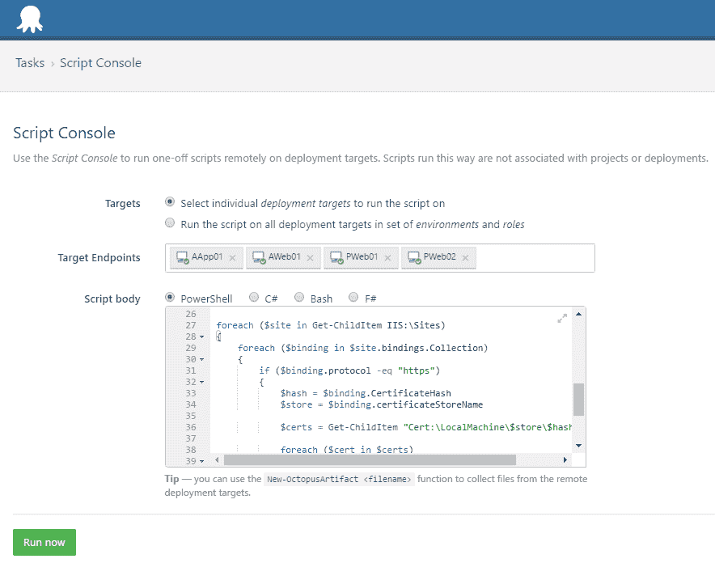
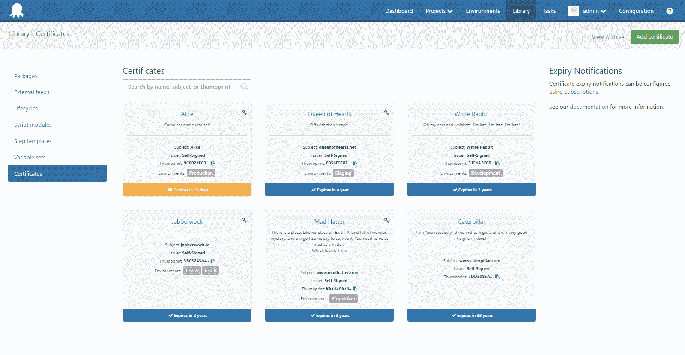

# SHA1“粉碎”碰撞-章鱼部署

> 原文：<https://octopus.com/blog/shattered>

[](#)

如果你最近一直关注科技新闻，你会看到[谷歌宣布](https://security.googleblog.com/2017/02/announcing-first-sha1-collision.html)一项新的攻击，这使得[几乎有可能产生 SHA1 哈希冲突](http://shattered.io/)。

风险似乎集中在证书用于数字签名而非加密的领域。到目前为止，我们还没有看到任何明确的报告表明这适用于 SSL/TLS——我的理解是，存在有人制作假证书的风险，它可以像真证书一样被“信任”,但 SSL/TLS 数据不能被解密。当然，我不是专家！

无论哪种方式，SHA1 已经过时一段时间了，证书颁发机构很久以前就停止颁发 SHA1 证书了。这对 SHA1 来说只是又一个致命的打击。

在这篇文章中，我想解释这对 Octopus 意味着什么，并提供一些 PowerShell 脚本来查看您部署的应用程序是否受到影响。

## 章鱼和触手目前使用 SHA1

当您安装 Octopus 和触手代理时，它们都会生成 X.509 证书，用于加密它们之间的连接(通过 TLS)。当我们生成这些自签名证书时，**我们使用 SHA1** 。这是我们在 Windows API 中调用的[证书生成函数](https://msdn.microsoft.com/en-us/library/windows/desktop/aa376039(v=vs.85).aspx)的默认设置，我们从未想过要改变。

缓解措施:

*   与此同时，如果你担心的话，有一个变通办法:你可以生成自己的证书，并告诉 Octopus 和触手使用它们。有关详细信息，请查看我们关于[如何使用章鱼和触手](https://octopus.com/docs/security/octopus-tentacle-communication/custom-certificates-with-octopus-server-and-tentacle)自定义证书的文档页面。
*   很快
    我们将发布一个更新，将算法改为 SHA256。这将适用于新的安装，但对于旧的安装，您必须重新生成证书并更新所有机器之间的信任。
*   **稍后**我们会在 Octopus 中增加一些功能，自动重新生成 Octopus 服务器和所有触手上的证书，并为您全部更新。如果您有许多机器要管理，您可能需要等待。这还需要做更多的工作，但我们会在谷歌 90 天内公布技术细节之前，尽量腾出时间来完成这项工作。

## 你应该检查的其他事情

你要检查 SHA1 是否在其他地方被使用。八达通用户的常见例子包括:

*   如果您使用 HTTPS，用于八达通网络前端的证书。通常这是人们自己提供的东西。
*   用于向第三方服务进行身份验证的证书，如 Azure 管理证书
*   用于为您部署的网站提供 HTTPS 的证书

## 使用 PowerShell 检测 SHA1 证书

给定一个`X509Certificate2`对象，这里有一个 PowerShell 函数检查它是否使用 SHA1:

```
function Test-CertificateIsSha1{
    [cmdletbinding()]
    param(  
    [Parameter(
        Position=0, 
        Mandatory=$true, 
        ValueFromPipeline=$true)
    ]
    [System.Security.Cryptography.X509Certificates.X509Certificate2[]]$Certificate
    ) 

    process 
    {
       foreach($cert in $Certificate)
       {
           $algorithm = $cert.SignatureAlgorithm.FriendlyName
           $isSha1 = $algorithm.Contains("sha1")
           Write-Output $isSha1
       }
    }
} 
```

这里有一个 PowerShell 脚本，您可以使用它来检查网站是否正在使用 SHA1 证书。Jason Stangroome 在 [Get-RemoteSSLCertificate](https://gist.github.com/jstangroome/5945820) 的初步实施中表现出色:

```
function Get-RemoteSSLCertificate {
    [CmdletBinding()]
    param (
        [Parameter(Position=0, Mandatory=$true, ValueFromPipeline=$true)]
        [System.Uri[]]
        $URI
    )
    process 
    {
       foreach ($u in $URI)
       {
            $Certificate = $null
            $TcpClient = New-Object -TypeName System.Net.Sockets.TcpClient
            try {
                $TcpClient.Connect($u.Host, $u.Port)
                $TcpStream = $TcpClient.GetStream()
                $Callback = { param($sender, $cert, $chain, $errors) return $true }
                $SslStream = New-Object -TypeName System.Net.Security.SslStream -ArgumentList @($TcpStream, $true, $Callback)
                try {
                    $SslStream.AuthenticateAsClient('')
                    $Certificate = $SslStream.RemoteCertificate
                } finally {
                    $SslStream.Dispose()
                }
            } finally {
                $TcpClient.Dispose()
            }
            if ($Certificate) {
                if ($Certificate -isnot [System.Security.Cryptography.X509Certificates.X509Certificate2]) {
                    $Certificate = New-Object -TypeName System.Security.Cryptography.X509Certificates.X509Certificate2 -ArgumentList $Certificate
                }

                Write-Output $Certificate
            }
        }
    }
}

$sites = @("https://www.yoursite.com", "https://anothersite.com")
$sites | ForEach-Object {
    $site = $_
    $cert = Get-RemoteSSLCertificate -Uri $site
    if (Test-CertificateIsSha1 -Certificate $cert) {
        Write-Warning "Site: $site uses SHA1"
    }
} 
```

这里有一个脚本检查您的 IIS 服务器是否正在使用任何 SHA1 证书:

```
Import-Module WebAdministration

foreach ($site in Get-ChildItem IIS:\Sites)
{
    foreach ($binding in $site.bindings.Collection)
    {
        if ($binding.protocol -eq "https") 
        {
            $hash = $binding.CertificateHash
            $store = $binding.certificateStoreName

            $certs = Get-ChildItem "Cert:\LocalMachine\$store\$hash"

            foreach ($cert in $certs) 
            {
                if (Test-CertificateIsSha1 -Certificate $cert) 
                {
                    Write-Warning "Site: $site.Name uses SHA1"
                }
            } 
        }
    }
} 
```

您可以在所有机器上的 [Octopus 脚本控制台](https://octopus.com/docs/administration/script-console)中轻松运行:

[](#)

## 八达通的证书功能

这是一个为 Octopus 3.11 中的[新证书功能](https://octopus.com/blog/certificates-feature)欢呼的好时机。如果你无论如何都要更新你的网站证书，为什么不用 Octopus 来管理它们呢？

[](#)

如需更新，请订阅我们的[简讯](#newsletter)。