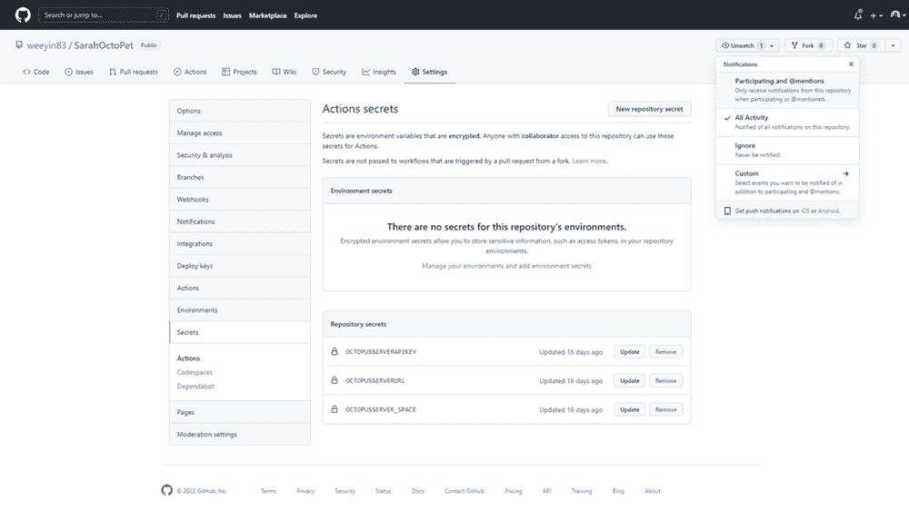

# 源代码控制你的 Azure Bicep 文件

> 原文：<https://octopus.com/blog/source-control-azure-bicep-files>

最近，我写了关于使用 Azure Bicep 文件的[，使用 Octopus run book](https://www.octopus.com/blog/azure-bicep-octopus-deploy)部署你的 Azure 基础设施。

在这篇文章中，我解释了如何使用 GitHub 对 Azure Bicep 文件进行源代码控制，然后使用 Octopus 部署它们。

## 为什么是源代码管理？

源代码控制提供了单一的事实来源，无论是对您的应用程序代码还是您的基础设施代码(IaC)。

源代码管理还允许您与处理相同代码库的其他人协作，并合并他们的更改。它还可以帮助跟踪每个更改，因此如果有人犯了错误，您可以将时钟倒回到工作版本。

## 将你的二头肌文件从 GitHub 下载到 Octopus

将 Bicep 文件存储在 GitHub 中，您可以使用 GitHub 操作将它们移动到 Octopus Deploy 实例，以自动化 Azure 资源的部署。

GitHub Actions 于 2019 年推出，已成为 DevOps 专业人士和开源贡献者的热门工具。

在本文中，您将创建一个 GitHub Actions 工作流来将 Bicep 文件打包成一个 ZIP 文件。然后，将 Bicep 文件推送到 Octopus 实例，准备进行部署。

### 八达通连接

首先，您需要设置 GitHub Actions secrets，它将保存到 Octopus 实例的连接信息。

您需要:

*   Octopus 部署实例的 URL
*   API 密钥
*   您要将文件推送到的空间的名称

在**设置下创建 3 个秘密**、**秘密**:

*   `OCTOPUSSERVERAPIKEY`
*   `OCTOPUSSERVERURL`
*   `OCTOPUSSERVER_SPACE`

[](#)

### 创建 GitHub 操作工作流

现在您需要创建 GitHub 操作工作流。

您的 GitHub Actions 工作流需要位于一个名为**的文件夹下。github** 在你的库中，它必须使用 YAML。

从描述工作流文件的作用开始，以便于参考和他人理解。然后，定义工作流的名称以及希望它运行的时间:

```
 # This workflow takes the Bicep files within the Bicep folder and zips them together.  Then pushes/uploads them to the Octopus Instance specified. 
# In the repo's secrets are the information relating to the Octopus Instance URL, API key and Space. 
name: OctoPetShopBicepBuild
on:
  push:
    branches:
    - main 
```

每次主分支上有推时，您的工作流都会运行。

接下来，您需要定义工作流的步骤:

```
# A workflow run is made up of one or more jobs that can run sequentially or in parallel
jobs:
  # This workflow contains a single job called "Bicep Build"
  BicepBuild:
    # The type of runner that the job will run on
    runs-on: windows-latest
    steps:
    # This first step takes the code within the Repo and pulls it into the workspace
    - uses: actions/checkout@v2 
```

定义作业应该运行的工作程序或运行程序的类型。在这个例子中，我定义了最新的 Windows runner。

工作流程的第一步是将存储库中的文件放入工作区。我使用了一个叫做 checkout 的市场行为来完成这个任务。

```
 # We install the latest version of Octopus CLI
    - uses: OctopusDeploy/install-octopus-cli-action@v1.1.8 
```

接下来，将 Octopus CLI 安装到您的 runner 上，以便您可以使用该 CLI 中的命令。默认情况下，跑步者没有安装命令。

```
 # We take the files inside the Bicep folder and zip them together
    - name: Zip Bicep files
      run: octo pack --id="OctoBicepFiles" --format="zip" --version=${{ github.run_number }} --basePath=${{ github.workspace }}\Bicep\ --outFolder=${{ github.workspace }}\output 
```

下一步是将文件放入存储库中的 Bicep 文件夹，并放入一个 ZIP 文件中。

```
# We take the zip file we created and push them to the Octopus Deploy server instance
    - name: Push Bicep files
      run: octo push --package="${{ github.workspace }}\output\OctoBicepFiles.${{ github.run_number }}.zip" --server="${{ secrets.OCTOPUSSERVERURL }}" --apiKey="${{ secrets.OCTOPUSSERVERAPIKEY }}" --space="${{ secrets.OCTOPUSSERVER_SPACE }}" 
```

此工作流的最后一步是推送步骤。这一步获取您创建的 ZIP 文件，并将其推送到您的 Octopus 实例中。您使用之前创建的秘密来连接到您的 Octopus 实例。

你可以在 GitHub 上获得一份[完整工作流程的副本。](https://gist.github.com/weeyin83/fa134eec3cb7bd8c52fa25f2f323189c)

## 结论

现在，您有了一个存储 Bicep 模块和基础设施部署代码的地方，以及一个将这些文件推送到 Octopus 实例以备部署的自动化过程。

如果您对此流程有任何问题或反馈，请在下面留下您的评论，我们非常希望收到您的回复。

阅读我们的 [Runbooks 系列](https://octopus.com/blog/tag/Runbooks%20Series)的其余部分。

愉快的部署！