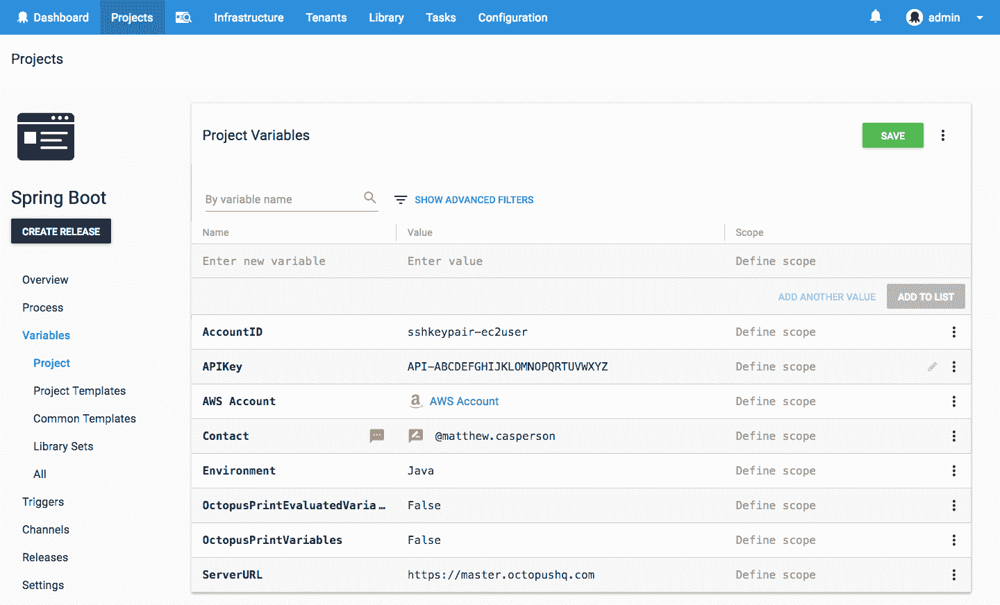

# Spring Boot 即服务-部署八达通

> 原文：<https://octopus.com/blog/spring-boot-as-a-service>

Spring Boot 支持构建 JAR 文件，这些文件可以像普通的 bash 脚本一样在 Unix 环境中执行。这些文件被称为[完全可执行的 JARs](https://docs.spring.io/spring-boot/docs/current/reference/html/deployment-install.html) ，它们使得将 Spring Boot 应用程序部署为 Linux 服务变得非常方便。在这篇博文中，我们将看看如何将一个完全可执行的 JAR 文件部署到一个 EC2 实例中，该实例是使用 Octopus 通过 CloudFormation 模板创建的。

## AWS 帐户

Octopus CloudFormation 步骤通过 AWS 帐户向 AWS 进行身份验证。这些账户由基础设施➜账户➜亚马逊网络服务账户管理。你可以通过我们的[文档](https://octopus.com/docs/infrastructure/aws/creating-an-aws-account)找到更多关于创建 AWS 账户的信息，记住账户需要有一些[通用权限](https://octopus.com/docs/deployments/aws/permissions)才能有效地用于部署 CloudFormation 模板。

[](#)

## SSH 帐户

我们还需要配置一个帐户，用于通过 SSH 连接到 Linux EC2 实例。这些账户由基础设施➜账户➜ SSH 密钥对管理。在这里，我们将创建一个 SSH 帐户，用户名为`ec2-user`(这是 Amazon Linux 的默认用户名)和 PEM 文件，您需要在 AWS 中创建该文件并将其分配给 EC2 映像。你可以在他们的[文档](https://docs.aws.amazon.com/AWSEC2/latest/UserGuide/ec2-key-pairs.html)中找到更多关于创建 AWS 密钥对的信息。

[](#)

## 机器政策

我们需要配置的最后一个全局 Octopus 设置是机器策略，可在基础设施➜机器策略下访问。

与轮询触角不同，SSH 目标必须有准确的 IP 地址或主机名才能参与 Octopus 部署。然而，将由 CloudFormation 模板创建的 EC2 实例没有固定的 IP 地址，并且当 EC2 实例停止并再次启动时，它们所具有的 IP 地址将会改变。这意味着我们需要做两件事来确保我们的 EC2 实例在 Octopus 中正确配置:

1.  每次 EC2 实例启动时，将 EC2 实例添加到 Octopus 中(如果它尚未注册)。
2.  让 Octopus 清理任何未通过健康检查的部署目标。

我们将在后面的章节中用 CloudFormation 模板中的一些脚本来处理第一步。通过编辑默认机器策略中的`Clean Up Unavailable Deployment Targets`部分来启用`Automatically delete unavailable machines`来配置步骤 2。

[](#)

## 构建完全可执行的 JAR 文件

通常情况下，JAR 文件是用类似`java -jar application.jar`的命令运行的。然而，Spring 使得构建完全可执行的 jar 成为可能，这些 jar 可以在 Unix 之类的系统上运行，比如 T3。

在这篇博文中，我们将使用一个简单的百里香叶 Spring Boot 应用程序，它可以从 [GitHub](https://github.com/OctopusDeploy/ThymeleafSpringDemo/tree/executable-jar) 获得。在 Maven `pom.xml`里面我们有配置:

```
<plugin>
  <groupId>org.springframework.boot</groupId>
  <artifactId>spring-boot-maven-plugin</artifactId>
  <configuration>
      <executable>true</executable>
  </configuration>
</plugin> 
```

设置`<executable>true</executable>`指示 Spring Boot Maven 插件构建一个完全可执行的 JAR。

如果我们查看 JAR 文件的实际内容，我们可以看到它是从一个 Bash 脚本开始的，这个脚本包含了 Init 脚本的[注释约定。](http://refspecs.linuxbase.org/LSB_3.0.0/LSB-PDA/LSB-PDA/initscrcomconv.html)

```
$ head -n 21 target/springboot.0.0.1-SNAPSHOT.jar
#!/bin/bash
#
#    .   ____          _            __ _ _
#   /\\ / ___'_ __ _ _(_)_ __  __ _ \ \ \ \
#  ( ( )\___ | '_ | '_| | '_ \/ _` | \ \ \ \
#   \\/  ___)| |_)| | | | | || (_| |  ) ) ) )
#    '  |____| .__|_| |_|_| |_\__, | / / / /
#   =========|_|==============|___/=/_/_/_/
#   :: Spring Boot Startup Script ::
#

### BEGIN INIT INFO
# Provides:          springboot
# Required-Start:    $remote_fs $syslog $network
# Required-Stop:     $remote_fs $syslog $network
# Default-Start:     2 3 4 5
# Default-Stop:      0 1 6
# Short-Description: springboot
# Description:       Demo project for Spring Boot
# chkconfig:         2345 99 01
### END INIT INFO 
```

这意味着我们可以像执行一个常规的 init 脚本一样执行这个文件。

## 使用 CloudFormation 构建 EC2 实例

我们将利用 Octopus 中的 CloudFormation 步骤来构建一个 EC2 实例，该实例将托管我们的 Spring Boot 服务。这个模板将在`us-east-1`区域运行，并将从标准的 Amazon Linux AMI 创建一个 EC2 实例，在我们的例子中是`ami-97785bed`。

这是完整的云形成模板。

```
AWSTemplateFormatVersion: 2010-09-09
Resources:
  InstanceSecurityGroup:
    Type: AWS::EC2::SecurityGroup
    Properties:
      GroupDescription: SSH and Web Ports
      SecurityGroupIngress:
      - IpProtocol: tcp
        FromPort: '22'
        ToPort: '22'
        CidrIp: '0.0.0.0/0'
      - IpProtocol: tcp
        FromPort: '8080'
        ToPort: '8080'
        CidrIp: '0.0.0.0/0'
  Linux:
    Type: 'AWS::EC2::Instance'
    Properties:
      ImageId: ami-97785bed
      InstanceType: m3.medium
      KeyName: DukeLegion
      SecurityGroups:
        - Ref: InstanceSecurityGroup
      Tags:
        -
          Key: Application
          Value: Spring Boot
        -
          Key: Domain
          Value: None
        -
          Key: Environment
          Value: Test
        -
          Key: LifeTime
          Value: Transient
        -
          Key: Name
          Value: Spring Boot
        -
          Key: OS
          Value: Linux
        -
          Key: OwnerContact
          Value: "#{Contact}"
        -
          Key: Purpose
          Value: Support Test Instance
        -
          Key: Source
          Value: CloudForation Script in Octopus Deploy
        -
          Key: scheduler:ec2-startstop
          Value: true
      UserData:
        Fn::Base64: |
          #cloud-boothook
          #!/bin/bash
          sudo yum install -y libunwind libicu jq java-1.8.0-openjdk
          sudo update-alternatives --set java /usr/lib/jvm/jre-1.8.0-openjdk.x86_64/bin/java
          if [ ! -d /opt/springboot ]; then
            sudo mkdir /opt/springboot
            sudo chown ec2-user:ec2-user /opt/springboot
          fi
          role="SpringBoot"
          serverUrl="#{ServerURL}"
          apiKey="#{APIKey}"
          environment="#{Environment}"
          accountId="#{AccountID}"
          localIp=$(curl -s http://169.254.169.254/latest/meta-data/public-hostname)
          existing=$(wget -O- --header="X-Octopus-ApiKey: $apiKey" ${serverUrl}/api/machines/all | jq ".[] | select(.Name==\"$localIp\") | .Id" -r)
          if [ -z "${existing}" ]; then
            fingerprint=$(sudo ssh-keygen -l -E md5 -f /etc/ssh/ssh_host_rsa_key.pub | cut -d' ' -f2 | cut -b 5-)
            environmentId=$(wget --header="X-Octopus-ApiKey: $apiKey" -O- ${serverUrl}/api/environments?take=100 | jq ".Items[] | select(.Name==\"${environment}\") | .Id" -r)
            machineId=$(wget --header="X-Octopus-ApiKey: $apiKey" --post-data "{\"Endpoint\": {\"DotNetCorePlatform\":\"linux-x64\", \"CommunicationStyle\":\"Ssh\",\"AccountType\":\"SshKeyPair\",\"AccountId\":\"$accountId\",\"Host\":\"$localIp\",\"Port\":\"22\",\"Fingerprint\":\"$fingerprint\"},\"EnvironmentIds\":[\"$environmentId\"],\"Name\":\"$localIp\",\"Roles\":[\"${role}\"]}" -O- ${serverUrl}/api/machines | jq ".Id" -r)
          fi
Outputs:
  PublicIp:
    Value:
      Fn::GetAtt:
      - Linux
      - PublicIp
    Description: Server's PublicIp Address 
```

我们首先定义将分配给 EC2 实例的安全组。这个安全组为 SSH 开放端口 22，为 Spring Boot 应用程序开放端口 8080。

```
InstanceSecurityGroup:
  Type: AWS::EC2::SecurityGroup
  Properties:
    GroupDescription: SSH and Web Ports
    SecurityGroupIngress:
    - IpProtocol: tcp
      FromPort: '22'
      ToPort: '22'
      CidrIp: '0.0.0.0/0'
    - IpProtocol: tcp
      FromPort: '8080'
      ToPort: '8080'
      CidrIp: '0.0.0.0/0' 
```

接下来是 EC2 实例。这个配置定义了 AMI 映像 ID、实例类型、要使用的 SSH 密钥对以及应用于实例的一些标记。

在 Octopus 内部，我们有一堆需要在任何 EC2 实例上设置的标签。至少您需要设置`Name`标记，因为这是出现在 AWS 控制台中的名称。

注意，在 Octopus 中使用变量替换[设置了`OwnerContact`标记值。我们将在后面的步骤中定义这个变量。](https://octopus.com/docs/deployment-process/variables/variable-substitution-syntax)

```
Linux:
  Type: 'AWS::EC2::Instance'
  Properties:
    ImageId: ami-97785bed
    InstanceType: m3.medium
    KeyName: DukeLegion
    SecurityGroups:
      - Ref: InstanceSecurityGroup
    Tags:
      -
        Key: Application
        Value: Spring Boot
      -
        Key: Domain
        Value: None
      -
        Key: Environment
        Value: Test
      -
        Key: LifeTime
        Value: Transient
      -
        Key: Name
        Value: Spring Boot
      -
        Key: OS
        Value: Linux
      -
        Key: OwnerContact
        Value: "#{Contact}"
      -
        Key: Purpose
        Value: Support Test Instance
      -
        Key: Source
        Value: CloudForation Script in Octopus Deploy
      -
        Key: scheduler:ec2-startstop
        Value: true 
```

为了将这个 EC2 实例用作 Octopus 部署目标，它需要安装 Mono，或者安装支持 DotNET Core 2 所需的包。在这个例子中，我选择了支持后者，所以我们使用`yum`来安装[先决条件中列出的依赖项。Linux 上的 NET Core](https://docs.microsoft.com/en-us/dotnet/core/linux-prerequisites?tabs=netcore2x)。

虽然 Amazon Linux 没有得到微软官方支持运行 DotNET 核心应用，但我们在遵循 DotNET 核心文档时，可以将 Amazon Linux 与 CentOS 同等对待。然而，虽然这适用于本博客，但它是一个不受支持的配置。

我们还安装了 Java 8，并将其设置为现有 Java 7 安装的默认设置。

`#cloud-boothook`标记被`cloud-init`服务用来[识别应该在每次引导](http://cloudinit.readthedocs.io/en/latest/topics/format.html#cloud-boothook)时运行的脚本。

在生产环境中，像 Java 和 DotNET 核心依赖项这样的包将被放入基本 AMI 映像中，而不是在实例启动时安装。

```
UserData:
  Fn::Base64: |
    #cloud-boothook
    #!/bin/bash
    sudo yum install -y libunwind libicu jq java-1.8.0-openjdk
    sudo update-alternatives --set java /usr/lib/jvm/jre-1.8.0-openjdk.x86_64/bin/java 
```

我们将在`/opt/springboot`下安装 JAR 文件，因此我们需要确保该目录存在，并且`ec2-user`帐户可以修改其内容。

```
 if [ ! -d /opt/springboot ]; then
      sudo mkdir /opt/springboot
      sudo chown ec2-user:ec2-user /opt/springboot
    fi 
```

最后，我们需要这个 EC2 实例向 Octopus 服务器注册自己，如果它还没有这样做的话。脚本的这一部分查询 Octopus API，以确定 EC2 实例的当前主机名是否存在一个部署目标，如果没有找到部署目标，就会添加它。

该脚本中的许多变量是使用[变量替换](https://octopus.com/docs/deployment-process/variables/variable-substitution-syntax)提供的。这些将在下一节中定义。

```
 role="SpringBoot"
    serverUrl="#{ServerURL}"
    apiKey="#{APIKey}"
    environment="#{Environment}"
    accountId="#{AccountID}"
    localIp=$(curl -s http://169.254.169.254/latest/meta-data/public-hostname)
    existing=$(wget -O- --header="X-Octopus-ApiKey: $apiKey" ${serverUrl}/api/machines/all | jq ".[] | select(.Name==\"$localIp\") | .Id" -r)
    if [ -z "${existing}" ]; then
      fingerprint=$(sudo ssh-keygen -l -E md5 -f /etc/ssh/ssh_host_rsa_key.pub | cut -d' ' -f2 | cut -b 5-)
      environmentId=$(wget --header="X-Octopus-ApiKey: $apiKey" -O- ${serverUrl}/api/environments?take=100 | jq ".Items[] | select(.Name==\"${environment}\") | .Id" -r)
      machineId=$(wget --header="X-Octopus-ApiKey: $apiKey" --post-data "{\"Endpoint\": {\"DotNetCorePlatform\":\"linux-x64\", \"CommunicationStyle\":\"Ssh\",\"AccountType\":\"SshKeyPair\",\"AccountId\":\"$accountId\",\"Host\":\"$localIp\",\"Port\":\"22\",\"Fingerprint\":\"$fingerprint\"},\"EnvironmentIds\":[\"$environmentId\"],\"Name\":\"$localIp\",\"Roles\":[\"${role}\"]}" -O- ${serverUrl}/api/machines | jq ".Id" -r)
    fi 
```

## 变量

CloudFormation 脚本有许多使用[变量替换](https://octopus.com/docs/deployment-process/variables/variable-substitution-syntax)定义的变量。这些变量在我们的 Octopus 项目的变量➜项目部分中定义。

通过获取 URL `https://octopusserver/app#/infrastructure/accounts/sshkeypair-ec2user`的最后一个元素找到了`sshkeypair-ec2user`的`AccountID`变量，这是从基础设施➜帐户➜ SSH 密钥对打开 ec2 用户 SSH 帐户时显示的 URL。

注意，`AWS Account`变量被设置为之前创建的`AWS Account`。该变量由 Octopus 步骤使用，而不是由 CloudFormation 模板直接使用。

你可以从[文档](https://octopus.com/docs/octopus-rest-api/how-to-create-an-api-key)中获得更多关于创建 Octopus API 密匙的信息。

[](#)

## 开始没有目标的部署

因为我们正在创建我们将作为 Octopus 项目的一部分部署到的基础设施，所以我们需要配置一些设置，以允许 Octopus 在没有任何预先存在的有效目标的情况下开始部署。这是在`Deployment Targets`下的项目设置中完成的。将值设置为`Allow deployments to be created when there are no deployment targets`意味着即使没有可用的目标，项目也可以开始部署。

[](#)

## 云形成步骤

现在是时候开始定义项目步骤了。我们将从部署 CloudFormation 模板开始，这是通过`Deploy an AWS CloudFormation template`步骤完成的。

[](#)

下面是填充步骤的屏幕截图。

[](#)

## 健康检查步骤

一旦部署了 CloudFormation 模板，它所创建的 EC2 实例将启动并向 Octopus 注册自己作为部署目标。我们现在需要将这个新目标添加到项目将要部署到的目标列表中。这是使用`Health Check`步骤完成的。

[](#)

下面是填充步骤的屏幕截图。

[](#)

## 传输包步骤

既然我们新创建或更新的 EC2 实例是我们的部署目标列表的一部分，我们可以将我们的 Spring Boot JAR 文件转移到它。这是使用`Transfer a package`步骤完成的。

我们使用`Transfer a package`步骤代替`Deploy Java Archive`步骤，因为后者将提取并重新打包 JAR 文件。完成提取和重新打包是为了允许 JAR 中的文件修改其内容(如果启用了变量替换)。然而，Spring Boot 完全可执行的 JAR 文件不能被`jar`工具提取。Spring Boot 文档中有这样的警告:

> 目前，一些工具不接受这种格式，所以您可能并不总是能够使用这种技术。例如，jar -xf 可能无法提取完全可执行的 jar 或 war。

另一方面,`Transfer a package`步骤只复制文件，并不试图修改它，这对于我们的用例来说是完美的。

[](#)

下面是填充步骤的屏幕截图。

[](#)

## 安装服务

有了系统上的 JAR 文件，我们现在可以将它作为 Linux 服务安装。这是通过使 JAR 文件可执行，在`/etc/init.d`下链接 JAR 文件，并配置服务在 start 上运行`chkconfig`来完成的。

我们将使用`Run a Script`步骤运行这个脚本。

[](#)

这是完整的脚本。

```
filePath=$(get_octopusvariable "Octopus.Action[Transfer JAR File].Output.Package.FilePath")
echo Linking $filePath to /etc/init.d/springboot
sudo chmod +x $filePath
sudo rm /etc/init.d/springboot
sudo ln -s $filePath /etc/init.d/springboot
sudo chkconfig springboot on
sudo service springboot restart 
```

下面是填充步骤的屏幕截图。

[](#)

## 显示摘要信息

为了方便运行此部署的人员，我们将显示一些有用的摘要信息。这是通过第二个`Run a Script`步骤完成的。

部署 CloudFormation 模板时，Octopus 会捕获任何输出变量，并将其用于后续步骤。我们利用这一点来构建一个基于 EC2 实例的公共 IP 地址的 URL。

```
Write-Host "Open application at http://$($OctopusParameters["Octopus.Action[Linux CloudFormation].Output.AwsOutputs[PublicIp]"]):8080" 
```

下面是填充步骤的屏幕截图。

[](#)

## 部署项目

下面是这个项目的一个部署结果的截图。

[](#)

请注意 CloudFormation 模板部署的输出中的这几行:

```
Saving variable "Octopus.Action[Linux CloudFormation].Output.AwsOutputs[StackId]"
Saving variable "Octopus.Action[Linux CloudFormation].Output.AwsOutputs[PublicIp]" 
```

这些日志消息提供了一种简单的方法来获取作为 CloudFormation 部署的结果而创建的任何输出变量的完整变量名。

还要注意运行状况检查步骤的输出。在这个部署中，我通过在 UserData 脚本中添加一个注释，对 CloudFormation 模板进行了一些调整。虽然这种变化不影响 EC2 实例的部署方式，但 CloudFormation 将其视为对现有堆栈的更改，因此关闭并重新启动 EC2 实例。这又给了 EC2 实例一个新的公共 IP，这意味着 EC2 实例将在启动时向 Octopus 注册自己。然后，运行状况检查步骤检查旧的部署目标和新的部署目标，确定旧的目标不再有效并将其删除，并成功完成对新目标的运行状况检查，并将其包括在用于剩余部署的目标列表中。

## 打开 Web 应用程序

最后一个脚本步骤的输出生成了一个 URL`http://184.73.104.221:8080`。打开它会显示 Spring Boot 应用程序。

这个 URL 实际上对您不起作用，因为这个演示 EC2 实例已经关闭。为您生成的 URL 将具有不同的 IP 地址。

【T2 

## 验证服务

我们可以通过连接到 EC2 实例并运行`service`命令来验证 Spring Boot 应用程序是否作为 Linux 服务运行。

```
$ sudo service springboot status
Running [2716] 
```

该服务可以像任何其他服务一样启动、停止和重新启动。

```
$ sudo service springboot restart
Stopped [2716]
Started [4123]
$ sudo service springboot stop
Stopped [4123]
$ sudo service springboot start
Started [4235] 
```

## 结论

完全可执行的 JAR 文件允许将 Spring Boot 应用程序部署为常规的 Linux 服务，使它们易于部署和管理。如果您对自动化部署 Java 应用程序或创建云基础设施感兴趣，[下载 Octopus Deploy](https://octopus.com/downloads) 的试用版，并查看[我们的文档](https://octopus.com/docs/deploying-applications)。