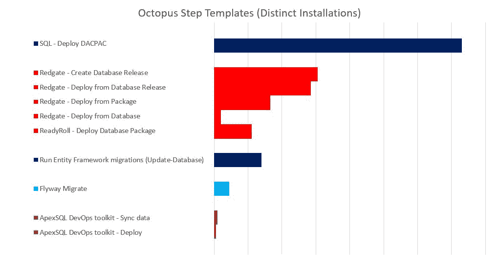
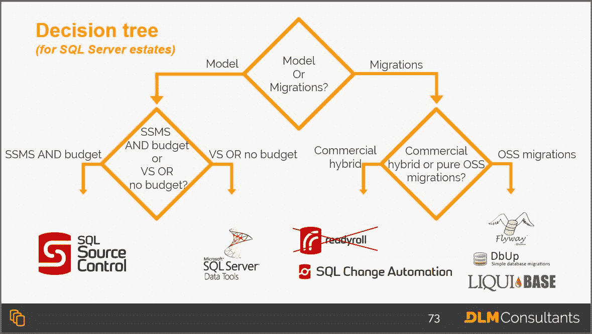

# Octopus Deploy 的 SQL Server 部署选项- Octopus Deploy

> 原文：<https://octopus.com/blog/sql-server-deployment-options-for-octopus-deploy>

如果您有一个 SQL Server 数据库并使用 Octopus Deploy，那么您有几个关于数据库源代码控制和部署工具的选项。这篇博客文章提供了最广泛使用的工具的基本概述，以帮助您决定哪个选项最适合您的团队。

## 基于模型和基于迁移的解决方案

大多数数据库源代码控制和部署工具可以大致分为基于模型的(T0)或基于迁移的(T5)。

基于模型的工具编写出数据库模式所需的最终状态，通常为每个对象创建一个脚本。在部署管道中的某个点，软件会将源代码与目标数据库进行比较，并生成一个部署脚本。

基于迁移的工具要求用户保存迁移脚本的有序列表。该工具将针对目标数据库执行它们。通常，该工具还会向目标数据库添加一个表，以记录已经部署了哪些脚本。

很多人对哪个更好有强烈的看法。这有点像一场激烈的战争，我不想在这里纠缠不清。然而，每种方法都有优点和缺点，如果你不知道它们是什么，我建议你在继续之前阅读一下这篇博文。

## 本土解决方案

基于迁移的解决方案听起来似乎很容易在内部开发。然而，自行开发的解决方案通常会导致知识囤积、复杂且不可预测的部署以及巨大的维护成本。

自行开发的基于迁移的工具通常是作为附带项目产生的，坦率地说，它们不可能像无数类似的开源基于迁移的工具那样成熟，这些工具已经由经验丰富的维护人员社区经过多年的改进，并被世界各地成千上万的开发人员所使用。

在我从事数据库 DevOps 领域工作的十年中，我还没有看到一个自行开发的解决方案比类似的开源或供应商解决方案更适合组织的例子。不要这样做。请使用本文中的工具。

使用流行的工具通常是值得的。广泛使用的工具通常得到更好的支持，更好的文档记录，并且通常有可以找到答案的活跃社区。通常也可以招募有使用工具经验的人。

为了确定最广泛使用的工具，我首先根据 Octopus 团队友好提供的一些功能使用数据，检查了各种 [Octopus Deploy 社区步骤模板](https://library.octopus.com/listing)的相对受欢迎程度:

【T2 

这个数据有局限性。例如，人们完全有可能通过 PowerShell 步骤触发了他们的数据库部署工具，而没有使用库中的步骤模板。还有一些流行的工具，比如 DbUp，它们没有 step 模板。也就是说，上述步骤模板的相对受欢迎程度与我的真实单词体验相符。

在这篇文章中，我将讨论 DbUp 和上面的每一个工具，除了 ApexSQL，它的用户更少。

## SSDT

**类型:**基于模型

上面列出的最流行的步骤模板部署 DacPacs。这些是使用 SQL Server 数据工具(SSDT)从 Visual Studio 数据库项目中生成的构建工件。

SSDT 是由微软构建的，它是随 Visual Studio (VS)一起开箱即用的，所以假设你的开发者有适当的 MSDN 许可证，它基本上是免费的。这使得它成为大多数普通 VS 用户的自然解决方案。然而，对于更熟悉 SQL Server Management Studio (SSMS)的数据库开发人员和 DBA 来说，VS 可能会相当混乱。

Visual Studio 数据库项目有点像. NET 项目，由解决方案和项目文件组成。因此，这可能是大多数人的天然选择。NET 开发人员，但可能会让任何 SQL Server 专家感到困惑。净经验。此外，有些人对不断在 SSMS 和 VS 之间转换感到沮丧

作为一个基于状态的工具，它提供了声明式数据库开发的许多生产力优势，但有时自动生成的部署脚本可能会做一些痛苦的事情，如删除数据或在巨大的表上重建索引。这些问题可能只有在首次部署到大型生产数据库时才会被发现。

SSDT 确实有一些混合特性来解决这些问题，比如重构日志、部署前和部署后脚本，但是随着时间的推移，这些往往会变得难以管理。

**最好的:**SQL Server 的事实上的标准，Visual Studio 中的构建过程，SQL 环境变量。

**最糟糕的事情:**在膨胀的预部署/后部署脚本中管理复杂的重构，管理依赖性。

## 雷德盖特

Redgate 支持两种类型的 SQL Server 源代码管理项目。这两种项目类型都可以使用名为 SQL Change Automation 的 PowerShell 模块进行部署:

*   [SQL 源代码管理](https://www.red-gate.com/products/sql-development/sql-source-control/)是 SSMS 的一个插件，为你的数据库创建一个基于模型的项目。
*   SQL 变更自动化 VS 和 SSMS 插件为你的数据库创建一个基于迁移的项目。然而，虽然 SCA 项目主要是基于迁移的，但是它们有几个强大的混合特性。这使得 SCA 项目成为撰写本文时可用的最真实的基于混合迁移和基于模型的工具。

### SQL 源代码管理项目

**类型:**基于模型

几乎可以肯定，SQL 源代码管理是继 SSDT 之后最流行的 SQL Server 源代码管理工具。SQL 源代码控制和 SSDT 的主要区别在于，它不是内置于 VS 中，而是内置于 SSMS 中。对于大部分时间都在 SSMS 的 SQL Server 开发人员和数据库管理员来说，这大大简化了使用过程。不要再在不同的想法间跳跃。

部署是通过 SCA PowerShell 模块处理的，有一些优秀的 step 模板使得设置 Octopus 部署项目相对简单。差异报告也非常方便。查看 [Bob 最近的帖子](https://octopus.com/blog/database-deployment-automation-using-redgate-sql-change-automation)了解更多信息。

我已经在这里写了[关于 SSDT 和 SQL 源代码控制之间的差异的更详细的描述，并且还有一个关于这个主题的](https://www.brentozar.com/archive/2018/12/comparison-review-microsoft-ssdt-vs-red-gate-sql-source-control/) [30 页的白皮书](https://dlmconsultants.com/redgate-vs-ssdt/)。

**最好的事情:**可用性，与 SSMS 整合，发布差异报告。

**最糟糕的事情:**价格，管理复杂的重构。

### SQL 变更自动化(SCA)项目

**类型:**迁徙型/混合型

在撰写本文时，SCA 项目(以前称为 ReadyRoll 项目)无疑是最先进的 SQL Server 项目类型。它们旨在为您提供基于模型和基于迁移的工具的最佳部分。这确实增加了一些复杂性，所以有一点学习曲线，但是 SCA 通常会兑现它的承诺。

SCA 主要是一个基于迁移的工具，但是因为它来自 Redgate，所以它内置了模式比较和脚本生成功能。它也建立在 SSDT 之上，所以你可以免费继承许多最好的 SSDT 特性(部署前/部署后脚本、SQL 环境变量等)。它带有 SSMS 和 VS 的插件，所以你可以使用你喜欢的 IDE。

基本原则是，一旦您完成了开发数据库的一些开发工作，您点击一个按钮，SCA 将生成您的脚本并将其添加到您的项目中。如果生成的脚本做了一些有点傻的事情，比如删除一列，您可以在提交到源代码控制之前编辑它。

由于覆盖，存储过程和函数通常是用基于迁移的工具管理的噩梦，所有的*可编程对象*被提取到项目的一个单独部分，在那里它们被视为一个基于迷你模型的子项目。这也有助于减少迁移脚本的总数，使基于迁移的部分更容易管理。这是基于迁移的项目要避免/减少的两个最大问题。

基于迁移的工具的另一个挑战是发现冲突。SCA 通过在另一个迷你子项目中保存一个*模式模型*提供了一个方便的解决方案，为所有的表创建脚本。如果两个迁移脚本更新同一个表，您将在模式模型中看到合并冲突。模式模型还充当了期望的最终状态的便利参考点，尽管事实上它并不用于部署。

这种混合方法确实有一些缺陷。它更复杂，所以有一个学习曲线，并且基线化现有的项目并不容易。此外，如果您在任何迁移脚本中使用存储过程，您可能会遇到一些复杂的竞争情况，存储过程更新总是在最后应用，但是这对于大多数团队来说是一种边缘情况。

坦白地说，SCA 最大的问题是你需要向别人要预算。与这篇博文中列出的所有其他工具不同，Redgate 工具不是免费的。

**最佳:**最佳混合解决方案，兼具基于模型和基于迁移的解决方案的优势。

**最差:**价格，复杂度。

## 实体框架(EF)迁移

**类型:**迁移型

[实体框架](https://docs.microsoft.com/en-us/ef/) (EF)迁移是默认的部署解决方案，对于使用 EF 的人来说是现成的，EF 是最流行的对象关系映射(ORM)工具。NET/SQL Server。

EF 迁移的主要考虑不是部署功能本身，而是你是否想使用 ORM 工具。如果你问的最多。NET 开发人员，他们可能会喜欢它。如果你问大多数数据库管理员，他们可能会讨厌它。这是另一场古老的火焰战争。

EF，尤其是在代码优先而不是数据库优先(大多数人都这样做)的情况下，为。NET 开发人员，这使得他们更容易开发他们的。NET 应用程序。这使得 EF vary 很受那些没有太多 SQL Server 经验或知识的开发人员的欢迎。

然而，开发人员往往会得到关于最终被推送到数据库的代码的糟糕反馈。SQL Server 经验有限的开发人员加上对代码的糟糕反馈，常常会导致让 DBA 非常不高兴的查询。

当然，ORM 在美国很受欢迎。NET 社区，但要小心行事。此外，戴上我的 DevOps 帽子，确保你记得为整个价值流进行优化，而不是以下游工人为代价，为单个开发人员或团队/筒仓进行优化。

**极品:** ORMs。

**最糟糕的事情:** ORMs。

## 候鸟迁徙所经的路径

**类型:**迁移型

Flyway 是一个基于移植的开源工具。最初由[阿克塞尔·方丹](https://twitter.com/axelfontaine)撰写，最近被 Redgate 收购[。虽然它不是 SQL Server 使用最广泛的工具，但它在开源社区中非常流行。](https://tech.eu/brief/redgate-acquires-flyway-for-10-million/)

这是一个 Java 应用程序，对于 SQL Server 部署工具来说可能有点奇怪，但这是因为，与本文中的其他工具不同，Flyway 从一开始就被设计为跨平台的。Flyway 用户可以运行 MySQL、Postgres、Oracle 或 Flyway 支持的 20 多种 RDBMSs 中的任何一种。这使得它成为支持多个关系数据库的商店的流行选择。

与大多数类似的工具相比，使用它相对简单:下载，用连接字符串更新配置文件，并将脚本放到`flyway-[version]/sql`目录中。然后打开命令提示符，输入`flyway migrate`。

也就是说，它没有内置的比较引擎。这意味着它不能为您生成部署脚本。您需要手动创建它们，或者使用数据库比较工具。

Flyway 是数据库迁移工具的 Marie Kondo。

**最好的事情:**跨平台支持，简单——没有花里胡哨。

**最差:** Java，没有花里胡哨。

## DbUp

**类型:**基于迁移

DbUp 是另一个非常受欢迎的开源迁移工具，尤其是在 Octopus Deploy 用户中。这可能与它是由保罗·斯托弗写的这一事实有很大关系。如果您是 Octopus Deploy 用户，您几乎肯定也使用过它，因为它被打包到 Octopus Deploy 安装程序中。你认为你的 Octopus Deploy 数据库是如何部署的？

DbUp 是一个. NET 库，您可以添加到自己的库中。NET apps，这解释了为什么它没有一个步骤模板。

像 Flyway 一样，DbUp 没有任何巧妙的比较工具或花哨的特性。它故意是一个简单明了的迁徙者。创建和管理这些升级脚本的所有工作都取决于您。

**极品:**简单/可定制，. NET。

**最糟糕的事情:**需要一些 C#技能。

## 其余的…

还有很多其他的解决方案。有些人可能会感到恼火，因为我没有包括更多的供应商工具，如 [Idera](https://www.idera.com/productssolutions/it-database-management-tools#DESIGNModelsandDatabases) 、 [ApexSQL](https://www.apexsql.com/) 、 [DBmaestro](https://www.dbmaestro.com/) ，或者其他无数的开源迁移脚本运行程序，如 [Liquibase](https://www.liquibase.org/) 、 [RoundhousE](https://code.google.com/archive/p/roundhouse/downloads) 或 [DBDeploy](http://dbdeploy.com/) 。

如上所述，我的目的是列出最受欢迎的选项。根据 Octopus 提供的数据和我的个人经验，这篇博客文章中列出的工具是我认为 Octopus Deploy 用户中最受 SQL Server 部署欢迎的工具。

## 结论

没有一种工具是完美的。他们都有自己的挑战，但他们也都有优势。然而，几乎可以肯定的是，在几乎所有情况下，使用这些工具中的一种比创建自己的数据库部署框架更好。

哪种工具最适合您的环境？嗯，看情况。但是这里有一个决策树，来自 [DLM 顾问公司为期两天的数据库开发运维培训课程](https://dlmconsultants.com/dlm-workshops/)，可以在您的团队中引发一些讨论:

您在使用上述工具时有过正面或负面的体验吗？你试过其他工具吗？如果是这样，请在下面留言。我很想听听你的想法。

* * *

自 2010 年以来，Alex Yates 一直在帮助组织将 DevOps 原则应用于他们的数据。他最引以为豪的是帮助 Skyscanner 开发了一天 95 次[部署的能力](https://www.youtube.com/watch?v=sNsPnCv7hHo)，并支持了联合国项目服务办公室的发布流程。亚历克斯与除南极洲以外的各大洲的客户都有过合作——所以他渴望见到任何研究企鹅的人。

作为一名热心的社区成员，他共同组织了[数据接力](https://datarelay.co.uk/)，是【www.SpeakingMentors.com】的创始人，并自 2017 年以来被公认为[微软数据平台 MVP](https://mvp.microsoft.com/en-us/PublicProfile/5002655?fullName=Alex%20Yates) 。

Alex 是官方 Octopus Deploy 合作伙伴 [DLM 顾问](https://dlmconsultants.com/)的创始人。他喜欢为那些希望通过改进 IT 和数据库交付实践来实现更好业务成果的客户提供指导、辅导、培训和咨询。

如果你想和亚历克斯一起工作，请发邮件至:[enquiries@dlmconsultants.com](mailto:enquiries@dlmconsultants.com)