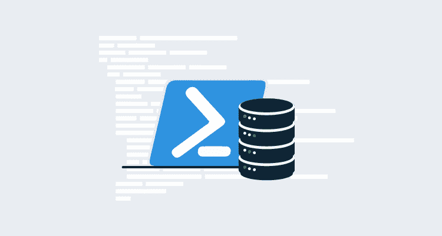

# SQL Server 和 PowerShell:实践示例- Octopus Deploy

> 原文：<https://octopus.com/blog/sql-server-powershell>

[](#)

Octopus Deploy 的目标之一一直是帮助简化自动化应用程序部署，而应用程序部署通常需要在此过程中进行数据库管理。在这篇文章中，我的目标是提供一些使用 PowerShell 进行 SQL Server 数据库管理的常见示例，以便更直接地集成到部署中。

所有这些例子的源代码都可以在 [GitHub](https://github.com/OctopusSamples/sql-server-powershell-examples) 上找到。如果你遇到任何问题或者有修改的建议，请随意张贴到 GitHub 库的问题列表或者发送一个请求！

## 安装 SQL Server PowerShell 模块

微软建议使用 **SqlServer** 模块从 PowerShell 与 SqlServer 进行交互。下面的例子中并没有用到它，但是它包含了许多对 SQL Server 管理有用的 cmdlets。

可以使用以下命令从 PowerShell Gallery 安装 **SqlServer** 模块:

```
Install-Module -Name SqlServer 
```

此外，如果已经安装了此模块，并且您使用的是 PowerShell 5.0 或更高版本，则可以使用以下命令对其进行更新:

```
Update-Module -Name SqlServer 
```

如果您使用的是早于 5.0 的 PowerShell 版本，请使用以下命令:

```
Uninstall-Module -Name SqlServer
Install-Module -Name SqlServer 
```

关于安装 **SqlServer** 模块的更多信息，请参见本微软文档:[安装 SQL Server PowerShell 模块](https://docs.microsoft.com/en-us/sql/powershell/download-sql-server-ps-module)。

## 测试与 SQL Server 的连接

测试 SQL Server 数据库连接的最简单方法之一是使用连接字符串和基本的 **SqlClient** 类:

```
try
{
    # This is a simple user/pass connection string.
    # Feel free to substitute "Integrated Security=True" for system logins.
    $connString = "Data Source=YourInstance;Database=YourDB;User ID=YourUser;Password=YourPassword"

    #Create a SQL connection object
    $conn = New-Object System.Data.SqlClient.SqlConnection $connString

    #Attempt to open the connection
    $conn.Open()
    if($conn.State -eq "Open")
    {
        # We have a successful connection here
        # Notify of successful connection
        Write-Host "Test connection successful"
        $conn.Close()
    }
    # We could not connect here
    # Notify connection was not in the "open" state
}
catch
{
    # We could not connect here
    # Notify there was an error connecting to the database
} 
```

在部署开始时对连接进行测试，您就知道可以对 SQL Server 进行所需的调用了。

## 创建 SQL Server 登录名

为了在服务器或实例中正确分离权限，您可能需要为应用程序或相关服务创建新的登录。来自 SQL Server 模块的 cmdlet 将完成此任务:

```
# To run in a non-interactive mode, such as through an Octopus deployment, you will most likely need to pass the new login credentials as a PSCredential object.
$pass = ConvertTo-SecureString "Th!sI5Y0urP4ss" -AsPlainText -Force

# Create the PSCredential object
$loginCred = New-Object System.Management.Automation.PSCredential("NewUser",$pass)

# Create login using the Add-SqlLogin cmdlet
Add-SqlLogin -ServerInstance YourInstance -LoginPSCredential $loginCred -LoginType SqlLogin 
```

此 cmdlet 极大地简化了 SQL Server 登录的创建，并灵活地使用内置标志，如`-MustChangePasswordAtNextLogin`或`-ConnectionTimeout.`如果您在 Octopus 部署过程中使用此命令，您可能会发现包含以下标志很有用:

*   `-Enable`确保稍后在您的部署中登录可用。
*   `-GrantConnectSql`允许登录连接到数据库引擎。

更多信息，参见 [Add-SqlLogin 参考](https://docs.microsoft.com/en-us/powershell/module/sqlserver/Add-SqlLogin)。

## 创建 SQL Server 数据库并分配所有者

令人惊讶的是，Microsoft 并没有提供现成的 cmdlet 来创建数据库，因此有两条主要途径可以在没有预先备份的情况下启动并运行数据库。两者都相当简单。使用以下命令之一可以创建新的空白数据库:

对您的实例直接运行 SQL 来创建数据库:

```
# This query could also come from a file
Invoke-Sqlcmd -Query "CREATE DATABASE YourDB" -ServerInstance YourInstance 
```

或者，使用 SQL Server 管理对象(SMO)对象来完成繁重的工作:

```
#Name your database
$dbname = "YourDB"
# Create a SQL Server database object
$srv = New-Object Microsoft.SqlServer.Management.Smo.Server("YourInstance")
if($null -ne $srv.Databases[$dbname])
{
    $db = New-Object Microsoft.SqlServer.Management.Smo.Database($srv, $dbname)

    # Create the database
    $db.Create()
} 
```

如果您*有想要恢复的数据库备份，而不是创建空白数据库，那么**Restore-SQL database**cmdlet 是您的好朋友:*

```
$backupFile = "\\SQLBackups\YourDBBackup.bak"
Restore-SqlDatabase -ServerInstance YourInstance -Database YourDB -BackupFile $backupFile 
```

关于**Restore-SQL database**cmdlet 的更多信息可以在这个微软文档中找到: [Restore-SqlDatabase](https://docs.microsoft.com/en-us/powershell/module/sqlserver/restore-sqldatabase?view=sqlserver-ps) 。

现在您的数据库已经就绪，让我们将数据库所有者改为`NewOwner`:

```
# Here we'll need a user with administrative privileges to set the owner.
# Let's say that $SqlAdmin contains the username and $SqlAdminPass contains the password as a secure string.
$dbname = "YourDB"

# Create the server connection object
$conn = New-Object Microsoft.SqlServer.Management.Common.ServerConnection("YourInstance", $SqlAdmin, $SqlAdminPass)

# Create the server object
$srv = New-Object Microsoft.SqlServer.Management.Smo.Server($conn)

# Check to see if a database with that name already exists
if($null -ne $srv.Databases[$dbname])
{
    # If it does not exist, create it
    $db = New-Object Microsoft.SqlServer.Management.Smo.Database($srv, $dbname)
    $db.SetOwner("NewOwner")
}
else
{
    # There was an error creating the database object
} 
```

## 从文件运行 SQL 脚本

新数据库就绪后，可能需要对设置进行更改，或者某些表缺少默认数据。PowerShell 可以直接从文件运行 SQL 脚本来解决这些问题。让我们假设`alter_script.sql`在一个已知的位置(可能在您的 Octopus 部署中的一个包内)。可以使用以下命令直接从 PowerShell 运行该脚本:

```
# Assumes you are working from the package directory
Invoke-Sqlcmd -InputFile .\alter_script.sql -ServerInstance YourInstance -Database YourDB 
```

其他的`Invoke-Sqlcmd`信息可以在这个微软文档中找到: [Invoke-Sqlcmd cmdlet](https://docs.microsoft.com/en-us/powershell/module/sqlserver/invoke-sqlcmd) 。

## 运行内联 SQL 命令

最后，您可能需要运行一些 SQL 查询来验证数据库包含正确的数据(检查一切正常)。PowerShell 能够直接从控制台窗口运行内联 SQL 查询。让我们运行一个快速查询来检查表中的行数:

```
$rowcount = "SELECT COUNT(*) FROM YourTable"
Invoke-Sqlcmd -ServerInstance YourInstance -Database YourDatabase -Query $rowcount 
```

## 结论

无论您是在每次从 Octopus 部署一个版本时自动配置新数据库，还是对现有数据库运行一次性命令，PowerShell 和 SQL Server 模块都是完成这项工作的合适工具。

你还有其他的场景或具体问题吗？在这里留下评论或者加入我们的[社区松弛期](https://octopus.com/slack)。

## 参考