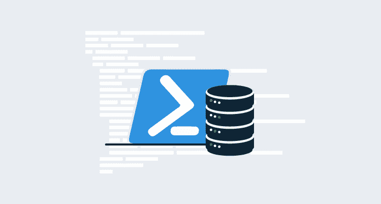

# 使用 dbatools 简化 SQL Server 和 PowerShell:实用示例- Octopus Deploy

> 原文：<https://octopus.com/blog/sql-server-powershell-dbatools>

[](#)

## 说重点！

## 为什么选择 PowerShell？

我们的数据在规模和复杂性方面继续呈指数级增长。DevOps 和 SRE 运动正在重新定义对弹性和响应性的期望。数据泄露、数据丢失或报告延迟的成本正在急剧增加。

四十五年前，[神话中的人月](https://en.wikipedia.org/wiki/The_Mythical_Man-Month)告诉我们，满足指数级增长需求的答案不仅仅是增加员工数量。生产率不会以同样的方式增长。

我们这些负责管理这些数据的人需要扩展我们的能力，来大规模地设计、交付和保护我们的数据，以满足对我们服务的需求。坦率地说，如果我们的技能只是扩展到使用 SQL Server Management Studio (SSMS)中的向导，我们将跟不上。

我们拥抱自动化至关重要。

如果您的数据在 SQL Server 数据库中，这意味着有必要学习 PowerShell。如果 PowerShell 还不是您工具箱中的关键部分，那么它很快就会成为。如果您还不习惯使用 PowerShell 作为您与 SQL Server 的主要接口，并且您希望保持可雇佣性，那么是时候进行一些研发了。

## 为什么选择 dbatools？

几个月前，James 写了[这篇关于使用 SqlServer PowerShell 模块](https://octopus.com/blog/sql-server-powershell#installing-the-sql-server-powershell-module)的精彩文章。他正确地指出“微软建议使用 SqlServer 模块从 PowerShell 与 SQL Server 进行交互”。他没有错。微软确实这么说。但我没有。在我看来， [dbatools](https://dbatools.io/) 应该是任何 SQL Server 工作的默认 PowerShell 模块。

dbatools 是一个社区驱动的开源 PowerShell 模块，用于管理 SQL Server。它由[克里斯·勒梅尔](https://twitter.com/cl)发起，但在克里斯鼓舞人心的指导下，已经由 [189 个贡献者](https://github.com/sqlcollaborative/dbatools/graphs/contributors)扩展。它继续有机增长，包括真正的最终用户需要的命令。在撰写本文时，它附带了超过 500 个 cmdlet 的[,比您在 SqlServer 模块中获得的大约多 5 倍。](https://dbatools.io/commands/)

而且不仅仅是数量；也是品质。相对于 SqlServer 模块，dbatools 也出奇的好用。这既是因为命令更简单，也是因为有一个巨大的社区，人们热衷于相互支持，他们中的许多人整天都在公共 SQL Server 社区 Slack workspace 中放松。如果您有任何问题或遇到困难，通常会在几分钟内得到回复。虽然这是一个社区的事情，你需要尊重这些人是出于好心帮助你。你将很难找到一个官方的支持团队来帮助任何一个能够击败它的厂商。

## 基本示例

在本文中，我首先向您展示所有 James 示例的 dbatools 等价物，以展示使用 dbatools 的相对简单性和可维护性。然后，我将讨论除了 SqlServer 模块提供的功能之外，dbatools 将为您提供的一些更加强大的功能。

就像詹姆斯一样，我所有的脚本都在[一个公共的 GitHub repo](https://github.com/Alex-Yates/dbatools-powershell-examples) 中。如果您对如何改进它们有任何建议，我很乐意查看您的拉动请求。😛

### 安装 dbatools PowerShell 模块

首先，James 安装了 SqlServer 模块。对于 dbatools，过程是相同的:

```
#Install the dbatools module from the PowerShell gallery
Install-Module -Name dbatools

#If the module is already installed, update it using the following commands:
#For PowerShell 5.0 or later
Update-Module -Name dbatools

#For PowerShell version earlier than 5.0
Uninstall-Module -Name dbatools
Install-Module -Name dbatools 
```

### 测试与 SQL Server 的连接

接下来，我们需要测试我们可以连接到我们的 SQL 实例。

我们可以通过使用[Test-DBA connection](https://docs.dbatools.io/#Test-DbaConnection)cmdlet 在实例级别对此进行测试，或者我们可以使用 [Get-DbaDatabase](https://docs.dbatools.io/#Get-DbaDatabase) cmdlet 在数据库级别进行测试。如同(全部/大部分？)的 dbatools cmdlets 中，cmdlet 试图为我们捕捉任何异常以避免*红色的海洋*堆栈跟踪，但是如果我们想要启用异常并自己处理它们，我们可以使用`-EnableException`参数:

```
# To test connectivity to a SQL instance
Test-DbaConnection localhost

# To test connectivity to a specific database
Get-DbaDatabase -SqlInstance localhost -Database MyDatabase 
```

就我个人而言，我发现上面的代码比 SqlServer 模块示例更容易理解和使用:

```
try
{
    # This is a simple user/pass connection string. 
    # Feel free to substitute "Integrated Security=True" for system logins.
    $connString = "Data Source=YourInstance;Database=YourDB;User ID=YourUser;Password=YourPassword"

    #Create a SQL connection object
    $conn = New-Object System.Data.SqlClient.SqlConnection $connString

    #Attempt to open the connection
    $conn.Open()
    if($conn.State -eq "Open")
    {
        # We have a successful connection here
        # Notify of successful connection
        Write-Host "Test connection successful"
        $conn.Close()
    }
    # We could not connect here
    # Notify connection was not in the "open" state
}
catch
{
    # We could not connect here
    # Notify there was an error connecting to the database
} 
```

### 创建 SQL Server 登录名

接下来，James 创建了一个 SQL Server 登录名。dbatools 中对应的 cmdlet[New-DbaLogin](https://docs.dbatools.io/#New-DbaLogin)非常类似。

```
# To run in a non-interactive mode, such as through an Octopus deployment, you will most likely need to pass the new login credentials as a PSCredential object.
$securePassword = ConvertTo-SecureString "Th!sI5Y0urP4ss" -AsPlainText -Force

# Create the login using the New-DbaLogin cmdlet
New-DbaLogin -SqlInstance localhost -Login MyLogin -SecurePassword $securePassword -PasswordPolicyEnforced -PasswordExpirationEnabled 
```

### 创建 SQL Server 数据库并分配所有者

使用 SqlServer 模块创建数据库非常困难。James 不得不恢复运行定制的 SQL 脚本，或者使用 SQL Server 管理对象(SMOs)来“完成繁重的工作”。对我来说，这两种解决方案都复杂得令人恼火。

接下来，James 更改了数据库所有者，再次创建了一对 smo。正如詹姆斯正确解释的那样，这是微软官方推荐的路线。然而，dbatools 使得代码更容易阅读和维护。

在下面的脚本中，我使用了 [New-DbaDatabase](https://docs.dbatools.io/#New-DbaDatabase) 和[Restore-DBA database](https://docs.dbatools.io/#Restore-DbaDatabase)cmdlet 来演示如何用一个命令创建一个新数据库或恢复一个新数据库。然后，我组合了 [Get-DbaDatabase](https://docs.dbatools.io/#Get-DbaDatabase) 和[Set-DBA dbowner](https://docs.dbatools.io/#Set-DbaDbOwner)cmdlet 来更改新数据库的数据库所有者。

```
# Create a new empty database
New-DbaDatabase -SqlInstance localhost -Name MyDatabase

# Create a new database from a backup
Restore-DbaDatabase -SqlInstance localhost -Path "\\Backups\MyDatabase.bak"

# Assign a new owner to your database
$db = Get-DbaDatabase -SqlInstance localhost -Database MyDatabase
$db | Set-DbaDbOwner -TargetLogin MyLogin 
```

### 运行 SQL 脚本

James 最后演示了如何使用 SqlServer cmdlet Invoke-Sqlcmd 来执行一些内联 SQL 或单独的。sql 脚本。这段代码看起来足够简单，与 dbatools 的等价代码 [Invoke-DbaQuery](https://docs.dbatools.io/#Invoke-DbaQuery) 看起来和感觉上非常相似。但是，dbatools 的等效功能旨在更方便地在管道中使用，并且与其他 dbatools 函数的行为更加一致。

```
# Run a query from a script
Invoke-DbaQuery -sqlinstance localhost -File "sql_script.sql" -MessagesToOutput

# Run an in-line SQL command
Invoke-DbaQuery -sqlinstance localhost -Query "PRINT 'hello world'" -MessagesToOutput 
```

## 更有力的例子

如上所述，dbatools 包含数百个命令，所以不可能在本文中涵盖所有命令。到目前为止，我一直关注一些用于处理基本操作的更简单的命令。然而，真正的力量来自于一些更大的 cmdlet，它们建立在更简单的 cmdlet 之上，使我们能够交付更大更复杂任务的最佳实践实现。

### 迁移 SQL 实例

Start-DBA migration cmdlet 可能是 dbatools 的第一个主要特性。它是许多**Copy**cmdlet(例如 [Copy-DbaDatabase](https://docs.dbatools.io/#Copy-DbaDatabase) 、 [Copy-DbaAgentJob](https://docs.dbatools.io/#Copy-DbaAgentJob) 、 [Copy-DbaLinkedServer](https://docs.dbatools.io/#Copy-DbaLinkedServer) 等)的包装器。)允许我们将所有 SQL Server 对象从一个实例迁移到另一个实例，包括数据库、代理作业、链接服务器和一长串其他对象类型。

试图使用 SSMS GUI 向导或者甚至普通的 T-SQL 脚本来实现这一点是一件痛苦的事情。用 SqlServer 模块做这件事并不容易。但是，使用 dbatools，我们可以像您打开 PowerShell 窗口并键入以下命令一样快速地开始这项工作:

```
Start-DbaMigration -Source sql01 -Destination sql02 -DetachAttach 
```

听起来有点不可思议，对吧？这里有几个视频有更多的信息。这个有 50 秒长。[这部](https://www.youtube.com/watch?v=kQYUrSlb0wg)，由克丽丝亲自拍摄，时长 50 分钟。

### 安全删除数据库

大胡子， [Rob Sewell](https://twitter.com/sqldbawithbeard) ，是 dbatools 最大的贡献者之一。他的第一个贡献是 [Remove-DbaDatabaseSafely](https://docs.dbatools.io/#Remove-DbaDatabaseSafely) 。受 Grant Fritchey 的三分钟备份演讲的启发，他整理了 Grant 的可靠备份的七个步骤，这样只需一个命令，你就可以放心地安全备份和删除数据库。

```
Remove-DbaDatabaseSafely -SqlInstance localhost -Database MyDatabase -BackupFolder 'C:\Backups\Old databases - DO NOT DELETE' 
```

[你可以在这里阅读更多相关内容](https://sqldbawithabeard.com/2016/07/20/remove-sqldatabasesafely-my-first-contribution-to-dbatools/)。

### 更多最佳实践材料

上面的两个例子演示了使用 dbatools 如何帮助您同时更有效地工作和标准化更好的实践。正如我提到的，dbatools 有超过 500 个命令，并且还在增加。为了让您了解 dbatools 允许您用一个简单的命令完成的其他一些最佳实践，请查看这些博客帖子:

1.  [新的最佳实践命令现已推出](https://dbatools.io/new-best-practices-commands-now-available/)
2.  [又一批新命令现已推出](https://dbatools.io/new-batch-of-commands/)

那些博客文章并不特别新，但我希望它们能激起你的兴趣。现在轮到您亲自动手练习使用这些命令了。

## 结论

我并不是说 DBA 角色已经死了。如果说有什么不同的话，那就是我们的数据问题变得越来越大，越来越复杂。数据库管理不再是一项可以外包给高度专业化的部门并从日常开发工作中抽象出来的功能。我们迫切需要懂得如何管理数据的人，我们需要他们密切参与我们数据结构的设计和开发。DBA 需要加入工程团队的其他成员。

DBA 很忙，雇佣更多的 DBA 并不是一个实际的解决方案。如果我们的数据库管理员要在开发周期的更早阶段找到时间参与进来，同时支持更大更复杂的数据资产，那么他们必须采用自动化，以便在更短的时间内高效可靠地完成更多的管理工作。能够做好这一点的数据库管理员将会非常吃香。不会的机会会更少。

从根本上说，DBA 需要努力减少使用 SSMS 向导的时间，增加使用 PowerShell 脚本和源代码控制的时间。数据库管理没有消亡，但它在不断发展。

dbatools 是支持 SQL Server 的最好、发展最快的 PowerShell 模块。

## 行动呼吁

由于 500 个 cmdlets 可能会令人望而生畏，您可能不知道从哪里开始。以下是一些建议:

1.  请查看 Chrissy 和 Rob 的“[在一个月的午餐中学习 DBA tools](https://www.manning.com/books/learn-dbatools-in-a-month-of-lunches)”。在写作的时候，它仍然是一个正在进行的工作，但是前八章已经可以使用了。这是个不错的开始。
2.  从你需要的开始。下一次当你有一个数据库任务需要完成时，问问你自己这是不是那种你可以编写脚本，测试，并坚持源代码控制的事情。在你写好脚本后，如果这是一个常规任务，你可以为它创建一个[章鱼手册](https://octopus.com/docs/operations-runbooks)。然后，如果你需要重复它或者完成一个类似的任务，你已经有了一个现成的模板。
3.  加入 SQL 社区。我们中有一群人[在闲暇时间](https://dbatools.io/dbatools-is-now-on-the-sql-server-communitys-slack/)闲逛。我们是一群傲慢友好的人，我们喜欢帮助事情进展。(如果您发现了改进 dbatools 的机会，[提交一个 pull 请求](https://github.com/sqlcollaborative/dbatools/blob/master/contributing.md)！)

加入我们吧。我们很高兴见到你！😊

* * *

自 2010 年以来，Alex Yates 一直在帮助组织将 DevOps 原则应用于他们的数据。他最引以为豪的是帮助 Skyscanner 开发了一天 95 次部署的能力，并支持了联合国项目服务办公室的发布流程。亚历克斯与除南极洲以外的各大洲的客户都有过合作——所以他渴望见到任何研究企鹅的人。

作为一名热心的社区成员，他共同组织了[数据接力](https://datarelay.co.uk/)，是[www.SpeakingMentors.com](http://www.speakingmentors.com/)的创始人，并自 2017 年以来被公认为[微软数据平台 MVP](https://mvp.microsoft.com/en-us/PublicProfile/5002655?fullName=Alex%20Yates) 。

亚历克斯是官方八达通部署合作伙伴 [DLM 咨询公司](https://dlmconsultants.com/)的创始人。他喜欢为那些希望通过改进 IT 和数据库交付实践来实现更好业务成果的客户提供指导、辅导、培训和咨询。

如果你想和亚历克斯一起工作，请发电子邮件:【enquiries@dlmconsultants.com 