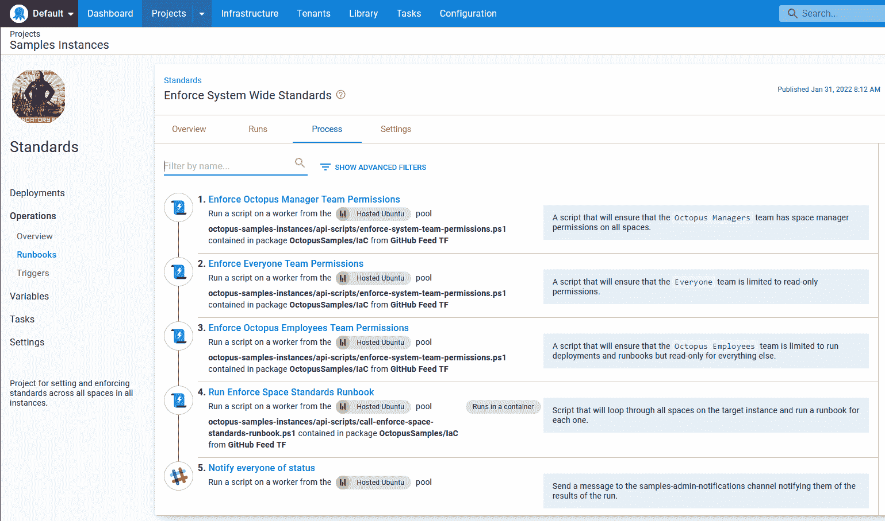
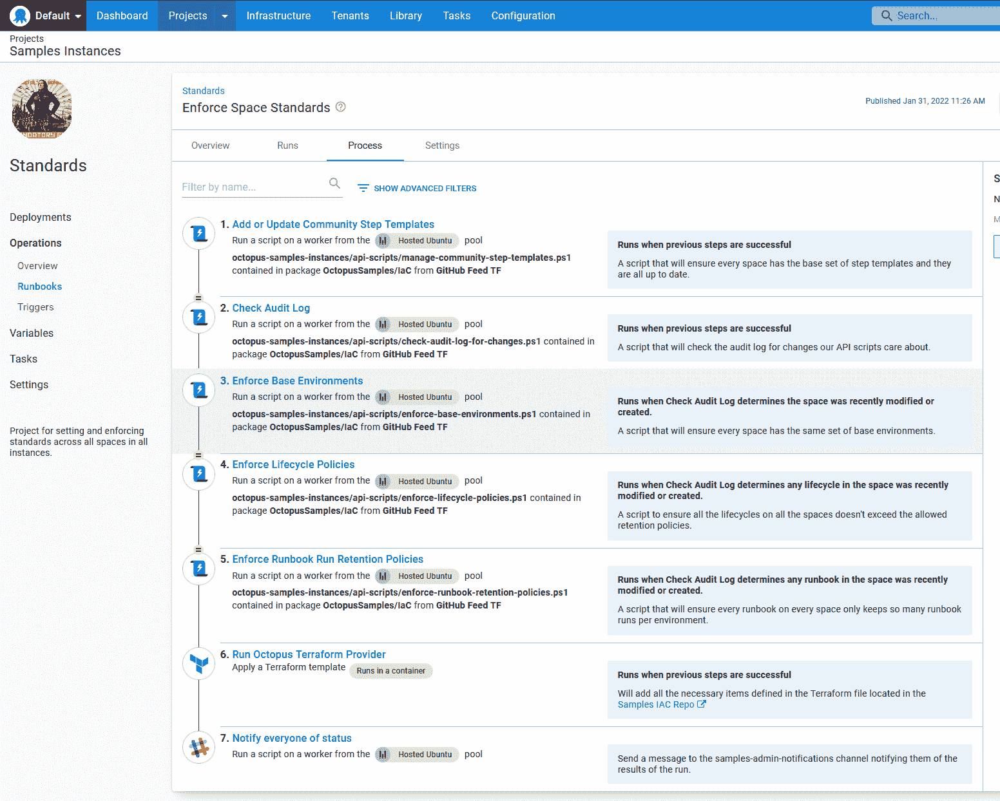
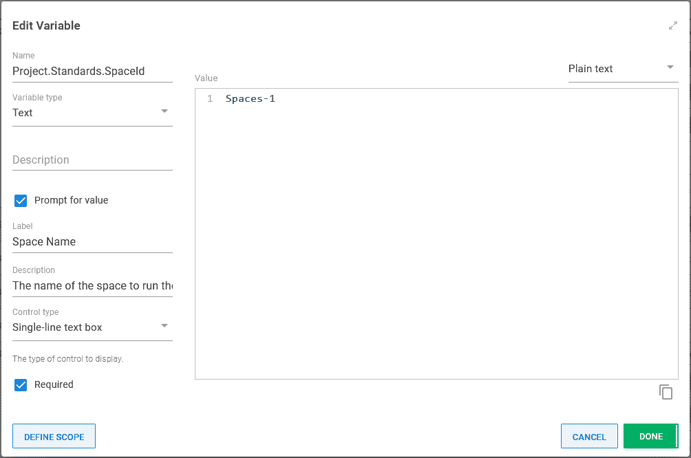
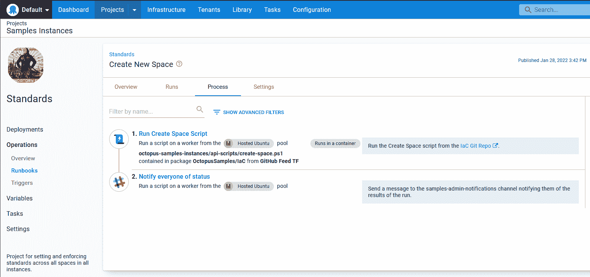
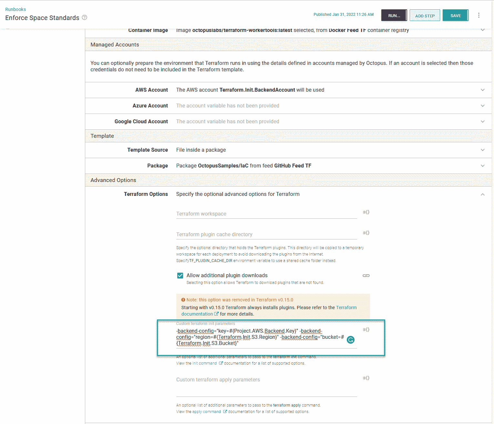

# 使用 Octopus Terraform 提供者创建标准- Octopus Deploy

> 原文：<https://octopus.com/blog/standards-with-octopus-terraform-provider>

自从我们在 2019 年末创建以来， [Octopus Deploy samples 实例](https://samples.octopus.app)已经显著增长。它有 30 多个车位。然而，这种增长是一把双刃剑。这些示例对我们的客户很有帮助，但是空间太大使得日常维护任务非常耗时，比如旋转外部 feed 密码。

在这篇文章中，我描述了我们的客户解决方案团队如何使用[Octopus Deploy terra form Provider](https://registry.terraform.io/providers/OctopusDeployLabs/octopusdeploy/latest/)来建立标准，以使示例实例更易于维护。

## 维护困难

在 Octopus Deploy，每个团队都有一个针对 AWS、Azure 和 GCP 的独特沙盒。在我们的沙盒里，每个人都可以自由支配。我们可以创建任何我们需要的资源来演示 Octopus Deploy 的功能。

然而，随着团队和样本实例的增长，样本之间的一致性变得更加难以实施。每个人都使用离他们最近的地区(对我来说，美国中部代表 Azure 和 GCP，美国东部代表 AWS)。如果我们的区域没有虚拟网络、VPC、数据库服务器等，我们会创建空间。当一个新的空间被创建时，创建它的人会从他们以前工作过的例子中复制值。除此之外，还要创建云帐户、工人池、外部提要和其他变量集。

维护示例实例非常耗时。例如，我们的一些样本使用 AWS AMIs。AWS 喜欢贬低 AMIs，它要求我们搜索每个样本来决定更新哪个样本。

虽然这是一种痛苦，但它并没有引起足够的摩擦来改变任何事情。我们并不是一直在创造空间。我们会尽可能地抽查商品。但是当我们的安全团队要求我们移动 AWS 和 Azure 沙箱时，我仔细研究了一下 Octopus Terraform 提供商。

## 空间标准

samples 实例中的每个空间都是唯一的，展示了如何在 Octopus Deploy 中使用不同的特性。空间之间的项目很少相似。范围设置为该项目的所有空间的基础资源。这些资源是:

*   帐目
*   工人池
*   外部源
    *   码头工人
    *   开源代码库
    *   进给
*   库变量集
    *   通知(与电子邮件和 Slack 一起使用的标准消息)
    *   GCP
    *   自动警报系统
    *   蔚蓝的
    *   API 键(从 Octopus 调用 API 脚本时使用)

在上面的列表中，您会注意到每个云提供商的库变量集。这是空间标准项目的第二部分。我们决定在美国和英国的一些地区创建一组基础资源、VPC 或虚拟网络、子网、安全组等。这些基础资源的名称存储在那些库变量集中，因此任何空间上的任何样本都可以使用它。

## 使用 Octopus Deploy Runbooks 运行 Terraform 命令

我知道我将使用 Octopus Deploy Runbooks 来运行`terraform apply`或`terraform destroy`命令。但是我不确定那些操作手册应该放在哪里。在 samples 实例上存储 runbooks 导致了“蛇吃尾巴”的情况。他们最终可能会阻止示例部署和其他操作手册。

我选择创建一个新的实例`samples-admin`，来存放运行手册。

下一步是开发一个 runbook 结构，将 Terraform 模板应用于 samples 实例上的所有空间。空间列表是动态的；添加空格应该会自动添加到流程中。Octopus Terraform 提供程序在针对特定空间时效果最佳。因此，我需要为每个空间运行`terraform apply`命令。拥有一个包含 34 个静态步骤的单一 runbook，每个步骤运行`terraform apply`并不能很好地扩展。为了解决这个难题，我制作了以下操作手册:

**实施系统范围的标准**——运行 API 脚本来实施 everyone 团队、Octopus employees 团队和 Octopus managers 团队的权限，然后调用**实施 samples 实例上每个空间的空间标准**。

[](#)

**实施空间标准**——接受一个 Space-ID 作为提示变量，运行几个 API 脚本来实施保留策略，并运行**应用 Terraform 模板**内置步骤。

[](#)

如果我想在单个空间上快速测试一个变化，Space-ID 提示变量将`Spaces-1`作为默认值。

[](#)

**创建新空间**——接受一个空间名作为提示变量，并运行 API 脚本来创建一个空间。创建空间后，它调用**Enforce System Wide Standards**run book(对单个空间使用提示变量)来确保为新空间正确设置权限和资源。

[](#)

预定触发器仅调用**强制系统范围标准**运行手册。每次该触发器运行时，都会创建以下任务:

*   **实施全系统标准**
    *   **执行空间标准**(空间-1)
    *   **执行空间标准**(空间-2)
    *   **执行空间标准**(空间-3)
    *   ...
    *   **执行太空标准** (Spaces-xxx)

## 地形基础

在开始时，我对 Terraform 的体验仅限于概念验证。这一节讲述了我所学到的如何将 Terraform 与 Octopus Deploy 一起使用。

### 资源所有权

向 Terraform 添加资源，无论是基础设施帐户、环境还是库变量集，都意味着它现在拥有该项目的生命周期。在 Octopus UI 中对该资源的任何修改都将在下次为该空间运行`terraform apply`时被覆盖。我的 runbooks 每 6 小时运行一次，因此，在被覆盖之前，修改最多会存在 6 个小时。

我想实施的一个标准是，每个生命周期的保留策略都设置为 5 天。我们的一些空间有多种生命周期来展示一个特定的功能。通过 Terraform 管理该标准是不可能的，因为:

*   资源必须在 Terraform 文件中声明。我们不想失去通过 UI 添加生命周期的能力。向 Terraform 文件动态添加资源是一项不小的工作量。
*   如果有一两个生命周期是由 Terraform 管理的，而其他的则不是，这将会非常混乱。
*   Terraform 拥有对资源的完全控制权。我不能让 Terraform 只管理保留策略。

我选择了一个 [API 脚本](https://github.com/OctopusSamples/IaC/blob/master/octopus-samples-instances/api-scripts/enforce-lifecycle-policies.ps1)。

你不能用 Terraform 和 Octopus UI 来管理资源。非此即彼。明确哪些资源是 Terraform 管理的。我决定在每个资源名中包含后缀`TF`。

### 状态

Terraform 使用状态文件来确定创建、更新和删除哪些资源。当资源出现在 Terraform 文件中而不是状态文件中时，Terraform 会尝试创建它。如果资源出现在状态文件中，但没有出现在 Terraform 文件中，它将被删除。

默认情况下，状态文件存储在工作目录的子目录中。Octopus Deploy 会在每个 Terraform 步骤运行后删除工作目录。该状态文件将被自动删除。Octopus Deploy 第一次运行`terraform apply`命令时，一切都正常，因为这是一个全新的状态文件，资源将不存在。但是在随后的运行中它会失败，因为资源已经存在于 Octopus Deploy 中，但是状态文件认为这些资源不存在。

无论如何，不建议将状态文件存储在本地目录中。任何敏感值都不加密地存储在状态文件中。为了存储状态文件，建议使用[远程后端](https://www.terraform.io/language/settings/backends)来存储状态文件。我选择了一个加密的安全 S3 桶。

在我最初版本的 Terraform 文件中，状态选项是内联声明的。但是，您不能将变量用于状态选项。出于无知，我决定使用 Octostache 并让 Octopus Deploy 在 runbook 运行时替换这些值。

```
terraform {
  required_providers {
    octopusdeploy = {
      source = "OctopusDeployLabs/octopusdeploy"
      version = ">= 0.7.64" # example: 0.7.62
    }
  }

  backend "s3" {
    bucket = "#{Project.AWS.Backend.Bucket}"
    key = "#{Project.AWS.Backend.Key}"
    region = "#{Project.AWS.Backend.Region}"
  }
}

provider "octopusdeploy" {
  # configuration options
  address    = var.octopus_address
  api_key    = var.octopus_api_key
  space_id   = var.octopus_space_id
} 
```

我不喜欢那样。有太多的活动部件，很容易搞砸。任何修改这个过程的人都必须知道查看 variables.tf 和 main.tf 文件，以确保他们创建了所有的变量。

在浏览 [Terraform 的文档](https://www.terraform.io/language/settings/backends/configuration#command-line-key-value-pairs)时，我发现了`terraform init`命令的`-backend-config`参数。Octopus Deploy 可以给`terraform init`命令添加额外的参数。因为我使用的是 S3，所以额外的命令行参数是:

```
-backend-config="key=#{Project.AWS.Backend.Key}" -backend-config="region=#{Terraform.Init.S3.Region}" -backend-config="bucket=#{Terraform.Init.S3.Bucket}" 
```

[](#)

现在我的 main.tf 文件如下所示:

```
terraform {
  required_providers {
    octopusdeploy = {
      source = "OctopusDeployLabs/octopusdeploy"
      version = ">= 0.7.64" # example: 0.7.62
    }
  }

  backend "s3" { }
}

provider "octopusdeploy" {
  # configuration options
  address    = var.octopus_address
  api_key    = var.octopus_api_key
  space_id   = var.octopus_space_id
} 
```

### 将预先存在的项目导入状态文件

除了外部源，几乎所有的空间标准项目对每个空间都是新的。一些空间有 Docker 外部提要、Github 外部提要，或者两者都有。我不想创建新的外部提要，并强迫每个人更新他们的部署流程。在运行`terraform apply`步骤之前，我选择将那些预先存在的外部提要导入到状态文件中。

这可不像跑`terraform import`那么简单。我希望我的过程运行多次。我的脚本需要:

1.  通过调用 Octopus API 确定提要是否已经存在于 Octopus 中。如果没有，则退出。
2.  确定该提要是否已存在于 Terraform 状态文件中。如果是，那么退出。
3.  将有问题的提要导入状态文件。

调用 Octopus Deploy API 对我来说不是问题。我有一些使用 API 的经验。其他一切对我来说都是新的。

我想用和 Octopus Deploy 内置步骤一样的方式登录 AWS。Octopus 使用[环境变量](https://www.terraform.io/language/settings/backends/s3#credentials-and-shared-configuration)作为凭证后端。在我的例子中，我需要为`AWS_ACCESS_KEY_ID`和`AWS_SECRET_ACCESS_KEY`提供一个值。

```
$backendAccountAccessKey = $OctopusParameters["Project.AWS.Backend.Account.AccessKey"]
$backendAccountSecretKey = $OctopusParameters["Project.AWS.Backend.Account.SecretKey"]

$env:AWS_ACCESS_KEY_ID = $backendAccountAccessKey
$env:AWS_SECRET_ACCESS_KEY = $backendAccountSecretKey

terraform init -no-color 
```

我解决了第一个问题；接下来是将状态文件读入内存。我是通过运行带有指定参数`-json`的`terraform show`命令和运行`ConvertFrom-Json` cmdlet 来实现的。

```
$currentStateAsJson = terraform show -json
$currentState = $currentStateAsJson | ConvertFrom-Json -depth 10 
```

有了 PowerShell 中的对象，花了一些试错才发现结构(很多`Write-Hosts`)。我最后说:

```
function Get-ItemExistsInState
{
  param 
    (
      $currentState,
        $itemTypeToFind,
        $itemNameToFind
    )

    foreach ($item in $currentState.Values.root_module.resources)
    {
        Write-Host "Comparing $($item.Name) with $itemNameToFind and $($item.type) with $itemTypeToFind"
        if ($item.name.ToLower().Trim() -eq $itemNameToFind.ToLower().Trim() -and $item.type.ToLower().Trim() -eq $itemTypeToFind)
        {
            Write-Host "The item already exists in the state"
      return $true
        }
    }   

    return $false
} 
```

将项目导入状态文件的命令是`terraform import [address] [id]`。该地址是在 terraform 文件中定义的。

对于定义为以下内容的资源:

```
resource "octopusdeploy_feed" "github" {
  name = "GitHub Feed TF"  
  feed_type = "GitHub"
  feed_uri = "https://api.github.com"
  is_enhanced_mode = false
} 
```

地址是`octopusdeploy_feed.github`。id 是 Octopus Deploy 中项目的 ID。比如`Feeds-1070`。

### 传入变量值

使用 Terraform，您可以像这样定义和使用变量:

```
terraform {
  required_providers {
    octopusdeploy = {
      source = "OctopusDeployLabs/octopusdeploy"
      version = ">= 0.7.64" # example: 0.7.62
    }
  }

  backend "s3" { }
}

variable "octopus_address" {
    type = string
}

variable "octopus_api_key" {
    type = string
}

variable "octopus_space_id" {
    type = string
}

provider "octopusdeploy" {
  # configuration options
  address    = var.octopus_address
  api_key    = var.octopus_api_key
  space_id   = var.octopus_space_id
} 
```

向这些变量传递值有 3 个选项。

1.  命令行参数:`-var="octopus_address=https://samples.octopus.app"`或`-var="octopus_address=#{Octopus.Web.ServerUri}"`
2.  变量文件:用扩展名`.tfvars`命名一个文件，并用值填充它。例如`octopus_address = "https://samples.octopus.app"`或`octopus_address = "#{Octopus.Web.ServerUri}"`
3.  环境变量:`export TF_VAR_octopus_address=https://samples.octopus.app`或`$env:TF_VAR_octopus_address = https://samples.octopus.app`

Octopus Deploy 支持所有 3 个选项。这是个人喜好的问题。我不喜欢使用. tfvars 文件，因为它必须用八进制值签入源代码管理；任何变量名的改变都需要更新多个不同的地方。我选择环境变量，因为它在 Octopus UI 中比命令行变量更简洁。

## 迁移到新资源

我在用几个项目做一个试点模板时学到了大部分经验。试点完成后不久，所有示例实例上都创建了这些资源。这是这个项目最简单的部分。

现在是时候迁移所有现有项目来使用新资源了。这是一项重要的任务，不是我们可以用一些 API 脚本编写的。每个样本都有自己的基础设施。我们需要修改这些示例，以使用相同的云资源基础集，并且只创建需要的内容。

拥有相同的库变量集、帐户和工作池使得迁移变得更加容易，但这仍然是手工操作。我提到这一点是因为如果您想在现有实例上实现这样的东西，您可能需要额外的手工操作。

## 结论

在我们开始使用 Octopus Terraform Provider 之前，复制/粘贴需要几个小时来轮换密码或在所有空间上添加新的资源组。现在只需要不到 30 分钟。

Octopus Terraform 提供者使得在 Octopus Deploy samples 实例上跨所有空间建立标准变得容易。在了解了 Terraform 的细微差别后，我开始欣赏它所能提供的东西。我现在可以在空间之间共享一些资源，但是这些资源的状态由 Terraform 管理。通过这样做，我限制了 Octopus UI 中的编辑权限，并依靠分支、恢复和拉请求等版本控制特性来创建批准流程。

愉快的部署！