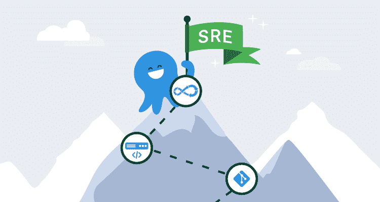

# 从系统管理员到 SRE - Octopus 部署

> 原文：<https://octopus.com/blog/sysadmin-to-sre>

DevOps 无处不在！它被用作标签、产品名称和职位名称。Digital Trends 将 DevOps 工程师列为 2020 年第三大最佳技术职位。Indeed.com 有超过 4000 份 DevOps 工程师职位的招聘信息，LinkedIn 有超过 3 倍的数量，超过 13000 份招聘信息。

DevOps 就不用说了，辣！

网站可靠性工程师(SRE)这个职位是近年来从谷歌中出现的。SRE 还没有它的前身那么受欢迎，但它经常被招聘人员用作同义词。

在这篇文章中，我分享了我对这个行业的新人如何渴望这些角色的想法。

看招聘信息可能只会让你困惑。从 10 年的 C#经验到对 Active Directory 域信任的深入了解，一切都列在工作描述中。面对如此广泛的需求，您应该从哪里开始呢？

首先要理解德沃普斯和 SRE 是高级工作角色。您可以通过申请服务台的入门级职位和系统管理来开始 web 开发职业生涯。德沃普斯和 SRE 还没有那个入门位置。通常，DevOps 从业者已经在技术领域工作了几年。这是因为 DevOps 和 SRE 角色需要了解开发和基础设施。很难同时学习这两个学科，这就是为什么大多数从业者都有这两个学科的背景。

我在服务台开始了我的职业生涯。晋升为系统管理员，并最终获得了一份高级系统工程师的工作。当我第一次通过 Twitter、博客帖子和会议讨论听说 DevOps 时，我认为它是初创公司的专利。所以我忽略了它，直到我对自动化的热情将我带到了作为代码的基础设施的 DevOps 实践中。我第一次听说 DSC(理想状态配置)是在嘉宾 Steve Murawski 的 PowerScripting 播客的第 275 集。将基础设施作为代码是将我带入 DevOps 世界的唯一想法。它是所有操作系统变体的系统管理员可以用来过渡到 DevOps 的门户。

DevOps 不是工具！这实际上是一些人在会议上喊的，他们看上去涂着勇敢之心的脸，敲着战鼓。他们的断言可以说是正确的。但是你使用的工具塑造了你使用的语言，决定了你如何与他人互动来完成你的工作。你实际上生活在你使用的工具中。无论是 email，Slack，还是像大多数开发者一样，Git。

在传统公司中，您会发现开发人员使用一套工具，而系统管理员使用另一套。这只会强化筒仓。

如果你曾经希望打破这些孤岛，你需要做的不仅仅是改变头衔，组建联合发行小组，并告诉人们一起工作。你需要给每个团队互动的机会。如果他们用于工作的工具重叠，这种情况就会自然发生。

共享工具创造了一种共享语言。这不是高层领导的建议，这适用于个人贡献者。如果您是一名系统管理员，希望进入 DevOps 角色，这适用于您。DevOps 与工具无关，但工具是一个很好的起点。

## 学习从命令行编码

自动化是起点。这是一个起点，因为它让你编写代码。如果你看一下 DevOps 工程师职位招聘中列出的技术，你会注意到一个趋势。他们都提到了某种形式的编码。这并不意味着你需要参加编码训练营，学习 Java 或 C#。任何脚本或编程语言都可以。重要的是你要选择一门实用的语言来应用到你的工作中。如果你在 Linux 上工作，Bash 和 Python 是一个天然的组合。如果你在 Windows 上工作，PowerShell 是个不错的选择。

开始学习一门编码语言很容易。有数不清的博客帖子、YouTube 视频、书籍和 Pluralsight 课程供你使用。

难的是弄清楚如何在工作中应用它。我建议你从自动化糟糕的事情开始。找到日常和平凡的任务，并努力实现自动化。你选择学习的脚本或编程语言将成为你工具箱中的锤子。与任何工具系列一样，锤子只是一个开始。您需要添加其他工具。在基础设施自动化的背景下，这些工具被命名为 Ansible、Chef、Puppet、Terraform、Azure Resource Manager 模板和 CloudFormation。这些工具很有价值，因为它们是抽象的。留给您更少的代码编写和更好的框架来管理您的基础设施。如果代码形式的基础设施是门户，那么自动化就是打开它的方式。

## 从源头开始

依靠 shell 历史和文件共享来存储代码的日子已经一去不复返了。你需要更好的东西。你需要源代码控制。源代码管理是一个广泛的主题，有整本书专门讨论它。好消息是不需要深入理解。你只需要足够的信息就能胜任。只需学习几个命令，您就可以立即投入使用。

Git 是目前最流行的源代码控制系统。GitHub 是目前最受欢迎的托管 Git 提供商。在 GitHub 上创建一个帐户并上传你的代码是一个很好的开始。GitHub 允许你创建公共和私有的存储库。如果你选择上传到一个公共库，确保你的代码是干净的并且可以开源。

创建公共存储库也可以作为您工作的公共工件。你可以用它们来展示你的技能和知识，也可以作为参考。不是所有你学到的东西都会留在你的脑子里，但是通过使用 Git，它会被记录在你的提交历史中。

学习 Git 会花一些功夫，但是一旦学会使用，就不会走回头路了。事实上，如果你开始在工作之外使用 Git，没有它你就不想工作了。您的组织中可能有人正在使用 Git 或其他源代码控制系统。四处询问并找出如何访问源代码控制系统，然后为您的团队创建一个存储库并帮助他们。让你的团队加入比让你的老板加入更困难。你的团队会有一个学习曲线，但在你说出*审计*这个词后，你的经理会同意的。

Git 的所有优势都不会马上显现出来。关注它在前期和未来增加的价值。这种直接价值是通过提交历史、增强的协作和比文件共享更容易管理的可审计代码。然而最重要的是，源代码控制开启了其他一切。

## 拉式请求意味着部署

传统上由发布工程师管理的工具已经成为任何编写代码的人的赌注。

是的，脚本也是代码。

发布工程是软件工程的一个分支，主要关注源代码的编译、汇编和交付。关于发布工程有很多你不需要知道的，但是有两种类型的工具是你不想离开的；持续集成和持续交付统称为 CI/CD。

TeamCity、Octopus Deploy、Jenkins、Azure DevOps 和 GitHub Actions 都是生活在这个领域的工具。专注于工具会让您感到困惑，因为这些工具都包含允许您构建 CI/CD 系统的特性。但是，持续集成和持续交付实际上是软件工程实践。

简单来说，将持续集成视为软件构建阶段的自动化，将持续交付视为软件发布和部署的自动化。持续集成、持续交付和源代码控制共同构成了一个发布管道。发布管道是一个概念性的过程，它将您的代码从源代码带到产品中。通过源代码控制和 CI/CD，您可以摆脱点击按钮的业务。

**场景**:您已经自动化了新基础设施的部署、供应和配置，并且所有的基础设施代码都存储在源代码控制中。您正处于可以使用这种自动化来扩展和缩减基础架构的阶段。然而，现在已经很难确定最后部署的是哪个版本的代码，部署是在命令行手动完成的，并且代码库中经常会出现输入错误。

**解决方案**:构建基础设施代码的发布管道。通过使基础设施代码程序化和非交互式，自动化部署基础设施代码的所有步骤。然后，您可以开始构建发布管道。从源代码控制开始，发布管道将由提交和/或拉请求触发。接下来，在构建阶段 lint 您的代码，以减少错别字和控制代码质量。在您的代码通过 lint 和其他测试之后，您可以在发布阶段部署它，这将部署基础设施代码。实现发布管道将您从自动化的手动部署中解放出来。从某种意义上说，这是自动化。目标总是点击更少的按钮。

## 结论

一切都指向自动化，正是自动化让这一切成为可能。没有自动化，门户就不会打开。进入门户，源码控制是你的据点。有了据点，发布管道将带你穿过迷雾，进入开发人员未知的领域。学习本文中列出的技术和实践将会在你的 DevOps 技能树上打开许多可能的路径。你下一步去哪里，将取决于你。

资源:

* * *

Josh Duffney 是一名现场可靠性工程师。他[写](https://duffney.io/posts/)，做演示，[教](https://app.pluralsight.com/profile/author/josh-duffney)，而[发](https://twitter.com/joshduffney)关于自动化、DevOps、云和优化输出同时最小化输入。