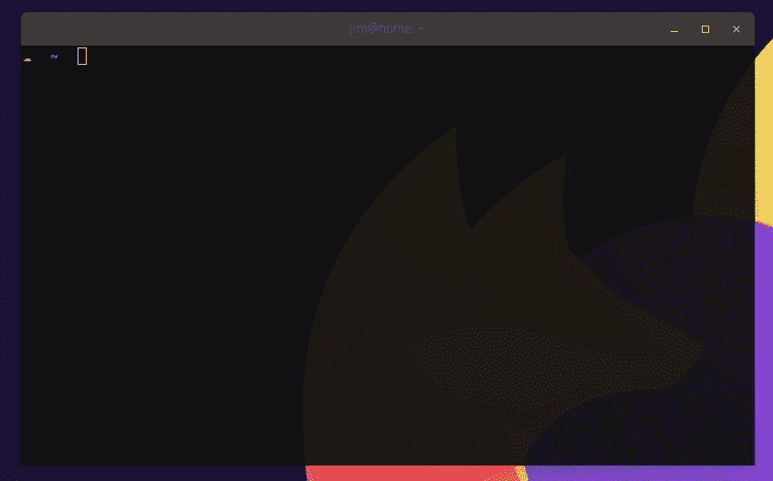
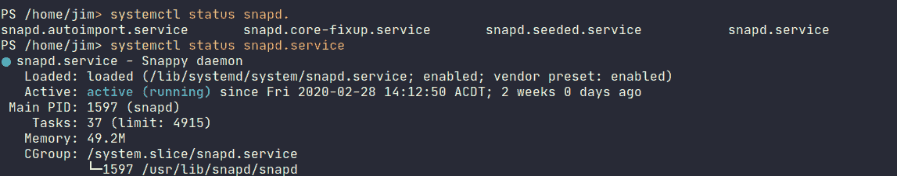

# Octopus CLI 的命令行选项卡完成- Octopus 部署

> 原文：<https://octopus.com/blog/tab-completion-for-the-octopus-cli>

[](#)

作为一名开发人员，我喜欢我的 IDE 和文本编辑器在我进行大量输入时提供有用的提示。这不仅在我知道我要做什么的时候加快了我的速度，而且在我学习如何使用工具或框架特性的时候也加快了我的速度。回想起来，我学习 C#编程的速度可能要归功于像 IntelliSense 这样的特性。

我最近对我们自己的 Octopus CLI 感到有点沮丧，因为我不得不在我的 shell 和浏览器之间切换，以检查我需要传递哪些标志。

为什么我的命令行体验应该与 Visual Studio 有所不同？即使在最好的情况下，我也记不住确切的 CLI 调用，更不用说在我面临修复某个东西的压力时了！

## 壳牌完井救援

好消息是，只需少量的前期投资，您就可以调整您的命令行体验，为您提供这类提示并自动完成短语和选项，CLI 创建者可以对他们的产品进行更改，使事情变得更加简单。

我感到沮丧的结果是，我们的 CLI 中增加了一些功能来支持和配置流行 shells 中的 tab 补全。

如果您获得了 Octopus CLI 的最新版本，您也可以将所需的脚本安装到流行的 shells 中:

```
# install into your ~/.zshrc
octo install-autocomplete --shell zsh

# install into your ~/.bashrc
octo install-autocomplete --shell bash

# install into your pwsh $PROFILE
octo install-autocomplete --shell pwsh

# using legacy powershell on windows?
octo install-autocomplete --shell powershell

# unsure? do a dry run first and show the result without saving
octo install-autocomplete --shell bash --dryRun 
```

一旦安装，只要点源或重启你的外壳，你就可以完成所有的事情！这就是它的作用:

[](#)

## 制表符补全是如何工作的？

在高层次上，大多数您喜欢的 shells 都提供了内置的命令来接受来自外部资源的建议，比如一个文件或另一个应用程序。这意味着你可以[为任何命令行工具](https://www.cyberciti.biz/faq/add-bash-auto-completion-in-ubuntu-linux)编写它们。这些内置功能的工作方式大致相同:

1.  注册遇到 tab 键时要调用的命令。
2.  在 tab 键之前处理文本输入。
3.  从源(列表、其他命令)读入建议。
4.  如果有多个建议，向用户显示选择。有些外壳甚至允许用户选择一个！
5.  如果有一个建议，那就用它。

Systemd 内置了对`bash`和`zsh`的完成支持，但不支持`pwsh`。所以，让我们实现它吧！一个小例子是子命令`systemctl status`,它通过名称获取单个服务并显示其状态。

在`zsh`和`bash`中，我完成了可能要显示的服务的标签，所以让我们在`pwsh`中实现一个类似的东西。

每当按下`tab`键时，我们可以让`pwsh`使用这个列表，用下面的脚本向我们提供提示:

```
# Register our script block against usages of systemctl
Register-ArgumentCompleter -Native -CommandName systemctl -ScriptBlock {
  # Declare the expected parameters for this feature
  param($wordToComplete, $commandAst, $cursorPosition)

  # Split the incoming words into an array
  $words = $commandAst.ToString() -split ' '

  # The first word is our sub-command
  $subCommand = $words[0]

  # The last word is our search term
  $searchTerm = $words[-1]

    # if the status sub-command was chosen
    if ( $words -eq 'status' ) {

      # Find all enabled unit file names
      $services = systemctl list-unit-files | grep enabled | cut -d' ' -f1

      # Find some suggestions based on our search term
      $suggestions = $services | select-string $searchTerm

      # Provide parameter name suggestions to pwsh
      $suggestions | % {
        [System.Management.Automation.CompletionResult]::new($_, $_, 'ParameterName', $_)
      }
    }
} 
```

如果我们将其写入`$PROFILE`，然后用`. $PROFILE`对其进行“点源”，您将会看到您现在可以完成任何已启用的服务。

[](#)

## Octopus CLI 做了什么来简化这一过程？

上面的例子要求我提前做好处理建议的工作。如果最了解其子命令的`systemctl`本身提供了这些完成，会怎么样？这就是像`dotnet`、`nuke`、`octo`这样的工具所做的；它们提供了自己的子命令来处理建议方面的事情。您可以使用最新版本的 Octopus CLI 进行尝试:

```
octo complete list

# returns subcommands starting with 'list'
list-deployments
list-environments
list-latestdeployments
list-machines
list-projects
list-releases
list-tenants
list-workerpools
list-workers 
```

这使得上面的注册更加简单。现在，它们看起来更像这样:

```
Register-ArgumentCompleter -Native -CommandName octo -ScriptBlock {
    param($wordToComplete, $commandAst, $cursorPosition)

    $parms = $commandAst.ToString().Split(' ') | select -skip 1

    # throw everything at `octo complete` and let it figure things out
    octo complete $parms | % {
        [System.Management.Automation.CompletionResult]::new($_, $_, 'ParameterName', $_)
    }
} 
```

## 包扎

Shell 完成是一个很好的节省时间的方法，您可以在自己的工具中编写对它的支持，或者构建对现有工具的支持。

请在评论中告诉我们你是如何使用 Octopus CLI 的！你希望在命令行中使用什么工具更容易？

Octopus CLI 现在能够帮助您在您最喜爱的 shell 中快速实现这一点。尽情享受吧！