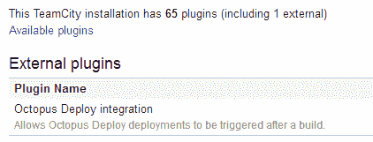
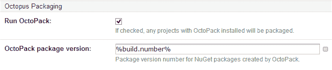
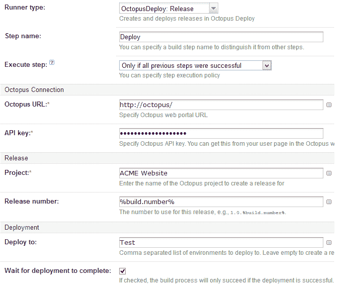

# 章鱼的团队城市插件！-章鱼部署

> 原文：<https://octopus.com/blog/teamcity-improvements>

在过去的几周里，我们花了很多时间来改进章鱼/团队城市整合的故事。为此，我们创建了一个 TeamCity 插件，您可以将它安装在您的 TeamCity 服务器上。



该插件可以从[通常的 Octopus 下载页面](http://octopusdeploy.com/downloads)下载。插件的[源代码是开源的，托管在 GitHub 上。](https://github.com/OctopusDeploy/Octopus-TeamCity)

该插件提供了两个主要特性。首先，它扩展了内置的 MSBuild/VisualStudio 运行类型，以添加更好的 OctoPack 支持:



其次，它添加了一对定制构建运行器，用于创建和升级发布。



在这个过程中，我们对 Octo.exe 也做了一些修改，以更容易确保发布使用正确的软件包版本。例如，如果您有一个文件夹，其中包含您想要包含在发行版中的 NuGet 包，您可以:

```
octo.exe create-release <....> --packagesFolder=somepath 
```

当确定版本中每个包的版本号时，Octo 将检查该文件夹中包的版本号。您可以将它与 TeamCity 工件依赖项结合使用，以使一个构建配置中构建的包流入到由另一个构建配置创建的发布中。

这些功能在我们最近的 TeamCity/Octopus 网络研讨会中进行了演示，会议记录如下:

[http://www.youtube.com/embed/JWGLEEm9Qhg](http://www.youtube.com/embed/JWGLEEm9Qhg)

VIDEO

非常感谢 JetBrains 的团队(特别是 [Eugene](https://twitter.com/jonnyzzz) )帮助创建和完善这个插件。