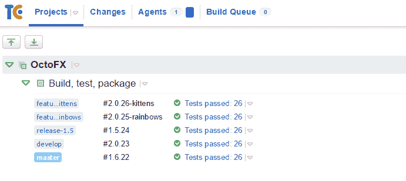
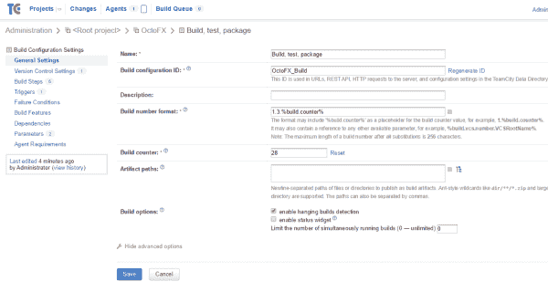
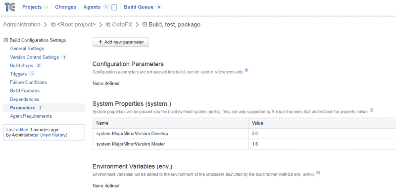
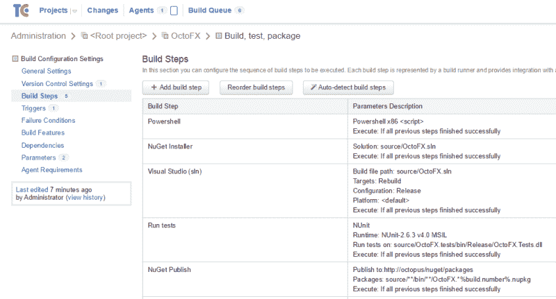

# 基于当前分支机构- Octopus 部署动态设置 TeamCity 版本号

> 原文：<https://octopus.com/blog/teamcity-version-numbers-based-on-branches>

当您使用 TeamCity 构建一个包含多个分支的项目时，根据分支的不同，最好有不同的构建号。例如，除了简单的 TeamCity 构建号，如`15`、`16`等等，您可能有:

*   分支`master` : `1.6.15`。
*   分支`release-1.5` : `1.5.15`(从分支名称开始的主要/次要构建)。
*   分支`develop` : `2.0.15`(不同的次要构建)。
*   分支`feature-rainbows` : `2.0.15-rainbows`(特征分支为标签)。

它看起来是这样的:



处理像 [GitFlow](http://nvie.com/posts/a-successful-git-branching-model/) 这样的分支工作流，并使用这些版本格式，对于 TeamCity 来说是相当容易的，在这篇博文中，我将向你展示如何操作。您自己的版本控制策略可能会有所不同，但是希望这篇文章能够帮助您开始。

## 背景

首先，我们关心两个内置的 TeamCity 参数:

*   `build.counter`:这是自动递增的构建计数器(上面的 15 和 16)。
*   这是完整的版本号。默认是`%build.counter%`，但可以更复杂。

`build.number`的格式和`build.counter`的值在 TeamCity UI 中定义:



然而，您也可以在构建期间使用[服务消息](https://confluence.jetbrains.com/display/TCD7/Build+Script+Interaction+with+TeamCity)动态设置它。也就是说，您的构建脚本可以将以下文本写入 stdout:

```
##teamcity[buildNumber '1.1.15'] 
```

这将覆盖内部版本号，然后新值将被传递给内部版本中的其余步骤。

## 把它放在一起

根据分支名称是`master`还是`develop`，我们将使用不同的主/次构建号。为此，我们将在 TeamCity 中定义两个参数。这些需要成为 TeamCity 中的**系统**参数，以便他们可以构建脚本。



为了根据分支名称动态设置构建号，我将添加一个 PowerShell 脚本步骤作为我的构建中的第一个构建步骤:



最后，下面是 PowerShell 脚本:

```
# These are project build parameters in TeamCity
# Depending on the branch, we will use different major/minor versions
$majorMinorVersionMaster = "%system.MajorMinorVersion.Master%"
$majorMinorVersionDevelop = "%system.MajorMinorVersion.Develop%"

# TeamCity's auto-incrementing build counter; ensures each build is unique
$buildCounter = "%build.counter%" 

# This gets the name of the current Git branch. 
$branch = "%teamcity.build.branch%"

# Sometimes the branch will be a full path, e.g., 'refs/heads/master'. 
# If so we'll base our logic just on the last part.
if ($branch.Contains("/")) 
{
  $branch = $branch.substring($branch.lastIndexOf("/")).trim("/")
}

Write-Host "Branch: $branch"

if ($branch -eq "master") 
{
 $buildNumber = "${majorMinorVersionMaster}.${buildCounter}"
}
elseif ($branch -eq "develop") 
{
 $buildNumber = "${majorMinorVersionDevelop}.${buildCounter}"
}
elseif ($branch -match "release-.*") 
{
 $specificRelease = ($branch -replace 'release-(.*)','$1')
 $buildNumber = "${specificRelease}.${buildCounter}"
}
else
{
 # If the branch starts with "feature-", just use the feature name
 $branch = $branch.replace("feature-", "")
 $buildNumber = "${majorMinorVersionDevelop}.${buildCounter}-${branch}"
}

Write-Host "##teamcity[buildNumber '$buildNumber']" 
```

既然`%build.number%`是基于分支的，那么您的 TeamCity 构建就有了一个一致的构建号，可以在您的其余构建步骤中使用。例如，如果您使用的是 OctoPack，那么内部版本号可以用作`OctoPackPackageVersion` MSBuild 参数的值，这样您的 NuGet 包就可以匹配内部版本号。

### 了解更多信息