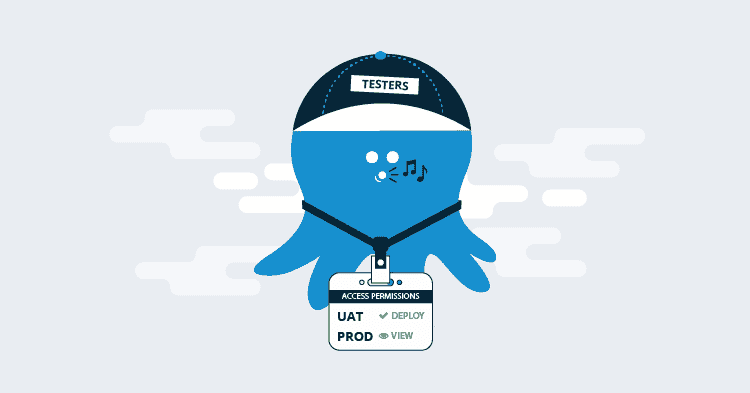
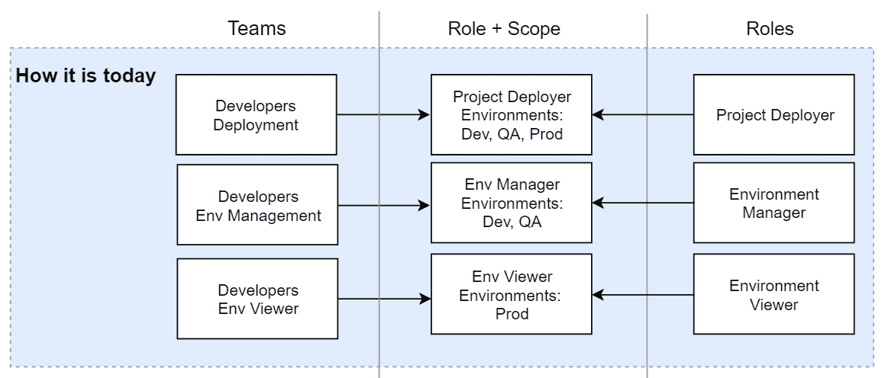
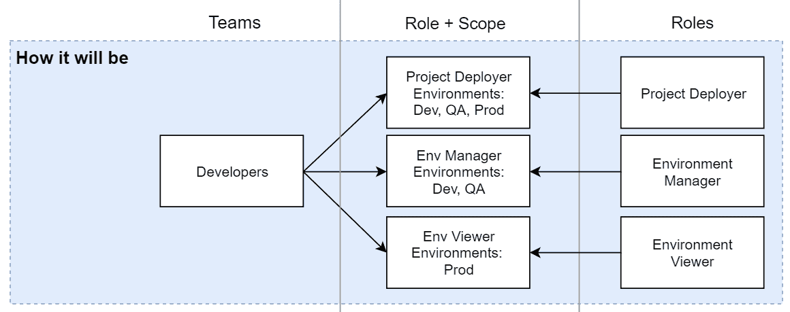
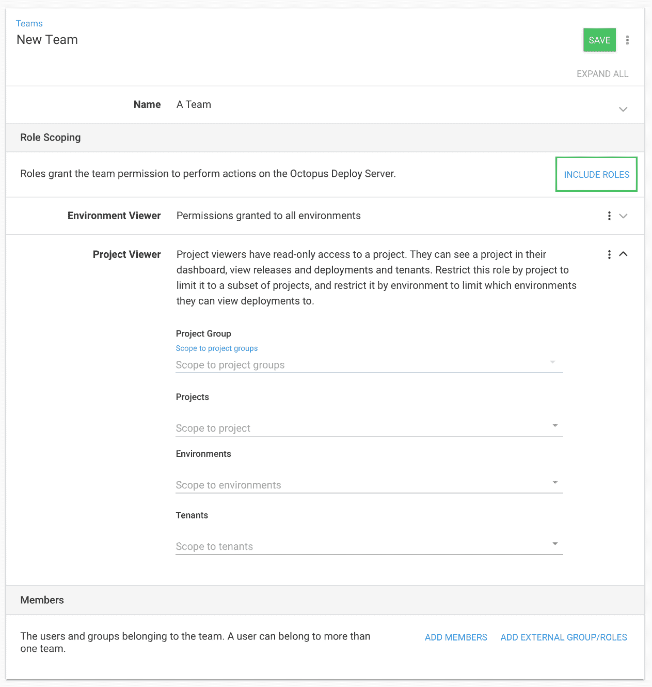

# 团队配置改进- Octopus 部署

> 原文：<https://octopus.com/blog/team-configuration-improvements>

## 团队配置改进

配置你的 Octopus 服务器不是你一直在做的事情，重点是部署你的软件和微调你的项目。Octopus 最有趣的事情是配置团队和权限。

这是 Octopus 的一个很长时间没有改变的领域，我们现在正在围绕如何管理团队进行一些改进。在这篇文章中，重点将放在团队的结构变化上，请留意即将到来的空间博客文章，在那里我们将再次谈论团队。

## 背景

Octopus 具有精细的权限，例如:

*   创建部署
*   编辑机器

这些权限有 100 多种，它们作为用户角色捆绑在一起，用户角色是实现特定任务的权限的逻辑集合。例如:

*   **环境管理器**:用于配置机器和目标。
*   **项目部署器**:用于部署项目。

团队是用户的集合，是这些用户角色的集合，以及这些角色适用的地方，例如特定的环境、项目或租户。目前的方式导致了管理团队和权限的合理开销。

## 我们现在如何配置团队

目前，如果您有一个软件开发团队，您希望将他们部署到“开发”环境中，但是您也希望他们能够配置和管理“开发”和“QA”。你需要创建两个团队。

在第一个团队中，您添加成员，授予他们适当的权限，并限制他们只能进行“开发”。

在第二个团队中，您再次添加相同的成员，授予他们不同的权限，并对“开发”和“QA”应用限制。

这导致了许多任意的团队排列，只是为了支持不同的角色范围。此时，您有两个拥有相同用户组的团队，因为这是获得与两个环境相关的不同权限集的唯一方法。

现在，您希望这些用户对“生产”环境有一定的可见性，但只能进行只读访问。希望你猜对了，你需要第三支队伍！这样一直持续下去。

当新的团队成员加入您的组织时，您必须将他们添加到三个团队中。这是一个维护负担，简化事情的一种方法是使用活动目录，但这并不适合每个人。不难看出我们为什么要进行这些改变和改进。

如果我们设想一下，这是 3 个开发团队，他们都有相同的团队成员，但是存在只是为了帮助定义范围。

## 未来你将如何配置团队

我们决定不必这么麻烦。作为提供空间的更大工作的一部分，我们正在努力使团队更容易管理。我们让团队成员成为团队的焦点，并让团队根据您的需要担任尽可能多的角色。

给事物命名是困难的，所以我们坚持已经存在的，希望是熟悉的，它们仍然被称为“角色”。很快你就可以在任何一个团队中扮演任意多的角色。

如果我们将变化可视化，我们可以将 3 个开发团队合并成一个包含所有开发人员的逻辑团队，然后根据需要关联尽可能多的角色和范围。

它的用户界面如下所示。

## 成功的陷阱

我们花了很多时间与客户讨论配置权限的复杂性。通常，当他们努力按照自己想要的方式设置时。我们这些变化和未来改进的最终目标是确保每个人在配置他们的团队和权限时都能成功。

为了实现这一点，我们将提出更多类型的角色，并改进名称和描述，以便更容易选择正确的角色。

如果你已经做出了自己的组合，因为 Octopus 附带的不适合你，我们希望听到你的意见。请告诉我们您对该角色的称呼，以及您添加的一些权限示例。

## 突破性变化

我们尽力不在我们的 API 中引入突破性的变化，并且在大多数情况下我们避免它。在这种情况下，它将需要一个急剧的突破性变化。团队数据结构是不同的，我们决定尝试使它部分向后兼容可能会导致更严重的损害和混乱。如果您不想利用这一变化，您仍然可以创建相同的结构化团队，只需一个定义了限制的条目。

如果您目前使用 API 来创建和编辑团队，那么在这个特性发布之后，您将需要更新使用该 API 的任何代码，因为团队的数据结构发生了变化，以支持多个角色与它们自己的范围的链接。

## 结论

如果你有任何问题，请在评论中告诉我们。如果你对 API 的变化有疑问，请通过我们的[支持渠道](https://octopus.com/support)告诉我们你目前正在做的一些细节，我们会带你了解如何用新的 API 配置你的团队。

如果所有这些技术细节让你想知道更多，一定要看看这个早期的帖子，关于[权限如何在 Octopus 的 React UI](https://octopus.com/blog/permissions-in-react) 中工作，并关注即将到来的关于空间的更多信息。