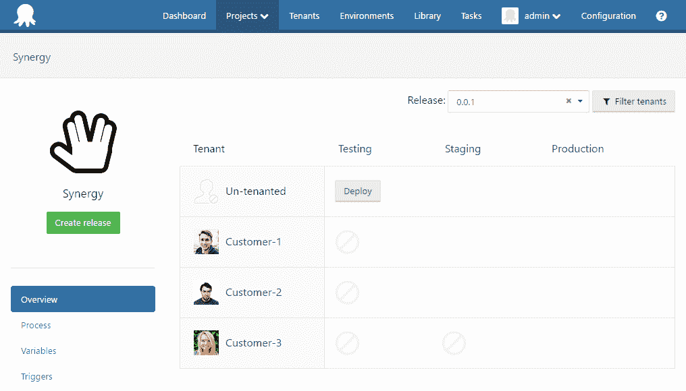
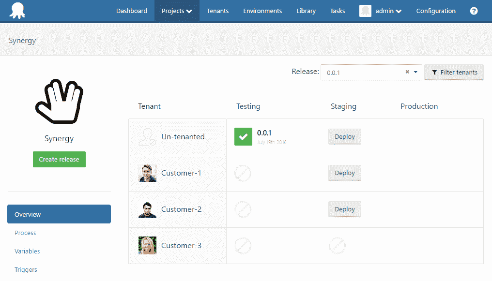
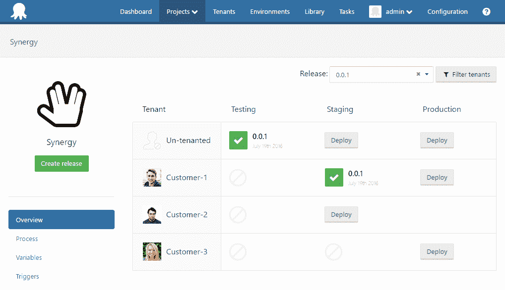
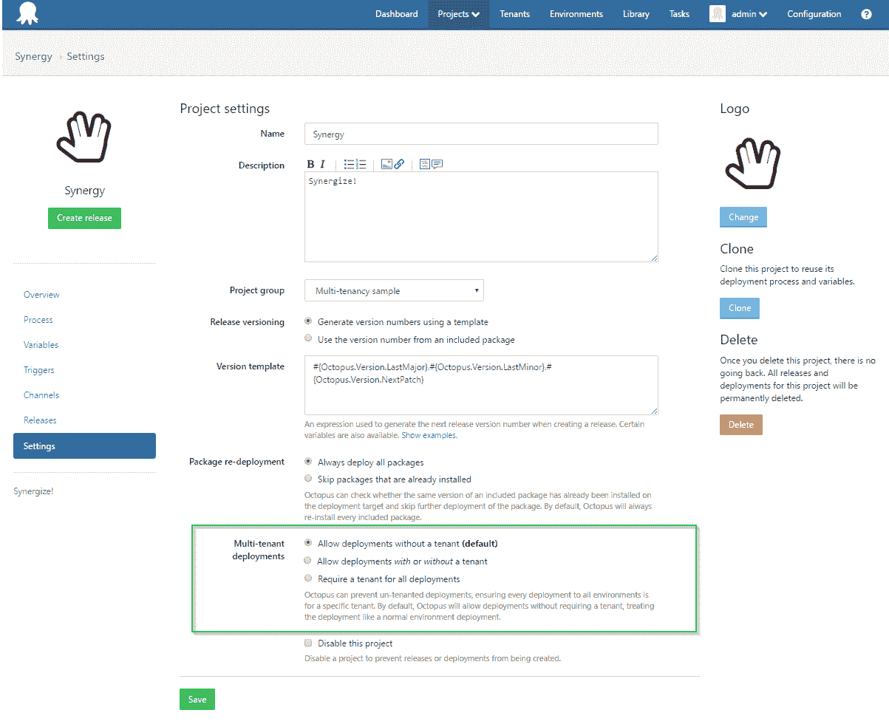

# 租户感知生命周期- Octopus 部署

> 原文：<https://octopus.com/blog/tenant-aware-lifecycle>

为了充分利用多阶段部署的优势，[部署生命周期](http://docs.octopusdeploy.com/display/OD/Lifecycles)是需要理解的关键概念之一。通常，发布的当前阶段可以通过生命周期环境中部署的直接线性进展来确定。然而，一旦您启用并开始使用多租户，情况可能开始变得不那么清晰。让我们看一下租户的加入如何影响部署生命周期过程。

## 租户感知生命周期

我们将从设置一个典型的多租户配置场景开始。我们的`Synergy`项目的默认生命周期类似于`Testing`->-`Staging`->-`Production`，我们有三个不同的租户连接到这个项目，用于不同的环境。

*   `Customer-1`部署到`Staging`和`Production`
*   `Customer-2`部署到`Staging`和`Production`
*   `Customer-3`仅部署到`Production`

我们没有给机器或步骤增加任何标记范围的复杂性，并且假设部署一旦开始就会成功完成。

### 步骤 1 -测试的首次部署

查看从`3.4.0`构建中获得的新项目仪表板，我们可以很好地了解与这个项目相关联的所有租户以及一个发布过滤器。只有可以部署到该版本的[通道](http://docs.octopusdeploy.com/display/OD/Channels)(在本例中为默认通道)的租户才会显示在这个过滤视图中。

创建我们的版本`0.0.1`我们发现，按照对生命周期的标准理解，我们最初只能部署到第一个环境`Testing`。到目前为止，一切都没有改变。**由于我们的租户都没有连接到该环境，我们只能执行未租赁到`Testing`环境**的部署。假设不涉及租户，这意味着对变量模板的任何引用都将解析为模板默认值或适当范围的项目变量。

### 步骤 2 -测试完成，第一个租户部署

随着我们测试环境的成功，当前的生命周期阶段已经转移到了`Staging`。现在，我们有两个客户可以部署到这个环境中，`Customer-1`和`Customer-2`。然而，由于`Customer-3`没有连接到`Staging`，他们仍然不能部署这个版本。请注意，**未租赁部署的性质意味着，尽管现在有可用的租户，也可以执行到`Staging`。**

让我们假设我们已经通过部署`Customer-1`到`Staging`继续。

### 第三步-分期？生产？在哪里？谁啊。

根据我们所指的租户，生命周期的当前阶段现在稍微复杂一些。因为`Customer-1`已经到了`Staging`，所以我们现在可以为那个租户升级到`Production` *的部署。*

只能部署到`Production`的 `Customer-3`现在也可以直接执行到`Production`的首次部署。这是因为将任何租户部署到一个环境都是对该版本的未租用生命周期的一种提升。这解释了为什么`Customer-3`部署*和*未租赁部署现在可以执行到`Production`，尽管两者都没有执行`Staging`部署。

另一方面，我们将`Customer-2`定义为除了`Production`之外还连接到`Staging`环境。这个配置建议我们*要求* `Customer-2`在提升到`Production`之前先部署到`Staging`。让我们停下来想一想这意味着什么。虽然根据`Customer-1`和`Customer-3`我们现在可以执行`Production`部署，但是对于`Customer-2`的任何部署仍然必须首先发生在`Staging`上。因此，就好像我们现在有一个并行的生命周期，这个版本仍然处于专门针对`Customer-2`的`Staging`阶段，而其他租户可以继续下一阶段。**将租户链接到项目的环境需要在阶段进展之前将他们部署到该环境。**此功能允许您在未完成每个配置阶段的情况下，阻止您的租户部署进入后续环境，而不会影响其他租户继续部署。

## 租户必需的项目

您可能已经注意到这种开箱即用的多租户行为的一个结果是，您总是能够对任何租户可以部署到的任何环境执行未租赁部署。然而，在您的特殊情况下，您可能会发现对`Production`执行非租赁部署没有意义。也许某些必需的变量会丢失，因为它们只能在变量模板中的租户上定义。也许您希望防止未租用的部署意外地部署到生产基础架构中。为了支持您希望禁止未租赁部署的这些场景，我们在项目设置页面上包括了以下选项。

通过选择`Require a tenant for all deployments`选项，该项目将无法再进行未租赁的部署。我们预计这将是一些团队在开始转向完全租用的架构时将采用的高级配置。在这种情况下，您还可以设置一个特殊的内部测试租户，它与开发或测试环境相关联，在这些环境中，您的客户特定的部署没有多大意义。也许您还将为您的每个测试人员创建一个测试租户，允许他们接收您的发布到不同机器的单独部署，以便进行并行测试。(请记住，在禁用未租赁部署时，您需要确保至少有一个租户能够部署到您的每个生命周期环境中，否则不会有太大进展！).

**我们认为，即使您的项目实际上不需要为多个客户部署同一个版本，您的部署也可以通过多种不同的方式受益于多租户特性。**让我们知道你可能如何利用租户，而不仅仅是明显的租户=客户设计！