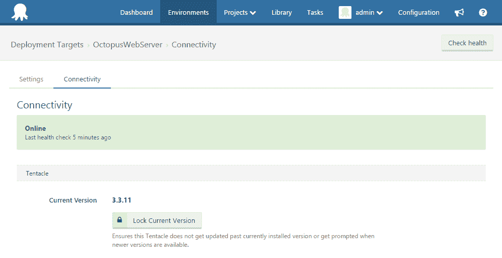
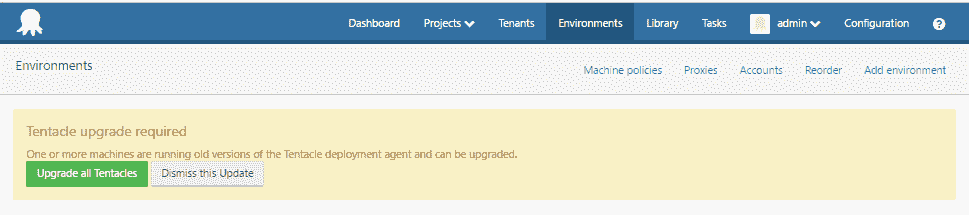

# 触手版本和何时更新- Octopus 部署

> 原文：<https://octopus.com/blog/tentacle-versioning>

## 版本化项目

> ...升级或者安装最新版本的章鱼服务器就可以了，不一定非要用最新版本的触手。

我们 Octopus 喜欢使用 [GitVersion](https://github.com/GitTools/GitVersion) 来版本化我们的构建，因为这提供了一种简单的机制来基于 Git 库的历史语义版本化我们的产品。当多个开发人员向同一个项目添加修复、分支和补丁时，这是非常有用的，允许系统在构建时确定正确的“下一个”版本，而不必弄清楚谁刚刚添加了什么，以及我们何时停止发布。

当然，另一方面，同一个存储库中的所有项目都将被版本化，不管我们是否对那个特定的项目做了任何更改。这是因为版本化上下文基于存储库状态，而不是其中的代码。由于一系列的依赖(老实说，主要是历史原因)，我们主要的 Visual Studio 解决方案包含 Octopus 服务器，目前还包含 Octopus 触手。这意味着每次我们创建一个新的服务器安装程序(我们最近已经做了很多次！)，我们得到了一个新版本的触手安装程序作为构建工件。

我们的一些眼尖的用户已经注意到了这种版本控制的同步，并正确地问我们，当他们的服务器升级时，是否应该升级触须。由于触手代码*很少*改变的事实，你可以放心的知道*升级或者安装最新版本的章鱼服务器是没问题的，不一定要用最新版本的触手*。现在，在你直接进入下面的评论部分询问我们为什么不做“X”，或者“Y”会是一个更好的方法之前，让我向你保证这是我们计划很快解决的事情，可能通过将 Octopus 触手项目分解到它自己的存储库中。我们考虑过不发布没有变化的触手版本，但是不喜欢这样的想法，那看起来触手好像神秘地跳过了版本号。通过我们打算的方法，我们打破了由版本锁步引起的混乱，但必须确保兼容性是清楚的，因为双方将有不同的版本号。刚刚说了你“不需要更新触手”，还有几点需要考虑。

## 触手 3.1+要求。NET 4.5

去年年底，我们将触手从 3.1 版本升级到了使用。NET 4.5，以便为 TLS 1.2 提供支持。虽然触手 3.1+仍然支持 TLS 1.0，但这仍然需要。NET 4.5，因此从 3.1 开始的*触角将无法与无法升级的服务器一起工作。NET 4.0* 。

自从。在 Windows Server 2003 或 Windows 2008 SP1 版上[不支持](https://www.microsoft.com/en-us/download/details.aspx?id=30653#system-requirements)NET 4.5，那么这就意味着对于运行这些版本 Windows 的机器来说，你将无法升级到 Octopus 触手的更新版本。不过不要担心，我们会为触手 3.0.x 提供安全或可靠性补丁。

## 锁定触手

如果你在一个被。NET 4.0 或者只是不想在你的环境仪表板上看到烦人的消息，我们在 3.2.17 中提供了一个[特性，让你可以将你的触手版本“锁定”到当前安装的版本。这将意味着它不会被包括在任何更新，如果你点击“升级所有触角”按钮，也不会提醒你当它是过时的升级后，你的章鱼服务器。这是减少环境页面上一些噪音的好方法，但是你需要关注我们的发布说明，以确保你没有错过任何有趣的特性或修复。值得注意的是，以这种方式锁定您的触手只会对您启用它的单个目标产生影响，因此您需要为您希望其触手安装保持在当前版本的所有目标启用它。](https://github.com/OctopusDeploy/Issues/issues/2237)

或者，你可以使用同一个 [3.2.17](https://github.com/OctopusDeploy/Issues/issues/2237) 版本中提供的另一个特性来忽略触手更新消息。在更新 Octopus 服务器时，你可能会发现环境页面被黄色覆盖，上面有升级通知，表明有新的触手版本可用。由于实际上可能不需要升级，您可以单击“忽略此更新”按钮来忽略此消息。请注意，这种解除只是使用 cookies 在本地进行处理，并将在您下次更新时再次显示。一旦我们停止让触手版本与每个章鱼服务器版本冲突，这个特性就没那么必要了。同时，如果我们频繁的服务器发布扰乱了您的环境页面，那么这个按钮就是为您准备的！

## 在八字形窗帘后面

希望这篇短文能让你了解 Octopus Deploy 的一些幕后想法，以及为什么触手下载会有这样的版本。所有软件都需要改进，这是我们希望改进的一个方面。除非我们在发行说明中明确指出触手相关的变化，否则你现在可以少关注下载界面上的章鱼触手版本。虽然目前这可能不太理想，但我们确实计划在新的一年对这一流程做出一些改变。