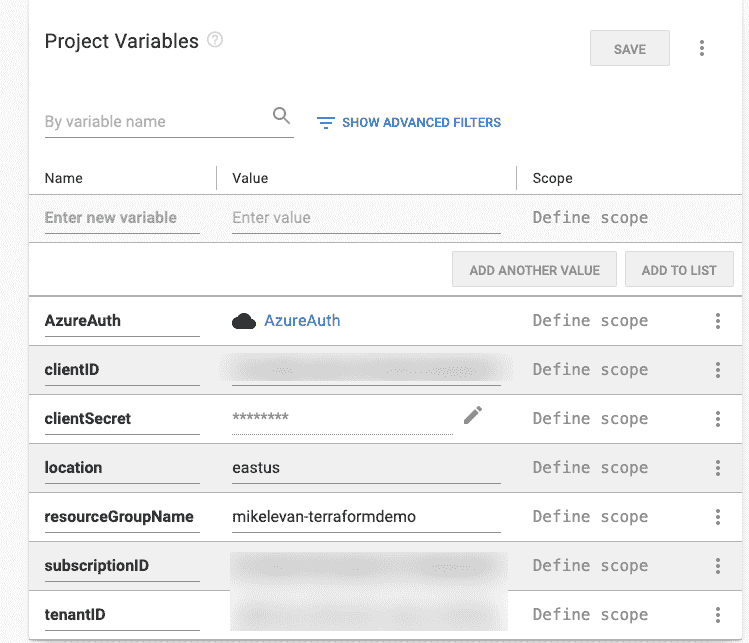
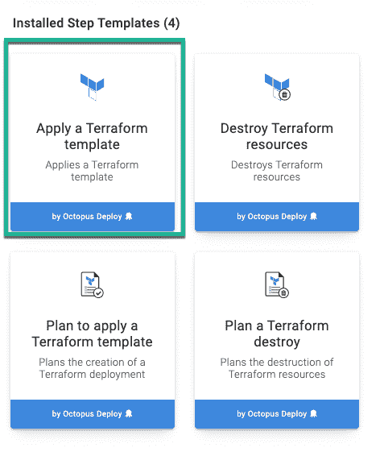

# 基础设施作为 Azure 中的代码，具有 Terraform 和 Octopus Deploy - Octopus Deploy

> 原文：<https://octopus.com/blog/terraform-and-octopus-deploy-in-azure>

[](#)

基础设施开发人员编写代码来自动化配置云和内部基础设施的过程，在这篇文章中，我将向您展示如何使用 Terraform 和 Octopus Deploy 将服务部署到 Azure。

## 先决条件

要跟进这篇博文，您需要以下内容:

*   一个 Octopus 部署的服务器，或者是[本地](https://octopus.com/start/server)或者是[云实例](https://octopus.com/start/cloud)
*   Azure 订阅。如果你还没有，你可以注册一个 [30 天的免费试用](https://azure.microsoft.com/en-us/free/)。
*   Azure 服务主体(应用程序注册)有权在您的 Azure 订阅中创建资源。
*   初级到中级水平的[地形](https://www.terraform.io/intro/index.html)知识。

## 同时使用章鱼和地球形态

Terraform 是由 [Hashicorp](https://www.hashicorp.com/) 创建的代码为平台的开源[基础设施，在 Octopus Deploy 中默认支持。](https://docs.microsoft.com/en-us/azure/devops/learn/what-is-infrastructure-as-code)

您可以将 Terraform 资源部署到:

*   蔚蓝的
*   自动警报系统
*   内部部署(硬件和虚拟化环境)

在持续交付和部署工具中使用 Terraform 的主要好处之一是，您可以专注于编写代码，而不是手动部署。将 Octopus 和 Terraform 结合起来，可以让整个生命周期自动化。

## 地形代码

要在 Azure 中创建资源或服务，您需要编写 HCL 代码。在这一节中，我将向您展示使用 Terraform 在 Azure 中创建资源组的 HCL 代码。

### Azure Terraform 提供商

每当您与 Terraform 提供者交互时，您都需要在代码块中指定一些输入和身份验证。用于与 Azure 交互的提供者是 [`azurerm`提供者](https://www.terraform.io/docs/providers/azurerm/index.html)。

向`azurerm` Terraform 提供商认证有四种方式:

出于这篇博文的目的，我们使用 Azure 服务主体。

提供商需要以下信息:

*   Azure 订阅 ID
*   客户端 ID
*   客户机密
*   Tenant ID

还有一个`features`参数，但是可以留空。

提供者配置块看起来像下面的代码:

```
provider "azurerm" {
  subscription_id = "#{subscriptionID}"
  client_id       = "#{clientID}"
  client_secret   = "#{clientSecret}"
  tenant_id       = "#{tenantID}"

  features        = {}
} 
```

注意，订阅 ID、客户机 ID、客户机机密和租户 ID 的值都有变量。我将在后面的小节中介绍这些变量的配置。

## 创建 Azure 资源

资源创建操作将调用`azurerm_resource_group`资源类型。资源类型在配置块中包含两个参数:

*   **名称**:您正在创建的资源组的名称。
*   **位置**:资源组将要驻留的位置，例如`eastus`。

```
resource "azurerm_resource_group" "resourceGroup" {
  name     = "#{resourceGroupName}"
  location = "#{location}"
} 
```

有了提供者和资源代码后，它应该类似于下面的代码片段:

```
provider "azurerm" {
  subscription_id = "#{subscriptionID}"
  client_id       = "#{clientID}"
  client_secret   = "#{clientSecret}"
  tenant_id       = "#{tenantID}"

  features        = {}
}

resource "azurerm_resource_group" "myterraformgroup" {
  name     = "#{resourceGroupName}"
  location = "#{location}"
} 
```

## 从 Octopus 部署到 Azure 的身份验证

接下来，您需要一种从 Octopus Deploy 到 Azure 的身份验证方法。Octopus Deploy 提供了一种创建帐户的方法，用于对云和内部环境进行身份验证。

### 创建 Azure 帐户

1.  登录 Octopus Deploy 门户网站，进入 **基础设施➜账户**
2.  点击**添加账户**并选择 **Azure 订阅**选项。
3.  为您用来在 Azure 门户中创建资源的 Azure 服务主体添加相关信息。
4.  为了确认 Azure 服务主体工作，点击**保存并测试**。

## 在 Octopus Deploy 中创建新项目

从 Octopus Deploy 到 Azure 的身份验证完成后，您可以开始考虑您希望 Terraform runbook 如何存在以及存在于何处。为了确保 runbook 在它自己的项目中，您可以在 Octopus Web 门户中创建项目。

### 在 Octopus Deploy 中创建项目

1.  登录 Azure 门户，进入**项目**。
2.  选择您想要存储项目的项目组，然后单击**添加项目**。
3.  创建一个新项目，并将其命名为 **TerraformAzure** 。

创建项目后，就该创建操作手册了。

### 创建章鱼变量

导航到项目的变量部分，添加项目变量:

```
AzureAuth         = AzureAuth Account
clientID          = guid_client_id
clientSecret      = client_secret
location          = eastus
resourceGroupName = your_resource_group_name
subscriptionID    = your_subscription_id
tenantID          = guid_tenant_id 
```

这些值会因您使用的环境而异。变量的`Name`应该与下面的例子相匹配，但是对于您的环境，值会有所不同。

[](#)

## 配置操作手册

因为你是在 Azure 中部署服务，而不是为应用程序编码，所以使用 runbook 是最有效的方法。操作手册将为您提供使用 Terraform 步骤模板和创建资源组的能力。

## 创建一本操作手册

1.  导航到**项目**，选择 **操作➜操作手册** 。
2.  点击**添加 RUNBOOK** 。
3.  创建一个 runbook 并将其命名为 **ResourceGroup** 。

## 向操作手册添加步骤

1.  导航到操作手册，选择**流程**，点击**添加步骤。**
2.  点击地形类别。
3.  选择**应用地形模板**步骤。

[](#)

### 配置 Terraform 步骤

根据您运行的环境，这些步骤可能会有所不同。例如，您可以使用不同于默认的工作池。以下是 Terraform 要包括的关键步骤:

1.  在**托管账户**下，选择 **Azure 账户**并将您在**身份验证中创建的 Azure 账户添加到从 Azure** 部分的 Octopus Deploy。
2.  在**模板**下，选择**模板源**并使用**源代码**选项。然后粘贴以下代码:

```
provider "azurerm" {
  subscription_id = "#{subscriptionID}"
  client_id       = "#{clientID}"
  client_secret   = "#{clientSecret}"
  tenant_id       = "#{tenantID}"

  features        = {}
}

resource "azurerm_resource_group" "myterraformgroup" {
  name     = "#{resourceGroupName}"
  location = "#{location}"
} 
```

如你所见，这使用了你在**创建 Octopus 变量**一节中创建的变量。

## 执行操作手册

项目、身份验证、步骤和代码的配置都已完成。现在，是时候看看实际运行的代码了。

1.  在**运行手册**下，你会看到**资源组**运行手册。点击**运行**。
2.  选择您想要运行 runbook 的环境，然后单击**运行**。

runbook 执行后，任务摘要将显示您已经使用 Octopus Deploy 和 Terraform 在 Azure 中成功创建了一个资源组。

## 结论

将持续部署和基础设施作为代码结合起来是任何自动化环境的关键。它不仅为您提供了自动化，还为其他团队成员提供了一个协作、查看发生了什么以及理解流程的地方，而不是自己手动完成。