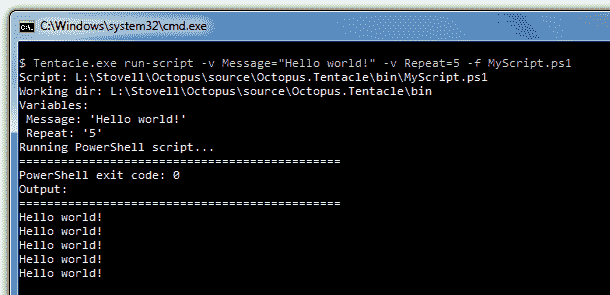

# 使用触手章鱼部署测试 PowerShell 脚本

> 原文：<https://octopus.com/blog/testing-powershell-scripts>

Octopus 允许您将 PowerShell 脚本[嵌入到您的包](http://octopusdeploy.com/documentation/features/powershell "Embedding scripts")中，这些脚本会在部署过程中自动执行。这是一个很好的挂钩，可以让您:

*   运行自定义可执行文件
*   配置 Windows 服务
*   [配置 IIS](http://octopusdeploy.com/documentation/features/iis "IIS and PowerShell")
*   执行数据库部署脚本
*   配置文件和文件夹的安全设置
*   [成吨的其他东西](http://technet.microsoft.com/library/bb978526.aspx "What can I use PowerShell for?")

在 Octopus portal 中定义的变量会自动传递到您的脚本中，因为变量的作用域可以是环境或机器，所以这提供了一个很好的方法来为不同的环境参数化您的脚本。

触手代理在进程中托管 PowerShell，这意味着脚本在普通 PowerShell 中的运行方式与在 Octopus 中的运行方式有时会有所不同。测试脚本总是很困难——你必须将它们打包，创建一个发行版，然后部署这个发行版，只是为了看看对脚本的一个小的改变是否有效。

如果您在运行 PowerShell 脚本时遇到问题，您现在可以使用触手可执行文件直接测试脚本，这意味着它们在与部署完全相同的上下文中运行。您可以从命令行使用以下命令来完成此操作:

```
Tentacle.exe run-script -v Message="Hello world!" -v Repeat=5 -f MyScript.ps1 
```

`-v`参数允许您传递变量(就像它们是部署中使用的变量一样)。`-f`参数指定要运行的脚本文件。你也可以使用`-w`来设置一个自定义的工作目录。

假设我的脚本是这样的:

```
foreach ($i in (1..$Repeat))
{
    write-host $Message
} 
```

输出如下所示:



这个特性在 [build 1.0.16.1276](http://octopusdeploy.com/downloads?version=1.0.16.1276 "1.0.16.1276") 中提供。希望它能让在触手环境中测试 PowerShell 脚本变得更容易！

### 了解更多信息