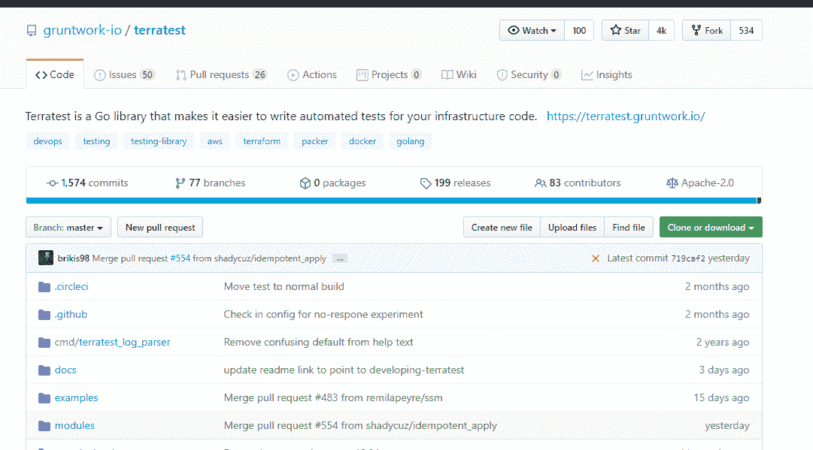
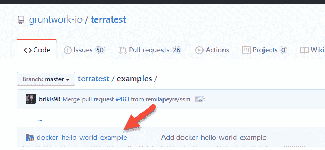
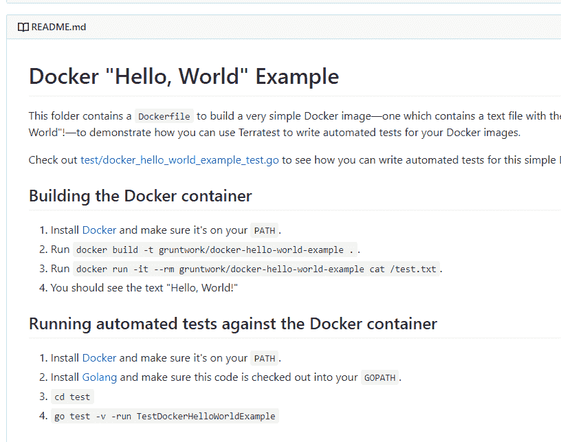

# 测试地形代码- Octopus 部署

> 原文：<https://octopus.com/blog/testing-terraform-code>

[](#)

测试代码是开发人员能做的最重要的事情之一。事实上，有一种叫做测试驱动开发( [TDD](http://agiledata.org/essays/tdd.html) )的编码实践是基于先写测试，然后基于测试写代码。即使你不遵循测试驱动开发，考虑在代码中实现单元测试和模拟测试仍然是极其重要的。没有测试，您实际上是在部署代码，并希望它会按照您认为应该的方式工作。即使代码部署得很好，如果代码被修改了，你也不知道会有什么结果。

在这篇文章中，你将关注用一个叫做 Terratest 的框架来测试 Terraform 代码。Terratest 是最受欢迎的 Terraform 测试框架之一，具有许多不同的工具集，功能丰富。

## 先决条件

要跟进这篇文章，您应该具备以下条件:

*   对编程的理解。虽然你不会深入 Golang 的基础知识，但如果你过去编程过，你应该会看到熟悉的概念(方法、函数等。).
*   关于地形的中级知识。
*   Azure 订阅。如果你没有，你可以注册一个 [30 天的免费试用](https://azure.microsoft.com/en-us/free/)。
*   文本编辑器。出于本文的目的，您将使用 Visual Studio 代码( [VS 代码](https://code.visualstudio.com/download))。
*   Golang 已安装。根据操作系统的不同，您可以找到[安装说明](https://golang.org/doc/install)。

## 单元测试和模拟测试

在进入测试部分之前，让我们回顾一下测试到底是什么。您通常会使用的两个主要测试是:

### 单元测试

单元测试是一种用于测试特定代码单元的软件测试方法。例如，假设您有一个名为`Car`的类和该类中一个名为`Ford`的方法。`Ford`方法返回几个值；福特是什么颜色，福特是什么型号，福特是哪一年的。您可以运行该代码来查看结果是否正确，但是如果您不想创建任何特定的东西，而只想查看代码是如何构建的呢？这就是单元测试的用武之地。单元测试可以测试值应该是什么。

假设结果应该是以下值:

*   年份= 2020 年
*   型号= F150 套索
*   颜色=铂。

当单元测试运行时，如果这些值返回 true，则单元测试通过。如果结果返回为 false，则单元测试失败，它会让您知道失败在哪里。

### 模拟测试

模拟测试是另一种软件测试方法，它可以伪造资源的创建，也可以实际创建资源。假设您有一些 C#代码，您想为一个前端 web 应用程序进行测试。单元测试可以很好地确认方法在 C#代码中实际工作，但是如果您想测试实际的部署呢？您可以实现一个模拟测试，而不是一次又一次地手工部署测试，或者创建一个连续的交付管道来测试代码。模拟测试将部署代码，确认代码工作正常，或者保持部署不变，或者删除部署。在典型的模拟测试中，资源在模拟成功运行后立即被删除。

## 编写要测试的 Terraform 代码

在上一节中，您学习了什么是单元测试和模拟测试。在本节中，您将创建一个 Terraform 模块，该模块将在 Azure 中部署一个虚拟网络。您编写的代码将是用于测试目的的代码。

让我们检查一下 Terraform 代码的每个部分，以确认正在部署什么。要了解这一部分，您应该打开一个文本编辑器，如 Visual Studio 代码。

### main.tf 配置

第一部分将是`azurerm`提供者。`azurerm`提供者对 Azure 进行 API 调用来创建资源:

```
provider "azurerm" {
    version = "2.0.0"
    subscription_id = var.subscriptionID
} 
```

第二部分是第一个资源。第一个资源在 Azure 中创建了一个网络安全组(NSG)。NSG 非常类似于防火墙:

```
resource "azurerm_network_security_group" "OctopusSG" {
  name                = "OctopusSG"
  location            = "eastus"
  resource_group_name = var.resourceGroupName
} 
```

第三部分将创建第一个网络安全规则。可以把网络安全规则想象成防火墙上的端口规则。第一个端口规则是端口 80 对世界开放:

```
resource "azurerm_network_security_rule" "Port80" {
  name                        = "Allow80"
  priority                    = 102
  direction                   = "Inbound"
  access                      = "Allow"
  protocol                    = "Tcp"
  source_port_range           = "*"
  destination_port_range      = "80"
  source_address_prefix       = "*"
  destination_address_prefix  = "*"
  resource_group_name         = azurerm_network_security_group.OctopusSG.resource_group_name
  network_security_group_name = azurerm_network_security_group.OctopusSG.name
} 
```

第二个网络安全规则针对端口 22，它将允许安全外壳(SSH)连接到网络安全组中的任何虚拟机:

```
resource "azurerm_network_security_rule" "Port22" {
  name                        = "Allow22"
  priority                    = 100
  direction                   = "Inbound"
  access                      = "Allow"
  protocol                    = "Tcp"
  source_port_range           = "*"
  destination_port_range      = "443"
  source_address_prefix       = "*"
  destination_address_prefix  = "*"
  resource_group_name         = azurerm_network_security_group.OctopusSG.resource_group_name
  network_security_group_name = azurerm_network_security_group.OctopusSG.name
} 
```

正在创建的第四个资源是 Azure 虚拟网络本身。虚拟网络将有一个地址空间(CIDR 范围)为`10.0.0.0/16`和两个 DNS 服务器`8.8.8.8`和`8.8.4.4`:

```
resource "azurerm_virtual_network" "octopus-vnet" {
  name                = "octopus-vnet"
  location            = var.location
  resource_group_name = var.resourceGroupName
  address_space       = ["10.0.0.0/16"]
  dns_servers         = ["8.8.8.8", "8.8.4.4"]
} 
```

第五个也是最后一个资源是为虚拟网络内部的子网创建的。子网将有一个地址前缀(子网范围)为`10.0.1.0/24`:

```
resource "azurerm_subnet" "octopus-sub" {
  name                 = "testsubnet"
  resource_group_name  = azurerm_network_security_group.OctopusSG.resource_group_name
  virtual_network_name = azurerm_virtual_network.octopus-vnet.name
  address_prefix = "10.0.1.0/24"
} 
```

### 可变配置

变量将由三个值组成:

*   订阅 ID
*   资源组名
*   位置

下面是没有任何默认值的变量配置。这使得代码可重用，并且在大多数环境中更容易实现:

```
variable "subscriptionID" {
    type = string
    description = "Variable for our resource group"
}

variable "resourceGroupName" {
    type = string
    description = "name of resource group"
}

variable "location" {
    type = string
    description = "location of your resource group"
} 
```

### Tfvars 配置

为了在运行时传递变量，您将使用一个`terraform.tfvars`配置来尽可能地保持代码的可重用性。

下面是将要使用的`tfvars`配置:

```
subscriptionID = value_here
resourceGroupName = "OctopusRG"
location = value_here 
```

有了`main.tf`、`variables.tf`和`terraform.tfvars`，您就可以开始查看 Terratest 来测试您编写的代码了。

## 首先看 TerraTest

在上一节中，您编写了将用 Terratest 测试的代码。在本节中，您将了解 Terratest 如何与 Terraform 一起使用。

Terratest 框架可以在 [GitHub](https://github.com/newcontext-oss/kitchen-terraform) 找到。

[ ](#) Terratest 是一个 Go 库，帮助你实现基础设施即代码测试。Terratest 由 Gruntwork 创建和维护，这是一个提供 DevOps 即服务的平台。你可以了解更多关于 [Gruntwork](https://gruntwork.io/) 。

在 Terratest GitHub 上的 examples 目录下，可以看到几个不同的例子。让我们来看看**docker-hello-world-example**:

[](#)

正如您从下面的截图中看到的，可以通过运行`build`和`run`命令以标准方式构建 Docker 映像。

当 Docker 容器运行时，您可以使用 Golang 命令行来运行测试。您使用的命令行工具是`go test`:

[](#)

测试运行后，您将看到一个输出，告诉您测试是否成功完成。

## 在 Terratest 中编写测试

既然您已经了解了将要测试的代码和 Terratest 框架，那么是时候使用 Golang 创建一个新的测试了。

对于本节，您应该打开 Visual Studio 代码，并在与 Terraform 代码相同的目录中创建新文件。新文件可以随意命名，例如`terraform-test.go`。

让我们首先设置`package`并将其称为**测试**:

```
package test

} 
```

接下来，您需要指定几个不同的 Golang 库。将使用的两个 Golang 库是:

```
package test

import (
  "github.com/gruntwork-io/terratest/modules/terraform"
  "testing"
) 
```

当库在导入块中之后，设置新的函数。这个函数可以被命名为任何你喜欢的名字，但是在这篇文章中，我们称它为`vnet_test`。通过在新创建的函数中调用`testing`库来使用它:

```
package test

import (
  "github.com/gruntwork-io/terratest/modules/terraform"
  "testing"
)

func vnet_test(t *testing.T) {
    }
} 
```

最后，您需要添加测试本身。首先，将创建一个名为`terraformOptions`的变量，它利用了`terraform.Options()`。然后，代码使用一个名为`defer`的语句，在虚拟网络被测试和创建后立即销毁它。在 defer 语句之后，您将看到用 Terraform 初始化和创建虚拟网络的`.InitAndApply`方法:

```
package test

import (
  "github.com/gruntwork-io/terratest/modules/terraform"
  "testing"
)

func vnet_test(t *testing.T) {

    terraformOptions := &terraform.Options{
    }

    defer terraform.Destroy(t, terraformOptions)

    terraform.InitAndApply(t, terraformOptions)

} 
```

当您有了`terraform-test.go`文件中的代码后，在命令行上运行以下命令:

```
go test -v terraform-test.go 
```

恭喜你！您已经使用 Terratest 成功创建了一个 Terraform 测试。

## 结论

在这篇文章中，您了解了测试的关键概念，以及为什么在任何代码中实现测试如此重要。无论是后端代码，前端代码，还是基础设施代码。您首先了解了两种关键的测试类型，单元测试和模拟测试。然后，您编写了一些 Terraform 代码，开始测试创建 Azure 虚拟网络。之后，您先看了一下 Terratest 框架及其提供的功能。最后，您编写了一个 Terratest 来测试 Azure 虚拟网络的创建，并在创建成功后销毁它。

对于你的下一个挑战，尽管在这篇文章中没有解释，看看[厨房平台](https://github.com/newcontext-oss/kitchen-terraform)。Kitchen-terraform 是另一个即将推出并越来越受欢迎的测试框架。