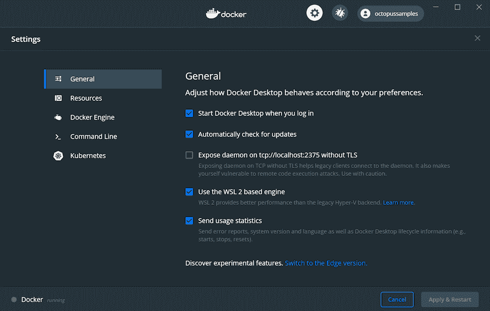
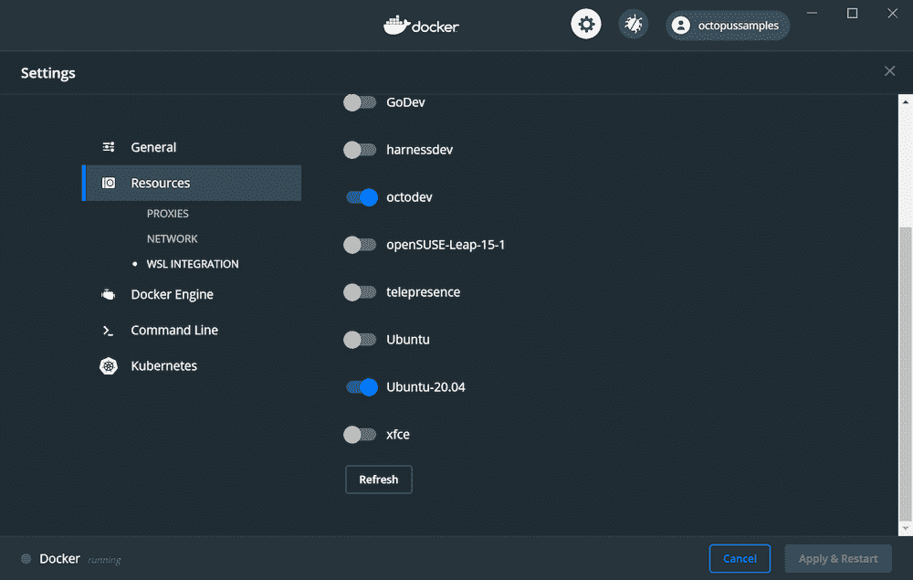
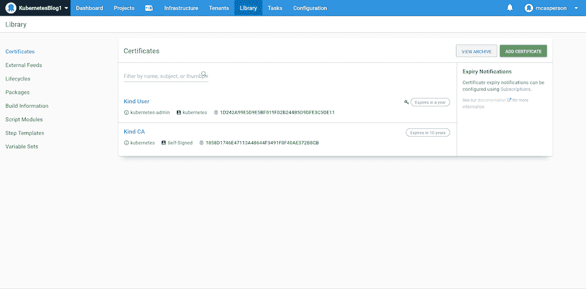
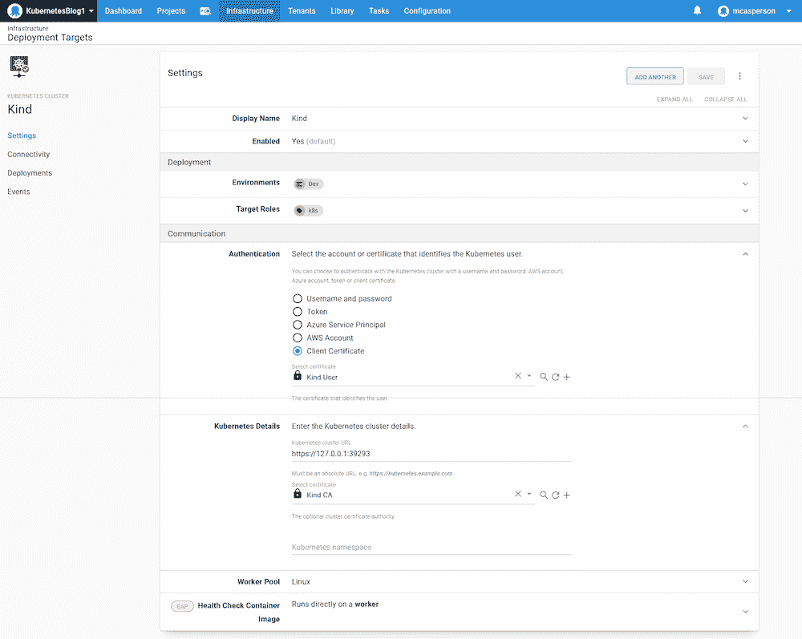
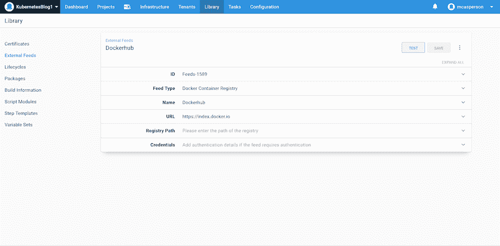
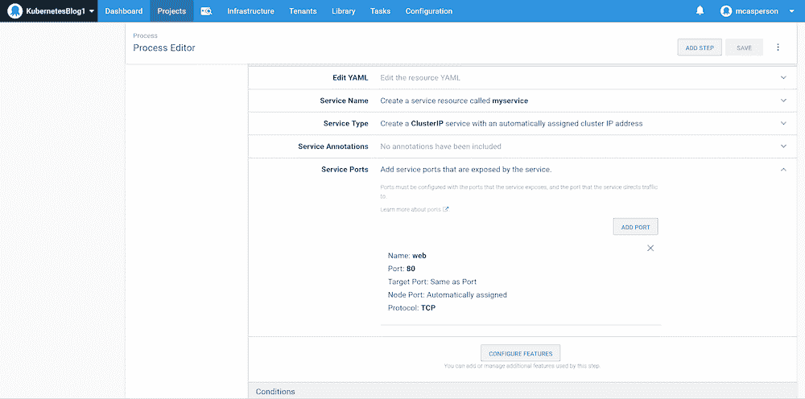
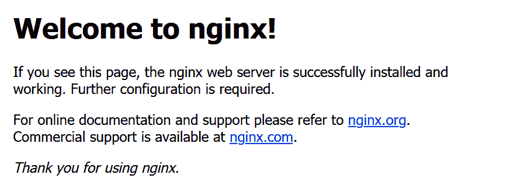

# 使用 Kind - Octopus Deploy 创建测试 Kubernetes 集群

> 原文：<https://octopus.com/blog/testing-with-kind>

开始使用 Kubernetes 可能有点让人不知所措。像 [Minikube](https://kubernetes.io/docs/tasks/tools/install-minikube/) 、 [K3s](https://k3s.io/) 、 [Docker Desktop](https://docs.docker.com/docker-for-windows/kubernetes/) 、 [MicroK8s](https://microk8s.io/) 和 [Kind](https://kind.sigs.k8s.io/) 这样的工具如此之多，即使知道使用哪个测试发行版也不是一个容易的选择。

为了本地发展，我发现自己在使用 Kind。它可以快速启动，并与 WSL2 很好地集成，允许我在 Windows 和 Linux 开发之间快速切换。

在这篇博文和相关的截屏中，我将向您展示如何使用 Kind 和 Octopus 的托管实例快速启动并运行本地开发的 Kubernetes 集群。

## 截屏

下面的视频演示了将 web 应用程序部署到 Kind 创建的开发 Kubernetes 集群的过程。文章的其余部分提供了其他资源的链接和演示中使用的脚本副本:

[https://www.youtube.com/embed/sMt2-enODC0](https://www.youtube.com/embed/sMt2-enODC0)

VIDEO

## 启用 WSL2 Docker 集成

要从 WSL2 实例中使用 Kind，Docker Desktop 需要启用 WSL2 集成。这可以通过选择**使用基于 WSL2 的引擎**选项来实现:

[](#)

Docker 随后在目标 WSL2 实例中公开:

[](#)

## 安装种类

Kind 是一个自包含的 Linux 可执行文件，下载后放在 PATH 中以便于访问。 [Kind 快速入门文档](https://kind.sigs.k8s.io/docs/user/quick-start/)提供了关于安装 Kind 的说明，在我的 WSL2 Ubuntu 实例中是通过运行:

```
curl -Lo ./kind https://kind.sigs.k8s.io/dl/v0.8.1/kind-linux-amd64
chmod +x ./kind
sudo mv ./kind /usr/local/bin 
```

Kind 文档有到最新版本的链接，可能已经从上面的 URL 更新了。

## 创建集群

使用以下命令创建新的开发集群:

```
kind create cluster 
```

然后，可以使用存储在`~/.kube/config`文件中的配置来访问这个集群，该文件是在创建集群时由 Kind 创建的。该文件的示例如下所示:

```
apiVersion: v1
clusters:
- cluster:
    certificate-authority-data: LS0tLS1CRUdJTiBDRVJUSUZJQ0FURS0tLS0tCk1JSUN5RENDQWJDZ0F3SUJBZ0lCQURBTkJna3Foa2lHOXcwQkFRc0ZBREFWTVJNd0VRWURWUVFERXdwcmRXSmwKY201bGRHVnpNQjRYRFRJd01Ea3hOREF4TXpBd04xb1hEVE13TURreE1qQXhNekF3TjFvd0ZURVRNQkVHQTFVRQpBeE1LYTNWaVpYSnVaWFJsY3pDQ0FTSXdEUVlKS29aSWh2Y05BUUVCQlFBRGdnRVBBRENDQVFvQ2dnRUJBS0xPCmV3Y3BBbThwNzB1UnBLSDBJV0Zod043MFJTNTZDTTVXd2xGR0d4YmZaZ0s4endiQmY4aWRzUS9hK1lHK1RWR3gKazBQZDdma0NIVG9yU1I5ajlhSEZLQVlpN3VDbkJoVGVmNjgxVHBJWFBtU3lqUFVpbkxrSG4yRXVNNitESWRTVwpMd2ExaUNwVVVqc0pTOTZ6UnViM2dOdHdvUndCZEo0d3J3SitYUm95VFpIREhtalZkZFJ5Qk1YRGN3dzNNS1BRCmFaRzA0dUtwRlRNeEgyakNrQm9sMW9zNTByRWJrdXY2TVhTVGdvbEpzMEVsSTZXckVpNk00cXdGRWFDWmpBcisKcmtyZUZvdDdXeVpPc3N1Rk91azk4ZS9sb0tvMmtOMVhwcVZKSk55c3FRbmNqRHIzV044VHowZTJOWjZndm9ZWgpNc1RsbTJCTFFqUnFRTllqU3FrQ0F3RUFBYU1qTUNFd0RnWURWUjBQQVFIL0JBUURBZ0trTUE4R0ExVWRFd0VCCi93UUZNQU1CQWY4d0RRWUpLb1pJaHZjTkFRRUxCUUFEZ2dFQkFFSkNzUTg4Rk5MdjJPc0h5Zk96elFPSzdzRVUKVU5jVDhLa3EvbWE2SjkrSWsxY0ZpOHdhdnFZdi93SkNMS2xPc1FML3FUZ2tQSldlb05NV0YwYitMYU5INnUxTgp4NDF2aGNzYjI5Nks0d3orUi9uQzBZWkd1VStSMzFCaHRaS3p2ckI2L1dCSGZLSkYxVlQxOExxcTFvMkRKM1paCno0a1d2UGdEeEc3UjU1eGVTcWkxc2pZWDJmSnRpajNBREhBSGRwRmN4TldUVmNJVm4zMzJNczlCcEtBK1kxbkcKb1pXeXd5Rm8xektDdmNZeEltU2FabXYzTmpiQytlU0VrU1RrdjFCTmt6Z0lMVWtrbUNFOFdWMXMvWDVmN3V3eApNR1d4YVVMWDRvRFJ5Z1FCaitvL09Eb0lTQU5HZDRUWXFxcHVBS29IdC9jZ1VPSWl6NkNzdGp1dElWVT0KLS0tLS1FTkQgQ0VSVElGSUNBVEUtLS0tLQo=
    server: https://127.0.0.1:39293
  name: kind-kind
contexts:
- context:
    cluster: kind-kind
    user: kind-kind
  name: kind-kind
current-context: kind-kind
kind: Config
preferences: {}
users:
- name: kind-kind
  user:
    client-certificate-data: LS0tLS1CRUdJTiBDRVJUSUZJQ0FURS0tLS0tCk1JSUM4akNDQWRxZ0F3SUJBZ0lJUzViczdNb0pEbmt3RFFZSktvWklodmNOQVFFTEJRQXdGVEVUTUJFR0ExVUUKQXhNS2EzVmlaWEp1WlhSbGN6QWVGdzB5TURBNU1UUXdNVE13TURkYUZ3MHlNVEE1TVRRd01UTXdNVEZhTURReApGekFWQmdOVkJBb1REbk41YzNSbGJUcHRZWE4wWlhKek1Sa3dGd1lEVlFRREV4QnJkV0psY201bGRHVnpMV0ZrCmJXbHVNSUlCSWpBTkJna3Foa2lHOXcwQkFRRUZBQU9DQVE4QU1JSUJDZ0tDQVFFQW5xM0VDSFYwc0RmOXJIQnUKS09jelQ4L2pmcVkrbzU5Rm5MZWJZNUFRQVBLeWhCVm1vR3ZTaUVQSzhYUm5EMjA1dWFiTlBteFVLQmhBVFBjcApobXpFa2pVNjAwQkVCcnN6ZDJ6KzlmalUxQlFrUU9vL0ljSkM5YnBwdXhvbnNxVjhvWmY3L0R2OUpGamVIOTU3CkdDR1FsWXBwM2trb1kzc2VVaG9wOFY5SzJrYzJGa2srZjVpRXpIUFdiZkNsYTRpK01scVVxU21iakVYUGlvWnQKYUprMWxQbExLMVRZWER3QjI2N2ZYWnhsZU9Vcm5uem51Y0hJQTBLYjlnRFE5K25STFBWYm5yOU1wM2IzVG5RdwpKbno3bGpvclE2Y1htQmJ5b293dXZMTzZqMkpNcjhYOFZSUlgzMCtFOWNkVXpCSXRySUkyK0krekF6a3FsTWl3CllkUlVMd0lEQVFBQm95Y3dKVEFPQmdOVkhROEJBZjhFQkFNQ0JhQXdFd1lEVlIwbEJBd3dDZ1lJS3dZQkJRVUgKQXdJd0RRWUpLb1pJaHZjTkFRRUxCUUFEZ2dFQkFGRGI1Q0thV0ZEc2RlV0xBS2plT0MyL0xlRnhYbUNzL2JuYgoxcGxIc0Z1Vmc0U3FlVmFVTGlidkR2bkd3Q3pEbUJuWFovNkxqUDhrWW9Wa3pobkYvS0paLys1dzJTelhEYzVECnFRaHhhWWlaclRQUlBsVmxpWWxTRy9XS3dlMTRxTEMvY01Ed1AxYU9aRXVPQ1huVnFZN1IwVlRydVJYTFREbW8KRjRVWHBicmw0R0t5V04zUWo3eXBKWkVqenFYeVJJWHJwNVpyQjF1WDQ0RzVqeUlEYXpIZXNRdk1mQnlPYTBHSgpMbUMvWDR1dFRaUEk1VTZRQWdjNzdaVGNoNkVUSXVjLzNZT3N5c1JHZWZXNUhpVFBESjFhNWQ3TkViT09HQ1N5CkN0UStiL2ljbGtHTHBDbmltb0RUdkp4QzNrSjNTZjJJKzlGQ1F2V0NzWU0vYnpZOWxHYz0KLS0tLS1FTkQgQ0VSVElGSUNBVEUtLS0tLQo=
    client-key-data: LS0tLS1CRUdJTiBSU0EgUFJJVkFURSBLRVktLS0tLQpNSUlFb3dJQkFBS0NBUUVBbnEzRUNIVjBzRGY5ckhCdUtPY3pUOC9qZnFZK281OUZuTGViWTVBUUFQS3loQlZtCm9HdlNpRVBLOFhSbkQyMDV1YWJOUG14VUtCaEFUUGNwaG16RWtqVTYwMEJFQnJzemQyeis5ZmpVMUJRa1FPby8KSWNKQzlicHB1eG9uc3FWOG9aZjcvRHY5SkZqZUg5NTdHQ0dRbFlwcDNra29ZM3NlVWhvcDhWOUsya2MyRmtrKwpmNWlFekhQV2JmQ2xhNGkrTWxxVXFTbWJqRVhQaW9adGFKazFsUGxMSzFUWVhEd0IyNjdmWFp4bGVPVXJubnpuCnVjSElBMEtiOWdEUTkrblJMUFZibnI5TXAzYjNUblF3Sm56N2xqb3JRNmNYbUJieW9vd3V2TE82ajJKTXI4WDgKVlJSWDMwK0U5Y2RVekJJdHJJSTIrSSt6QXprcWxNaXdZZFJVTHdJREFRQUJBb0lCQUFlQ0YxMkRHVU5oVXRwKwo4MmR5RVNaOG9yb1NhYkphVGZQdGFDZmM0RFQ3UnVFakZoa1BJUVlibHhXM3VVeXNrV2VzY2RlN1Rud2JNYWV5CnBqOWJGQzRLNEw2d01zZlN3Y3VyMTZDUjVwZ21YOVRHZ0xnN05lbmtxUzRXUGJ5aFFmVnZlSmZseXNPV2hPUWoKSmRYdGVLYnF4cm1pNG90YWZ3UEpneVNOcXNBTFBYblFDRzZMTnRBdWJrTXA0Qm94dE82MVBCZkN1QzlUZ3BpMQovVkIzTTdTQnJWcW4wUTkySzVzNWpvRnlSZ2dUMlRaUHZXT0NqWnVRZDNLWWIwT1NaZHhBbjY2ZVRJbks4bVlECnVqMFE2eE9KZGllZHl5a2dpc2pwZ0hMZUY3c3ZZTWRrZXI5SGhvOXBtRkNzY0VRMmF0TFZyZjRacjRHNXgwVDkKOExzSldKa0NnWUVBdzNjQ1BndDA1T1NSK202RlFlK3dsaURxWnhKTWFxa3lLcGJuNHVjMTRQMk1uN25BckVZNApaMllNUVZGVGpYai9hYXdpSzNPUSs2eCszZDliVkN6amxzZ05wcXlBeTczOUpDN2xObG5vL3hpdDBWTE5mSE9SClNGalRxdzNlWFRaYVZKcVJQaDgvaEs1ZlJvZDhCOThsM0hFZ3BsVjU1M0hnQXMwVDdUa2FTR3NDZ1lFQXo5SkEKOUlTdDM0VzBsVWhOcGErMFBDMVQ0T1dpMUd3NVlMNW4rSU1wWFFrOEk3S0k0c0ZMYTNRaXczSFlIamxkYjkveQo2RUU5LzBQYWhzV3JzTTB5MnFrT0JHMEE1OFJKV1lZK3k0RGM4OGpnSzBxWEt4K1g2cm1qN2J2L1ZjLzdnYU1ECk12WW80TkZUL2RuM0JJM3Q5eVVNeTlpd2M0Zi9BYjNkWnQyWXBFMENnWUVBbTlZVUNaZGt1T0NxcWJqWHNUd0IKMDQrbWtrcDZka2N5NGRXeVJxc0R2NzhtRUdvdC9LdDNhS2hwZU9IMzlVRFVrVkZWWk1NY2dpcUNjeTRTU0VnSgpvenNYOXh4dEN3TU1BWDhKNjQwL1A3SlRVaUhzQmg2MVk3SzkveEJ0aW04OUVWcXlGWThnT3c0eWs2Nk02bEcwCmc4NEZzOWROKzRKRWtMY2ovZXVhMHNVQ2dZQk1xRE9KZmo5Y2ljYzRvWGp5dXNMeXg0MS9FWFZrZ1o4UWptdHYKZ1lJS2JWT2ZuMFZhenczd3p0L2IwK3h5Q1pycm4ySE1SZlNHYWhMN1Q0S3JMcVdwZmw1TFI2SGoyOFZxbmxnZgpYS01qMFY3TzJTNjFtMnZBQzBYcWRVUVQ5U25DZ2N5MlNaSitpdmcrVk40RzhndHE5R0dwOTMzdXY2VlNrU1JQCncwR0FxUUtCZ0FYcDBKaXZEMmVvcmtTVzdtZFdpcHB4Q25sOGRyMGJ6WUg5Vm1HUEJoR2dnWTdPeUd4WXBJWEoKUzFicS9Bd3kxdlVUVTVpcGJha3dXYzlkbEdLWnczRXUvVDZwWEFQdklIeUNNc2xIWDdxVjFFSXQxekI4SFd1MgpyeTVpRWVhTDc2VU1Dc1NDTFdpYkk0RHJBUjJwQ2NMOUFxYU1DMTQ1YllFQS9oWVdTSDlCCi0tLS0tRU5EIFJTQSBQUklWQVRFIEtFWS0tLS0tCg== 
```

下面的脚本将`client-certificate-data`和`client-key-data`字段提取到一个 PFX 文件中，将`certificate-authority-data`字段提取到一个纯文本文件中。

请注意，您需要安装`jq`和`openssl`应用程序来运行这个脚本。

```
#!/bin/bash

CONTEXT="kind-kind"

CERTIFICATE=$(kubectl config view --raw -o json | jq -r '.users[] | select(.name == "'${CONTEXT}'") | .user."client-certificate-data"')
KEY=$(kubectl config view --raw -o json | jq -r '.users[] | select(.name == "'${CONTEXT}'") | .user."client-key-data"')
CLUSTER_CA=$(kubectl config view --raw -o json | jq -r '.clusters[] | select(.name == "'${CONTEXT}'") | .cluster."certificate-authority-data"')

echo ${CERTIFICATE} | base64 -d > client.crt
echo ${KEY} | base64 -d > client.key

openssl pkcs12 -export -in client.crt -inkey client.key -out client.pfx -passout pass:

rm client.crt
rm client.key

echo ${CLUSTER_CA} | base64 -d > cluster.crt 
```

PowerShell 中有一个类似的脚本:

```
param($username="kind-kind")

kubectl config view --raw -o json |
  ConvertFrom-JSON |
  Select-Object -ExpandProperty users |
  ? {$_.name -eq $username} |
  % {
    [System.Text.Encoding]::ASCII.GetString([System.Convert]::FromBase64String($_.user.'client-certificate-data')) | Out-File -Encoding "ASCII" client.crt
    [System.Text.Encoding]::ASCII.GetString([System.Convert]::FromBase64String($_.user.'client-key-data')) | Out-File -Encoding "ASCII" client.key
    & "C:\Program Files\OpenSSL-Win64\bin\openssl" pkcs12 -export -in client.crt -inkey client.key -out client.pfx -passout pass:
    rm client.crt
    rm client.key
  }

  kubectl config view --raw -o json |
  ConvertFrom-JSON |
  Select-Object -ExpandProperty clusters |
  ? {$_.name -eq $username} |
  % {
    [System.Text.Encoding]::ASCII.GetString([System.Convert]::FromBase64String($_.cluster.'certificate-authority-data')) | Out-File -Encoding "ASCII" cluster.crt
  } 
```

## 安装 Octopus worker

要将本地开发机器连接到 Octopus 实例，需要安装一个轮询工作器。当目标机器没有静态 IP 地址时，轮询工作器会联系 Octopus 服务器并允许通信。

触手是使用章鱼网站上的这些说明[安装的。对于我的基于 Ubuntu 的 WSL2 实例，安装是通过以下命令完成的:](https://octopus.com/docs/infrastructure/deployment-targets/linux/tentacle#installing-and-configuring-linux-tentacle)

```
sudo apt-key adv --fetch-keys https://apt.octopus.com/public.key
sudo add-apt-repository "deb https://apt.octopus.com/ stretch main"
sudo apt-get update
sudo apt-get install tentacle 
```

然后，使用以下命令配置触手实例:

```
sudo /opt/octopus/tentacle/configure-tentacle.sh 
```

因为 WSL2 不支持 systemd，我们需要使用以下命令手动运行触手:

```
sudo /opt/octopus/tentacle/Tentacle run --instance Tentacle 
```

## 上传证书

从 Kubernetes 配置文件创建的两个证书文件被上传到 Octopus:

[](#)

## 创建目标

上传证书后，创建一个新的 Kubernetes 目标，使用**种类用户**证书进行身份验证，使用**种类 CA** 证书信任 HTTPS API 端点:

[](#)

## 创建提要

正在部署的 Docker 映像托管在 DockerHub 上，必须将其配置为外部提要:

[](#)

## 创建部署

然后我们用**部署 Kubernetes 容器**步骤部署`nginx`容器。

该部署配置有暴露端口 80 的单个容器:

[](#)

部署创建的 pod 通过在端口 80 上访问的服务公开:

[](#)

## 访问服务

Kind 只公开 Kubernetes API 端点，因此在集群外部无法访问该服务。要从我们的浏览器打开 NGINX，我们需要使用`kubectl`将流量从本地端口转发到集群。这是通过以下命令完成的:

```
kubectl port-forward svc/myservice 8081:80 
```

NGINX 可以在 URL http://localhost:8081 上找到。下面是默认 NGINX 容器显示的欢迎页面:

[](#)

## 结论

Kind 和 WSL2 的结合提供了一种创建本地开发 Kubernetes 集群的便捷方式，该集群可以通过轮询工作器向 Octopus 公开。

在这篇文章和截屏中，我们看到了如何在 WSL2 中配置一个开发 Kubernetes 集群，提取 HTTPS 端点和用户身份验证使用的证书，通过轮询触手连接到集群，并创建一个可用于执行部署的 Kubernetes 目标。

愉快的部署！