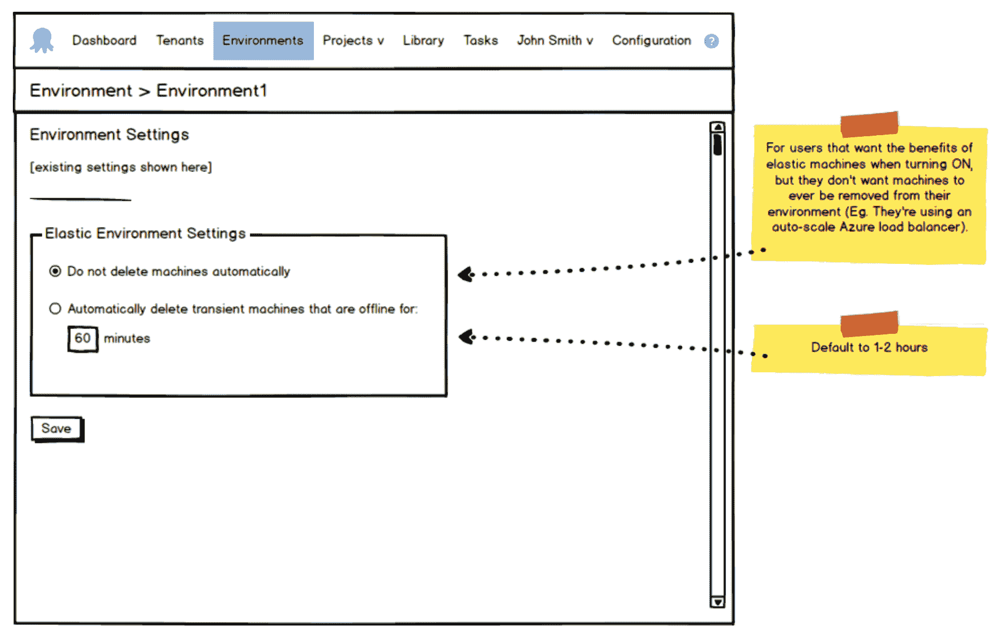
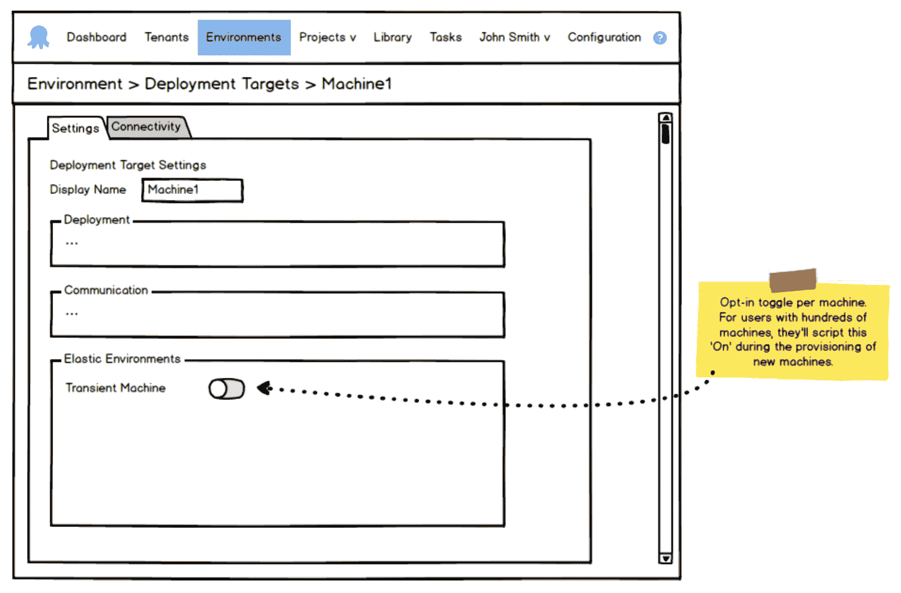
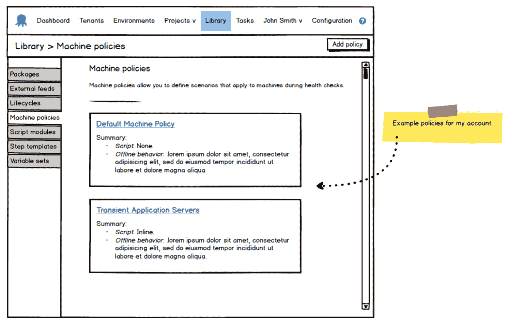
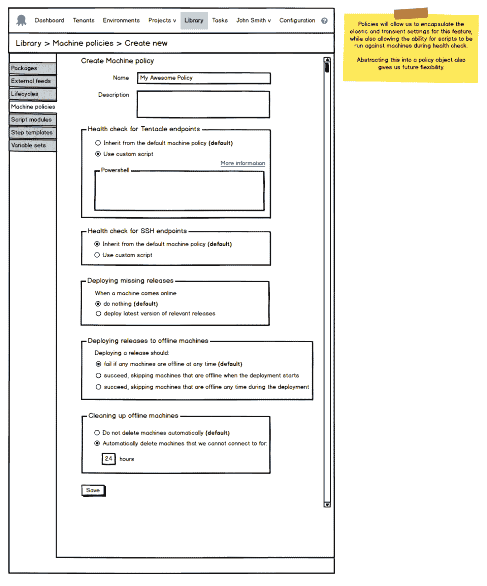
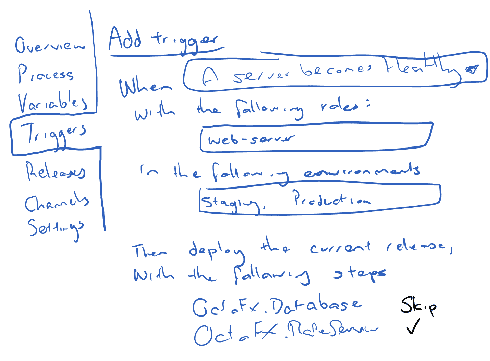
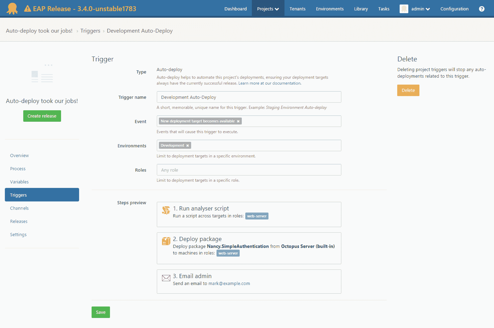

# 自动部署和事件源的发展——Octopus 部署

> 原文：<https://octopus.com/blog/the-evolution-of-auto-deployments-and-event-sourcing>

这篇文章是我们 Octopus 3.4 博客系列的一部分。在我们的[博客](https://octopus.com/blog/octopus34-blog-series-kickoff)或我们的[推特](https://twitter.com/OctopusDeploy)上关注它。

**Octopus Deploy 3.4 已经发货！阅读[博文](https://octopus.com/blog/octopus-deploy-3.4)和[今天就下载](https://octopus.com/downloads)！**

* * *

作为一个新特性，我们希望自动部署是我们有信心并自豪地发布的东西；目前，它的易用性和直观性与 Octopus 相当。基本上，它必须*工作*并让你微笑着点头。我们坚持这一愿景，尽管有几次情况并不明朗。这篇文章回顾了导致我们建立的[弹性和瞬态环境](http://docs.octopusdeploy.com/display/OD/Elastic+and+Transient+Environments)的一些决策。

我们开始试图通过在一个巨大的清单中列出我们想要的所有功能来解决这个问题，并在 Balsamiq 中绘制一些模型(因为，谁不喜欢 Balsamiq 呢？).办公室里有演示会议，每个人都集思广益，提出想法和关注点。这最初将是一个小得多的功能集，我们将在更大的多租户版本中包含一些很酷的弹性功能。然而，随着这两个功能的开发，它们很快变得比我们预期的复杂得多，我们一直在计划的任何内部时间表都开始悄悄溜走(到了我们完全停止指定截止日期，只专注于工作的地步)。这是一场自我诚实的比赛，只有*我们*知道我们何时真正到达了终点:)

我们的功能清单大致如下:

*   当新机器上线时，它将自动部署
*   它应该知道在给定的机器上应该是哪个版本
**   它应该知道在给定的机器上哪个版本*是**   它会自动清理旧环境*   等等。*

 *听起来很简单。不会很难吧？

我们疯狂地开始在现有的环境和部署目标屏幕上添加复选框和单选按钮，渴望开始给用户提供选择加入这些新的弹性和瞬态行为的选项。

一些早期的模型显示了这个特性的简单开端: 

随着时间的推移，我们在改进 UI 决策的同时制作了更多的模型，并开发了一个与模型相匹配的版本。然后我注意到一些有趣的事情开始发生...

人们终于可以真实地玩玩 Octopus 里面的*功能了。他们不开心。我也没有。有些事情感觉不对劲(即使功能是与每个人都认为是一个好方向的实体模型 1:1 开发的)。至少对我来说，这感觉就像我们突然将现有的环境和部署目标屏幕复杂化了，我们喜欢使用它们的简单性。还有一种挥之不去的感觉是，如果不进一步增加现有屏幕的体积，将来很难扩展这些功能。我们迷失了方向，但决定同时继续开发后端功能，同时给自己时间来解决我们的 UI 问题。*

## 输入机器策略

没过多久，保罗就来帮我们了，他提醒我们一个被称为*机器政策*的老主意。突然有了这个想法，你可以把一个策略附加到一台机器上。它从环境和部署目标屏幕中抽象和隔离了弹性和瞬态逻辑*和*，从编程的角度来看，这也使得使用数据模型更加容易。这正是我们所需要的。

一些新的样机+一些新的希望！我们在路上。 

我们花了几周时间研究这个想法，基本上是在做我们需要的事情。然而，当我们越来越接近终点线时，仍然有一种挥之不去的感觉，有些事情不太对劲。我们都知道，我们都在几次会议上说过，但有一段时间我们无法确定。你能通过查看那些机器策略模型来发现它吗？

这是模型的“部署缺失版本”部分。我们犯了一个错误，盲目地接受机器策略作为我们所有弹性环境需求的通用解决方案。机器策略的部署部分就像试图将圆钉放入方孔中。虽然我通常完全支持[方孔中的圆钉](https://www.youtube.com/watch?v=8rwsuXHA7RA)，但在这种情况下，它就是不起作用，因为与部署相关的条件属于项目，而不是机器。保罗已经找到了缺失的部分，并用简单的潦草笔迹描述了这一景象:

这个小涂鸦给了多少微笑是难以形容的。它清除了所有的噪音(你脑中那个一直在说*有些不对劲*的声音)，我们突然知道了终点线在哪里。

## 输入项目触发器

这是事情变得令人兴奋的时候...

项目触发器给了我们同样的灵活性和分离性，这是机器策略在几周前所促成的，并且只关注自动部署。它还扩展了自动部署的可能性。我们可以将自动部署限制到某些标准，比如角色或环境。我们可以有多个促进不同目的的触发器(一个用于您的*开发*环境，一个用于您的*阶段*环境等)。这太棒了。

所以现在我们有了愿景。然而，实现仍然不确定。

## “如何”

我们研究了几种实现自动部署的方法。其中一些在实现了 90%之后就被彻底抛弃了(不夸张)。这就像是道路上的最后一个分支。只有一条分支通向实际的终点线，但是所有的分支*看起来*都像是从你站的地方通向终点线。

> 个人注释:对我来说，这是一次有趣的全新经历。在 Octopus 之前，我已经习惯于按照严格的时间表和预算工作，所以你只能选择一条路(如果它最终没有变得伟大、艰难，你现在就只能坚持下去)。但是八达通鼓励我们探索所有的可能性，这样我们就能为我们的客户获得最好的结果，这就是其中的一次。

我们首先探索了一个通知系统，我们称之为*域事件*(就像那些像我一样的 iOS 爱好者的 ns 通知一样)。我们的想法是可以在 Octopus 中注册事件(比如`MachineEnabled`、`MachineDisabled`、`MachineAdded`等)。)我们会监听这些事件，并在必要时通过自动部署做出响应。

比如伪代码。`if (event == MachineAdded) then ForwardThisMachineToAutoDeployForProcessing()`

自动部署引擎将按计划运行(每 15 秒一次)，并决定部署到哪些机器上(基于我们在各种表上的一些标志)。经过几天几夜的集中思考，基本概念已经建立并运行了。不幸的是，这种架构在[高可用性](http://docs.octopusdeploy.com/display/OD/High+Availability) (HA)设置中失败了，我们需要做出决定:

1.  继续推进这个域事件架构，并修补它以在 HA 下工作，或者
2.  尝试不同的方法。

*事件源*的概念是作为一个想法提出来的，以避免我们遇到的架构问题。我们已经在 Octopus 中使用了一个名为`Event`的表，以便在系统中发生重大事件时创建审计历史。因此，扩展这个`Event`表使我们能够非常容易地探索事件源架构。

## 结合所有的努力

我们不想完全抛弃我们努力工作(实际上是几周的工作和测试)的领域事件架构。我们也喜欢领域事件在将来对 Octopus 的其他领域仍然有用的想法。因此，我们选择以一种不暴露域事件的高可用性问题的方式来重用它们。我们现在使用它们来填充弹性和瞬态环境所需的事件:)

例如，当添加一台机器时，我们为`MachineAdded`发布一个域事件。然后，域事件监听器代表我们填充`Event`表。这很好，因为这意味着我们有一个单独的类(域事件监听器)来控制哪些事件将被自动部署。

然后，我们的自动部署引擎被简化为一个纯粹的事件源架构，这使得它更加独立，更易于测试(并且在 HA 下工作)。它每 15 秒运行一次，并扫描`Event`表，查看自上次通过以来发生了什么事件。然后，它根据正面事件(*机器被添加*、*上线*、*被启用*)和负面事件(*机器被删除*、*离线*、*被禁用*)来分析和平衡这些事件，然后决定自动部署哪些版本。

## 目前处于测试阶段

说了这么多，我想对整个团队，特别是社区表示我个人的感谢，感谢他们伸出援手，分享他们的想法和反馈。这是一项巨大的努力，并且这一切导致了我们今天所拥有的，目前在 [3.4.0-beta0001](https://octopus.com/downloads/3.4.0-beta0001) 中:在[机器策略](http://docs.octopusdeploy.com/display/OD/Machine+Policies)和[项目触发器](http://docs.octopusdeploy.com/display/OD/Keeping+deployment+targets+up+to+date)之间有明显区别的弹性和瞬态环境。

在接下来的几周里，我们将通过一些简短的博客帖子来探索这些新功能。我们期待您的反馈，并希望这能让您对这些功能的形成有所了解:)*