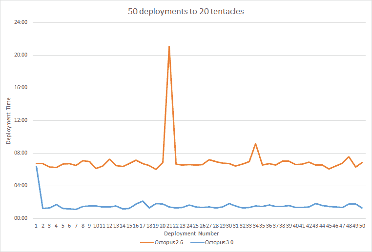

# Octopus Deploy 3.0 节省时间:delta 压缩- Octopus Deploy

> 原文：<https://octopus.com/blog/the-octopus-deploy-3.0-time-saver-delta-compression>

Octopus Deploy 3.0 中一个很酷的新特性是 delta 压缩。Octopus Deploy 中的一个典型场景是频繁部署对包的小更改。例如，您可能推送一些代码更新，但是您的所有库都没有改变。在过去，Octopus Deploy 会将整个包上传到每个触手上，不管变化有多小。随着 delta 压缩的引入，只有你的包的改变会被上传到每个触手。这在理论上听起来很棒，但我很好奇 delta 压缩在实践中会产生什么样的好处。

对于这个实验，我设置了 2.6 和 3.0 服务器，每个服务器有 20 个触角。触角位于世界的另一端，因此网络条件会减缓包的获取，使其成为部署的重要部分。我执行了 50 次 110MB 包的部署。每个包包含 10MB 的更改。

结果是:

2.6 完成一次部署平均需要 7 分钟，总运行时间为 **6 小时 7 分钟**。

3.0 用了 6 分 23 秒来执行第一次部署，然后平均用 1 分 30 秒来计算增量并将它们推送到触角，总运行时间为 **1 小时 26 分**。

这是一个相当惊人的结果。有了 Octopus Deploy 3.0，您等待部署的时间将会减少。增量压缩也节省了您的带宽，并释放您的章鱼服务器和触手资源，为更多的部署！