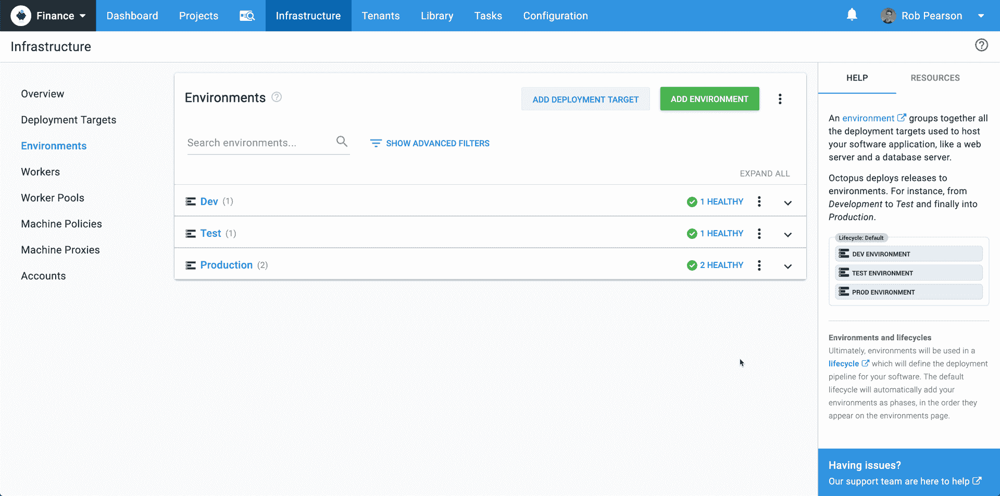

# 我的用户体验之旅——Octopus Deploy 引发的思考

> 原文：<https://octopus.com/blog/thoughts-from-my-recent-ux-journey>

*“我感觉很好，我感觉很棒，我感觉很棒”*

[继续查看几个没有垂直对齐、字体大小不一致、缺少一些动画的表格]

*“我感觉很好，我感觉很棒，我感觉很棒”*

[看到缺少帮助选项，过多的信息使屏幕非常分散注意力，以及更多的*样式问题]*

***(现在大声抽泣)“我感觉很好，我感觉很棒，我感觉很棒！”***

你好。我叫马克，我是鲍勃(或者我是治疗师？有时候我也不确定)。你以前听过我的消息。我是 Octopus 的 UX 人之一，目前负责我们的入职工作。我们希望新客户取得成功，所以我们希望尽可能地避开他们，给他们一些简单的、不受干扰的东西。今天，我想分享一下我们上个季度一直在做的一些事情，以及为什么我们认为这些事情会让您的生活变得更加轻松。

从客户的角度接近 UX 是我们非常重视的事情，随着你的应用功能的增加，不时后退一步，想想第一次体验你的界面的新用户是很重要的。

这些概念有意义吗？有没有什么分散他们注意力的事情？他们能把点点滴滴联系起来，理解事物，然后教别人吗？

## 尽量减少分心

[](#)

一致性很重要(在我们的代码、设计和实现中同样如此)，因为作为消费者，它减少了我们大脑的认知负荷，使我们更容易接受新信息。

以这个代码示例为例:

```
var body: some View {
    VerticalStack(alignment: .leading) {
        Text(self.categoryName)
            .font(.headline)
            .padding(.leading, 15)
            .padding(.top, 5)

        ScrollView(showsHorizontalIndicator: false) {
            HorizontalStack(alignment: .top, spacing: 0) {
                ForEach(self.items) { landmark in
                    CategoryItem(landmark: landmark)
                }
            }
        }
        .frame(height: 185)
    }
} 
```

只要浏览一下这段代码，您就可以很容易地推断出发生了什么，因为一切都是正确一致的。如果这段代码中有一个 bug，我相信任何工程师都可以很快很容易地找到它。

现在，让我们拿同一个代码样本，但是这一次，用让我们眼睛抽搐的特殊方式编写它:

```
var body: some View {
VerticalStack(alignment: .leading) {
     Text(self.categoryName).font(.headline).padding(.leading, 15)
       .padding(.top, 5)
    ScrollView(showsHorizontalIndicator: false) {

      HorizontalStack(alignment: .top, spacing: 0) {
        ForEach(self.items) { landmark in
                CategoryItem(landmark: landmark)
                 }
        }
    }

 .frame(height: 185)
 }
} 
```

[](#)

我觉得大多数工程师像第一个例子一样编写代码，但是有时(通常只是以小的方式)我们像第二个例子一样实现并向客户介绍我们的设计。

为什么？

因为代码是我们大部分时间看到的——当我们工作时，它就在我们面前。我们关心代码，这很好！毕竟我们是工程师。

另一方面，顾客关心用户体验，因为这是他们互动的内容；这就是激励他们的东西；那就是牵着他们的手，带他们踏上这段神奇旅程的东西。

[](#)

*【耶一巫师，哈利】*

客户的旅程只有通过底层工程才有可能实现。但是，如果它不是以直观的方式呈现，没有噪音和干扰，那么他们就不会与工程的美联系起来，我们的交付就会失败。

**这样想吧**
如果代码具有*高*质量，那么它允许伟大的 UX 具有*潜力*，但这并不能保证。进入工程和设计的同样仔细的想法需要进入 UX，以使你的软件的全部潜力被你的客户理解和欣赏。

这让我想到了入职团队上个季度一直关注的事情:减少噪音。

### 降低噪音

以前，当需要在 Octopus 中引入新功能时，会有功能屏幕本身，加上一个文档页面，再加上应用程序中的一些支持文本，为您提供要点，包括文档的链接。

作为一个新用户，这种格式最初可能非常有用，但是在您使用了该功能并理解了它之后，您真的不需要再看到支持文本了。它现在永久地占据了你屏幕上的垂直空间，你的大脑不得不在每次你加载那个屏幕的时候浏览它，这给你的大脑制造了一点额外的认知负荷，让你的大脑在它要去的地方说*“嗯，跳过那个吧”*。

随着时间的推移，这些小噪音开始累积。它们变成了不必要的干扰，并从对用户真正有价值的 UI 区域夺走了权力。

在 Octopus，我们希望让新客户能够轻松地将这些点连接起来并找到他们的路，这通常需要支持文本来解释正在发生的事情。但对于使用八达通多年的更高级用户，我们不想给他们制造不必要的噪音。

考虑到这一点，我们最近增加了一个小功能来帮助我们实现这一目标...

我们希望新用户获得成功，作为这一目标的一部分，我们研究了如何让新用户更容易上手，并探索章鱼概念。

我们决定在边栏上提供有用的信息，这些信息既容易获得，也容易被忽略。这个侧边栏提供了与您正在查看的页面相关的概念的快速摘要，以及到我们的文档和其他有用资源的链接，这些资源对开始使用 Octopus 的人来说很有帮助。

[](#)

将支持文本包含到侧边栏也意味着我们可以将它从许多屏幕的顶部移除，从而释放宝贵的屏幕空间。

如果您需要的话，这个特性可以为您提供一点额外的帮助，但是也不会妨碍您。这通常是我们在任何屏幕上寻找的平衡。

因此，在这些小小的发现之旅中，我们不断从不同的方向、不同的组合和不同的角度探索事物，直到我们感觉达到了某种平衡。

这通常会让您的团队感到沮丧，因为您会发现自己会说这样的话:

> *“很好，但还是有些不对劲，我不知道是什么，但还没准备好”*

当谈到 UX 时，你必须相信你的感觉，因为当它*是*对的时候，你会知道的。你肩上所有的重量会突然消失，你会微笑。

## UX 团队的结束语

以我的经验来看，这个过程需要团队内部的高度信任。如果你真的想成长，你必须准备好给予和获得强硬的反馈，这意味着让你的团队为这种尊重但开放的反馈风格做好准备。你必须考虑到在某件事情上做了多少工作，但也要做出艰难的决定，一个设计是否朝着正确的方向前进。

提前谈论这一点有助于让人们轻松进入这个过程，并避免以后一些更困难的对话。我通常是这样处理的:

> “我们要求并鼓励每个人公开设计给他们带来的感受，并相信他们的直觉。你不能太依赖任何一项工作，因为你可能不得不放弃几天的进展，转向不同的方向。这可能会很痛，但要知道这绝不是退步。我们总是在前进，因为我们从所有这些迭代中学习，并最终一起到达某个伟大的地方。”

有些时候*你不得不放弃一些你非常努力的设计/代码，因为有些东西感觉不太对劲，或者你已经展示给人们看了，但他们没有以你希望的方式做出反应或与之联系。*

回想起来，正是这些时刻教会了你很多关于你自己(以及和你一起工作的人)的事情。

好消息是，你可以深切地关心你的代码/设计，而不必把自己与它联系在一起。诀窍似乎是:

*   保持团队沟通畅通*(表达感受)*
*   保持定期评审和反馈*(不要让作品达到沸点)*
*   保持会议简短扼要*(有议程，进来，出去，完成任务)*
*   经常从客户的角度看问题*(不是字面上的，只是奇怪)*

开始做这些事情，我相信你会朝着正确的方向前进。要知道，UX 的小变化可以给人们的生活带来很大的变化，会有机会改善客户的体验，好事也会发生。

在我们忙乱的小世界里发生的一切，总是试图保持观点。也就是说，你希望顾客体验的*主要价值*是什么？其他一切可能只是噪音😃

保持微笑和愉快的部署。

[](#)