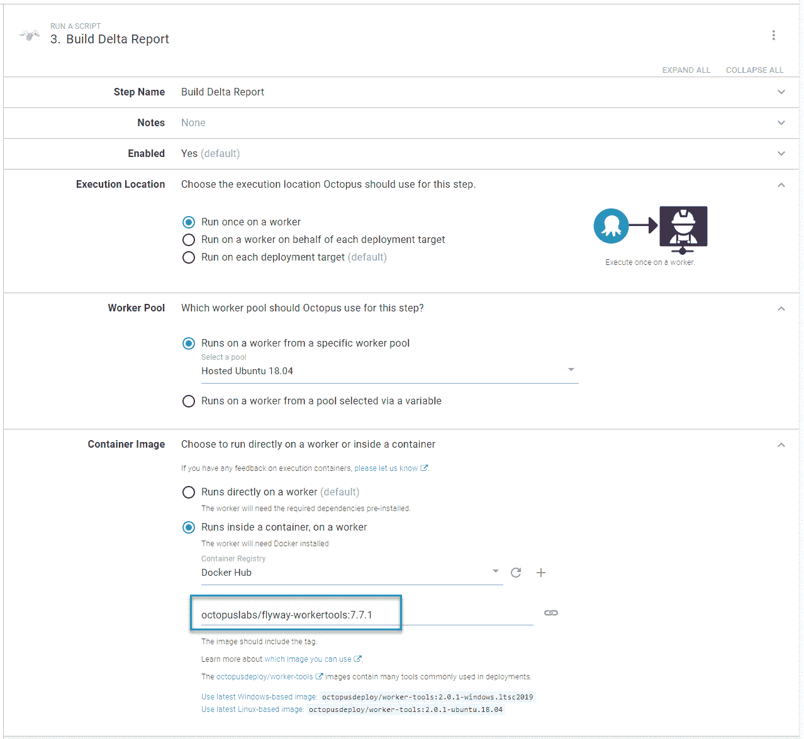
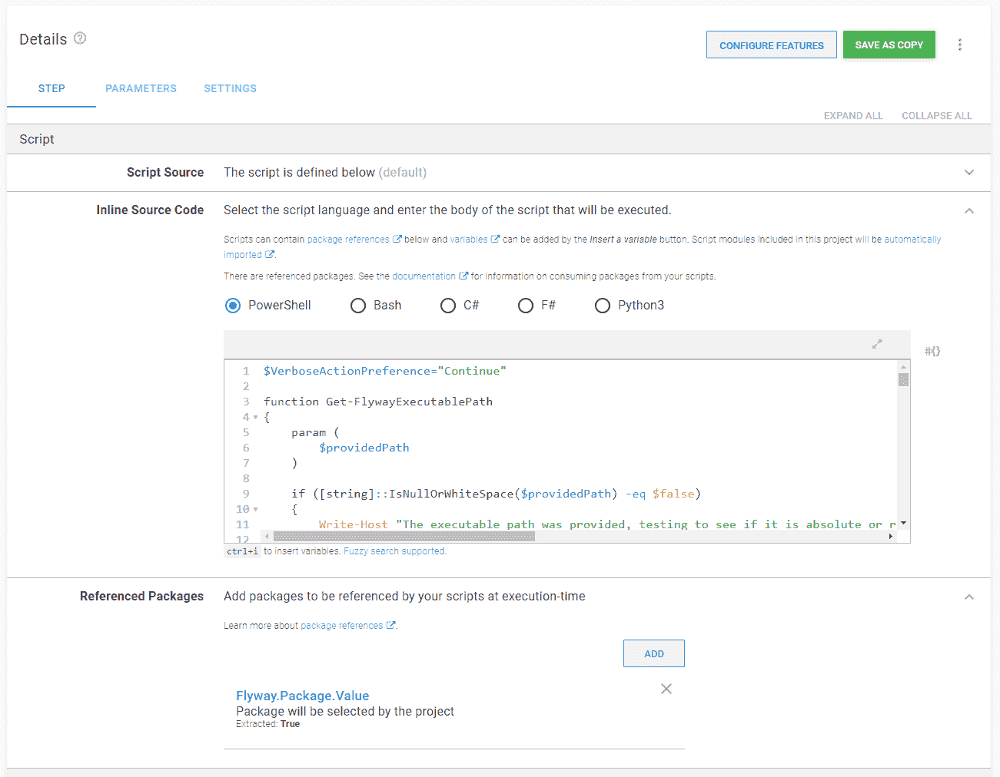
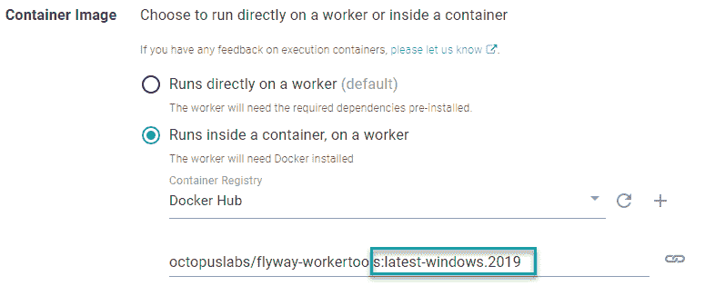
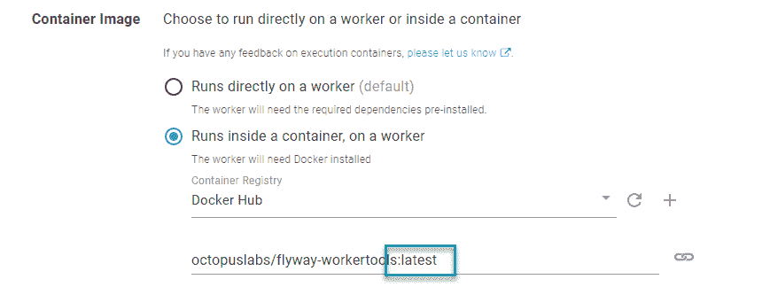
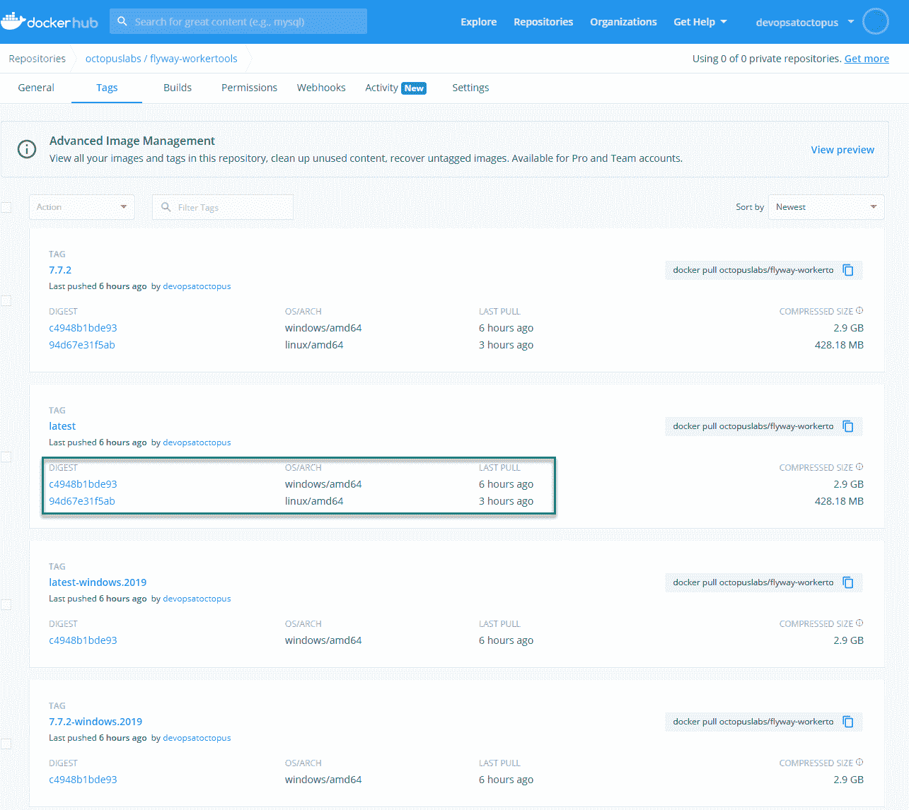
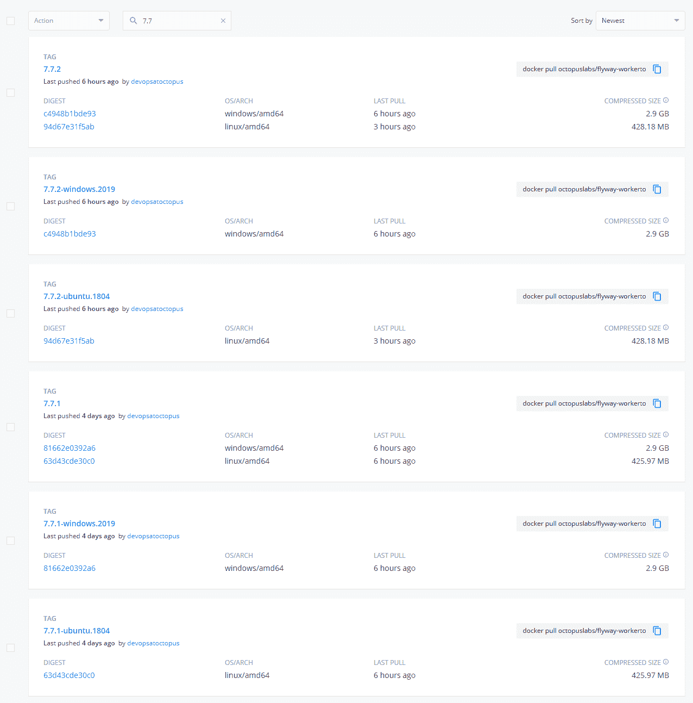

# 构建定制执行容器的技巧——Octopus Deploy

> 原文：<https://octopus.com/blog/tips-building-custom-execution-containers>

[](#)

执行容器是 Octopus Deploy 中隐藏的瑰宝。我最近完成了对它们的深入研究，以帮助一位客户。这包括创建一个定制的 Docker 映像，用于执行容器特性。我学到了一些提示和技巧，我想分享给你，帮助你写你的自定义图片。

## 执行容器的优势

当 2018 年 [workers](https://octopus.com/docs/infrastructure/workers) 发布时，我对从 Octopus 服务器卸载部署任务的能力感到兴奋。我开始创建工人池。我在配置工作人员时遇到的一个问题是需要预安装软件。在某些情况下，某些软件(如 Terraform)版本之间不兼容。并排运行在技术上是可能的，但它可能会导致问题，而且我无法在不修复一堆部署的情况下升级到最新版本。

我最终得到了这样的工人池:

*   Terraform 11 工人池
*   Terraform 12 工人池
*   等等。

执行容器解决了这个问题。我可以用我需要预装的软件创建 Docker 映像。现在，在我的部署过程中，我指定下载并运行一个 Docker 映像。

[](#)

版本是部署过程的一部分。将我的部署过程升级到最新的工具需要更改分配给 Docker 映像的版本号和运行该过程的任何步骤。这并不奇怪，因为所需工具的版本是部署过程的一部分。

## 技巧 1:用执行容器引用包

数据库部署是工作人员的常见用例。数据库部署至少涉及一个包含所需状态或迁移脚本的包，但是包引用如何与执行容器一起工作呢？

首先，在执行容器上运行的步骤通常来自于**运行脚本步骤**。**运行脚本步骤**提供了[引用包](https://octopus.com/docs/deployments/custom-scripts/run-a-script-step#referencing-packages)的能力。这将把必要的目录作为卷安装到 Docker 容器上。

[](#)

您可以轻松地将包的内容传递给执行容器，这应该会使它从直接在服务器上运行无缝地过渡到执行容器。这适用于 [Octopus Deploy 提供的图像](https://hub.docker.com/r/octopusdeploy/worker-tools)或您的自定义图像。

## 技巧 2:映像需求

创建自定义执行容器映像时，有一些要求:

1.  Linux 镜像应该是基于 Ubuntu 的，并且安装了`wget unzip apt-utils curl software-properties-common`。这是 Calamari 正确运行所需的软件。
2.  Dockerfile 文件中不能定义入口点。Octopus 拥有容器的生命周期；入口点可能会过早结束容器。
3.  Linux 容器运行在 Linux 主机上，Windows 容器运行在 Windows 主机上。Windows 主机上没有 Linux 容器。
4.  假设您使用多种体系结构标记映像(下面将详细介绍)，工作池可以由 Windows 主机或 Linux 主机组成。

## 技巧 3:了解工作目录并配置可执行路径

`docker run`命令还利用 workdir 或`-w`参数[来设置容器中的工作目录，以匹配主机中的工作目录。](https://docs.docker.com/engine/reference/run/#workdir)

通常，容器中的工作目录并不重要。如果脚本运行成功，它是从根目录还是从随机文件夹运行都没关系，除非您需要在 Docker 映像上安装定制软件。它不使用包管理器，如 Windows 的 Chocolatey，Linux 发行版的 APT 或 YUM。

我最近在为 Flyway 构建执行容器时遇到了这个问题。包管理器非常有用，因为它为环境变量添加了必要的路径。我可以使用`flyway info`而不是`C:\Flyway\flyway.exe info`来运行 info 命令。在撰写本文时，只有一个 Maven repo，您可以使用它下载一个. tar 或。zip 文件。

对于基于 Linux 的发行版，命令如下:

```
ARG FLYWAY_VERSION=7.7.1

# Change the workdir to Flyway to install flyway binaries
WORKDIR /flyway

# Install flyway
RUN curl -L https://repo1.maven.org/maven2/org/flywaydb/flyway-commandline/${FLYWAY_VERSION}/flyway-commandline-${FLYWAY_VERSION}.tar.gz -o flyway-commandline-${FLYWAY_VERSION}.tar.gz \
  && tar -xzf flyway-commandline-${FLYWAY_VERSION}.tar.gz --strip-components=1 \
  && rm flyway-commandline-${FLYWAY_VERSION}.tar.gz \
  # Make the /flyway/flyway command an executable
  && chmod +x /flyway/flyway \
  # Make it so any user can call /flyway/flyway 
  && ln -s /flyway/flyway /usr/local/bin/flyway

# Octopus expects to start in the default directory
WORKDIR / 
```

这会将 Flyway 包的内容提取到`/flyway`目录，使`/flyway/flyway`成为可执行文件，然后将其添加到适当的路径。我在脚本中需要做的就是调用`/flyway/flyway info`来运行[飞行路线信息命令](https://flywaydb.org/documentation/command/info)。

对于 Windows 容器，这方面的命令是:

```
SHELL ["powershell", "-Command"]

ARG FLYWAY_VERSION=7.7.1

# # Install Flyway
RUN Invoke-WebRequest "https://repo1.maven.org/maven2/org/flywaydb/flyway-commandline/${env:FLYWAY_VERSION}/flyway-commandline-${env:FLYWAY_VERSION}-windows-x64.zip" -OutFile flyway-cli.zip; `
    & '.\Program Files\7-Zip\7z.exe' x .\flyway-cli.zip; `
    rm .\flyway-cli.zip;

RUN $old = (Get-ItemProperty -Path 'Registry::HKEY_LOCAL_MACHINE\System\CurrentControlSet\Control\Session Manager\Environment' -Name path).path; `
    Write-Host $old; `
    $flywayPath = ';C:\flyway-' + ${env:FLYWAY_VERSION}; `    
    $new = $old + $flywayPath; `
    Write-Host $new; `
    Set-ItemProperty -Path 'Registry::HKEY_LOCAL_MACHINE\System\CurrentControlSet\Control\Session Manager\Environment' -Name path -Value $new; `
    refreshenv 
```

该脚本将 Flyway 可执行文件下载并提取到`C:\flyway-[version number]`，然后将该目录添加到环境路径中。我在脚本中需要做的就是调用`flyway info`来运行[飞行路线信息命令](https://flywaydb.org/documentation/command/info)。

## 技巧 4:创建基本图像

我建议创建包含任何子映像都可以利用的基础映像。我为 Flyway 执行容器映像创建了[基础映像](https://github.com/OctopusDeployLabs/workertools):

*   Windows 2019 映像
    *   PowerShell 核心
    *   巧克力
    *   计算机编程语言
    *   7Zip
*   Ubuntu 图像
    *   。NET 核心必备软件(Calamari 是一个自带的。网芯 app)
    *   卷曲
    *   拉开…的拉链
    *   PowerShell 核心
    *   Python3

这样，子映像只需提取基础映像并安装必要的软件。基本映像可以减少子映像的构建时间，因为核心映像很少改变。

在转移到基本映像之前，我的 Linux 和 Windows 版本大约需要 13 分钟。移动到基本图像减少到 5 分钟。

## 技巧 5:对跨平台图像使用 Docker 清单

要求一个人选择 Windows 或 Linux 映像是一个额外的认知负荷，特别是如果工具是跨平台的。它迫使用户思考容器将在哪里运行。

而不是这个: [](#)

使之成为可能: [](#)

这可以通过使用[码头货单](https://docs.docker.com/engine/reference/commandline/manifest/)来完成。

Docker 提供了 [buildx](https://docs.docker.com/buildx/working-with-buildx/) 作为 manifest 命令的替代。在撰写本文时，buildx 不容易支持 Windows 容器和 Linux 容器。

为了利用`docker manifest`，你必须打开 Docker 中的实验特性。有很多例子说明如何为 Linux 做这件事。如果您使用的是 Docker Desktop for Windows，请以管理员身份运行此 PowerShell 命令，然后重新启动 Docker 引擎:

```
[Environment]::SetEnvironmentVariable("DOCKER_CLI_EXPERIMENTAL", "enabled") 
```

清单的工作原理:

1.  为 Windows 构建映像:`docker build ./windows-2019 --tag octopuslabs/flyway-workertools:$FLYWAY_VERSION_TO_BUILD-windows.2019 --tag octopuslabs/flyway-workertools:latest-windows.2019`。
2.  为 Windows: `docker push octopuslabs/flyway-workertools:$FLYWAY_VERSION_TO_BUILD-windows.2019`的每个标签推送图片。
3.  转到 Linux 容器。
4.  为 Linux 构建映像:`docker build ./ubuntu-1804 --tag octopuslabs/flyway-workertools:$FLYWAY_VERSION_TO_BUILD-ubuntu.1804 --tag octopuslabs/flyway-workertools:latest-ubuntu.1804`。
5.  为 Linux 的每个标签推送图片:`docker push octopuslabs/flyway-workertools:$FLYWAY_VERSION_TO_BUILD-ubuntu.1804`。
6.  构建清单:`docker manifest create octopuslabs/flyway-workertools:latest octopuslabs/flyway-workertools:latest-windows.2019 octopuslabs/flyway-workertools:latest-ubuntu.1804`。
7.  推送清单:`docker manifest push octopuslabs/flyway-workertools:latest`。

您将为每个架构(Windows 和 Linux)构建并标记一个映像。这些标签对于该架构是唯一的。当您为`latest`标签构建清单时，您可以“将最新的 windows.2019 和最新的 ubuntu.1804 合并到一个标签中”。完成后，您的标签将在 Docker Hub 上显示如下。

必须在构建清单之前推送图像。否则，您会收到一个关于找不到图像的错误，因为清单没有查看本地计算机。

[](#)

我已经让 GitHub 动作来[构建公共的 Flyway 执行容器](https://github.com/OctopusDeployLabs/flyway-workertools/blob/main/.github/workflows/docker-build-push.yml)，所以你可以看到它的运行。

## 技巧 6:利用 Docker 构建参数

您会注意到，在我的 Dockerfile 文件示例中，我使用了`ARG`命令:

```
ARG FLYWAY_VERSION=7.7.1 
```

当一个新版本的 Flyway 准备好安装时，假设其他一切都是一致的，我只需在我的`docker build`命令中传递一个`--build-arg`开关。

```
docker build ./ubuntu-1804 --tag octopuslabs/flyway-workertools:$FLYWAY_VERSION_TO_BUILD-ubuntu.1804 --tag octopuslabs/flyway-workertools:latest-ubuntu.1804 --build-arg FLYWAY_VERSION=$FLYWAY_VERSION_TO_BUILD 
```

为了创建 Docker 映像的新版本，我只更改了管道中的一个点，而不是多个地方。

## 技巧 7:根据关键软件对 Docker 镜像进行命名和版本化

我一直使用 Flyway 作为我的示例容器。这是容器的关键软件。其他软件，如 Java Runtime Environment (JRE ),需要它才能正常工作。图像的名称为`flyway-workertools`，版本基于 Flyway 版本。

[](#)

目标是减少图像消费者的模糊性。任何运行`flyway-workertools`图像的`7.7.2`的人都知道他们将得到 Flyway 的`7.7.2`。

## 技巧 8:安排构建来检查新版本

最后一个技巧与日常维护有关。执行容器很棒，但是保持所有工具的最新版本是非常耗时的。Flyway 发布了一个清单文件，我可以让我构建检查。我的脚本将:

1.  检查 Flyway 清单文件中的最新版本。
2.  从 Docker Hub 中调出所有标签，搜索最新版本。
3.  如果发现最新版本是一个标签，那么停止构建。
4.  如果发现最新版本是*而不是*作为标签，那么构建一个新版本。

下面的脚本来自用于构建 Flyway worker 工具映像的 [GitHub 动作。因为这是一个 GitHub 动作，所以它设置输出变量，供后面的动作和步骤使用。](https://github.com/OctopusDeployLabs/flyway-workertools/blob/main/.github/workflows/docker-build-push.yml)

```
$manifestDataRaw = Invoke-WebRequest "https://repo1.maven.org/maven2/org/flywaydb/flyway-commandline/maven-metadata.xml"
$manifestData = [Xml]$manifestDataRaw
$latestFlywayVersion = $manifestData.metadata.versioning.latest
$workerToolsTags = Invoke-RestMethod "https://registry.hub.docker.com/v1/repositories/octopuslabs/flyway-workertools/tags"
$matchingTag = $workerToolsTags | Where-Object { $_.name -eq $latestFlywayVersion }
echo "::set-output name=CURRENT_FLYWAY_VERSION::$latestFlywayVersion"
if ($null -ne $matchingTag)
{
    Write-Host "Docker container already has latest version of flyway"
    echo "::set-output name=Continue::No"
}
else
{
    Write-Host "We need to upgrade the flyway container to $latestFlywayVersion"            
    echo "::set-output name=Continue::Yes"
} 
```

有了这个脚本，我可以安排一个每日构建来检查新版本，并在发现新版本时构建一个新容器。只要消费者引用一个特定的版本号(例如，`7.7.2`，他们就不会注意到新的图像。

包管理器的逻辑是不同的，并且[依赖于包管理器本身](https://stackoverflow.com/questions/18885820/how-to-check-the-version-before-installing-a-package-using-apt-get)。

## 结论

Octopus Deploy 中的执行容器使得管理依赖关系更加容易。Octopus 提供图像来帮助尽可能多的人开始使用执行容器。它们应该适用于大多数情况，但是图像可能包含您不需要的额外软件，导致膨胀和更长的下载时间。

我希望所提供的技巧能帮助你制作出符合你特定需求的图片。

愉快的部署！