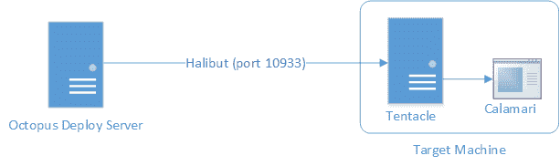
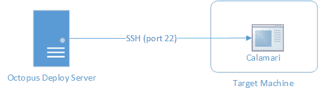
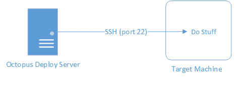
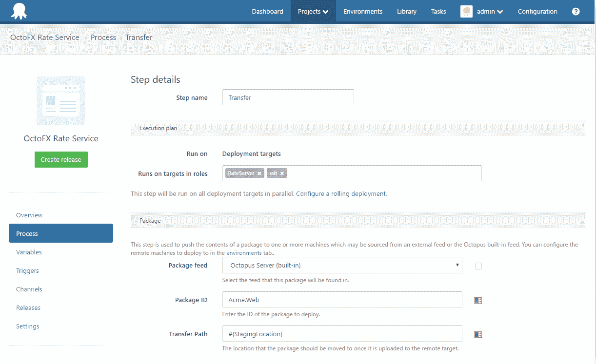
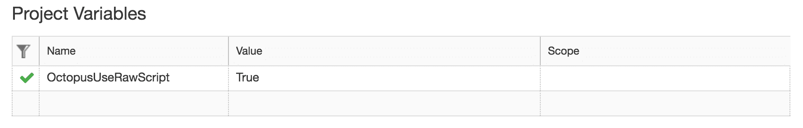
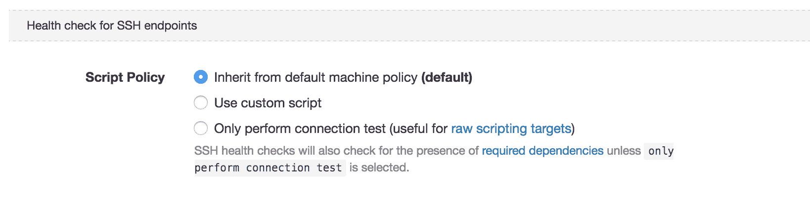

# 尝试生章鱼-章鱼部署

> 原文：<https://octopus.com/blog/trying-raw-octopus>

卡拉马里&为你的 SSH 目标部署 Mono-free。

## 原始脚本

如果你已经阅读了一些我们很棒的[文档](http://docs.octopusdeploy.com/)，你可能会遇到下面这个简单的架构图。

这描述了一个标准的 Windows 安装，其中 Octopus 服务器使用 [Calamari](https://octopus.com/docs/api-and-integration/calamari) 通过安装的[触手](https://octopus.com/docs/infrastructure/deployment-targets/windows-targets/tentacle-communication)执行部署，触手提供通信通道。有了 [SSH](https://octopus.com/docs/infrastructure/deployment-targets/linux/ssh-target) 部署，SSH 连接消除了对触手的需求，因此 Octopus 可以直接向远程目标上的 Calamari 发出命令

对于某些场景，这似乎还不够远。甚至运行 Calamari(及其核心依赖 [mono](http://www.mono-project.com/) )的需求有时也是用户没有或不想要的奢侈品。也许你正试图在无法安装 mono 的硬件负载平衡器或 IOT 设备上简单地执行一些脚本。也许 mono 在 80 年代被分回来的那个不知名的 Unix 发行版上不被支持，bash shell 也还没有被移植。出于这个原因，我们已经发布了一个隐藏的特性，叫做[原始脚本](https://octopus.com/docs/deploying-applications/custom-scripts/raw-scripting)，它通过一个特殊的项目变量，允许你的脚本步骤通过打开的 SSH 连接直接执行*，而不需要 Octopus 进行任何额外的包装或引导。结合 3.7.12 中新的[传输包](https://octopus.com/docs/deployments/packages/transfer-package)步骤，您现在可以将您的应用程序部署到您的 Linux 服务器上，甚至不知道什么是 mono！*

> 我们真的只是打开一个 SSH 连接，按原样传递您的脚本。

## 转移包裹

对于某些部署，您可能只是希望将包传输到远程目标，而不是实际解压缩。也许它需要通过脚本进一步处理或上传到另一个服务器。新的`Transfer A Package`步骤的工作方式与普通的`Deploy A Package`步骤非常相似，除了没有真正提取包内容，也没有任何额外的脚本可以作为该步骤的一部分运行。在正常部署(非原始)中使用时，获取阶段可以利用[增量压缩](https://octopus.com/docs/deployments/packages/delta-compression-for-package-transfers)和[保留策略](https://octopus.com/docs/administration/retention-policies)，然后将包从其暂存位置复制到您提供的目标路径。如果在原始脚本编写期间发生包传输，则上述采集优化都不会发生(因为它们是由 Calamari 执行的),而是将包从上传暂存位置*移动*到目的地。

## 设置它

为原始脚本设置您的项目只是配置一个标准的 [SSH 目标](https://octopus.com/docs/infrastructure/deployment-targets/linux/ssh-target)，然后添加项目级变量`OctopusUseRawScript`。这个标志只对项目中的包传输和脚本步骤有影响。

我们在文档中包含了一个[指南，概述了部署和运行一个简单打包脚本的简短步骤，而无需在目标上做任何额外的工作。](https://octopus.com/docs/deployments/custom-scripts/raw-scripting)

关于原始脚本，有一件事怎么强调都不为过，那就是我们实际上只是打开了一个 SSH 连接，并按原样传递您的脚本。这意味着您需要了解与典型 SSH 部署的一些行为差异:

*   标准的 SSH 健康检查测试各种依赖项的存在，比如 Mono 和 Calamari。如果打算在原始脚本中专门使用端点，您可能希望配置它们的[机器策略](https://octopus.com/docs/infrastructure/deployment-targets/machine-policies)来仅执行连接性测试，以避免它们的健康检查失败。该设置现在从版本`3.10.1`开始可用。

*   如果您的默认 shell 不是 bash，那么您的脚本将不会在 bash 中运行。确保您相应地配置了您的登录 shell 或编写了您的脚本。

*   `get_octopusvariable`函数在你的脚本中将不再可用，因为它是由一个 Calamari 引导程序脚本提供的。相反，您可以编写脚本来利用[变量替换语法](https://octopus.com/docs/projects/variables/variable-substitutions) ( `#{MyVariable}`)，该语法将在传递给远程目标并被远程目标调用之前被替换。这显然排除了只能在远程目标上解析的环境变量。

*   `set_outputvariable`和`new_artifact`功能也不可用。因为 Octopus Deploy 仍然会监听和响应这些服务消息，所以您可以自己编写这些服务消息来解决这个问题。查看 Calamari [源代码](https://github.com/OctopusDeploy/Calamari/blob/master/source/Calamari/Integration/Scripting/Bash/Bootstrap.sh#L62)中的引导脚本以获取详细信息。

## 生吃

最终，这个特性为那些无法安装 Octopus 在 SSH 端点上运行 Calamari 所需的元素的用户提供了一种机制。虽然我们可以为 Windows 机器上的原始脚本提供额外的支持(默认情况下在 PowerShell 会话中运行，sans-Calamari ),但我们认为这是一个不太可能需要的场景，因为存在安装和运行整个触手服务的不可避免的需求。对于那些有这种需求的人(或者只是想在 SSH 上获得更简洁、更快速的部署体验)，我们鼓励您尝试一下，并让我们知道您认为哪里有改进的空间。