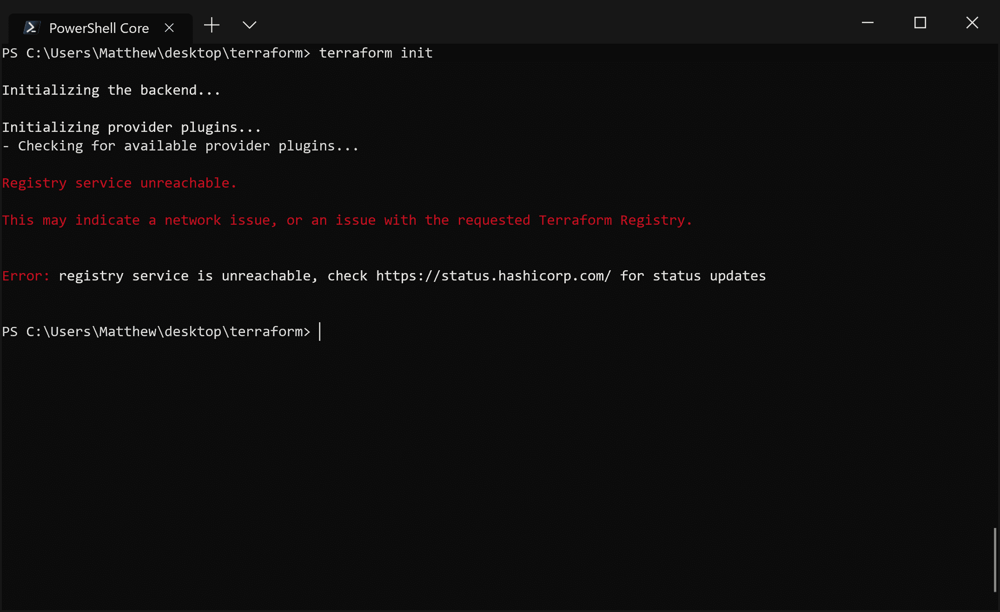
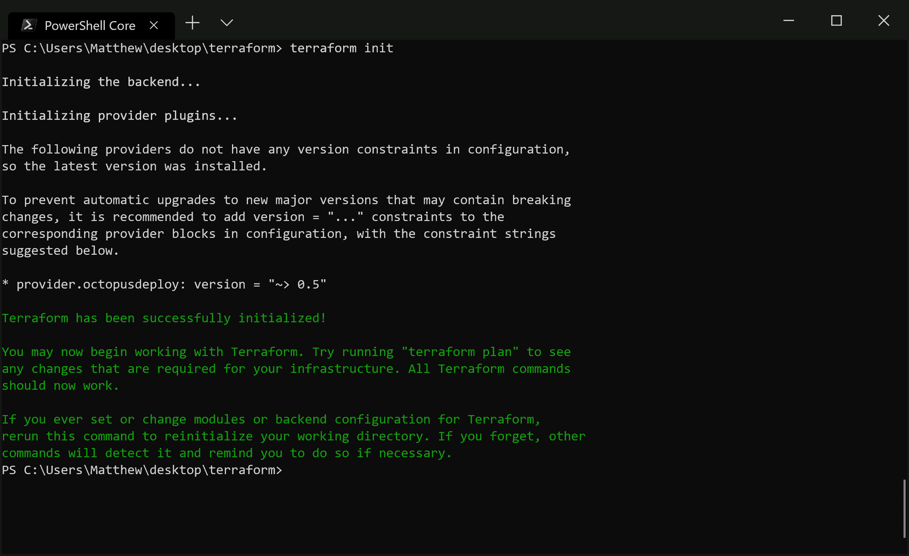
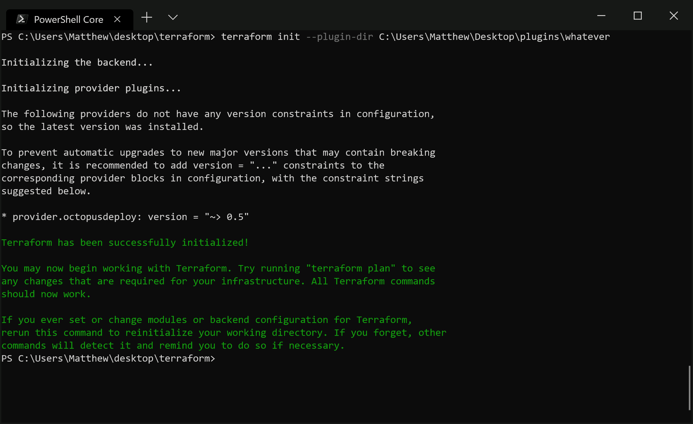

# 使用自定义 Terraform 插件的三种方法——Octopus Deploy

> 原文：<https://octopus.com/blog/using-custom-tf-plugins>

[](#)

Hashicorp GitHub 仓库中正在进行关于支持 Terraform 定制插件仓库的讨论。尽管现在只有官方的 Terraform 插件可以按需下载，而定制插件需要手动分发。

在本帖中，我们将看看从 Terraform 模板中访问自定义插件的三种不同方式。

## 示例项目

为了演示如何加载自定义插件，我们将创建一个非常简单的 Terraform 模板，它使用了 [Octopus 插件](https://github.com/OctopusDeploy/terraform-provider-octopusdeploy)。

为了添加对 Octopus provider 的依赖，我们在一个名为`octopus.tf`的文件中有以下代码:

```
provider "octopusdeploy" {
  address = "${var.address}"
  apikey  = "${var.apikey}"
  space   = "${var.space}"
} 
```

然后在名为`variables.tf`的文件中定义变量:

```
variable "address" {
  default = "http://myserver"
}
variable "apikey" {
  default = "API-YOURAPIKEYGOESHERE"
}
variable "space" {
  default = "Default"
} 
```

有了本地目录中的这两个文件，我们运行`terraform init`。结果是失败的，因为 Terraform 不知道如何获得 Octopus 插件。

[](#)

没有可用的插件，init 命令失败。

## 使插件全球可用

解决该错误的第一个选项是将插件文件保存到 Windows 中的`~\AppData\Roaming\terraform.d\plugins`或 Linux 和 MacOS 中的`~/.terraform.d/plugins`。

你必须小心文件名。对于 Windows，Octopus 插件将具有文件名`terraform-provider-octopusdeploy_v0.5.0.exe`，对于 Linux 和 MacOS，文件名将为`terraform-provider-octopusdeploy_v0.5.0`(用插件版本替换`0.5.0`)。任何其他文件名都将导致一个关于注册表服务不可访问的模糊错误。

[](#)

*一个意外的文件名会产生这个无用的错误。*

但是当您有正确的文件名时，`init`命令将成功完成。

[](#)

使用正确的文件名，init 命令成功。

## 将插件保存在模板旁边

下一个选项是将插件保存在模板文件旁边的`.terraform/plugins/<arch>`目录中。`<arch>`目录名与下表中的一个相匹配。同样，对于 Windows，插件的文件名必须是`terraform-provider-octopusdeploy_v0.5.0.exe`，对于 Linux 和 MacOS，插件的文件名必须是`terraform-provider-octopusdeploy_v0.5.0`。

| 操作系统（Operating System） | 拱门 |
| --- | --- |
| Windows 32 位 | `windows_386` |
| Windows 64 位 | `windows_amd64` |
| Linux 32 位 | `linux_386` |
| Linux 64 位 | `linux_amd64` |
| MacOS 64 位 | `darwin_amd64` |

## 插件目录选项

最后一个选项是将插件可执行文件保存在您选择的文件夹中，并使用`--plugin-dir`参数引用它。

当您使用`--plugin-dir`参数时，对目录名没有特殊要求。这里我调用了`terraform init --plugin-dir C:\Users\Matthew\Desktop\plugins\whatever`来证明目录名没有意义。

[](#)

plugin-dir 选项将获取任何包含正确插件的目录。

## 结论

在 Terraform 实现对定制插件库的支持之前，最终用户将不得不自己部署插件可执行文件。在这里，我们看到这些插件可以保存在:

*   `~\AppData\Roaming\terraform.d\plugins`用于 Windows 或`~/.terraform.d/plugins`用于 Linux 和 MacOS。
*   `.terraform/plugins/<arch>`傍模板文件。
*   任何被`--plugin-dir`选项引用的目录。