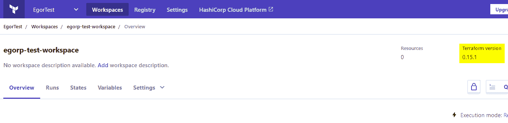
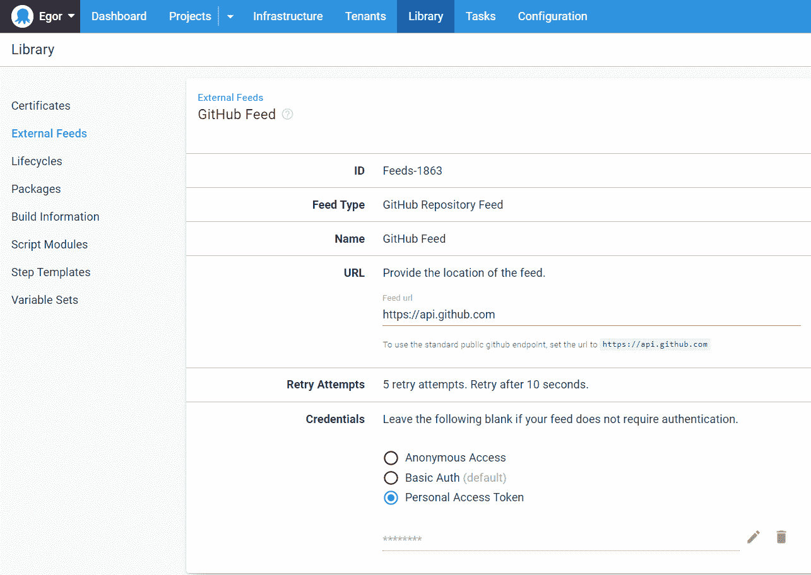
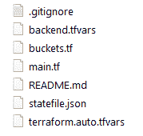
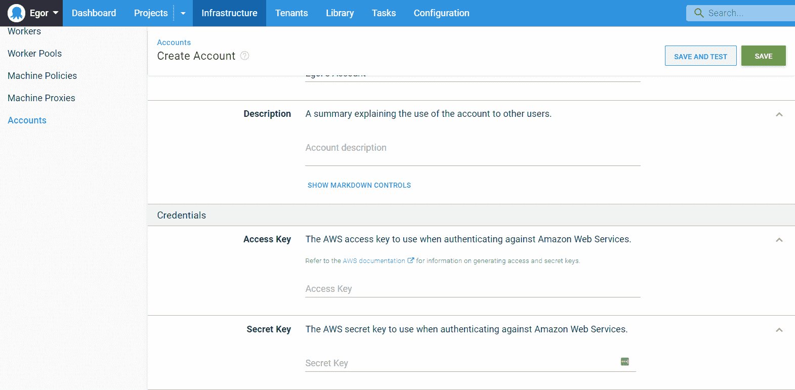
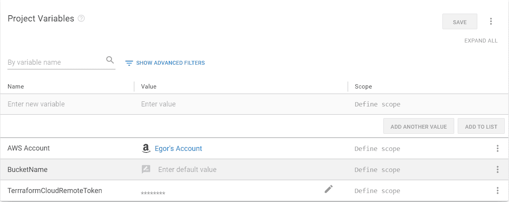
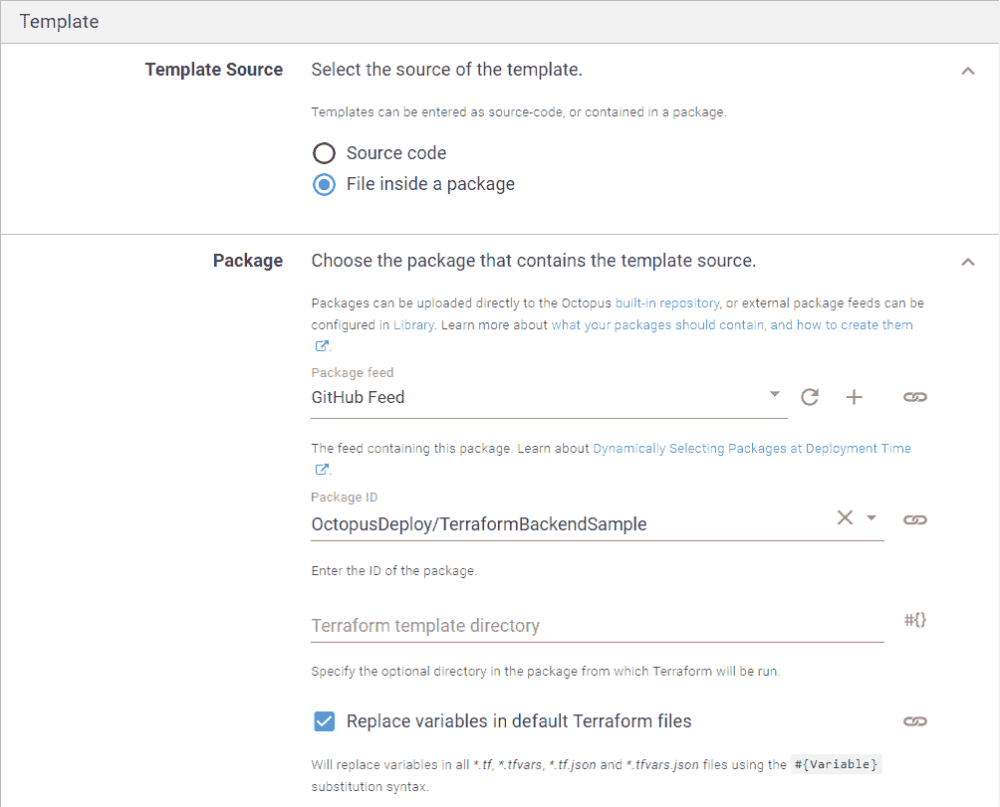
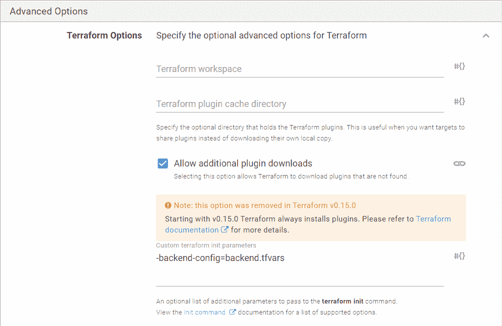
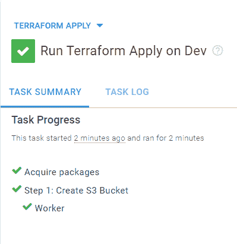
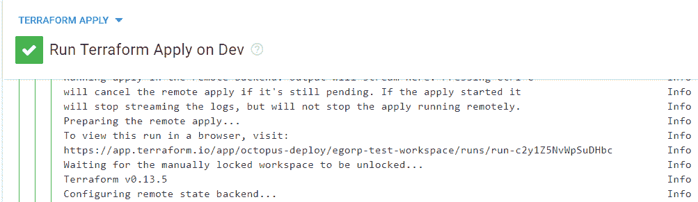

# 在 Octopus Deploy - Octopus Deploy 中使用带有 Terraform 的远程后端

> 原文：<https://octopus.com/blog/using-remote-backend-with-terraform>

Terraform 允许你用代码定义基础设施。在这篇文章中，我演示了如何使用 GitHub 库作为 Terraform 模板的源，并确保它们是受版本控制的。我还解释了如何在 Terraform 自己的云产品中存储工作区状态。

## 设置地形版本

在本地和通过 Octopus 从同一工作空间运行 Terraform 命令时要小心，因为不同版本的 Terraform 具有不兼容的状态格式。

如果您使用 Terraform Cloud，您可以通过 **设置➜常规** 指定您想要使用的 Terraform 的确切版本。

您可以使用 [tfenv 工具](https://github.com/tfutils/tfenv)来管理多个版本的 Terraform。

您还可以通过指定`required_version`来限制可用于工作区的 CLI 版本。

```
terraform {
  required_version = "= 0.13.5"
} 
```

详见[本期 GitHub](https://github.com/hashicorp/terraform/issues/23290)。

## 在 Terraform Cloud 中创建新的工作空间

首先，您需要在 [app.terraform.io](https://app.terraform.io/) 创建一个工作空间，作为您项目的后端。

如果您还没有帐户，请创建一个帐户。

在工作区向导中:

*   选择 **CLI 驱动的工作流程** -因为 Octopus 的 Terraform 步骤是使用 CLI 执行的。
*   将右上角的 Terraform 版本改为 Octopus 自带的 CLI 版本(本文发稿时为 0.11.15，或者查看 GitHub 中的[)。您可以通过提供自定义 Terraform CLI 可执行文件的完整路径(通过`Octopus.Action.Terraform.CustomTerraformExecutable`变量)或通过在](https://github.com/OctopusDeploy/Octopus.Dependencies.TerraformCLI/blob/master/build.cake#L32)[自定义 Docker 容器](https://octopus.com/docs/projects/steps/execution-containers-for-workers)中运行该步骤来使用不同版本的 Terraform。

[](#)

## 创建外部源

接下来，您需要配置 Octopus Deploy 来使用您的 GitHub 存储库作为[包提要](https://octopus.com/docs/packaging-applications/package-repositories/github-feeds)。

[](#)

## GitHub 知识库

在这篇文章中，我创建了一个[样本库](https://github.com/OctopusDeploy/TerraformBackendSample)，你可以很容易地为你的项目创建这个样本库。

存储库中有四个文件。您可以用不同的方式构建这些文件；但是要确保您的项目和后端变量是作为单独的文件保存的。

记住，提要中只有带标签的提交才可用，所以要向您的存储库添加一个标签。

**1。****main . TF**——在这里指定全局 Terraform 选项，比如后端选项和想要使用的工作空间。

```
terraform {
  backend "remote" {
    organization = "octopus-deploy"
    workspaces {
      name = "egorp-test-workspace"
    }
  }
}

variable "aws_access_key" {
  type = string
}

variable "aws_secret_key" {
  type = string
}

provider "aws" {
  region     = "us-east-1"
  access_key = var.aws_access_key
  secret_key = var.aws_secret_key
} 
```

**2。****buckets . TF**——对于这个例子，创建一个空的 S3 bucket。

```
variable "bucket_name" {
  description = "the bucket name to use"
}

resource "aws_s3_bucket" "mybucket" {
  bucket = var.bucket_name
  force_destroy = true
  acl    = "private"
  tags = {
      Name        = var.bucket_name
      Environment = "Dev"
  }
  cors_rule {
    allowed_headers = ["*"]
    allowed_methods = ["GET","PUT","HEAD","DELETE","POST"]
    allowed_origins = ["*"]
    max_age_seconds = 3000
  }
} 
```

**3。****terra form . auto . TF vars**-在这里存储其他文件中使用的变量。Octopus 在使用文件之前会执行[变量替换](https://octopus.com/docs/projects/variables/variable-substitutions)。

注意，这个文件必须有扩展名`.auto.tfvars`，否则远程后端不会使用它。

```
bucket_name = "#{BucketName}"
aws_access_key = "#{AWS Account.AccessKey}"
aws_secret_key = "#{AWS Account.SecretKey}" 
```

**4。** **backend.tfvars** -该文件被提供给`terraform init`命令的`-backend-config`参数。这允许您安全地存储敏感变量，而不是将这些值直接存储在存储库中。

```
token = "#{TerrraformCloudRemoteToken}" 
```

您的工作区现在应该如下所示:

[](#)

接下来，配置**应用 Terraform 模板**步骤，以使用我们的 GitHub 存储库并执行必要的变量替换，为您提供远程令牌和存储桶名称。

工作空间现在存储在 Terraform Cloud 中，因此您可以通过手动调用 Terraform CLI 来使用它，并将其作为 Octopus Deploy 中部署流程的一部分。

Terraform 将跟踪[工作区状态](https://www.terraform.io/docs/language/state/index.html)，并确保您的本地状态与真实的基础设施相匹配。

## 添加 AWS 帐户

导航至 **基础设施➜账户** ，添加您的 AWS 账户密钥和密码。

[](#)

## 添加变量

现在导航到左边的**变量**，添加您在`.tfvars`文件中定义的两个变量:

*   **AWS 账户**:选择**值**字段，**将类型**更改为 **AWS 账户**，然后选择您已经添加到**基础设施**选项卡的账户。
*   **BucketName** :您的 S3 桶的期望名称(如果您点击**打开编辑器**并勾选**提示输入值**，该值将必须在每次运行 runbook 时手动输入)。
*   **TerrraformCloudRemoteToken**:将类型更改为 **Sensitive** ，并为您的 Terraform 云工作空间粘贴机密令牌。

[](#)

## 创建操作手册

基础设施活动通常被定义为[运行手册](https://octopus.com/docs/runbooks)。这篇文章假设你熟悉在 Octopus 中创建[项目](https://octopus.com/docs/projects)，所以我将跳过这一部分。

1.  为您的项目创建一个操作手册。我把我的叫做`Terraform Apply`。
2.  在您的流程中添加一个**应用 Terraform 模板**步骤。

这个步骤模板很大，所以我将介绍最少的组件来完成它。

### 托管账户

*   **启用 AWS 账户整合**:选择**是**。
*   **使用 AWS 服务角色为 EC2 实例**执行:选择**否**。
*   **选择账户变量**:选择您在上一节创建的账户变量。
*   **区域**:输入默认使用的 AWS 区域，在我的例子中是`us-east-1`。

[T50](#)

### 模板部分

选择包中的**文件作为模板源，填写如下:**

*   **包提要**:选择您在第一步中创建的 GitHub 提要。
*   **包 ID** :输入你的仓库地址，在我这里是`OctopusDeploy/TerraformBackendSample`。

[](#)

其余的可以保留默认值。

### 高级选项

展开**地形选项**并指定以下内容:

*   **自定义地形初始化参数** : `-backend-config=backend.tfvars`

[](#)

点击**运行**在您选择的环境中运行操作手册。

[](#)

您可以在 Terraform 步骤的日志中找到 Terraform 云运行的 URL。

[](#)

现在，您已经使用共享的远程后端完成了部署。您可以在同一个工作区进行协作，并允许 Terraform 自动管理基础设施的状态。

## 结论

在这篇文章中，我演示了如何在 Octopus Deploy 中为您的 Terraform 工作区使用 Terraform 云后端。

愉快的部署！