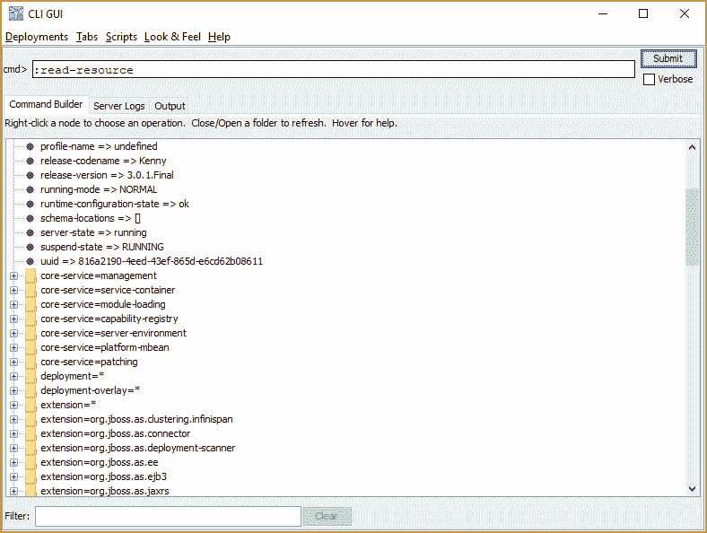

# 使用 WildFly CLI - Octopus 部署

> 原文：<https://octopus.com/blog/using-the-wildfly-cli>

[](#)

WildFly CLI 是一个强大的管理工具，它提供了交互式控制台和脚本功能。CLI 可用于查询和配置 WildFly 应用服务器的所有方面，在这篇文章中，我将从较高的层次来看如何使用 CLI。

## 登录

下载 WildFly 11，解压，运行`bin/standalone.sh`或者`bin\standalone.bat`。这将以默认配置开始，即将管理接口绑定到端口 9990 上的本地主机。

在另一个控制台中，使用`--connect`参数运行`bin/jboss-cli.sh`或`bin\jboss-cli.bat`。您将登录到 CLI:

```
$ ./jboss-cli.sh --connect
WARNING: An illegal reflective access operation has occurred
WARNING: Illegal reflective access by org.wildfly.security.manager.GetAccessibleDeclaredFieldAction (jar:file:/Users/matthewcasperson/Downloads/wildfly-11.0.0.Final/modules/system/layers/base/org/wildfly/security/elytron-private/main/wildfly-elytron-1.1.6.Final.jar!/) to field java.security.AccessControlContext.context
WARNING: Please consider reporting this to the maintainers of org.wildfly.security.manager.GetAccessibleDeclaredFieldAction
WARNING: Use --illegal-access=warn to enable warnings of further illegal reflective access operations
WARNING: All illegal access operations will be denied in a future release
[standalone@localhost:9990 /] 
```

从上面的输出示例中，我们可以看到发生了三件重要的事情。

首先，Java 9 已经报告了一些*非法反射访问*警告。这听起来很可怕，但这是因为 Java 9 模块系统引入了一些有意的变化(被称为[拼图](http://www.baeldung.com/project-jigsaw-java-modularity))。我希望随着时间的推移，这些警告会得到解决，但现在可以忽略它们。

其次，我们已经使用默认协议(remote+http)连接到默认主机(localhost)和端口(9990)。这些可以通过`--controller`选项手动指定:

```
./jboss-cli.sh --connect --controller=remote+http://localhost:9990 
```

CLI 接受许多不同的协议。默认情况下，可以使用`remote+http`或`http-remoting`。如果管理接口受 SSL 保护，则可以使用协议`remote+https`或`https-remoting`。

WildFly 的旧版本默认在`9999`上公开了一个本地管理端口，这需要协议`remoting`。WildFly 11 默认不公开本机管理端口。

第三，我们设法在没有提供任何凭证的情况下登录。这得益于一项名为[静默认证](https://access.redhat.com/documentation/en-us/red_hat_jboss_enterprise_application_platform/7.0/html-single/how_to_configure_server_security/#silent_authentication)的功能。

静默认证依赖于对`standalone/tmp/auth`或`domain/tmp/auth`目录的访问。这个想法是，如果一个用户有权访问这个目录，他们可能有权创建新的用户，所以静默认证给你访问权。

如果您拒绝对`auth`目录的写访问，静默认证将会失败，并且会提示您输入凭据。

## 环顾四周

CLI 的结构类似于文件系统，可以使用与 Bash 等 shell 中相同的命令进行导航。

`ls`命令将列出当前目录的内容:

```
[standalone@localhost:9990 /] ls
core-service                               subsystem                                  namespaces=[]                              release-version=3.0.8.Final                
deployment                                 system-property                            organization=undefined                     running-mode=NORMAL                        
deployment-overlay                         launch-type=STANDALONE                     process-type=Server                        runtime-configuration-state=ok             
extension                                  management-major-version=5                 product-name=WildFly Full                  schema-locations=[]                        
interface                                  management-micro-version=0                 product-version=11.0.0.Final               server-state=running                       
path                                       management-minor-version=0                 profile-name=undefined                     suspend-state=RUNNING                      
socket-binding-group                       name=matthews-mbp                          release-codename=Kenny                     uuid=ca421018-3df9-43e1-8b3f-ff843ebd38ee 
```

`pwd`命令显示当前工作目录:

```
[standalone@localhost:9990 /] pwd
/ 
```

`cd`命令将改变当前目录。通常目录会是一个类似于`subsystem`的类别和一个类似于`undertow`的实例，中间有一个等号:

```
[standalone@localhost:9990 /] cd subsystem=undertow
[standalone@localhost:9990 subsystem=undertow] ls
application-security-domain        server                             default-server=default-server      instance-id=${jboss.node.name}     
buffer-cache                       servlet-container                  default-servlet-container=default  statistics-enabled=false           
configuration                      default-security-domain=other      default-virtual-host=default-host 
```

`help`命令显示了可用命令的列表:

```
[standalone@localhost:9990 subsystem=undertow] help
Usage:

  jboss-cli.sh/jboss-cli.bat [--help] [--version]
                     [--bind=client_bind_address]
                     [--controller=(controller_alias | [protocol://][host][:port])]
                     [--connect] [--file=file_path]
                     [--commands=command_or_operation(,command_or_operation)*]
                     [--command=command_or_operation]
                     [--user=username --password=password]
                     [--properties=file_path]
                     [--no-local-auth]
                     [--error-on-interact]
                     [--timeout=timeout]
                     [--echo-command]
                     [--command-timeout=timeout]

 --help (-h)     - prints (this) basic description of the command line utility.
 ... 
```

`quit`命令将退出 CLI。

## 制表符结束

这些命令也有许多选项。查看这些选项的最简单方法是使用 tab complete。在这里，我输入了`ls`(末尾的空格很重要)，然后按 tab 键查看还有哪些选项可用:

```
[standalone@localhost:9990 subsystem=undertow] ls
--headers                    --resolve-expressions        application-security-domain  configuration                servlet-container            
--help                       -l                           buffer-cache                 server 
```

## 执行操作

在任何给定的目录中，都有许多可以执行的操作。操作以`:`字符开始。使用制表符结束，我们可以看到可用操作的列表:

```
[standalone@localhost:9990 http-listener=default] :
add                         map-clear                   read-attribute              read-children-types         remove                      
list-add                    map-get                     read-attribute-group        read-operation-description  reset-statistics            
list-clear                  map-put                     read-attribute-group-names  read-operation-names        undefine-attribute          
list-get                    map-remove                  read-children-names         read-resource               whoami                      
list-remove                 query                       read-children-resources     read-resource-description   write-attribute 
```

`:read-operation-names`操作显示与制表完成相同的列表:

```
[standalone@localhost:9990 http-listener=default] :read-operation-names
{
    "outcome" => "success",
    "result" => [
        "add",
        "list-add",
        "list-clear",
        "list-get",
        "list-remove",
        "map-clear",
        "map-get",
        "map-put",
        "map-remove",
        "query",
        "read-attribute",
        "read-attribute-group",
        "read-attribute-group-names",
        "read-children-names",
        "read-children-resources",
        "read-children-types",
        "read-operation-description",
        "read-operation-names",
        "read-resource",
        "read-resource-description",
        "remove",
        "reset-statistics",
        "undefine-attribute",
        "whoami",
        "write-attribute"
    ]
} 
```

可以在当前目录中执行操作(就像我们在上面的例子中所做的那样)，或者使用类似`/:read-operation-names`或`/subsystem=undertow:read-operation-names`的命令在特定目录上执行操作。

`:read-resource`操作是列出当前目录详细信息的常用方法。

WildFly 使用动态模型表示(DMR)格式表示对象。

```
[standalone@localhost:9990 http-listener=default] :read-resource
{
    "outcome" => "success",
    "result" => {
        "allow-encoded-slash" => false,
        "allow-equals-in-cookie-value" => false,
        "always-set-keep-alive" => true,
        "buffer-pipelined-data" => false,
        "buffer-pool" => "default",
        "certificate-forwarding" => false,
        "decode-url" => true,
        "disallowed-methods" => ["TRACE"],
        "enable-http2" => true,
        "enabled" => true,
        "http2-enable-push" => true,
        "http2-header-table-size" => 4096,
        "http2-initial-window-size" => 65535,
        "http2-max-concurrent-streams" => undefined,
        "http2-max-frame-size" => 16384,
        "http2-max-header-list-size" => undefined,
        "max-buffered-request-size" => 16384,
        "max-connections" => undefined,
        "max-cookies" => 200,
        "max-header-size" => 1048576,
        "max-headers" => 200,
        "max-parameters" => 1000,
        "max-post-size" => 10485760L,
        "no-request-timeout" => 60000,
        "proxy-address-forwarding" => false,
        "read-timeout" => undefined,
        "receive-buffer" => undefined,
        "record-request-start-time" => false,
        "redirect-socket" => "https",
        "request-parse-timeout" => undefined,
        "require-host-http11" => false,
        "resolve-peer-address" => false,
        "rfc6265-cookie-validation" => false,
        "secure" => false,
        "send-buffer" => undefined,
        "socket-binding" => "http",
        "tcp-backlog" => 10000,
        "tcp-keep-alive" => undefined,
        "url-charset" => "UTF-8",
        "worker" => "default",
        "write-timeout" => undefined
    }
} 
```

使用`:read-attribute`操作可以读取单个属性:

```
[standalone@localhost:9990 http-listener=default] :read-attribute(name=enabled)
{
    "outcome" => "success",
    "result" => true
} 
```

可以通过`:write-attribute`操作写入属性:

```
[standalone@localhost:9990 http-listener=default] :write-attribute(name=enabled, value=false)
{"outcome" => "success"} 
```

使用`:undefine-attribute`操作可以不定义属性:

```
[standalone@localhost:9990 http-listener=default] :undefine-attribute(name=write-timeout)
{"outcome" => "success"} 
```

## 特殊字符

要定义带空格的值，请用引号将字符串括起来:

```
[standalone@localhost:9990 /] /system-property=test:write-attribute(name=value, value="value with space")
{"outcome" => "success"}
[standalone@localhost:9990 /] /system-property=test:read-attribute(name=value)
{
    "outcome" => "success",
    "result" => "value with space"
} 
```

要使用引号，请用反斜杠将其转义:

```
[standalone@localhost:9990 /] /system-property=test:write-attribute(name=value, value="\"quoted value with space\"")
{"outcome" => "success"}
[standalone@localhost:9990 /] /system-property=test:read-attribute(name=value)
{
    "outcome" => "success",
    "result" => "\"quoted value with space\""
} 
```

反斜杠本身用反斜杠转义:

```
[standalone@localhost:9990 /] /system-property=test:write-attribute(name=value, value="\"quoted value with space and a backslash \\\"")
{"outcome" => "success"}
[standalone@localhost:9990 /] /system-property=test:read-attribute(name=value)
{
    "outcome" => "success",
    "result" => "\"quoted value with space and a backslash \\\""
} 
```

## 重新加载服务器

更改某些设置需要重新加载服务器。您可以通过读取根目录中的`server-state`属性来检查服务器的状态。在本例中，我们有一些需要重新加载的设置:

```
[standalone@localhost:9990 /] :read-attribute(name=server-state)
{
    "outcome" => "success",
    "result" => "reload-required",
    "response-headers" => {"process-state" => "reload-required"}
} 
```

`:reload`操作将重新加载服务器:

```
[standalone@localhost:9990 /] :reload
{
    "outcome" => "success",
    "result" => undefined
} 
```

## 批处理操作

WildFly 中的一些操作需要作为一个原子单元运行，或者您可能希望所有命令作为一个整体成功或失败。`batch`和`run-batch`命令提供该功能。

在批处理模式下，一个`#`字符会出现在提示中。

```
[standalone@localhost:9990 /] batch
[standalone@localhost:9990 / #] /subsystem=undertow/server=default-server/http-listener=default:undefine-attribute(name=write-timeout)
[standalone@localhost:9990 / #] /subsystem=undertow/server=default-server/http-listener=default:write-attribute(name=enabled, value=false)
[standalone@localhost:9990 / #] run-batch
The batch executed successfully 
```

`discard-batch`命令将放弃所有批处理命令并退出批处理模式:

```
[standalone@localhost:9990 /] batch
[standalone@localhost:9990 / #] /subsystem=undertow/server=default-server/http-listener=default:write-attribute(name=enabled, value=false)
[standalone@localhost:9990 / #] discard-batch
[standalone@localhost:9990 /] 
```

`list-batch`命令将显示未决的批处理命令，而`clear-batch`命令将清除任何批处理命令，但使您处于批处理模式:

```
[standalone@localhost:9990 /] batch
[standalone@localhost:9990 / #] /subsystem=undertow/server=default-server/http-listener=default:write-attribute(name=enabled, value=false)
[standalone@localhost:9990 / #] list-batch
#1 /subsystem=undertow/server=default-server/http-listener=default:write-attribute(name=enabled, value=false)
[standalone@localhost:9990 / #] clear-batch
[standalone@localhost:9990 / #] list-batch
The batch is empty.
[standalone@localhost:9990 / #] discard-batch 
```

## 备份配置

您可能希望在进行任何更改之前备份当前配置。这可以通过`:take-snapshot`操作来实现。

此操作的结果会告诉您备份保存的位置:

```
[standalone@localhost:9990 /] :take-snapshot
{
    "outcome" => "success",
    "result" => "C:\\Users\\matth\\Downloads\\wildfly-11.0.0.Final\\wildfly-11.0.0.Final\\standalone\\configuration\\standalone_xml_history\\snapshot\\20171108-082107378standalone.xml"
} 
```

## 运行 CLI 脚本

CLI 命令可以添加到脚本文件中，并以非交互方式运行。

例如，将这个脚本保存到名为`test.cli`的文件中:

```
connect
batch
/subsystem=undertow/server=default-server/http-listener=default:undefine-attribute(name=write-timeout)
/subsystem=undertow/server=default-server/http-listener=default:write-attribute(name=enabled, value=false)
run-batch 
```

然后可以使用`--file`命令行选项运行它:

```
./jboss-cli.sh --file=test.cli 
```

在这个测试脚本中，我们使用`connect`命令从脚本内部连接到 WildFly 实例，而不是传递`--connect`命令行选项。

要在 Windows 中运行`jboss-cli.bat`文件时禁用`Press any key to continue ...`提示符，请将`NOPAUSE`环境变量设置为`true`:

```
PS C:\Users\matth\Downloads\wildfly-11.0.0.Final\bin> $env:NOPAUSE="true"
PS C:\Users\matth\Downloads\wildfly-11.0.0.Final\bin> .\jboss-cli.bat --connect
[standalone@localhost:9990 /] quit
PS C:\Users\matth\Downloads\wildfly-11.0.0.Final\bin> 
```

## 流量控制语句

CLI 支持 if/else 和 try/catch/finally 之类的流控制语句。

例如，您可以将以下代码添加到 CLI 脚本中，如果尚未定义，它会将系统属性`test`设置为`true`:

```
if (outcome != success) of /system-property=test:read-resource
    /system-property=test:add(value=true)
end-if 
```

您也可以在交互模式下运行相同的命令:

```
[standalone@localhost:9990 /] if (outcome != success) of /system-property=test:read-resource
[standalone@localhost:9990 /] /system-property=test:add(value=true)
[standalone@localhost:9990 /] end-if
{"outcome" => "success"} 
```

try/catch/finally 流控制的工作方式与 Java 中的非常相似。下面将尝试添加数据源，如果出现异常，将移除并添加数据源。最后，数据源被启用:

```
try
  /subsystem=datasources/data-source=myds:add(connection-url=xxx,jndi-name=java:/myds,driver-name=h2)
catch
  /subsystem=datasources/data-source=myds:remove
  /subsystem=datasources/data-source=myds:add(connection-url=xxx,jndi-name=java:/myds,driver-name=h2)
finally
  /subsystem=datasources/data-source=myds:enable
end-try 
```

## 多行命令

通过用一个`\`字符结束每一行，命令可以分成多行:

```
[standalone@localhost:9990 /] /subsystem=datasources/data-source=myds:add( \
>   connection-url=xxx, \
>   jndi-name=java:/myds, \
>   driver-name=h2)
{"outcome" => "success"} 
```

## 运行 CLI GUI

CLI 有一个 GUI 模式，该模式提供了一个类似文件浏览器的界面，用于在 WildFly 设置目录结构中导航:

```
./jboss-cli.sh --gui 
```

[](#)

## 结论

在这篇文章中，我们从较高的层次上了解了 CLI 的工作原理以及您可以用它做些什么。如果您对 Java 应用程序的自动化部署感兴趣，请尝试免费的开始版本的 [Octopus Deploy](https://octopus.com/free) ，并看看[我们的文档](https://octopus.com/docs/deployments/java/deploying-java-applications)。