# 变量编辑器重新设计- RFC - Octopus 部署

> 原文：<https://octopus.com/blog/variable-editor-update-rfc>

在 4.0 版本中，我们计划彻底检查变量编辑器。这是我们最重要的[用户意见](https://octopusdeploy.uservoice.com/forums/170787-general/suggestions/7192251-improve-variables-ui)建议之一，感谢所有提供如何改进变量编辑器想法的用户。

根据收到的反馈，我们对变量编辑器第一版的目标是通过加入一些新功能，使表格编辑体验像预期的那样工作:

*   为一个变量提供不同范围的多个值
*   在弹出编辑器中为变量添加描述，将鼠标悬停在表格中的注释图标  上进行查看
*   添加变量时，能够在一个范围内输入多个值。

## 用户场景

在第一个版本中，我们着重于为四种用户场景提供解决方案。这些涵盖了 Octopus 团队的共同主题和我们用户的建议。

*   用户正在输入一个或两个环境范围内的数百个单个文本变量。他们需要通过使用键盘来快速完成这项工作。

*   用户需要添加大量代码作为变量，并且需要将其复制并粘贴到一个大的文本字段中。他们被要求给每个变量一个描述，并将其范围扩展到租户标签集。

*   为用户提供了每个环境的用户名和密码列表。用户希望能够首先选择环境，然后向该环境中添加多个值，而不是一次添加一个值并分别确定它们的范围。

*   用户希望查看特定范围配置的范围内有哪些值，以查看是否有任何重复。

**注意**还有一些很棒的附加功能建议。但是我们不能一下子把它们都包括进来，因为我们希望变量编辑器的第一个版本集中于提高基本的可用性，并为更高级的特性创建一个坚实的平台。

## 新的变量编辑器外观

变量编辑器将继承新的 4.0 UI，并保持高级概念，如在变量类型之间切换、过滤能力以及仅查看仅在库中可编辑的库变量集和公共模板。

引入了新的 UI 模式来帮助更好地过滤和显示信息:

*   默认显示的高级过滤器，可以通过过滤器图标  隐藏

*   能够通过带有警告的变量进行过滤

*   展开面板，现在可以看到哪些变量和公共变量模板属于哪个变量集

*   源图标有助于区分变量类型。

**项目变量**

[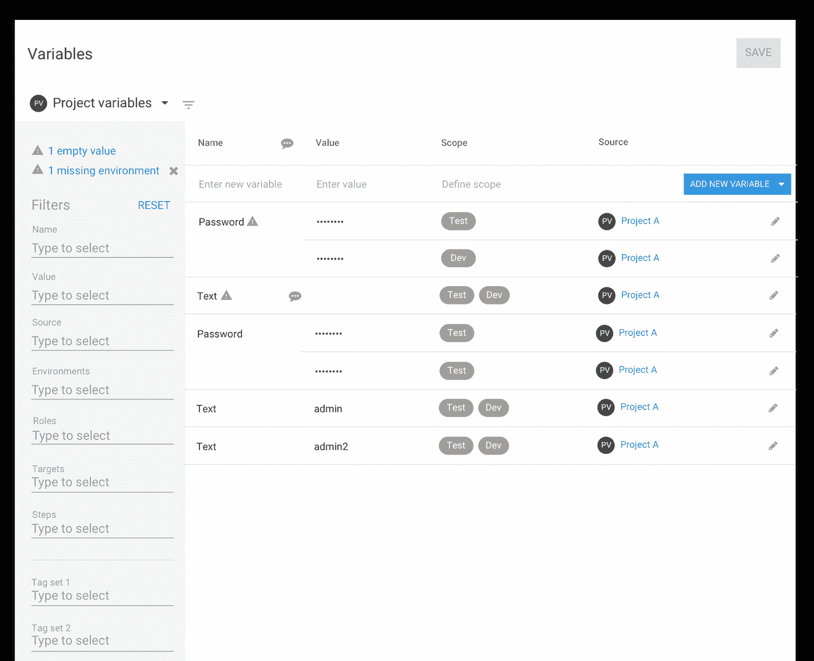](#)

**项目变量模板**

[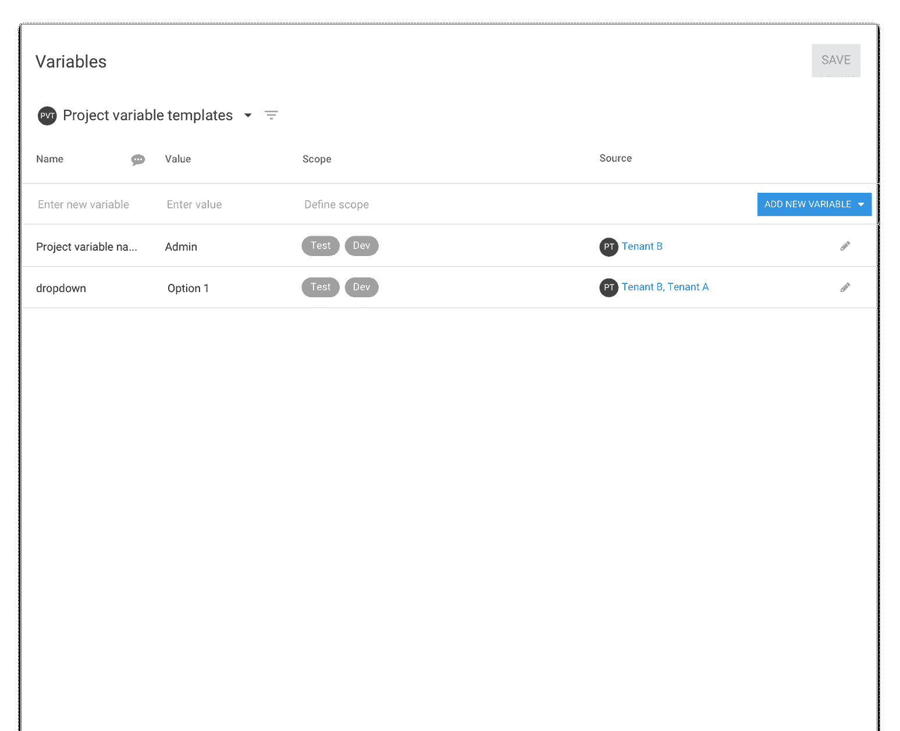](#)

**通用变量模板**

[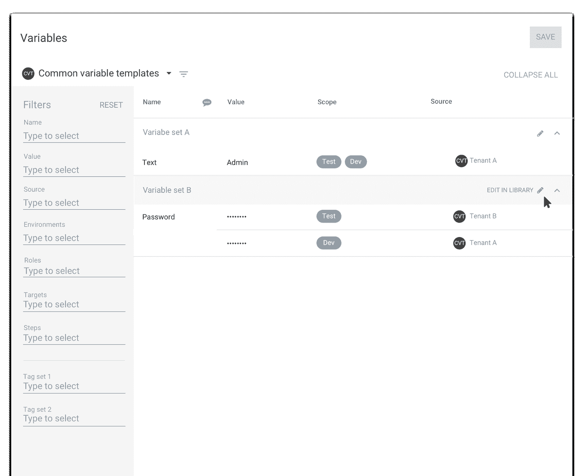](#)

**库变量集**

[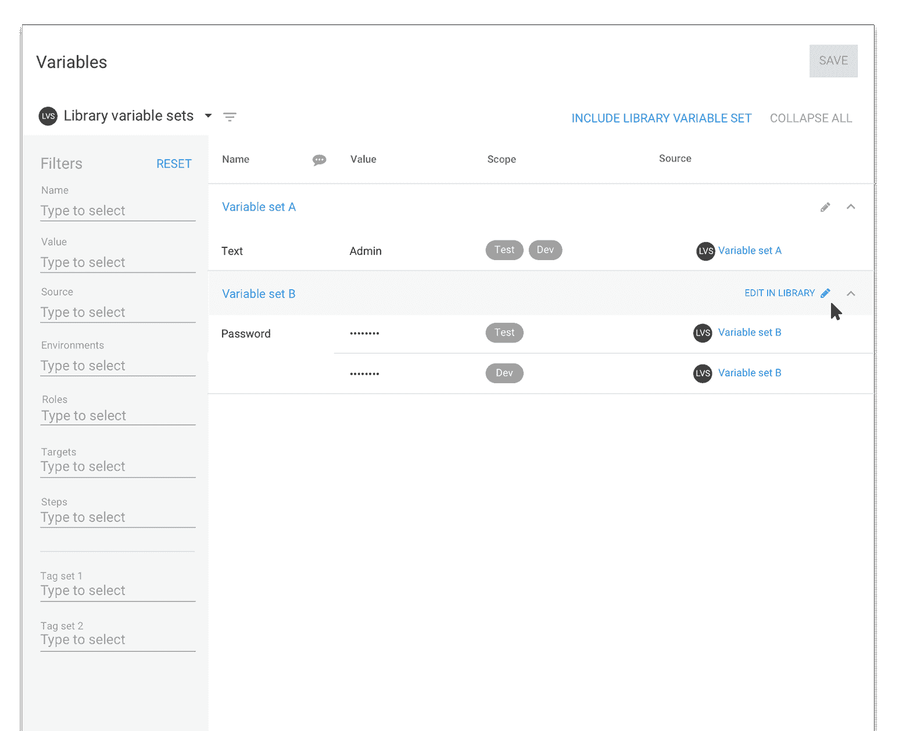](#)

**查看所有变量**

[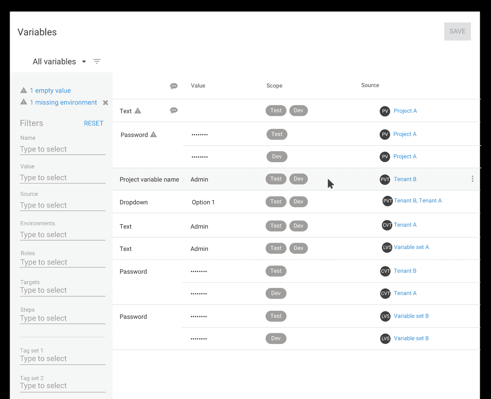](#)

## 添加新变量

当前变量编辑器表的底部有一个新的变量行。许多用户可能有很多条目，这导致这个空行出现在屏幕之外。我们已经将空的 add 行移到了表的顶部，这样无论有多少个变量，添加变量都变得简单快捷。您可以单击名称单元格开始添加值，或者单击“添加新变量按钮”创建新行。下面的视频显示了添加新变量。

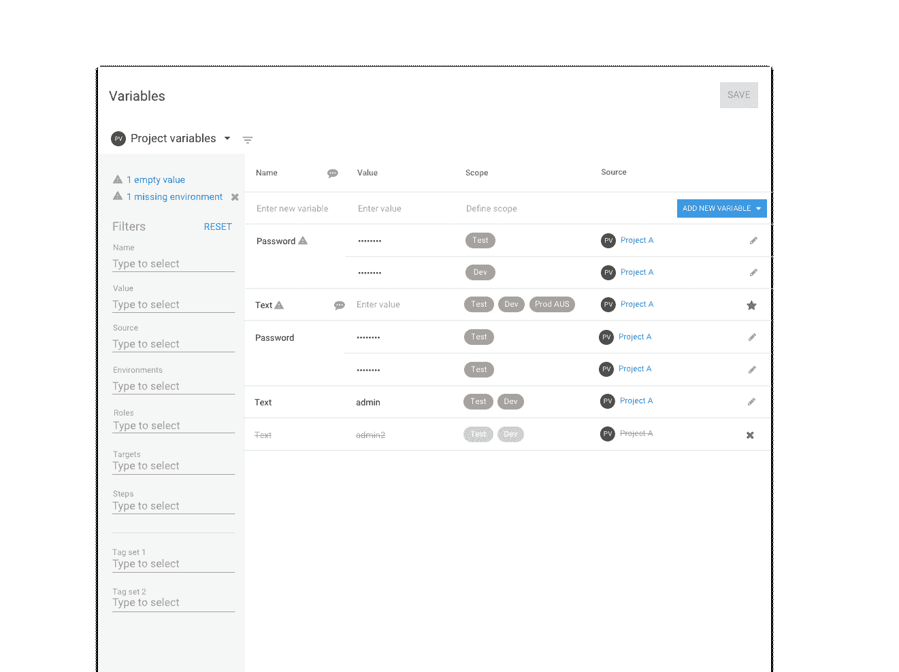

## 向范围添加多个值

我们计划在环境、角色、目标、步骤或租户标签集的范围内添加多个值。这个新功能将使为新环境或新角色添加一组变量变得更加容易。

此操作将在“添加新变量”按钮上显示为下拉菜单“添加多个值”。添加体验将发生在弹出编辑器中，用户首先定义范围，然后添加多个值。

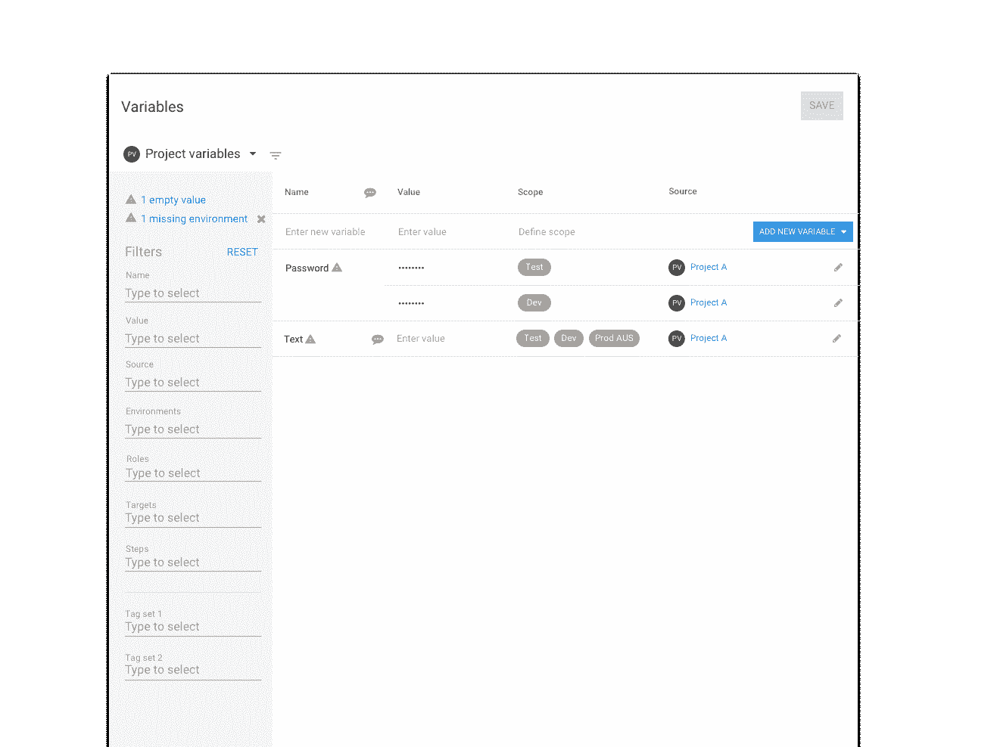

## 表格编辑体验

我们对新变量编辑器的目标是让它成为一个无缝的表格编辑体验，让用户在最小范围内输入简单变量。我们希望确保用户可以仅通过键盘导航表格，并可以选择使用鼠标。

以下是我们计划使用的常规键盘控件和快捷键。

### 键盘控制

Tab

- Moves the cell focus through the row from left to right, top to bottom - Moves the selector controls focus from top to bottom

Enter

- Adds another variable

- Performs the action of a selected button

- Selects item in dropdown list

Arrow up and down

- Moves the focus through a dropdown list

- Moves the focus from the form field to the Open editor link in the edit dialog

- Moves the focus of the rows in the variable table

esc

- collapses dropdown and puts a cell in selected state

- exist edit/add mode if a cell is in a selected state

- Esc moves through the states until out of edit mode

Typing

Will activate any selectors/dropdowns

ctl+enter

selects multiple items in a drop down

### 快捷指令

ctl+e

Opens editor popup

ctl+o

Creates a new variable

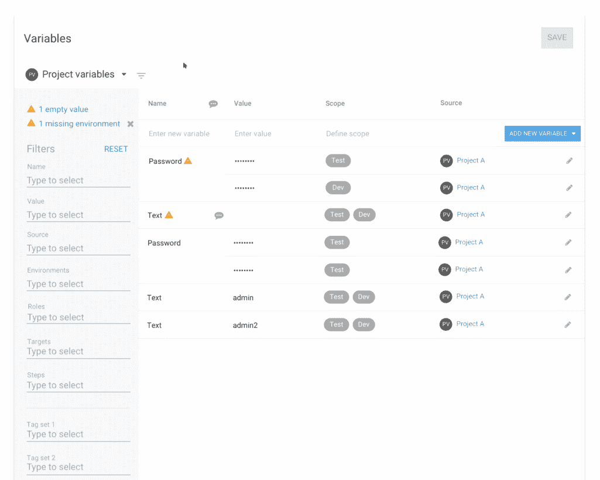

## 行操作

行操作将在悬停时显示为行末尾的溢出菜单。这将替换第一个单元格上的当前右键单击功能。

[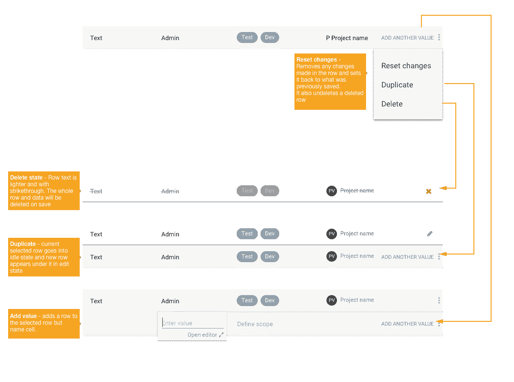](#)

弹出式编辑器用于显示高级选项和更大的文本字段，以便添加或编辑变量。编辑现有变量时，可以随时打开弹出编辑器。我们希望确保如果用户只使用键盘输入变量，弹出窗口仍然可以通过链接和键盘快捷键(ctl+o)访问。使用与表格编辑器相同的键盘命令在弹出编辑器中导航。

弹出编辑器中的高级设置包括:

*   向变量添加描述的能力
*   用于添加代码编辑器的较大值文本字段
*   提示值
*   租户标签集

[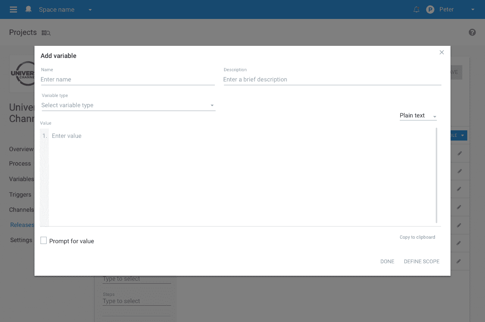](#)

[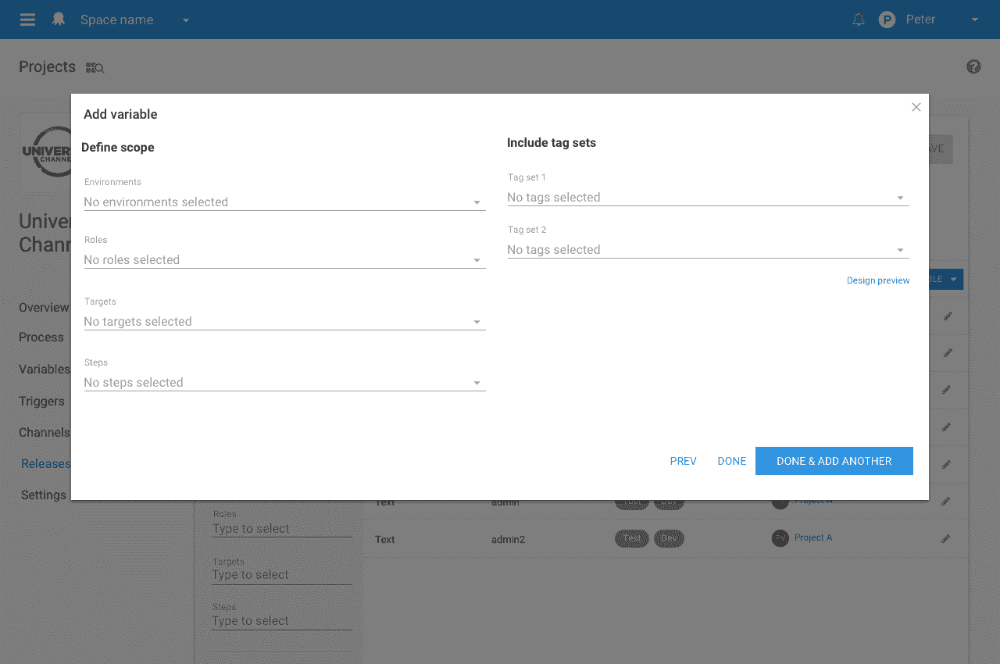](#)

## 性能和浏览器支持

作为 4.0 的一部分，我们希望充分利用自 2013 年我们上次重新设计以来网络取得的进步。这意味着 Octopus 4.0 将只支持 Internet Explorer (IE) 11 及以上版本。4.0 重写也将提高性能，允许快速加载和过滤大量数据。请阅读我们的 GitHub 问题，了解更多关于 [Octopus 4.0 浏览器支持](https://github.com/OctopusDeploy/Issues/issues/3457)的信息。

## 反馈

我们认为我们上面概述的将改进我们添加变量的方式，并为我们向编辑器添加更多高级功能提供一个更好的平台。

我们希望听到您对变量编辑器发布计划的反馈。我们想问的是，如果你只是想提供一些快速反馈，请在下面的评论中提出。如果有更大的事情需要更详细的讨论，请在我们的 GitHub 规范报告[变量编辑器重新设计规范报告](https://github.com/OctopusDeploy/Specs/blob/master/VariableEditorRedesign/index.md)上提出问题。