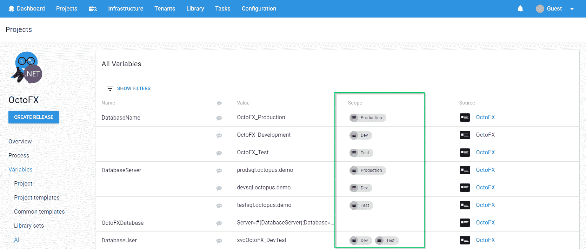

# 可变特异性和复杂性- Octopus 部署

> 原文：<https://octopus.com/blog/variable-specificity-and-complexity>

Octopus 允许变量作用于不同的环境、角色或机器。这很有用的一个简单例子是，根据您是部署到测试环境还是生产环境，数据库连接字符串有不同的值。



变量的范围可以是多个值，因此在给定的场景中决定哪个变量是合理的是一个非常棘手的过程。我们称之为**可变特异性**，它的工作原理有点像 [CSS 特异性](https://developer.mozilla.org/en-US/docs/Web/CSS/Specificity)。

例如，假设我们有这组变量:

```
DatabaseName = DB01 (Environment: Staging, Production)
DatabaseName = DB02 (Environment: Staging)
DatabaseName = DB03 (Environment: Production) 
```

在这种情况下，如果我们部署到生产环境，要使用的正确值可能是`DB01`或`DB03`，因为两者匹配。有时候变量作用域的结果是不确定的，我认为这很直观。

每个范围级别都有不同的优先级:

*   作用域为机器的变量比作用域为角色的变量更具体
*   ...这比环境范围内的变量更具体
*   ...这比没有范围的变量更具体

这通常也有直观的意义——机器比环境更细粒度，因此范围应该优先。

在 Octopus 中计算变量的特异性如下:

```
public int Rank()
{
    var score = 0;
    score += Score(ScopeField.Private, 10000000);
    score += Score(ScopeField.User, 1000000);
    score += Score(ScopeField.Action, 100000);
    score += Score(ScopeField.Machine, 10000);
    score += Score(ScopeField.TargetRole, 1000);
    score += Score(ScopeField.Role, 100);
    score += Score(ScopeField.Environment, 10);
    score += Score(ScopeField.Project, 1);
    return score;
} 
```

如果多个变量与一个场景相匹配，我们只需取排名第一的变量。较高优先级的项目在较低优先级的项目之前提高等级。例如，在生产中，我使用一个数据库，但是我的报告服务应该总是使用不同的数据库:

```
DatabaseName = DB01 (no scope)
DatabaseName = DB02 (Environment: Staging)
DatabaseName = DB03 (Environment: Production)
DatabaseName = DB04 (Role: Reporting)
DatabaseName = DB05 (Role: Reporting; Environment: Production) 
```

这很有效——我的报告应用程序甚至在准备阶段也会得到`DB04`,因为角色比环境更具体。但是在生产中，我可以通过在两个层次上界定它来强制它。

容易混淆的一个地方是涉及角色的多个匹配。举第一个例子，但让我们考虑角色，而不是环境:

```
DatabaseName = DB01 (Role: WebServer, AppServer)
DatabaseName = DB02 (Role: WebServer)
DatabaseName = DB03 (Role: AppServer) 
```

现在，我不能一次部署到多个环境，所以很明显，在第一个例子中，这两个值都适用。但是我*可以*拥有一台属于多个角色的机器。在我的开发环境中，也许我的预算仅限于单机，所以它既是一个`WebServer`又是一个`AppServer`。

在那个例子中，我的`WebServer+AppServer`机器应该得到哪个值？如果我调查 100 个人，我怀疑大多数人会期待`DB01`。换句话说，当多个值匹配时，他们期望应用一个**和**关系，并且每个匹配都应该有助于排名。

但是在这种情况下会发生什么呢？

```
DatabaseName = DB01 (Role: WebServer, AppServer)
DatabaseName = DB02 (Role: WebServer)
DatabaseName = DB03 (Role: AppServer; Environment: Production) 
```

如果我在生产中部署到一台`WebServer+AppServer`机器上，我应该获得什么价值？如果我对 100 个人进行民意测验，我会说一半人会期待`DB01`，一半人会期待`DB03`。不像前面的例子，没有直观的方法来解释这些。如果你花了几个小时来思考这个问题，它可能对你有意义，但是对下一个必须维护它们的人有意义吗？

像这样的决定是棘手的。我的希望是，不要试图让特殊性规则*太过*聪明，这只会鼓励人们找到更好的方式来为部署建模(也许环境比角色组合更有意义)，而不是依赖于很少有人一眼就能理解的复杂矩阵。