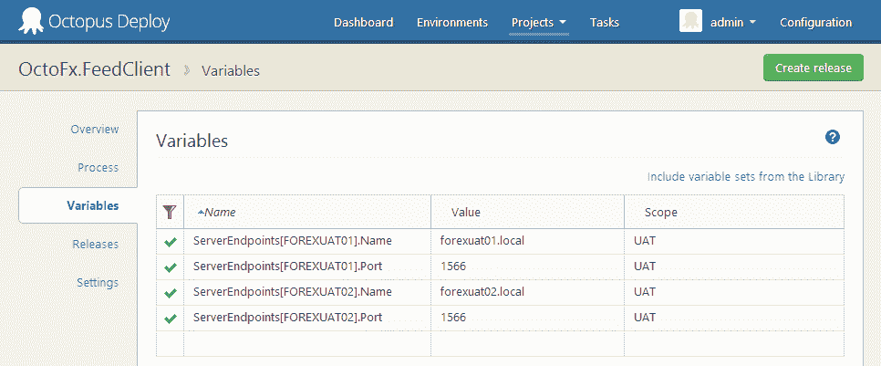
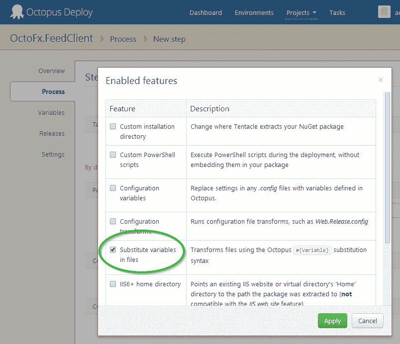
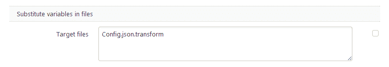
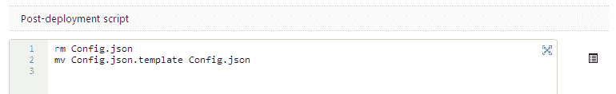
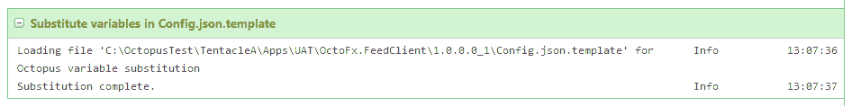

# Octopus 2.3 - Octopus Deploy 文件中的变量替换

> 原文：<https://octopus.com/blog/variable-substition-in-files>

Octopus 对变量提供了丰富的支持，这些变量的作用范围可以是特定的机器、环境和角色。在部署时，通过将变量名与`<appSetting>`和`<connectionString>`元素的名称相匹配，这些也可以被替换到 XML *App.config* 和 *Web.config* 文件中。

在 Octopus 2.3 中，我们将它扩展到其他类型的文件，使用在整个应用程序中工作的相同的变量语法。

我们的示例应用程序是一个提要监控服务，它在一个 JSON 文件中保存了一个目标服务器列表，该文件是:

```
{
  "Servers": [{
    "Name": "localhost",
    "Port": 1567
  }]
}

```

部署应用程序时，我们希望根据目标部署环境配置列表。UAT 环境中的服务器被称为 *FOREXUAT01* 和 *FOREXUAT02* 。



我们隐式地建立了一个包含两个条目的`ServerEndpoints`集合，UAT 环境中的每台服务器都有一个条目。

我们可以在部署时运行的模板文件中迭代这些。为了不妨碍开发，我们称它为 *Config.json.template* 。

```
{
  "Servers": [
    #{each server in ServerEndpoints}
      {
        "Name": "#{server.Name}",
        "Port": #{server.Port}
      }#{unless Octopus.Template.Each.Last},#{/unless}
    #{/each}
  ]
}

```

您可能熟悉简单形式的`#{Variable}`语法。这个例子使用了一些在 Octopus 2.0 中增加的新特性，包括`#{each}`和`#{unless}`。

随着 *Config.json.template* 包含在我们应用的 NuGet 包中，下一步是启用部署特性。



该特性易于配置，接受 Octopus 将在其中执行变量替换的文件列表。



由于我们使用了与目标文件不同的模板名称，我们还将添加一个 PowerShell 片段，用模板文件的内容替换原来的 *Config.json* 。



该模板现在将作为我们部署过程的一部分运行。



生成的 JSON 文件是(空白被稍微清除了一点):

```
{
  "Servers": [
    {
      "Name": "forexuat01.local",
      "Port": 1566
    },
    {
      "Name": "forexuat02.local",
      "Port": 1566
    }
  ]
}

```

愉快的部署！