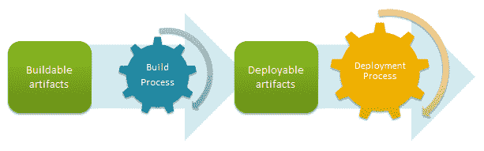

# Wanted:一种通用的应用程序打包格式。网络-章鱼部署

> 原文：<https://octopus.com/blog/wanted-universal-packaging-format>

最简单地说，任何自动化部署或连续交付解决方案的构建块都是:

分解一下，我称之为“可构建的工件”通常指源代码，它应该存放在版本控制系统中。一个**构建过程**获取那些工件，并产生新的工件:准备好用一个**部署过程**部署的工件。这些工件通常是二进制文件，通常被打包成某种格式，并标有解释内容的元数据。

将构建过程与部署过程分离的想法非常重要。在他们的书[连续交付](http://www.amazon.com/Continuous-Delivery-Deployment-Automation-Addison-Wesley/dp/0321601912)中，Jez 和 David 认为你应该“只构建你的二进制文件一次”:

> 许多构建系统使用版本控制系统中保存的源代码作为许多步骤的规范源。代码将在不同的上下文中重复编译:在提交过程中，再次在验收测试时，再次为容量测试，并且通常为每个单独的部署目标编译一次。每次编译代码，你都有引入一些差异的风险。稍后阶段安装的编译器版本可能与您用于提交测试的版本不同。您可能会获得某个第三方库的不同版本，而这并不是您想要的。甚至编译器的配置也可能改变应用程序的行为。我们已经看到这些来源中的每一个都进入了生产阶段。

## 史前古器物

一旦我们构建了代码，我们就有了一组可以部署的二进制文件。如果我们要多次重新部署这些二进制文件，**我们需要以一种我们可以轻松返回并找到它们的方式存储它们**。毫无疑问，在您的旅途中，您会遇到一个带有文件夹的文件共享，看起来像这样:

*   WebApp 的副本
*   WebApp 的副本(2)
*   WebApp
*   WebApp1
*   WebApp-2012-06-19
*   web app-制作
*   WebApp-Mike(不要删除这是生产)

如果我们希望接近可重复的、自动化的、低风险的部署，适当地维护我们的可部署工件是必不可少的。我们需要考虑这些工件是如何构造的。

也许最常见的工件格式是将文件压缩到一个归档中，并用日期或版本号标记文件名。例如，这将是上述问题的一个更好的解决方案:

*   WebApp-1.0.0.zip
*   WebApp-1.0.1.zip
*   WebApp-1.0.2.zip
*   WebApp-1.0.3.zip

一个工件可能只包含部署所需的文件。然后，可以使用版本号或时间戳来找到关于内容的更多信息，例如，工件中包含的变更列表、构建者和时间、修复的问题等等。

在理想的情况下，这些“元数据”可以存储在工件内部，因此工件是自描述的。这就是 NuGet *之类的规格。nupkg* 文件格式——它们不仅包含部署所需的原始二进制文件/文件，还包含描述它们的[元数据。这就是为什么我们称它为**打包格式**而不是“只是另一个 zip 文件”。](http://docs.nuget.org/docs/reference/nuspec-reference)

Windows 平台上常见的自描述工件的例子有 NuGet 包和 Windows installer MSI 文件。

## 工件仓库

一旦我们有了这些自我描述的工件，下一个问题是，我们把它们放在哪里？在连续交付手册中，这个地方被称为一个**工件库**:

> 它是一个关键的资源，为您的每个候选版本存储二进制文件、报告和元数据。

有很多选择，从文件共享到 FTP 服务器到 NuGet 服务器到像 Nexus 这样的专用产品。

工件存储库的目的是:

*   提供一个单独的地方来保存你的工件
*   提供一种快速的方法来根据版本查找和检索工件

想象一个企业，每天都在构建数百个应用程序，生产数千个工件。找到和检索正确工件的能力对于部署的成功至关重要。

## 这如何应用于？净空间

当我设计 Octopus Deploy 时，我真的想坚持将构建和部署分开的目标；Octopus 是一个自动部署系统，而不是自动构建系统。所以我们消费人工制品的方式非常重要。

现在，想象一个每天都在构建大量项目的环境:

*   WPF 应用
*   ASP。将在内部网运行的. NET web 应用程序
*   Azure 云服务
*   Azure 网站
*   Windows 服务
*   Node.js 应用程序

哪种工件格式最适合打包所有这些应用程序类型？

ASP。通过右击并选择“打包”或“发布”,可以将. NET 应用程序打包到 Visual Studio 的 MSDeploy 包中。他们也可以通过使用一系列咒语和山羊献祭从命令行打包。不过，MSDeploy 包的元数据并不丰富(例如，包格式中没有版本号)。

Azure 云服务被打包成。cspkgs，另一种基于 ZIP 的文件格式，元数据有限。Windows 服务和桌面应用程序可以打包成 MSI。

不幸的是，所有这些格式都有问题。MSI 有版本号，但是对于许多应用程序类型来说并不理想。MSDeploy 包对于 ASP.NET 应用程序来说很棒，但是没有简单的方法为桌面应用程序创建它们，而且它们没有版本号。Azure 云服务包再次缺少版本号。

NuGet 是允许 Octopus 部署发生的突破，因为它提供了三样东西:

*   一种自描述的包格式，具有非常丰富的元数据
*   使它们创建起来相对快速和简单的工具(不像——我肯定有些人不同意——MSI 或 MSDeploy 包)
*   一个标准的存储库接口，易于查询以查找工件

从概念上讲，任何应用程序都可以打包成一个 NuGet 包，并存储在一个 NuGet 存储库中。我看到 TeamCity 正在努力成为一个原生的 NuGet 库，并且我假设其他构建系统有一天也会这样做(除了 TFS，它总是最后一个)。

但是 NuGet 包也有自己的问题。这些约定主要是为了分发开源库，而不是需要运行的应用程序，所以打包应用程序可以打破这些约定。当涉及到较大的归档时，他们还会遇到性能问题。

为应用程序创建 NuGet 包也很难。虽然您可以右键单击并将 ASP.NET web 应用程序打包为 MSDeploy 包，但不能以这种方式创建 NuGet 包。像 TFS 这样的构建工具可以发布用于部署的 web 应用程序，但是它们很难自动打包。我们已经为 octo pack T1 工作了很长一段时间，试图让它变得更简单，但它还不够理想。

Azure 云服务可以从右键菜单或者通过 MSBuild 轻松打包，但是目前一个 Azure 项目无法使用 NuGet，所以使用 OctoPack 重新打包一个*。cspkg* 作为*。nupkg* 需要手动编辑项目文件。在 2013 年，在一个持续交付和开发的时代，这类任务应该会容易得多。

## 《我的愿望》

我希望看到一种通用的应用程序打包格式:

*   适用于所有应用类型(ASP.NET 应用、Windows 服务、Azure 包、节点、Java)
*   在微软堆栈上有非常好的工具支持(例如，不需要牺牲山羊就可以让它在 TFS 上的所有应用程序类型上工作),理想的情况是在其他堆栈上
*   有一个定义良好的存储库接口，用于按版本查询和检索包

我不认为这种格式应该是特定于微软或 Octopus Deploy 的。我认为它应该类似于(甚至可以构建在)NuGet 之上，但是没有阻碍 NuGet 不仅仅用于打包库的约定。

实现这一目标需要什么？