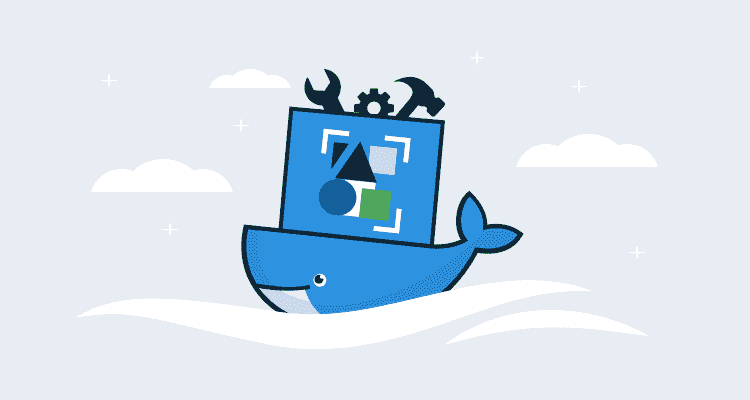
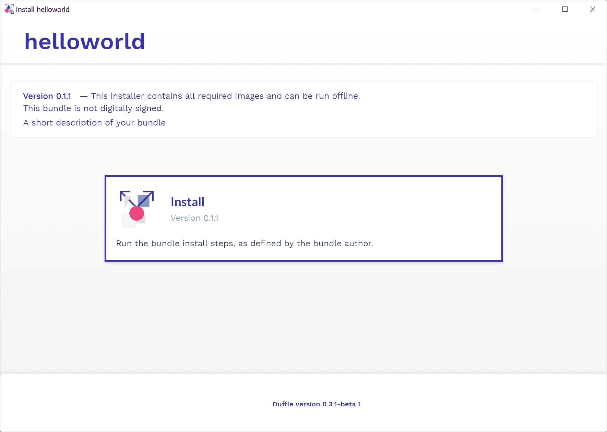
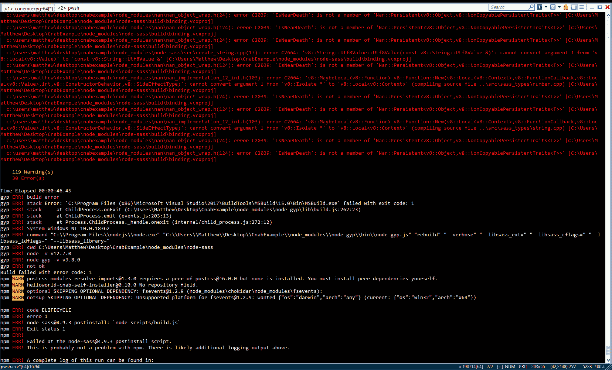

# 什么是 CNAB？-章鱼部署

> 原文：<https://octopus.com/blog/what-is-cnab>

使用云基础架构可能是一项艰巨的任务。每个云提供商都有自己的 CLI 工具和首选部署策略，跨平台工具(如 Terraform、Ansible、Puppet 和 Chef)需要大量投资来学习，一旦您启动了基础架构，您可能会面临管理更多部署到 Docker 或 Kubernetes 等平台的任务。

可以肯定地说，如今云部署几乎总是需要多种工具和凭证，而云原生应用捆绑包(CNAB)规范是对部署和管理云基础架构日益增长的复杂性的回应。

在本帖中，我们将看看 CNAB 解决的问题，CNAB 工具生态系统，以及今天使用 CNAB 的利与弊。

## CNAB 解决了什么问题？

为了理解 CNAB 解决的问题，我们可以看看我们在 Octopus 与 [Terraform 供应商](https://github.com/OctopusDeploy/terraform-provider-octopusdeploy)遇到的一个问题。

该提供者的目的是允许通过 Terraform 配置 Octopus 服务器，并且该功能作为一个定制的 Terraform 插件公开。但是，要使用该插件，您必须手动下载它，将其放在正确的目录中，并通过传递给 Terraform 的命令行参数引用它。虽然在 Terraform 社区中有很多关于分发插件的最佳方式的讨论，但是现在仍然是一个手动的过程。

因为这是一个手动过程，所以提供插件和记录其使用的负担就落在了我们身上。对于像 Terraform 这样的跨平台工具来说，这并不是一个微不足道的负担，因为这意味着这个过程在 Windows、MacOS 和 Linux 上得到了完美的记录和测试。如果我们可以将所有需要的工具和脚本捆绑到一个单独的、自包含的可部署工件中，这不是很好吗？

这正是 CNAB 被设计出来的场景。CNAB 包实质上是 Docker 映像的集合，包含针对远程资源执行安装所需的一切。在本例中，CNAB 包将包含 Terraform 可执行文件、插件、Terraform 模板和执行所有操作所需的脚本。最终的包消除了最终用户下载和配置单个工具的需要，而是为他们提供了一个自包含的安装程序。

通过提供独立的安装包，CNAB 解决了在自动化复杂部署时出现的许多常见问题，包括:

*   凭证管理
*   离线安装
*   版本化安装程序
*   签名和可验证的安装人员
*   审计线索
*   卸载过程
*   指向并单击安装程序

## 你如何使用 CNAB？

CNAB 本身只是一个规范，实现它取决于提供者。Duffle 项目提供了 CNAB 规范的参考实现，我们将在博客的其余部分使用这个工具。

Duffle 可执行文件可以从项目的 [GitHub releases](https://github.com/deislabs/duffle/releases) 页面下载。为 Windows、Linux 和 MacOS 提供了预编译的二进制文件。

Duffle 用命令`duffle create <bundle>`创建了一个样例包项目。将创建一个目录，其中包含 Duffle 项目`duffle.json`文件、`Dockerfile`和将包含在 Docker 映像中的示例安装脚本。

为了将 Duffle 项目转换成 CNAB 包，我们执行`duffle build`。这将采用 Duffle 特定的`duffle.json`文件中的包配置，并构建 Docker 映像和 CNAB 包。

构建项目意味着现在可以安装这个包了。我们可以通过运行`duffle bundle list`看到这一点，它显示了可用的包。

要执行安装，运行命令`duffle install <install name> <bundle>:<version>`。这将从包中运行 install 命令，在示例应用程序中，它将`hey I am installing things over here`打印到屏幕上。

一旦安装完成，命令`duffle list`将列出安装的详细信息。

要卸载一个包，运行`duffle uninstall <install name>`。这将运行 bundle 卸载脚本，对于我们的示例，该脚本将`hey I am uninstalling things now`打印到屏幕上。

这些包也可以使用[行李包](https://github.com/deislabs/duffle-bag)项目打包成一个独立的安装程序。这为最终用户提供了与任何其他应用程序安装程序非常相似的体验。

## CNAB/达芙蕾今天可以使用了吗？

如果您现在尝试使用 CNAB，有几个问题需要解决。

实现 CNAB 规范的[项目中没有 1.0 版本。](https://cnab.io/community-projects/) [Duffle](https://duffle.sh/) 、 [Porter](https://porter.sh) 和 [Docker App](https://github.com/docker/app) 都还在开发他们最初的零发布版本，这意味着随着它们的发展，你可以期待一些突破性的变化。

安装 CNAB 工具本身是一个手动过程。Duffle 从他们的 GitHub 发布页面提供二进制文件，最终用户可以下载、重命名和安装它们。理想情况下，这些安装程序将通过主要的软件仓库或商店提供，以使安装和更新它们变得轻松，但最终用户今天必须自己管理这个过程。

CNAB 规范的目标之一是允许将包保存在中央存储库中。像 CNAB 到 OCI 这样的项目正在研究这个问题，但是像大多数 CNAB 工具一样，它还处于早期阶段，所以你的运气可能会有所不同。

最后，对于面向操作人员的工具来说，创建独立的安装程序需要安装大量未记录的开发工具。您至少需要 Node.js、Python 和 Visual Studio Tools 之类的 C++编译器，即使这样，您也可以在构建期间调试深奥的错误。CNAB 还没有达到堆栈溢出帖子的临界质量，以使解决这些错误变得容易。

*即使作为一名开发者，这片红色的海洋也足以让你离开这个建筑。*

尽管有这些挑战，我还是惊喜地发现 Visual Studio 代码插件是如此容易地与 Duffle 项目一起工作，在经历了一些最初的挫折后，我很高兴地构建并打包了我的 CNAB 包。我特别喜欢构建自包含和执行安装程序的能力，以及 CNAB 处理凭证的事实。

因此，尽管随着工具更新到 1.0 版本，开发过程中的粗糙边缘被消除，任何加入 CNAB 潮流的人都可以预期会有一些颠簸，但整体 CNAB 捆绑包是一种分发安装程序的便捷方式，它将合并多个工具的复杂部署自动化。