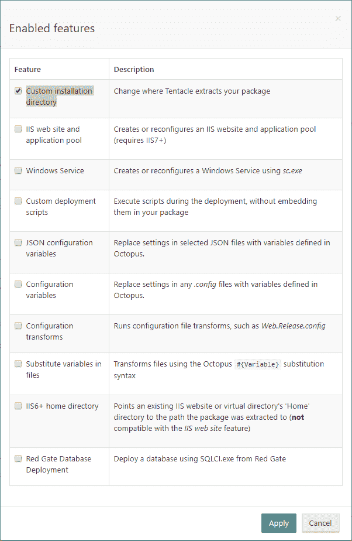
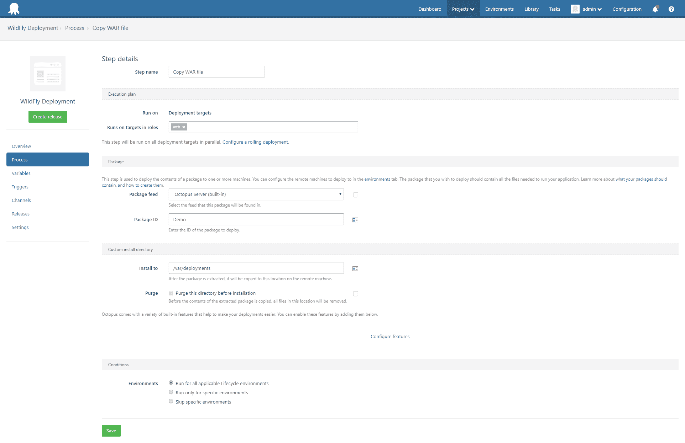

# 从 Octopus Deploy - Octopus Deploy 部署到 Wildfly

> 原文：<https://octopus.com/blog/wildfly-deploy>

这篇文章是为老版本的 Octopus 写的，在加入原生野生支持之前。

请访问[章鱼指南](https://octopus.com/docs/guides?destination=WildFly)获取关于部署到野外的最新说明。

在 Octopus，我们已经开始了一个项目，研究如何更好地支持 Java 开发人员。在之前的一篇博客文章中，我谈到了如何使用 Octopus Deploy 将 WAR 文件部署到 Tomcat。Tomcat 无疑是当今产品中最受欢迎的 Java 应用服务器(根据来自 [Plumbr](https://plumbr.eu/blog/java/most-popular-java-application-servers-2017-edition) 和 [Rebel Labs](https://zeroturnaround.com/rebellabs/java-tools-and-technologies-landscape-for-2014/8/) 的统计，Tomcat 占据了超过 50%的市场份额)。下一个最受欢迎的应用服务器是 JBoss/wildly，在这篇文章中，我将向您展示如何将 WAR 文件部署到 Wildfly 11(目前在 Alpha 中)。

像 Tomcat 一样，将 WAR 文件部署到 Wildfly 可以简单到只需将它复制到一个特殊的目录。在 Wildfly 的情况下，将 WAR 文件复制到`standalone/deployments`目录将触发 Wildfly 部署并运行应用程序。这是一个非常有效的部署方法，如果这对您有用，那么关于部署到 Tomcat 的博文同样适用于 Wildfly。

然而，有些情况下简单的文件拷贝在 Wildfly 中不起作用。特别是，部署到 Wildfly 域控制器通常是通过 JBoss CLI 工具完成的。

## CLI 部署面临的挑战

当从 Octopus Deploy 部署 WAR 文件时，理想情况下，我们希望这些步骤是等幂的。幂等只是一种花哨的说法，表示部署可以运行任意次，最终结果都是一样的。

JBoss CLI 工具中的部署操作不是这样的。您不能执行 CLI 命令，如

```
deploy myApplication.war --all-server-groups 
```

多次，因为一旦文件`myApplication.war`在 Wildfly 内容存储库中，如果没有像`--force`这样的选项，它就不能被覆盖。这自然会让您尝试运行这样的命令

```
deploy myApplication.war --all-server-groups --force 
```

这是行不通的。您不能在一个命令中强制上传文件并将其部署到服务器组。

这意味着，如果您希望能够将应用程序部署和重新部署到域环境中，您需要做一些额外的工作来确保正在运行的命令能够正常工作，无论该应用程序是否存在于 Wildfly content repository 中，它是否被分配到服务器组，以及它是否被启用或禁用。

## 绝妙的解决方案

当我们谈到部署到一个 Wildfly 域时，我们希望完成两项任务:

*   在 Wildfly 内容存储库中创建或更新 WAR 文件的内容。
*   可以选择将 WAR 文件分配给处于启用或禁用状态的服务器组。

这个 Groovy 脚本通过几个命令行参数公开了这些任务。在幕后，做了大量的工作来允许部署根据需要重新运行多次，并利用 Spring retry 框架来确保部署确实到达了 Wildfly 服务器。

## 利用 Octopus Deploy 的力量

我们可以使用两种方法将文件放入 Wildfly 域控制器。

第一种方法是通过管理界面将文件直接上传到 Wildfly 服务器。在这种情况下，Wildfly 服务器将在公共 IP 地址上公开其管理端口，而 Octopus Deploy 服务器本身将运行脚本，将文件上传到 Wildfly 服务器。

这种解决方案有一些缺点。

*   这些文件的上传没有经过优化，这意味着当您上传 100 MB 的 WAR 文件时，您必须在每次重新部署时发送该数据的每个字节。
*   您的 Wildfly 服务器需要在公共 IP 地址上公开管理接口。
*   运行脚本的负担放在 Octopus Deploy 服务器上

第二种方法是通过 Octopus deploy package 步骤将文件分发到 Wildfly 服务器，然后使用 CLI 工具的本地副本将文件上传到运行在同一实例上的 Wildfly 服务器。

这个解决方案解决了第一种情况的缺点。

*   通过 Octopus Deploy 分发的文件可以利用[增量复制](https://octopus.com/docs/deployments/packages/delta-compression-for-package-transfers)。这意味着可能只复制包中已更改的部分，从而减少网络流量并缩短部署时间。
*   Wildfly 服务器只需要将其管理接口暴露给本地主机适配器，因为所有 CLI 命令都将从本地服务器运行。
*   Octopus Deploy 服务器只负责复制文件和脚本，而 Wildfly 服务器本身将在本地运行脚本。

鉴于第二种方法的明显优势，这就是我们将如何进行。

## 先决条件

Wildfly 域控制器服务器需要安装以下软件包:

*   Groovy，由将部署 WAR 文件的脚本使用。
*   章鱼部署乌贼所用的单色。

使用 [SDKMAN](http://sdkman.io/) 安装 Groovy。它通常比您的 Linux 发行版附带的软件包做得更好。

您需要将一个 WAR 文件打包并推送到 Octopus Deploy 服务器。参见关于部署到 Tomcat 的博文，了解如何打包一个 WAR 文件并将其推送到 Octopus。

您还需要将 Wildfly 域控制器添加到 Octopus 环境中。正如我们在 Tomcat 示例中所做的，Wildfly 服务器很可能使用 SSH 连接。

最后，Wildfly 服务器需要将 Groovy 脚本和`jboss-cli.xml`文件复制到一个位置，该位置可以被章鱼用来连接 Wildfly 服务器的 SSH 用户访问。我把[https://github.com/OctopusDeploy/JBossDeployment.git](https://github.com/OctopusDeploy/JBossDeployment.git)回购克隆到了`/opt`，所以所有的文件都在`/opt/JBossDeployment`下。

## 部署到 Wildfly 域控制器

将包部署到 Wildfly 将是一个两步的过程。

### 部署包

第一步将利用`Deploy a package`步骤将 WAR 文件放到 Wildfly 域控制器文件系统中。点击`Configure features`链接，勾选`Custom installation directory`选项。

[](#)

然后在`Install to`字段中定义保存 WAR 文件的目录。我用过目录`/var/deployments`。

[](#)

确保 Octopus 连接到 Wildfly 服务器的 SSH 用户拥有将文件复制到该目录的权限，否则该步骤将失败。

### 运行脚本

第二步将利用`Run a Script`步骤从 Bash 启动 Groovy 脚本。

将`Run on`选项设置为`Deployment targets`，选择`Bash`作为脚本类型，并输入以下内容作为脚本体:

```
cd /opt/JBossDeployment
./deploy-app.groovy --controller=localhost --user=user --password=password --application=/var/deployments/demo.war --enabled-server-group=main-server-group 
```

脚本第一次运行可能需要几分钟，因为它将下载 Maven 依赖项(由 Groovy 脚本中的`@Grab`注释引用)并将它们存储在本地缓存中。

如果您想查看下载进度，请像这样运行脚本:

```
cd /opt/JBossDeployment
groovy -Dgroovy.grape.report.downloads=true deploy-app.groovy --user=user --password=password --application=/var/deployments/demo.war --enabled-server-group=main-server-group 
```

一旦下载了所有的依赖项，部署脚本将把 WAR 文件上传到 Wildfly，将其添加到`main-server-group`服务器组，并启用它。

## 部署到独立的 Wildfly 实例

为独立 Wildfly 实例部署包的过程与部署到域控制器非常相似。唯一的区别是传递给 Groovy 脚本的参数。

因为独立服务器没有服务器组的概念，所以删除了参数`enabled-server-group`。否则所有步骤保持不变。

```
cd /opt/JBossDeployment
./deploy-app.groovy --controller=localhost --user=user --password=password --application=/var/deployments/demo.war 
```

## 后续步骤

我们将使用像这里的脚本这样的实验来指导 Octopus 将来对 Java 和 Wildfly 这样的应用服务器的支持。在接下来的几周里，我们将为计划中的 Java 支持准备一份 RFC，如果您对 Java 支持感兴趣，我们将非常感谢您的反馈。