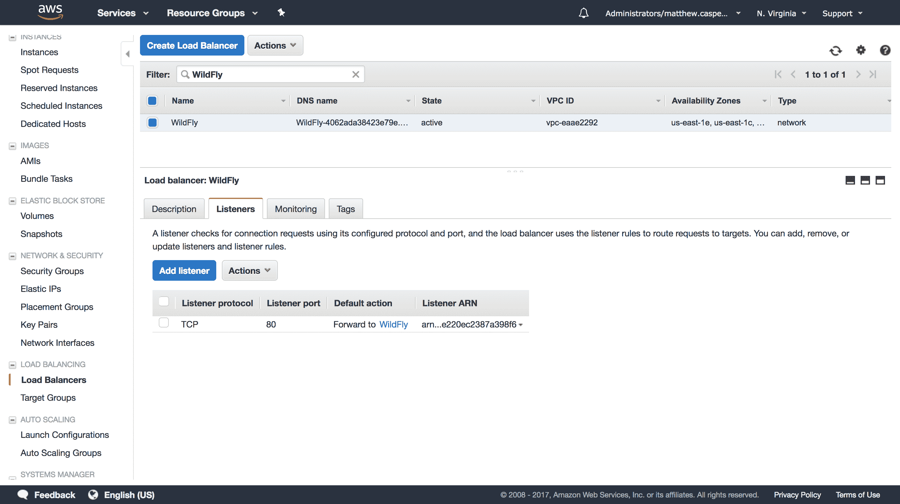
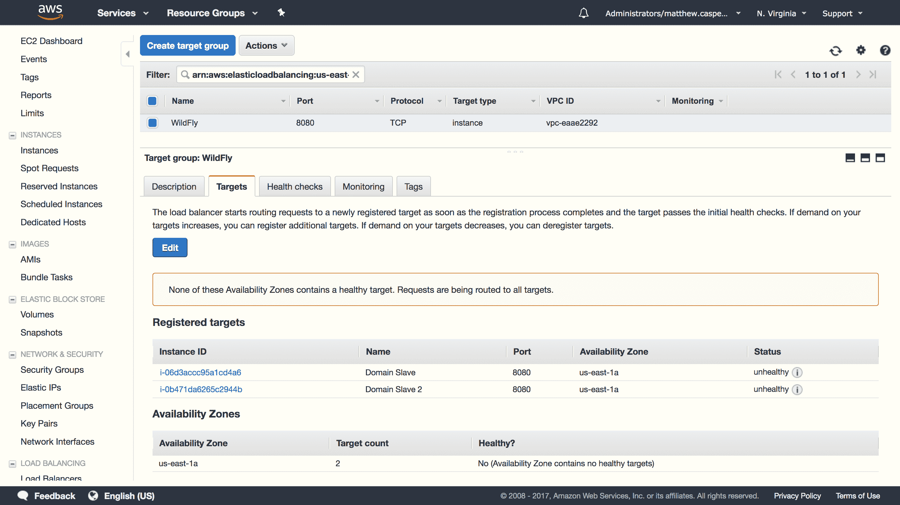
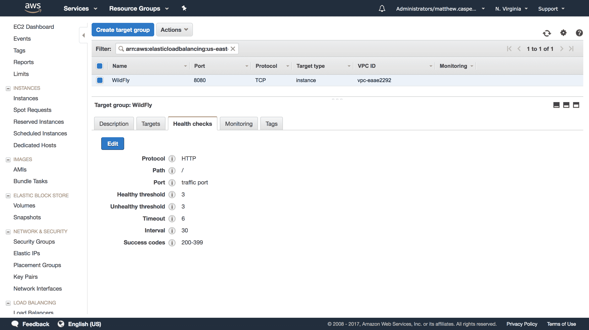
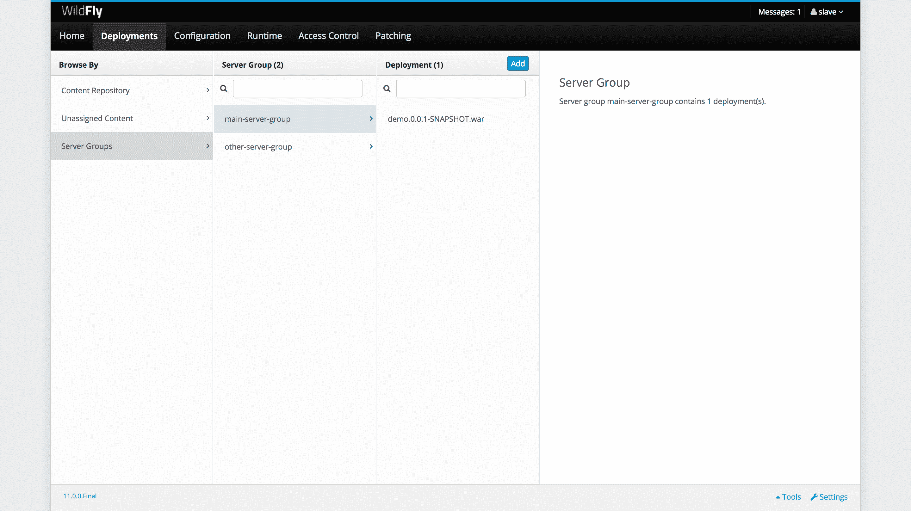
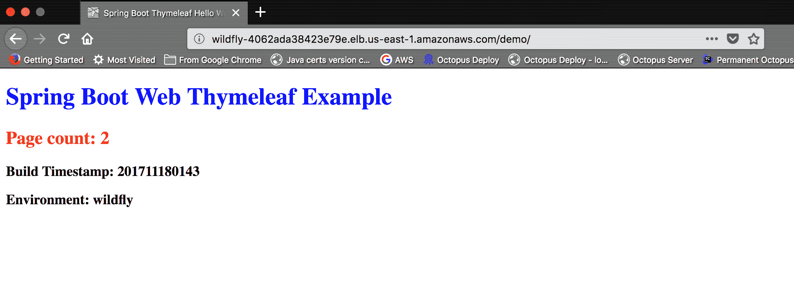
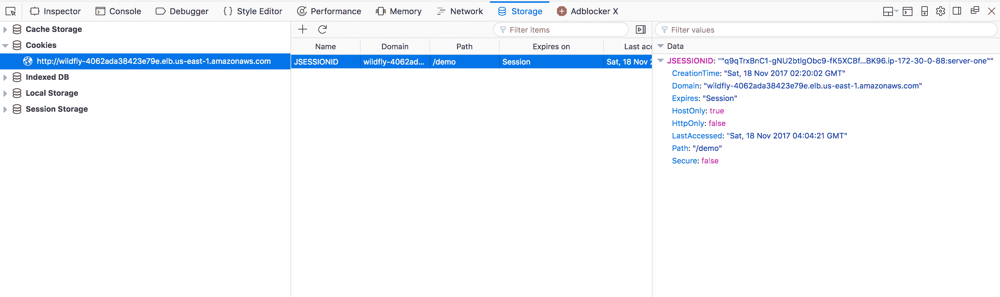

# 创建一个 WildFly 集群- Octopus 部署

> 原文：<https://octopus.com/blog/wildfly-jdbc-ping>

在[之前的博客文章](https://octopus.com/blog/wildfly-s3-domain-discovery)中，我们看到了在没有固定 IP 地址或网络广播的 AWS 环境中，如何通过将配置设置集中在 S3 桶中来配置 WildFly 域。

在这篇博文中，我们将通过在 AWS 中配置一个 WildFly 实例集群来进一步进行配置。

## 域与集群

在我们开始配置集群之前，有必要花点时间讨论一下域和集群之间的区别。

一个域由一个域控制器和一个或多个域从属设备组成。域控制器将设置和应用程序分发给域从属服务器，并提供启动、停止和重新启动从属服务器实例的方法。

域只是一个管理工具。除了简化的管理之外，您不会获得任何额外的功能，因为实例是域的一部分。事实上，您可以使用类似于[JBoss Operations Network(JON)](https://www.redhat.com/en/technologies/jboss-middleware/operations-network)的工具来替换一个域。

术语集群可能有歧义，因此对于这篇博文来说，集群意味着共享 Servlet 会话状态的两个或更多 WildFly 实例。共享此状态意味着服务器端 web 应用程序可以由集群中的任何节点提供，如果其中一个节点关闭，请求将由拥有会话状态副本的另一个节点来完成。

尽管从理论上讲，集群允许任何节点响应有状态 web 应用程序的请求，但在实践中，您通常会实现粘性会话来将流量从一个会话定向到单个服务器(只要它可用)。Infinispan 文档谈到了使用粘性会话的性能优势。

域可用于将从属实例配置为集群的一部分，或者域可由不构成集群的多个独立节点组成。同样，WildFly 的多个独立实例可以配置成一个集群。

因此，虽然域和集群都是以某种方式协调的 WildFly 实例组，但这两个术语指的是不同的东西。

## 配置集群

虽然我们不需要域来配置集群，但域是将公共设置分发到多个 WildFly 从属服务器的一种便捷方式，因此我们将使用域来构建我们的集群。我们将在之前的博文中已经完成的工作的基础上构建一个野域名。

扩展域以支持集群需要许多步骤。

### 定义中央配置数据库

在构建域时，我们使用了一个共享的 S3 存储桶来帮助发现域控制器。以类似的方式，我们将使用共享数据库来促进集群节点的发现。

因为我们正在 AWS 中部署 WildFly 实例，所以我们将使用 Aurora 数据库作为集群配置的中心点。Aurora 与 MySQL 兼容，这意味着我们将配置 WildFly，就像它正在与 MySQL 数据库通信一样。

### 添加模式

使用 MySQL 客户端工具，登录 RDS 实例，并创建一个名为`jgroups`的模式。这是通过命令`create database jgroups;`完成的:

```
[ec2-user@ip-172-30-0-89 configuration]$ mysql -ujgroups -p -hyour-rds-hostname.cluster-c1ufrgizkeyf.us-east-1.rds.amazonaws.com
Enter password:
Welcome to the MySQL monitor.  Commands end with ; or \g.
Your MySQL connection id is 15
Server version: 5.6.10 MySQL Community Server (GPL)

Copyright (c) 2000, 2017, Oracle and/or its affiliates. All rights reserved.

Oracle is a registered trademark of Oracle Corporation and/or its
affiliates. Other names may be trademarks of their respective
owners.

Type 'help;' or '\h' for help. Type '\c' to clear the current input statement.

mysql> create database jgroups;

Query OK, 1 row affected (0.04 sec) 
```

### 添加 MySQL 驱动程序

在每个 WildFly 从属服务器上，我们需要添加一个包含 MySQL 驱动程序的模块。一个模块只是一个 JAR 文件和一些 WildFly 可以用来加载它们的元数据的集合。

首先创建一个名为`modules/system/layers/base/com/mysql/driver/main`的目录。在这个目录中，创建一个名为`module.xml`的文件，内容如下:

```
<module  name="com.mysql.driver">
    <resources>
        <resource-root path="mysql-connector-java-5.1.44.jar" />
    </resources>
    <dependencies>
        <module name="javax.api"/>
        <module name="javax.transaction.api"/>
    </dependencies>
</module> 
```

然后将 [MySQL 驱动 JAR 文件](https://mvnrepository.com/artifact/mysql/mysql-connector-java/5.1.44)保存到`mysql-connector-java-5.1.44.jar`目录下。

### 添加数据源

RDS 实例将通过数据源进行访问。这在`ha`轮廓下的`domain/confguration/domain.xml`文件中定义。`<profile name="ha">`元素的所有子元素组成了`ha`概要文件。

为了定义我们的数据源，我们需要一个`<datasource>`元素(定义数据库连接)和一个`<driver>`元素(定义 MySQL JDBC 驱动程序细节)。

在本例中，我们将数据源指向一个名为`jgroups`的模式，并连接一个名为`jgroups`的用户(尽管这两个值不需要相同):

```
<subsystem >
  <datasources>
      <datasource jndi-name="java:jboss/datasources/JGroups" pool-name="JGroupsDS">
          <connection-property name="url">
              jdbc:mysql://your-rds-hostname.cluster-c1ufrgizkeyf.us-east-1.rds.amazonaws.com/jgroups
          </connection-property>
          <driver>mysql</driver>
          <security>
              <user-name>jgroups</user-name>
              <password>yourpassword</password>
          </security>
      </datasource>
      <drivers>
          <driver name="mysql" module="com.mysql.driver">
              <xa-datasource-class>com.mysql.jdbc.jdbc2.optional.MysqlXADataSource</xa-datasource-class>
              <datasource-class>com.mysql.jdbc.jdbc2.optional.MysqlDataSource</datasource-class>
          </driver>
      </drivers>
  </datasources>
</subsystem> 
```

### 定义 JGroups 堆栈

JGroups 是 WildFly 用来连接集群成员的库。默认情况下，JGroups 被配置为使用 UDP 和多播，但是 Amazon 不支持 UDP 和多播。

相反，我们将配置 WildFly 使用 TCP，并利用中央数据库作为发现对等点的方式。

在 JGroups 子系统中，我们将通过更改`<channel>`元素上的`stack`属性来切换到`tcp`堆栈:

```
<channel name="ee" stack="tcp" cluster="ejb"/> 
```

然后我们需要用`JDBC_PING`替换`MPING`协议:

```
<protocol type="org.jgroups.protocols.JDBC_PING">
    <property name="datasource_jndi_name">
        java:jboss/datasources/JGroups
    </property>
</protocol> 
```

完整的堆栈现在是这样的:

```
<subsystem >
    <channels default="ee">
        <!-- We are now using the tcp stack -->
        <channel name="ee" stack="tcp" cluster="ejb"/>
    </channels>
    <stacks>
        <stack name="udp">
            <transport type="UDP" socket-binding="jgroups-udp"/>
            <protocol type="PING"/>
            <protocol type="MERGE3"/>
            <protocol type="FD_SOCK"/>
            <protocol type="FD_ALL"/>
            <protocol type="VERIFY_SUSPECT"/>
            <protocol type="pbcast.NAKACK2"/>
            <protocol type="UNICAST3"/>
            <protocol type="pbcast.STABLE"/>
            <protocol type="pbcast.GMS"/>
            <protocol type="UFC"/>
            <protocol type="MFC"/>
            <protocol type="FRAG2"/>
        </stack>
        <stack name="tcp">
            <transport type="TCP" socket-binding="jgroups-tcp"/>
            <!-- MPING has been replaced with JDBC_PING -->
            <protocol type="org.jgroups.protocols.JDBC_PING">
                <property name="datasource_jndi_name">
                    java:jboss/datasources/JGroups
                </property>
            </protocol>
            <protocol type="MERGE3"/>
            <protocol type="FD_SOCK"/>
            <protocol type="FD_ALL"/>
            <protocol type="VERIFY_SUSPECT"/>
            <protocol type="pbcast.NAKACK2"/>
            <protocol type="UNICAST3"/>
            <protocol type="pbcast.STABLE"/>
            <protocol type="pbcast.GMS"/>
            <protocol type="MFC"/>
            <protocol type="FRAG2"/>
        </stack>
    </stacks>
</subsystem> 
```

### 使用`ha`轮廓

为了利用我们对`ha`概要文件的更改，需要配置从属实例来使用它。这在`<server-groups>`元件中进行配置。

更改`main-server-group`以使用`ha`轮廓:

```
<server-group name="main-server-group" profile="ha"> 
```

还将服务器组更改为使用`full-ha-scokets`套接字绑定组:

```
<socket-binding-group ref="full-ha-sockets"/> 
```

完整的`<server-groups>`元素现在看起来像这样:

```
<server-groups>
    <!-- main-server-group uses the ha profile -->
     <server-group name="main-server-group" profile="ha">
         <jvm name="default">
             <heap size="64m" max-size="512m"/>
         </jvm>
         <!-- main-server-group uses the full-ha-sockets socket binding group -->
         <socket-binding-group ref="full-ha-sockets"/>
     </server-group>
     <server-group name="other-server-group" profile="full-ha">
         <jvm name="default">
             <heap size="64m" max-size="512m"/>
         </jvm>
         <socket-binding-group ref="full-ha-sockets"/>
     </server-group>
 </server-groups> 
```

## 打开防火墙

套接字绑定组为 JGroups 使用端口`7600`，所以这个端口需要在我们的防火墙上打开。

## 启动奴隶

为了在数据库中注册正确的地址，WildFly 从属实例需要将`private`接口绑定到外部 NIC 的 IP 地址。这是通过将`-bprivate=<ip address>`参数传递给`domain.sh`来完成的。

因为这些从属实例需要为外部世界的流量提供服务，我们还需要将`public`接口绑定到外部 NIC 的 IP 地址。这是通过将参数`-b=<ip address>`传递给`domain.sh`来完成的。

例如，这个命令在 IP 地址为`172.30.0.88`的 EC2 实例上启动一个从属服务器:

```
[ec2-user@ip-172-30-0-88 bin]$ ./domain.sh --host-config host-slave.xml -bprivate=172.30.0.88 -b=172.30.0.88 
```

我们不绑定到 EC2 实例的公共 IP 地址(如果它甚至有一个公共 IP 地址的话)。负载均衡器将获取公共互联网流量，并将其定向到 WildFly 绑定的本地子网 IP 地址。

## 创建负载平衡器

至此，我们已经有了一个配置集群的域。WildFly slave 实例将从域控制器获取它们的配置(通过共享的 S3 桶发现)，该配置包括一个 JGroups 堆栈，允许形成一个集群(通过查询一个共享的数据库)。

为了真正利用集群，我们需要一个集中的负载均衡器来在从设备之间分配请求。这很重要，因为代表会话的 cookie 将被绑定到负载平衡器的地址，而不是任何单个节点的地址。这样，由单个 cookie 表示的单个会话在集群成员之间共享。

AWS 提供了一个负载平衡器来完成这项工作。

我们的负载平衡器将针对`WildFly`目标群体:

[](#)

该目标组有两个 WildFly 从属实例，并将流量定向到端口`8080`(wild fly 的默认 HTTP 端口):

[](#)

我们将使用默认的 WildFly 欢迎页面作为健康检查:

[](#)

## 部署可分发的 web 应用程序

为了利用复制会话状态，我们的 Java web 应用程序需要标记为可分发的。这是在带有`<distributable/>`元素的`web.xml`文件中完成的。这个[示例 web 应用程序](https://github.com/OctopusDeploy/ThymeleafSpringDemo/blob/master/src/main/webapp/WEB-INF/web.xml#L6)已经被配置为可分发的。

这个示例应用程序在会话存储中维护一个页面计数，我们可以使用这个值来确保我们的会话数据实际上是跨集群复制的。

我们将构建这个应用程序，并在整个域中部署它:

[](#)

## 打开应用程序

部署好应用程序和我们的负载平衡器后，我们就可以打开应用程序了。每次我们刷新页面，`Page count`就会增加。这是通过增加会话存储中的值来实现的，会话存储是我们的集群正在复制的存储:

[](#)

如果我们看一下`JSESSIONID` cookie，我们可以看到它被绑定到负载平衡器域。这很重要，因为这个 cookie 是我们跟踪会话的方式，而且由于浏览器的工作方式，这个 cookie 只会被发送到创建它的域。通过将 WildFly 服务器隐藏在负载平衡器之后，浏览器不知道哪个集群实例正在响应请求。

然而，如果我们仔细观察 cookie 的值，我们可以看到发起会话的从属实例的 IP 地址是`172.30.0.88`。该值仅代表启动会话的集群成员，如果不同的集群成员响应后续请求，该值不会改变:

[](#)

我们可以使用这些信息来关闭托管我们会话的从属服务器，将流量强制转移到第二个从属服务器上。

通过定义`host-slave.xml`文件中`<host>`元素的`name`属性，可以避免从机 IP 地址泄露；

```
<host name="Slave Name" > 
```

启动会话的群集节点现在关闭，所有流量都转移到群集的另一个成员。但是页面计数将继续从其先前的值攀升，而不会重置为 1，因为复制的会话意味着最终用户可以像什么都没发生一样继续。

## 验证集群配置

部署了可分发的应用程序后，JGroups 将开始在共享数据库中注册信息。使用 MySQL 客户端，我们可以用`show tables;`命令登录回数据库并列出我们的`jgroups`模式中的表。

这里我们可以看到`JGROUPSPING`表已经创建:

```
[ec2-user@ip-172-30-0-88 log]$ mysql -u jgroups -p -hyour-rds-hostname.cluster-c1ufrgizkeyf.us-east-1.rds.amazonaws.com
Enter password:
Welcome to the MySQL monitor.  Commands end with ; or \g.
Your MySQL connection id is 22
Server version: 5.6.10 MySQL Community Server (GPL)

Copyright (c) 2000, 2017, Oracle and/or its affiliates. All rights reserved.

Oracle is a registered trademark of Oracle Corporation and/or its
affiliates. Other names may be trademarks of their respective
owners.

Type 'help;' or '\h' for help. Type '\c' to clear the current input statement.

mysql> use jgroups;
Reading table information for completion of table and column names
You can turn off this feature to get a quicker startup with -A

Database changed
mysql> show tables;
+-------------------+
| Tables_in_jgroups |
+-------------------+
| JGROUPSPING       |
+-------------------+
1 row in set (0.00 sec)

mysql> 
```

## 结论

在这篇文章中，我们看到了如何配置一个域来创建一个集群，以及如何允许该集群通过一个共享数据库来识别对等体。然后，该集群通过 AWS 负载平衡器公开。

然后，我们将一个可分发的 web 应用程序部署到域中，并通过关闭创建原始会话的实例，将流量转移到一个新的集群节点上。

如果您对 Java 应用程序的自动化部署感兴趣，[下载 Octopus Deploy](https://octopus.com/downloads) 的试用版，并查看我们的文档。

## 了解更多信息