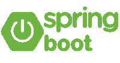
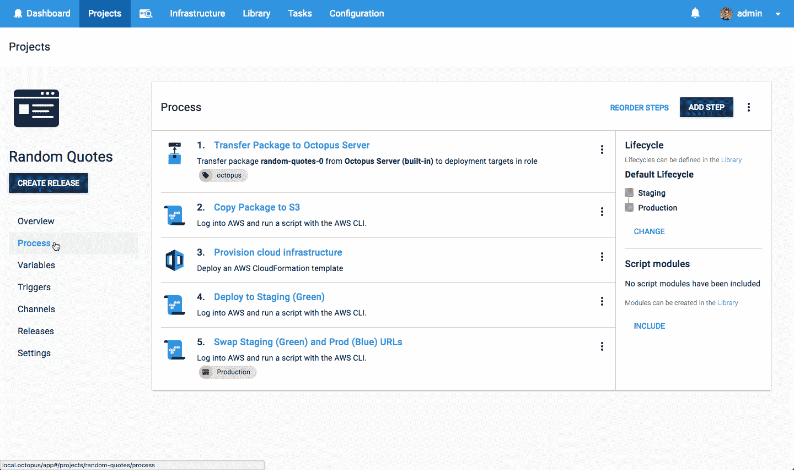
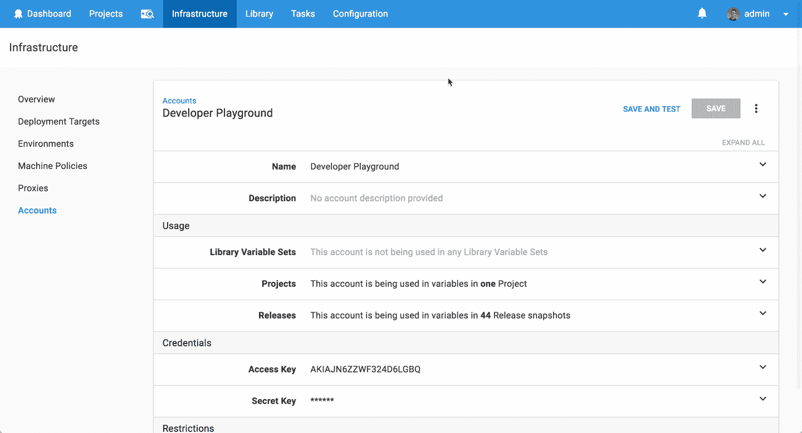
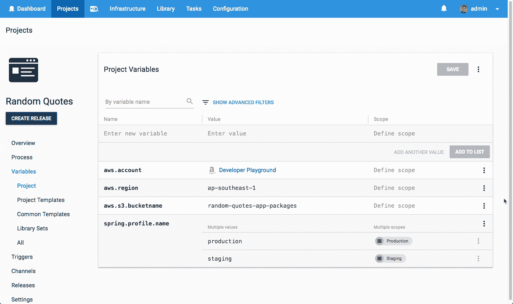

# 部署 Spring Boot web 应用程序-它会部署吗？第 2 集-章鱼部署

> 原文：<https://octopus.com/blog/will-it-deploy-episode-02>

欢迎来到另一个**它会部署吗？**我们尝试使用 Octopus Deploy 自动部署不同技术的那一集。在这一集中，我们将尝试通过云基础设施配置将 Spring Boot web 应用程序部署到亚马逊 web 服务平台，并确保零停机生产部署。

[https://www.youtube.com/embed/Pd2Wya6kvIU](https://www.youtube.com/embed/Pd2Wya6kvIU)

VIDEO

## 问题

### 技术堆栈

我们的应用程序是一个报价生成器，名为[随机报价](https://github.com/OctopusSamples/WillItDeploy-Episode002)。这个应用程序非常简单，但是它让我们演示了如何将 Java web 应用程序部署到 Amazon Web Services 平台。

向我们的营销经理安德鲁致敬，他一直在学习编码并开发了这款应用的第一部分。干得好！

### 部署目标

## 解决办法

那么它会部署吗？是的，会的！我们的部署流程如下所示。

第一步是添加一个 Octopus AWS 帐户，其中包括安全可靠地连接到 AWS 平台所需的所有详细信息。它用于在部署或执行脚本时向 AWS 进行身份验证。

然后，我们添加以下步骤来成功部署我们的应用，包括云基础架构配置和零停机生产部署。

*   Octopus **传送包**步骤将 Spring Boot jar 包传送到 Octopus 服务器。
*   Octopus **运行 AWS CLI 脚本**步骤，将 web 应用程序包复制到 S3 桶中。
*   Octopus **部署 AWS CloudFormation 模板**步骤来供应我们的云基础设施，包括创建我们的弹性 Beanstalk 应用程序和两个环境。
*   Octopus **运行 AWS CLI 脚本**步骤，将我们的 web 应用程序部署到绿色或临时环境中。
*   Octopus **运行一个 AWS CLI 脚本**步骤来交换 Elastic Beanstalk 应用程序环境 URL，以便我们的绿色(暂存)环境接收我们的蓝色(生产)URL。这仅在生产部署期间执行，以便我们实现零停机时间！

这个项目使用以下变量来存储我们的资源组名称、网站名称和应用程序设置。简单又好看！

本集的 [GitHub repo](https://github.com/OctopusSamples/WillItDeploy-Episode002) 包含了本视频使用的所有资源和链接。

### 总结

我们希望你喜欢这一集，因为我们有更多的作品！如果你想让我们探索某个框架或技术，请在评论中告诉我们。

不要忘记订阅我们的 [YouTube](https://youtube.com/octopusdeploy) 频道，因为我们会定期添加新视频。愉快的部署！😃