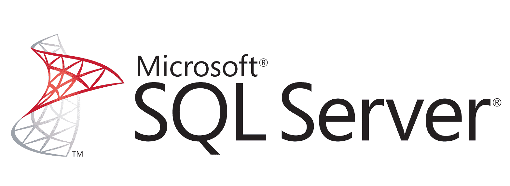
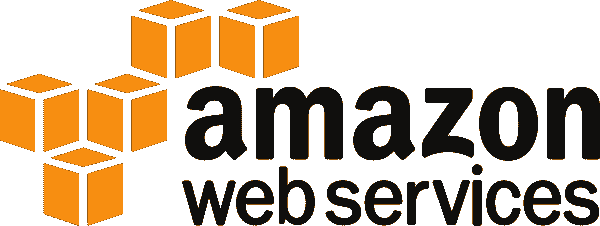
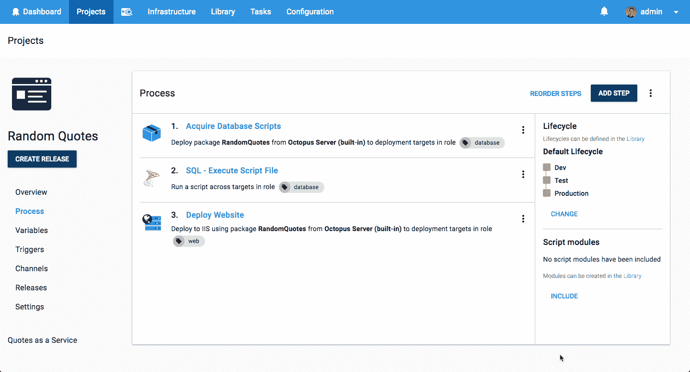
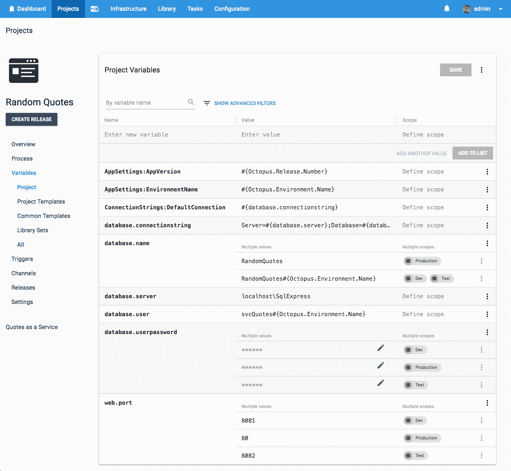

# 使用实体框架核心部署到 SQL Server 它会部署吗？第 3 集-章鱼部署

> 原文：<https://octopus.com/blog/will-it-deploy-episode-03>

欢迎来到另一个**它会部署吗？**我们尝试使用 Octopus Deploy 自动部署不同技术的那一集。在这一集中，我们尝试使用实体框架核心迁移将 Microsoft SQL Server 数据库部署到 Amazon Web Services (AWS)虚拟机(VM)。

[https://www.youtube.com/embed/0XfVDc71OpU](https://www.youtube.com/embed/0XfVDc71OpU)

VIDEO

## 问题

### 技术堆栈

我们的应用程序是一个报价生成器，名为[随机报价](https://github.com/OctopusSamples/WillItDeploy-Episode003)。这个应用程序非常简单，但是它允许我们演示如何部署数据库更改和更新。

向我们的营销经理安德鲁致敬，他一直在学习编码并开发了这款应用的第一部分。干得好！

### 部署目标

## 解决办法

那么它会部署吗？是的，会的！我们的部署流程如下所示。

然后，我们添加以下步骤来成功部署我们的数据库更改和 web 应用程序。

*   Octopus **部署包**步骤将我们的数据库脚本复制到我们的数据库部署目标
*   Octopus 社区贡献了步骤模板- **[SQL -执行脚本文件](https://library.octopusdeploy.com/step-template/actiontemplate-sql-execute-script-file)** 来针对我们的 SQL Server 数据库执行我们的实体框架核心迁移脚本。
*   Octopus **部署到 IIS** 部署我们的 ASP.NET 核心 web 应用程序的步骤

该项目使用以下变量来存储我们的应用程序设置、数据库连接详细信息和 web 应用程序配置。

本集的 [GitHub repo](https://github.com/OctopusSamples/WillItDeploy-Episode003) 包含了本视频中使用的所有资源和链接。

### 总结

我们希望你喜欢这一集，因为我们有更多的作品！如果你想让我们探索某个框架或技术，请在评论中告诉我们。

不要忘记订阅我们的 [YouTube](https://youtube.com/octopusdeploy) 频道，因为我们会定期添加新视频。愉快的部署！😃