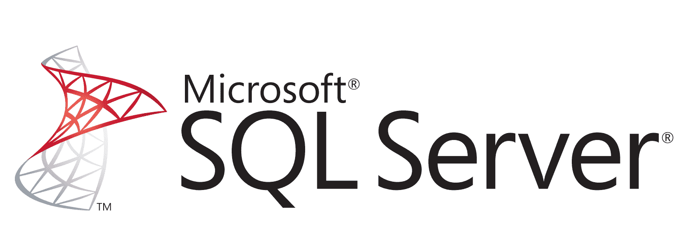
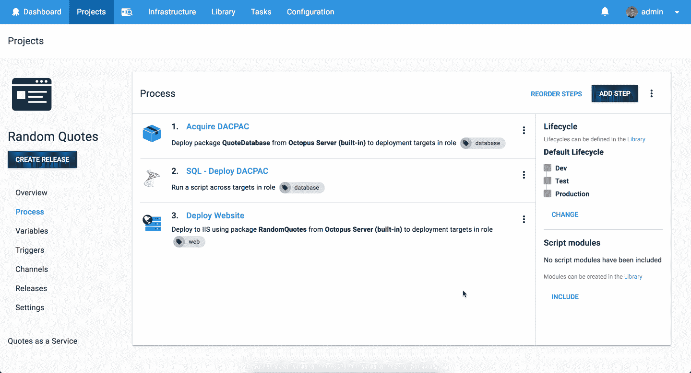

# 使用 DACPAC 部署到 SQL Server 它会部署吗？第 4 集-章鱼部署

> 原文：<https://octopus.com/blog/will-it-deploy-episode-04>

欢迎来到另一个**它会部署吗？**我们尝试使用 Octopus Deploy 自动部署不同技术的那一集。在本集中，我们尝试使用数据层应用程序包(DACPAC)将 Microsoft SQL Server 数据库部署到 Amazon Web Services (AWS)虚拟机(VM)上。

[https://www.youtube.com/embed/zGJthrY-qTQ](https://www.youtube.com/embed/zGJthrY-qTQ)

VIDEO

## 问题

### 技术堆栈

我们的应用程序是一个报价生成器，名为[随机报价](https://github.com/OctopusSamples/WillItDeploy-Episode004)。这个应用程序非常简单，但是它允许我们演示如何部署数据库更改和更新。

向我们的营销经理安德鲁致敬，他一直在学习编码并开发了这款应用的第一部分。干得好！

### 部署目标

## 解决办法

那么它会部署吗？是的，会的！我们的部署流程如下所示:

然后，我们添加以下步骤来成功部署我们的应用程序。

*   Octopus **部署一个包**步骤，将我们的数据库脚本复制到我们的数据库部署目标。
*   Octopus 社区贡献的步骤模板-**[SQL-Deploy DACPAC](https://library.octopusdeploy.com/step-templates/58399364-4367-41d5-ad35-c2c6a8258536/actiontemplate-sql-deploy-dacpac)**将我们的 DAC PAC 部署到我们的 SQL Server 数据库。
*   Octopus **部署到 IIS** 部署我们的 ASP.NET 核心 web 应用程序的步骤。

这个项目使用以下变量来存储我们的应用程序设置、数据库连接细节和 web 应用程序配置。

本集的 [GitHub repo](https://github.com/OctopusSamples/WillItDeploy-Episode004) 包含了本视频中使用的所有资源和链接。

### 包裹

我们希望你喜欢这一集，因为我们有更多的作品！如果你想让我们探索某个框架或技术，请在评论中告诉我们。

不要忘记订阅我们的 [YouTube](https://youtube.com/octopusdeploy) 频道，因为我们会定期添加新视频。愉快的部署！😃