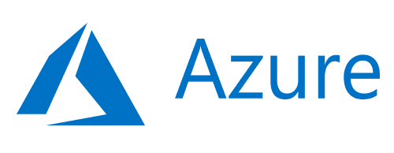
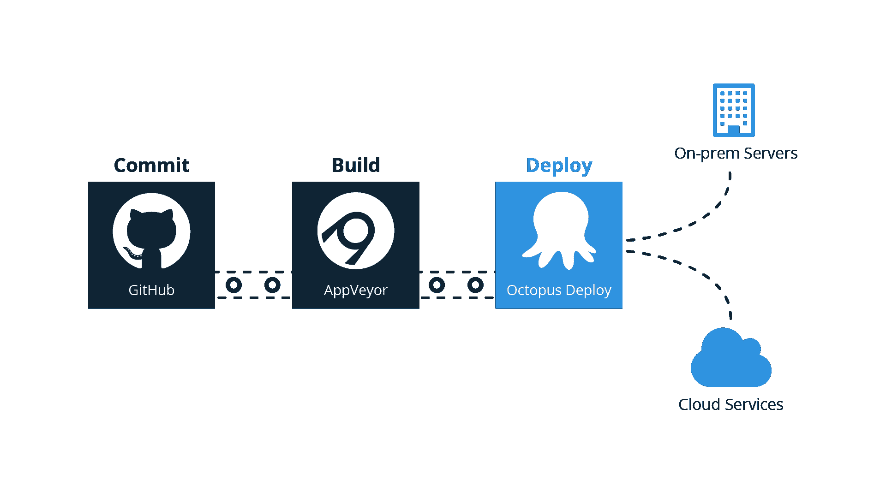
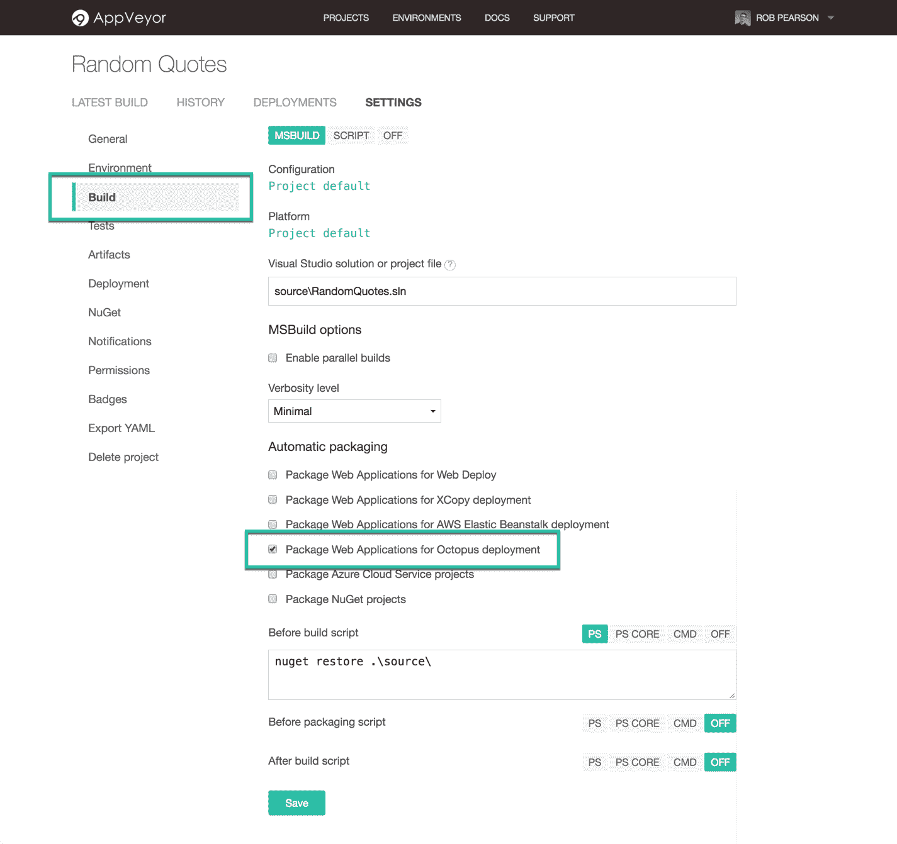
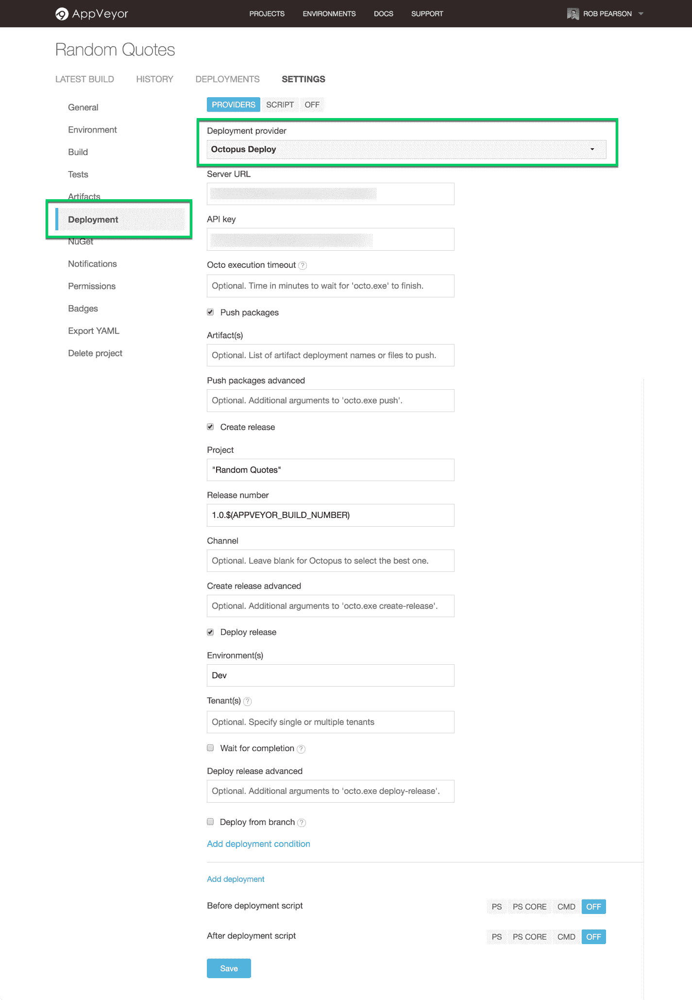
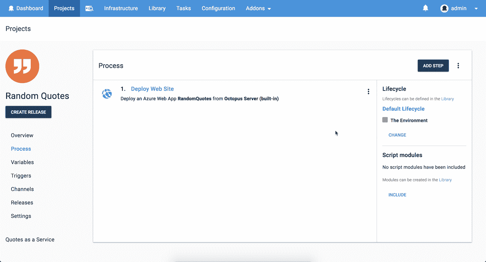
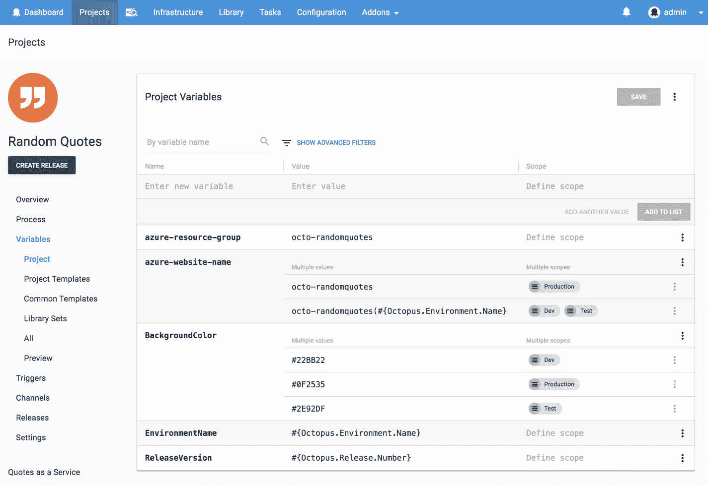

# 使用 AppVeyor 和 Octopus 将 ASP.NET MVC web 应用程序部署到 Azure 它能部署吗？第 6 集-章鱼部署

> 原文：<https://octopus.com/blog/will-it-deploy-episode-06>

欢迎来到另一个**它会部署吗？**我们尝试使用 Octopus Deploy 自动部署不同技术的那一集。在这一集中，我们试图将 ASP.NET MVC 5 web 应用部署到微软 Azure 应用服务。我们还探索与 [AppVeyor](https://appveyor.com) 和 [Octopus](https://octopus.com/cloud) 建立基于云的交付管道。

[https://www.youtube.com/embed/uIWGd7EUxXE](https://www.youtube.com/embed/uIWGd7EUxXE)

VIDEO

注:[章鱼云](https://octopus.com/cloud)即将到来！注册您的兴趣，了解我们基于云的解决方案的最新动态。

## 问题

### 技术堆栈

我们的应用程序是一个名为[随机报价](https://github.com/OctopusSamples/WillItDeploy-Episode006)的随机报价生成器 web 应用程序。这相当简单，但它将让我们了解如何将 ASP.NET MVC web 应用程序自动部署到微软的 Azure 平台上。

向我们的营销经理安德鲁致敬，他一直在学习编码并开发了这款应用的第一部分。干得好！

### 部署目标

[微软的 Azure 平台](https://azure.microsoft.com/) - [App 服务](https://azure.microsoft.com/en-us/services/app-service/)。

## 解决办法

那么它会部署吗？是的，会的！

我们基于云的交付渠道如下所示:

我们将源代码提交给 [GitHub](https://github.com/OctopusSamples/WillItDeploy-Episode006) ，用 [AppVeyor](https://appveyor.com) 自动构建我们的应用，用 [Octopus](https://octopus.com/cloud) 部署到[微软 Azure](https://azure.microsoft.com/en-au/services/app-service/) 。

把 AppVeyor 和 Octopus 集成起来又快又简单。我们只需选择“Package Web Applications for Octopus deploy”构建选项，并配置一个“Octopus Deploy”部署提供程序。

我们的部署过程如下所示:

我们的部署流程中只有一个步骤，即 Octopus **部署 Azure Web App** 步骤，将我们的 Web 应用程序部署到我们的应用程序服务。它的配置非常简单，我们大多使用默认设置。我们确实在部署期间打开了配置变量替换特性来更新我们的`web.config`文件。

该项目使用以下变量来存储我们的 Azure 资源组名称、网站名称以及一些其他应用程序设置，如横幅背景颜色、发布版本和环境名称。这很简单，但它说明了当我们的 web 应用程序在环境中推广时，我们可以如何更改我们的配置。

本集的 [GitHub repo](https://github.com/OctopusSamples/WillItDeploy-Episode006) 包含了本视频使用的所有资源和链接。

### 总结

我们希望你喜欢这一集，因为我们有更多的作品！如果你想让我们探索某个框架或技术，请在评论中告诉我们。

不要忘记订阅我们的 [YouTube](https://youtube.com/octopusdeploy) 频道，我们会定期添加新视频。愉快的部署！😃

## 了解更多信息