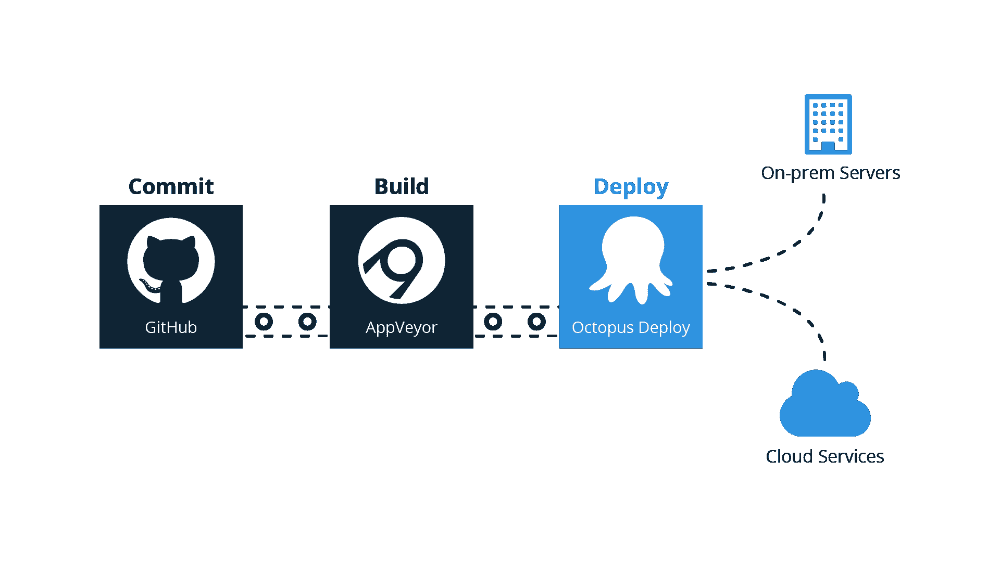
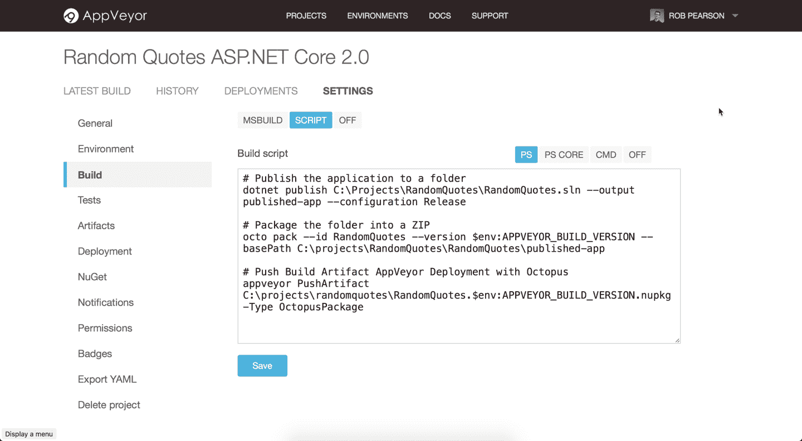
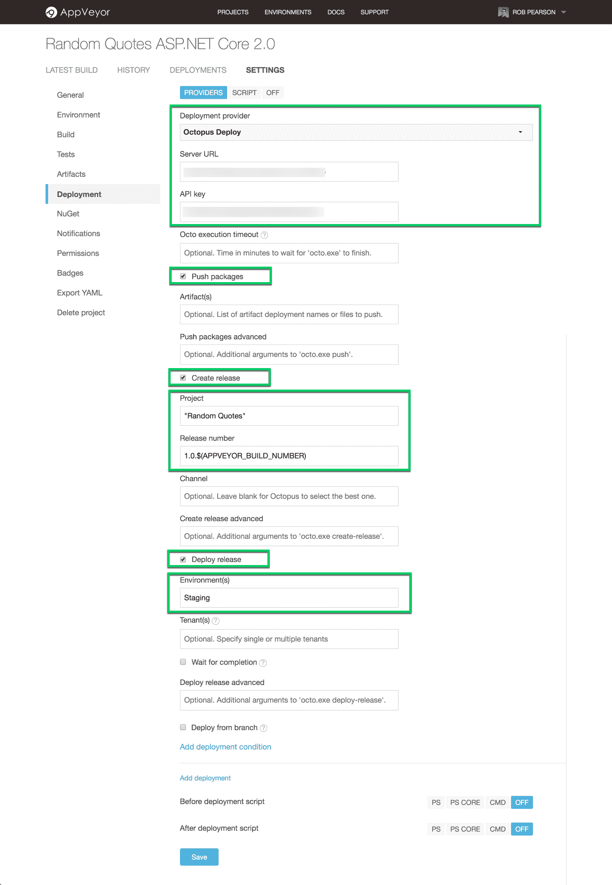
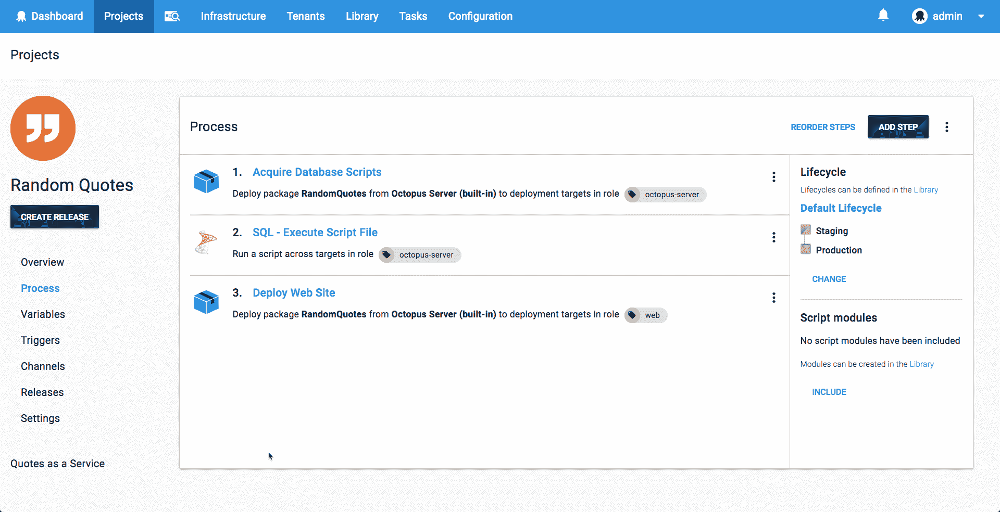
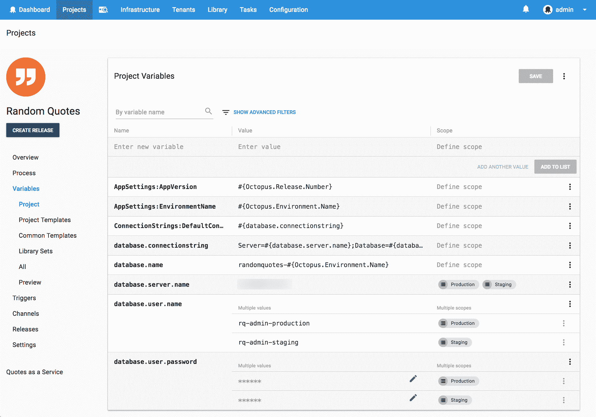

# 将 ASP.NET 核心网络应用程序部署到 Linux——它能部署吗？第 7 集-章鱼部署

> 原文：<https://octopus.com/blog/will-it-deploy-episode-07>

欢迎来到另一个**它会部署吗？**我们尝试使用 Octopus Deploy 自动部署不同技术的那一集。在这一集里，我们试图将 ASP.NET 核心 2.0 网络应用程序部署到亚马逊网络服务(AWS)的 Ubuntu Linux 虚拟机(VM)和 SQL Server for Linux 上。我们还探索与 [AppVeyor](https://appveyor.com) 和 [Octopus](https://octopus.com/cloud) 建立基于云的交付管道。

[https://www.youtube.com/embed/KhKnb58xOWk](https://www.youtube.com/embed/KhKnb58xOWk)

VIDEO

注:[章鱼云](https://octopus.com/cloud)即将到来！注册您的兴趣，了解我们基于云的解决方案的最新动态。

## 问题

### 技术堆栈

我们的应用程序是一个名为[随机报价](https://github.com/OctopusSamples/WillItDeploy-Episode007)的随机报价生成器 web 应用程序。这相当简单，但它将让我们了解如何将 ASP.NET 核心 web 应用程序和数据库自动部署到运行在 AWS 中的 Ubuntu Linux VM 和 SQL Server for Linux 上。

向我们的营销经理安德鲁致敬，他一直在学习编码并开发了这款应用的第一部分。干得好！

### 部署目标

## 解决办法

那么它会部署吗？是的，会的！

我们基于云的交付渠道如下所示:

我们将我们的源代码提交给 [GitHub](https://github.com/OctopusSamples/WillItDeploy-Episode007) ，用 [AppVeyor](https://appveyor.com) 自动构建我们的应用，并部署到一个 [AWS Ubuntu VM](https://aws.amazon.com/marketplace/search/results?x=0&y=0&searchTerms=Ubuntu+Sql+Server+Linux) 和 [Octopus](https://octopus.com/cloud) 。

把 AppVeyor 和 Octopus 集成起来又快又简单。我们使用一个定制的构建脚本来构建和打包我们的应用程序，并配置“Octopus Deploy”部署提供程序来部署它。

我们的部署过程如下所示:

*   Octopus **部署一个包**步骤，在 Octopus 服务器上获取/解压缩我们的数据库脚本。
*   Octopus 社区提供了步骤模板- **[SQL -执行脚本文件](https://library.octopusdeploy.com/step-template/actiontemplate-sql-execute-script-file)** 以针对我们的 SQL Server 数据库执行我们的实体框架核心迁移脚本。
*   Octopus **部署一个包**步骤将我们的 ASP.NET 核心 web 应用程序部署到我们的 Ubuntu Linux 虚拟机上，并对其进行适当的配置。

这个项目使用以下变量来存储我们的应用程序设置和数据库连接细节。

本集的 [GitHub repo](https://github.com/OctopusSamples/WillItDeploy-Episode007) 包含了本视频中使用的所有资源和链接。

### 总结

我们希望你喜欢这一集，因为我们有更多的作品！如果你想让我们探索某个框架或技术，请在评论中告诉我们。

不要忘记订阅我们的 [YouTube](https://youtube.com/octopusdeploy) 频道，我们会定期添加新视频。愉快的部署！😃

## 了解更多信息