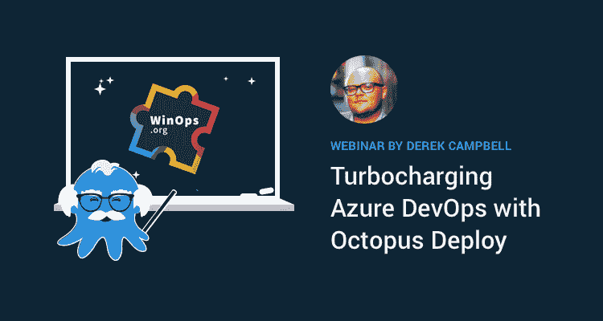

# WinOps 2019 - Octopus 讲座和研讨会- Octopus 部署

> 原文：<https://octopus.com/blog/winops-2019>

WinOps London 将于 9 月 23-24 日举行，届时章鱼将会到场！我很高兴地分享我正在领导一个 DevOps 研讨会，并谈论如何使用 Octopus 加速 Azure DevOps 部署。

## 为您的 CI/CD 管道车间增压

您目前的 CI/CD 渠道是否已经无法满足您的需求？是太慢，手动，还是太多的设置需要调整太频繁？有没有不小心成为“DevOps”的负责人？

不用担心，在这个实践研讨会中，我将带您了解 CI/CD 核心概念和最佳实践，并回顾现实世界中的发布管理和自动化问题以及如何克服它们。

在 2019 年 9 月 23 日为期半天的研讨会期间，您将通过 [OctoFX](https://github.com/OctopusSamples/OctoFX) 亲自体验 [TeamCity](https://www.jetbrains.com/teamcity/) 和[章鱼云](https://octopus.com/docs/octopus-cloud)，这是我们用来演示章鱼的一个示例应用程序。您将配置它的构建，运行自动化测试，设计您的部署过程，并最终在开发、测试和生产环境中推广它。

要求

*   笔记本电脑
*   VS 代码或 Visual Studio 2017+
*   现代网络浏览器

## 配备 Octopus Deploy talk 的涡轮增压 Azure DevOps

在 Octopus Deploy，我们对自动化充满热情，无论是代码、数据库还是基础设施，这就是为什么我们很高兴地宣布，我， [Derek Campbell](https://twitter.com/octoderek) 将在 2019 年 9 月 24 日的 [WinOp 伦敦活动](https://www.winops.org)上，在我们关于*涡轮增压 Azure devo PS with Octopus Deploy*的演讲中继续这一讨论。

在本节中，我将带您了解如何使用 Azure DevOps 扩展集成 Azure DevOps 和 Octopus Deploy。然后，我将演示一个 Azure 管道，最后将它传递给 Octopus Deploy，Octopus Deploy 将从单个构建部署到 Azure，并一直测试到生产。

如果你已经来了，那么一定要和团队打招呼，抢一些章鱼贴！