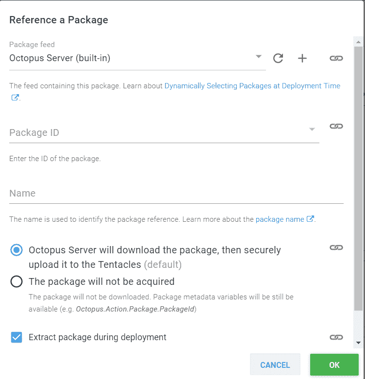
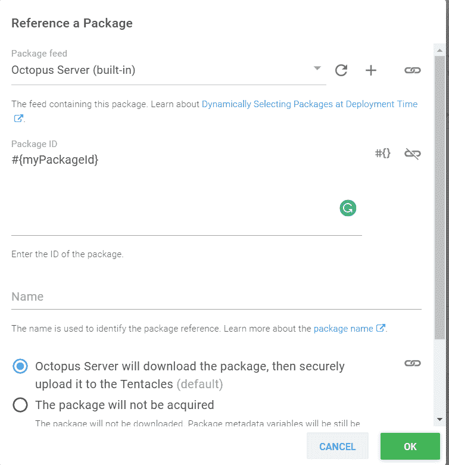

# 员工友好的自定义步骤模板- Octopus 部署

> 原文：<https://octopus.com/blog/worker-friendly-step-template>

## 介绍

2018 年 9 月，Michael Richardson 写了一篇[博文](https://octopus.com/blog/script-step-packages)介绍了在脚本步骤中引用包的功能。“为什么？”中描述的第二个场景说明在此功能之前，您需要先将包推送到目标，然后脚本任务才能针对提取的内容执行。Michael 继续解释说，这种方法既复杂又不能在 Octopus 服务器或工人上运行。

## 自定义步骤模板

使用 Michael 的想法，就像运行脚本步骤一样，我们能够从自定义步骤模板中引用包

[ ](#) [ ](#)

我们还能够通过将包 ID 分配给步骤模板的一个参数来使被引用的包动态化。

[](#)

这允许我们引用提取的包文件并对它们做一些事情:

```
$OctopusParameters["Octopus.Action.Package[$myPackageId].ExtractedPath"] 
```

## 专门的软件呢？

有时候，仅仅让文件在一个工作人员上可用并不足以使它们与工作人员兼容，比如将 SSIS 包部署到 SQL server。工人将有。它可以使用 ispac 文件，但是它没有安装知道如何使用它的软件。解决这个问题的一个方法是在你所有的员工身上安装这个软件。这增加了复杂性，因为您的所有员工都需要维护，以确保安装和/或更新了正确的软件版本。另一种方法是利用 PowerShell Gallery 在部署时安装必要的 PowerShell 模块。对于 SSIS 的例子，PowerShell 图库中的 SqlServer 模块包含必要的。允许工作人员部署。ispac 到 SQL server。

以下脚本用于演示目的。

使用下面的代码，我们可以检查 worker 是否安装了必要的模块。如果模块不可用，请将指定的版本(如果未指定，则为最新版本)下载到临时文件夹中，并将其包含在内，以便 cmdlets 可用。

首先，在当前工作文件夹中创建临时文件夹:

```
# Define PowerShell Modules path
$LocalModules = (New-Item "$PSScriptRoot\Modules" -ItemType Directory -Force).FullName 
```

接下来，我们将此文件夹添加到此会话的 PowerShell 模块路径中:

```
# Add folder to the PowerShell Modules Path
$env:PSModulePath = "$LocalModules;$env:PSModulePath" 
```

现在，让我们定义一个函数来检查是否安装了模块:

```
function Get-ModuleInstalled
{
    # Define parameters
    param(
        $PowerShellModuleName
    )

    # Check to see if the module is installed
    if ($null -ne (Get-Module -ListAvailable -Name $PowerShellModuleName))
    {
        # It is installed
        return $true
    }
    else
    {
        # Module not installed
        return $false
    }
} 
```

然后一个函数会在它丢失时安装它:

```
function Install-PowerShellModule
{
    # Define parameters
    param(
        $PowerShellModuleName,
        $LocalModulesPath
    )

    # Save the module in the temporary location
    Save-Module -Name $PowerShellModuleName -Path $LocalModulesPath -Force

    # Display
    Write-Output "Importing module $PowerShellModuleName ..."

    # Import the module
    Import-Module -Name $PowerShellModuleName
} 
```

最后，我们将定义一个函数来加载。以便可以使用它们的命名空间:

如果将它用于 SqlServer 模块，接下来将向 Get-ChildItem 添加一个 Exclude:

`Get-ChildItem -Path $ModulePath -Exclude msv*.dll`

```
Function Load-Assemblies
{
    # Declare parameters
    param(
        $PowerShellModuleName
    )

    # Get the folder where the module ended up in
    $ModulePath = [System.IO.Path]::GetDirectoryName((Get-Module $PowerShellModuleName).Path)

    # Loop through the assemblies
    foreach($assemblyFile in (Get-ChildItem -Path $ModulePath | Where-Object {$_.Extension -eq ".dll"}))
    {
        # Load the assembly
        [Reflection.Assembly]::LoadFile($assemblyFile.FullName) | Out-Null
    }    
} 
```

一旦定义了这些，调用我们的函数并在必要时安装:

```
# Check to see if SqlServer module is installed
if ((Get-ModuleInstalled -PowerShellModuleName "SqlServer") -ne $true)
{
    # Display message
    Write-Output "PowerShell module SqlServer not present, downloading temporary copy ..."

    # Download and install temporary copy
    Install-PowerShellModule -PowerShellModuleName "SqlServer" -LocalModulesPath $LocalModules

    # Dependent assemblies
    Load-Assemblies -PowerShellModuleName "SqlServer"
}
else
{
    # Load the IntegrationServices Assembly
    [Reflection.Assembly]::LoadWithPartialName("Microsoft.SqlServer.Management.IntegrationServices") | Out-Null # Out-Null supresses a message that would normally be displayed saying it loaded out of GAC
} 
```

对于我们的 SSIS 示例，我们的工作人员现在拥有了部署所需的组件。ispac 文件！

## 摘要

在这篇文章中，我们学习了如何从一个定制的步骤模板中引用一个包，通过使它成为一个步骤模板参数来使包 ID 引用成为动态的，以及动态地下载和安装 PowerShell 模块来制作工人友好的模板。