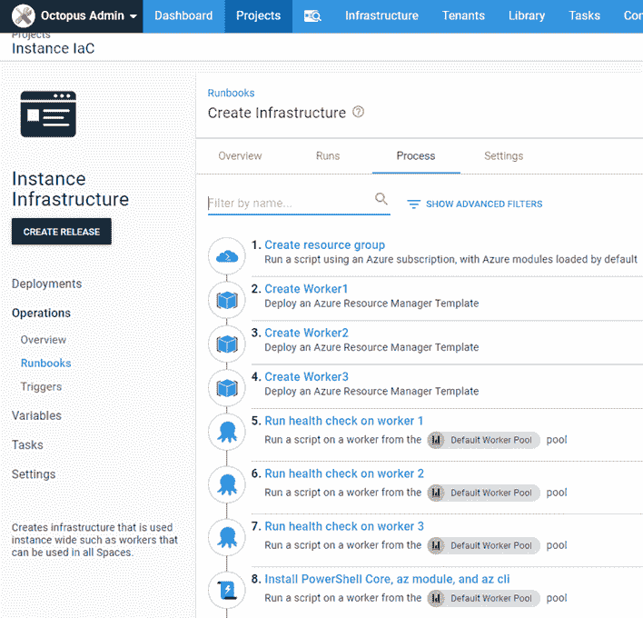
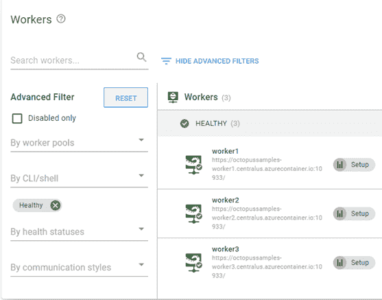

# 使用触手 Docker 图像创建工人- Octopus Deploy

> 原文：<https://octopus.com/blog/workers-as-containers>

[](#)

我最近需要在 Octopus Deploy 的[样本](https://samples.octopus.app)云实例上创建一些额外的临时工人。由于我只需要短命的工人，集装箱似乎是完美的解决方案。我把它们旋转起来，它们做一些工作，然后我把它们拆下来。在这篇文章中，我演示了如何在 Azure 托管的容器中创建 workers，执行健康检查，以及安装其他软件组件。

## 动员工人

我们需要执行的第一步是创建一本操作手册。这篇文章假设你对我们的 [runbooks](https://octopus.com/docs/runbooks) 功能有些熟悉。

我的操作手册由以下步骤组成:

*   创建 Azure 资源组
*   运行 ARM 模板来创建 Octopus Deploy 触手容器
*   运行健康检查
*   安装附加软件

在这个例子中，我使用的是微软的 Azure 平台，但也可以使用任何其他云，包括 AWS 和谷歌云。我们的[用 CloudFormation 在 AWS 中创建 EC2 实例](/blog/aws-cloudformation-ec2-examples)的博文用一个详细的例子介绍了 AWS 中的类似场景。

### 创建 Azure 资源组

为了便于移除和整体整洁，第一步使用**运行 Azure 脚本**步骤创建一个 Azure 资源组:

```
$resourceGroupName = $OctopusParameters["Azure.Network.ResourceGroup.Name"]
$resourceGroupLocation = $OctopusParameters["Azure.Location.Abbr"]

if ((az group exists --name $resourceGroupName) -eq $false)
{
    Write-Output "Creating resource group $resourceGroupName in $resourceGroupLocation"
    az group create --location $resourceGroupLocation --name $resourceGroupName
} 
```

### 运行 ARM 模板

Azure 容器实例是一种快速简单的方法来提升工作容器。使用一个小的 Azure 资源管理器(ARM)模板，我们可以自动创建 [Octopus 触手](https://hub.docker.com/r/octopusdeploy/tentacle)容器。

<details><summary>模板代码</summary></details>

```
{
    "$schema": "https://schema.management.azure.com/schemas/2015-01-01/deploymentTemplate.json#",
    "contentVersion": "1.0.0.0",
    "parameters": {
        "location": {
            "type": "string"
        },
        "containerName": {
            "type": "string"
        },
        "imageType": {
            "type": "string",
            "allowedValues": [
                "Public",
                "Private"
            ]
        },
        "imageName": {
            "type": "string"
        },
        "osType": {
            "type": "string",
            "allowedValues": [
                "Linux",
                "Windows"
            ]
        },
        "numberCpuCores": {
            "type": "string"
        },
        "memory": {
            "type": "string"
        },
        "restartPolicy": {
            "type": "string",
            "allowedValues": [
                "OnFailure",
                "Always",
                "Never"
            ]
        },
        "ipAddressType": {
            "type": "string"
        },
        "ports": {
            "type": "array"
        },
        "dnsNameLabel": {
            "type": "string"
        },
        "environmentVariables": {
            "type": "array"
        }
    },
    "resources": [
        {
            "location": "[parameters('location')]",
            "name": "[parameters('containerName')]",
            "type": "Microsoft.ContainerInstance/containerGroups",
            "apiVersion": "2018-10-01",
            "properties": {
                "containers": [
                    {
                        "name": "[parameters('containerName')]",
                        "properties": {
                            "image": "[parameters('imageName')]",
                            "resources": {
                                "requests": {
                                    "cpu": "[int(parameters('numberCpuCores'))]",
                                    "memoryInGB": "[float(parameters('memory'))]"
                                }
                            },
                            "ports": "[parameters('ports')]",
                            "environmentVariables": "[parameters('environmentVariables')]"
                        }
                    }
                ],
                "restartPolicy": "[parameters('restartPolicy')]",
                "osType": "[parameters('osType')]",
                "ipAddress": {
                    "type": "[parameters('ipAddressType')]",
                    "ports": "[parameters('ports')]",
                    "dnsNameLabel": "[parameters('dnsNameLabel')]"
                }
            },
            "tags": {}
        }
    ]
} 
```

模板需要输入一些参数:

*   **位置**:Azure 中的位置代码，即 centralus
*   **容器名**:容器的名称
*   **imageType** :公共|私有
*   **图像名** : `octopusdeploy/tentacle`
*   osType : Linux | Windows
*   **numberCpuCores** :要使用的内核数量
*   **内存**:容器使用的数字(以 GB 为单位)
*   **重启策略**:参见 Docker [文档了解选项](https://docs.docker.com/config/containers/start-containers-automatically/)
*   **IP address type**:Public | Private
*   **端口**:要暴露的端口数组
*   **dnsNameLabel** : DNS 条目的 DNS 前缀，即【dnsNameLabel】。[azure region]. azure container . io
*   **环境变量**:要传递给容器的环境变量数组

该模板将启动 Octopus Deploy 触手的 Azure 容器实例。

我选择了 Linux 变种，因为它比 Windows 容器小得多(254.39 MB 对 2.27 GB)。

### 运行健康检查

内置的健康检查模板仅适用于部署目标，但是，有一个专门为工作人员开发的社区步骤:[工作人员健康检查](https://library.octopus.com/step-templates/c6c23c7b-876d-4758-a908-511f066156d7/actiontemplate-worker-health-check)。运行此步骤可确保我们的员工身体健康，并为下一步做好准备。

### 安装附加软件

工作人员将需要与 Azure 和 AWS 进行交互。触手映像只有运行所需的最少软件，所以我需要安装以下软件:

*   PowerShell 核心
*   Azure CLI
*   AWS CLI

使用部署目标，您可以针对具有特定角色的所有目标执行步骤。由于工人没有角色，我需要找到一个替代者。脚本控制台允许您对池中的所有工作线程执行相同的代码。因为 Octopus 是 API 优先编写的，所以我能够复制脚本控制台的功能来运行代码，以便通过 API 针对整个池安装附加软件:

```
# Define parameters
$baseUrl = $OctopusParameters['Global.Base.Url'] 
$apiKey = $OctopusParameters['Global.Api.Key'] 
$spaceId = $OctopusParameters['Octopus.Space.Id']
$spaceName = $OctopusParameters['Octopus.Space.Name']
$workerPoolName = $OctopusParameters['Project.WorkerPool.Name']

if ($baseUrl.EndsWith("/"))
{
    $baseUrl = $baseUrl.SubString(0, $baseUrl.LastIndexOf("/"))
}

# Get worker pool
$workerPool = ((Invoke-RestMethod -Method Get -Uri "$baseUrl/api/$spaceId/workerpools/all" -Headers @{"X-Octopus-ApiKey"="$apiKey"}) | Where-Object {$_.Name -eq $workerPoolName})

# Build payload
$jsonPayload = @{
    Name = "AdHocScript"
    Description = "Script run from management console"
    Arguments = @{
        MachineIds = @()
        TenantIds = @()
        TargetRoles = @()
        EnvironmentIds = @()
        WorkerIds = @()
        WorkerPoolIds = @($workerPool.Id)
        TargetType = "WorkerPools"
        Syntax = "Bash"
        ScriptBody = @"
# Update the list of products
sudo apt-get update

# Install wget
sudo apt-get install wget -y

# Download the Microsoft repository GPG keys
wget https://packages.microsoft.com/config/debian/10/packages-microsoft-prod.deb

# Register the Microsoft repository GPG keys
sudo dpkg -i packages-microsoft-prod.deb

# Update the list of products
sudo apt-get update

# Install PowerShell
sudo apt-get install -y powershell

# Install az module
echo "Installing az module ..."
pwsh -Command "& {Install-Module az -Scope AllUsers -Force}" > /tmp/azModuleInstall.log

# Install Az cli
curl -sL https://aka.ms/InstallAzureCLIDeb | sudo bash

# Install aws cli
sudo apt-get install awscli -y
"@
    }
    SpaceId = "$spaceId"
}

$scriptTask = (Invoke-RestMethod -Method Post -Uri "$baseUrl/api/tasks" -Body ($jsonPayload | ConvertTo-Json -Depth 10) -Headers @{"X-Octopus-ApiKey"="$apiKey"})

# Check to see if the health check is queued
while ($scriptTask.IsCompleted -eq $false)
{
    Write-Output "Waiting 5 seconds ..."
    Start-Sleep -Seconds 5
    $scriptTask = (Invoke-RestMethod -Method Get -Uri "$baseUrl/api/tasks/$($scriptTask.Id)" -Headers @{"X-Octopus-ApiKey"="$apiKey"})
}

Write-Output "Installation complete!" 
```

因为我需要创建多个工人，所以步骤 2 和 3 在我的流程中创建了多次

[](#)

## 集装箱化工人

当配置为监听模式时，触手容器被编码为自动连接到 Octopus 服务器并向指定的工作池注册。运行手册完成后，我有三个健康的工人。

[](#)

## 结论

在这篇文章中，我演示了如何创建作为容器运行的工人。这为您提供了创建工作线程的灵活性，而无需管理虚拟机！