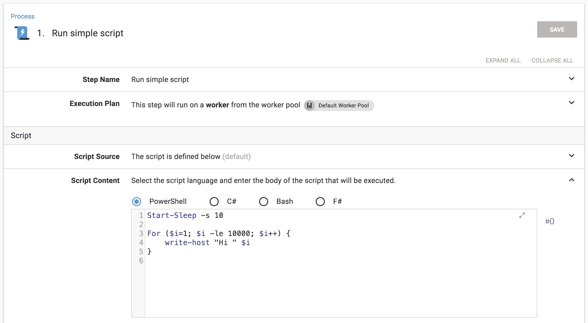
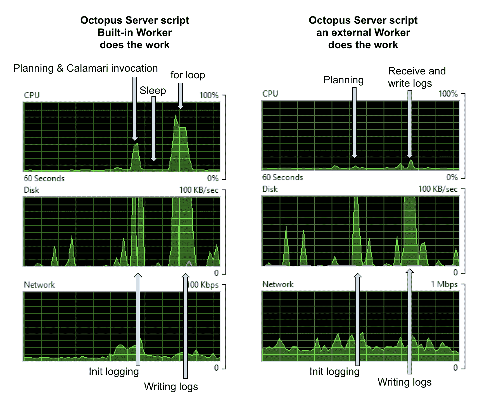
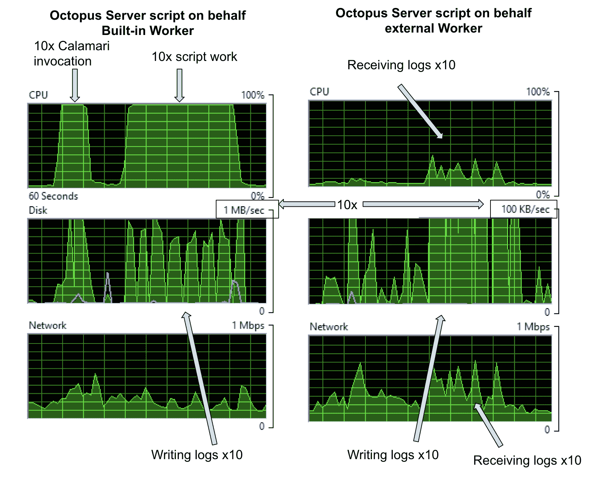
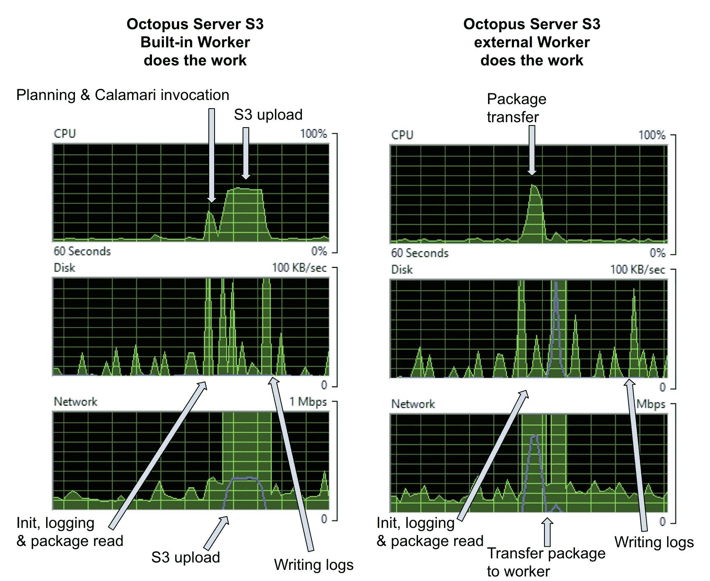
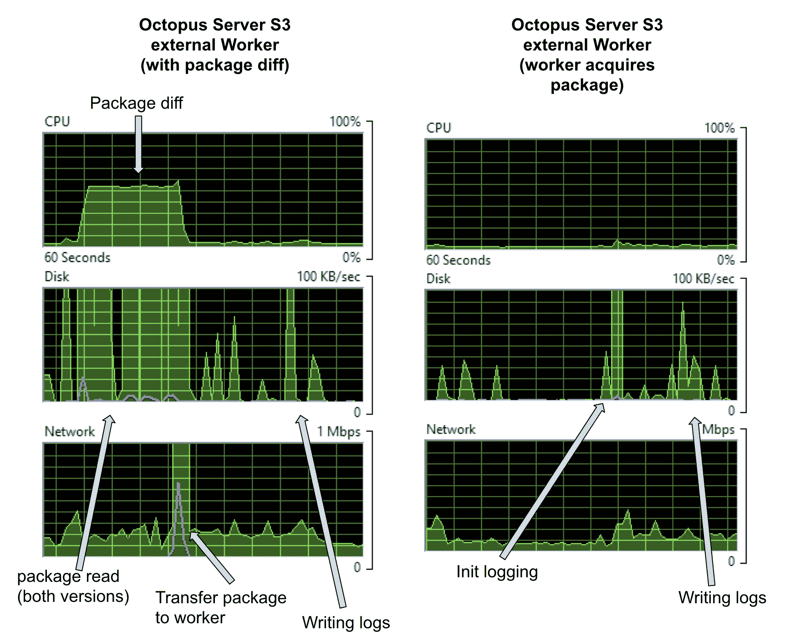
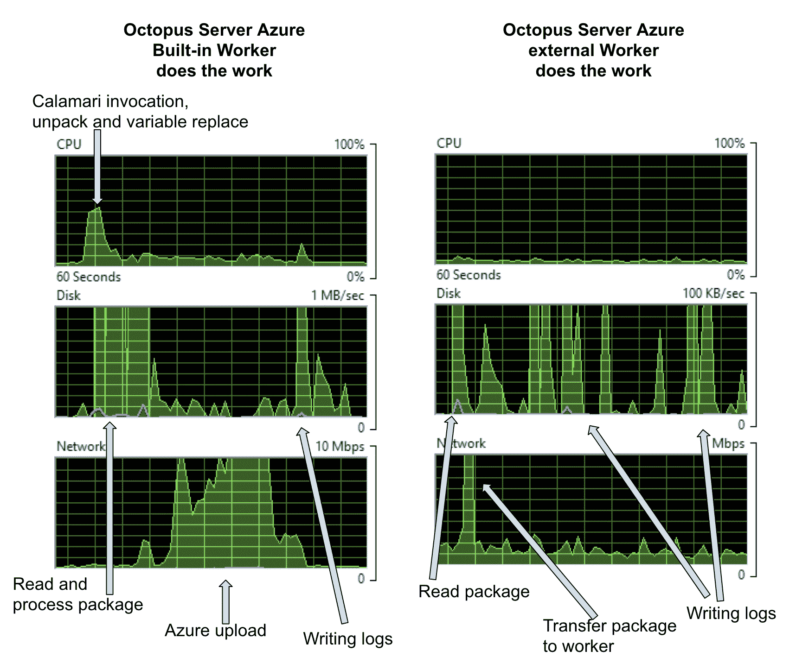
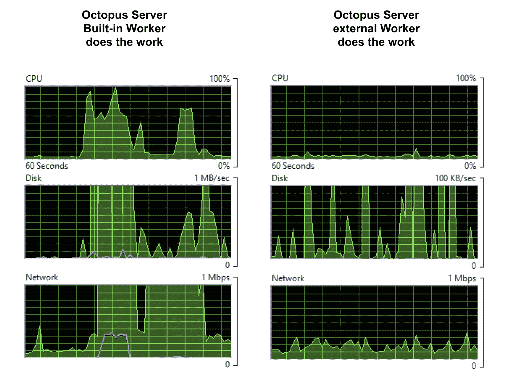

# Octopus 工作人员和绩效- Octopus 部署

> 原文：<https://octopus.com/blog/workers-performance>

[](#)

[在上一篇](https://octopus.com/blog/octopus-workers)中，我介绍了工人和一些可以用他们做的事情。我也答应给你更多的细节。从那以后，我们在 2018.7.0 版本中交付了工人，八达通客户已经拿起并开始使用它。现在我又有了几个帖子。

外部工作人员让你将一些部署工作从你的 Octopus 服务器转移到其他机器上。你可以简单地从安全的角度将工作转移给工人，例如，这样脚本就不会在你的 Octopus 服务器上运行。但是将工作从服务器上移走还有其他原因。其中之一就是性能。这一次，我将研究在部署期间使用 Workers 对您的 Octopus 服务器性能的影响。

现在，在这种情况下，我不得不从经典的警告开始，你的里程可能会有所不同。你的八达通服务器上有很多东西。根据您的设置，您可能将数据库放在同一台机器上，也可能放在其他地方，您可能将日志存储在本地或共享上，Octopus 运行系统任务以及您的部署，您的[部署模式将极大地影响服务器正在进行的](https://octopus.com/docs/administration/managing-infrastructure/performance#tip-task-logs)工作。在这篇文章中，我将研究部署期间服务器上的 CPU、磁盘和网络负载。

我们一直在努力提高 Octopus 的性能。有时这就是数据库性能。有时，它是寻找我们可以优化或缓存以提高 API 性能的部分。这篇文章不是关于这些。这是关于当你运行一个部署时轮子何时上路的问题。章鱼无法围绕这些位进行优化。这是部署的实际工作，所以必须完成。但是您可以分配工作量，以获得对您来说最好的结果。

您的 Octopus 服务器是您的部署基础设施的核心，过载的 Octopus 服务器会使部署变得缓慢，并使部署者沮丧。然而，使用 Workers，您可以有效地将 CPU、磁盘和网络负载转移到外部机器，让您的 Octopus 服务器休息一下，并促进您的部署。

在这篇文章中，我将把一些东西分开，这样你就可以理解工作的各个部分，以及将你的服务器的工作分配给工作机的权衡。为此，我将从您可以看到的角度来运行所有内容。因此，这不是关于我可以在内部测量什么，而是关于你可以在你的机器上观察到什么，以及它如何影响你的服务器和你的部署时间。

为了做到这一点，我不打算用数字或基准来谈论，而只是简单地展示资源监视器中的图表。没有花哨的工具，只是 AWS 中一个新的 Octopus 服务器，一个每个人都有的工具，以及对图形上下波动的解释。

下面的案例是玩具示例，旨在展示概念，而不是代表真实的部署模式。但是，如果我可以在这些简单的例子上演示负载削减，想象一下您可能在 Octopus 实例上获得的负载削减，以及随之而来的部署和可用性方面的改进，以及更健壮的 Octopus 服务器设置。

## 案例 1:一个简单的脚本

好了，让我们用一个非常简单的部署来热身。在部署时模拟任务的脚本。它休眠 10 秒钟，然后旋转到 10，000 次写入日志消息。

[](#)

因为这是一个紧密的循环，它会影响 CPU 因为它写日志，所以会撞到磁盘。我已经将脚本定位于默认的工作池。因此，如果池是空的，它将在 Octopus 服务器上的内置 Worker 上运行，如果池包含 Worker，它将在外部 Worker 机器上运行。

当缺省池为空时，该步骤在 Octopus 服务器上的内置 Worker 上运行，Octopus 服务器上的负载如下图所示。当我将一个 Worker 放入缺省池中时，该步骤在那个外部 Worker 上运行，Octopus 服务器上的负载看起来就像右下图所示。

[](#)

在我的设置中，数据库和日志存储都在 Octopus 服务器上，所以 CPU 上的第一个任务包含一些数据库工作以及规划部署。但是在我的例子中，数据库太小了，所以我忽略它的影响。

在左边，我们看到一个 CPU 命中结果是调用一个新的 [Calamari](https://github.com/OctopusDeploy/Calamari) (我们的开源的，基于约定的部署可执行文件)进程的成本。睡眠者将工作与第二个尖峰分开，第二个尖峰主要是`for`循环。在“磁盘”下，您可以看到用于设置日志等并将日志写入磁盘的尖峰。磁盘图表上的比例让您知道，这个简单的日志写操作并没有给我们带来太多负担。

在右边，当实际工作发生在外部工作机器上时，磁盘活动与以前基本相同:因为，在这个例子中，服务器与日志存储在同一个机器上，这些成本总是在这里被看到。然而，CPU 使用率消失了，这表明第一个图中的初始峰值是 Calamari 调用。有一些网络活动将日志从 Worker 传输回 Octopus 服务器，但是这里太小了，看不清楚；您将在后面的示例中看到网络点击。

我们可以用一些额外的基础设施来平衡这里的磁盘命中率:例如，将日志存储在其他地方会将这些成本转移到其他机器上(以网络流量为代价)。

关于成本需要记住的一点是，每个步骤的每个角色都会调用 Calamari。因此，如果我将脚本定位为代表包含十个部署目标的角色运行，我们将获得 10 倍的 Calamari 调用和 10 倍的脚本成本。在你的 Octopus 服务器上的内置工作器上，这加起来，但是如果我们把它卸载到外部工作器上，这几乎是不可察觉的。

[](#)

## 案例 2:S3 文件上传

最后一个例子显示了一个非常明显的例子，如果有计算工作可以转移到一个工人身上，那么这样做就转移了 Octopus 服务器的整个 CPU 开销。但这也暗示了需要做出其他的权衡，正如我们将在本例中看到的，有时服务器会产生计算工作。

在这个例子中，我正在 S3 上传一个 296MB 的文件。同样，我将这一步的目标放在了默认的工人池。当该池为空时，它在内置的 Worker 上运行，并在下面的左侧给出了图形，当该池包含外部 Worker 时，它在该机器上运行，对 Octopus 服务器的影响由右侧的图形给出。

[](#)

在左侧，您可以看到将包推送到 AWS S3 需要一些 CPU 成本，而通过网络获取包需要一些网络开销。在此示例中，包已经在服务器上。如果服务器必须首先获得包，我们会看到[额外的网络和磁盘成本](https://octopus.com/docs/deployments/packages/transfer-package)。

在右边，整个包仍然必须通过网络出去，所以网络成本是相同的，但有趣的是，将包推送到 S3 比 Octopus 将它推送到一个工人那里花费更多的 CPU。

当我们构建该包的下一个版本并再次部署该项目时会怎么样呢？在这种情况下，在 Octopus 服务器上运行内置 Worker 的成本是一样的；然而，在外部工作器上，我们可以选择不推送整个包，而是计算包的差异并只发送差异。如果我们这样做，我们会得到一个如下图所示的图表。

[](#)

对于近 300MB 的包，有一个新的 CPU 成本，这是差异的计算，在这种情况下，我们可以看到磁盘上的表现，因为 Octopus 必须访问包的两个版本来计算差异。在任务日志中，我看到

```
22:24:14   Verbose  |         Finding earlier packages that have been uploaded to this Tentacle.
22:24:15   Verbose  |         Found 1 earlier version of bigpackage on this Tentacle
22:24:15   Verbose  |         - 2018.7.6: C:\Octopus\TestInstance1\Files\bigpackage@S2018.7.6@103E651645EFF14EB4E34C8DA3AC2E6C.zip
22:24:15   Verbose  |         Process C:\Windows\system32\WindowsPowershell\v1.0\PowerShell.exe in C:\Octopus\TestInstance1\Work\20180806222409-891-383 exited with code 0
22:24:15   Info     |         Found matching version 2018.7.6: C:\Octopus\Packages\bigpackage\bigpackage.2018.7.6.zip
22:24:39   Info     |         Delta for package bigpackage v2018.7.7 successfully uploaded and applied.
                    |       
                    |         Success: Building delta for bigpackage v2018.7.7 (296.824 MB)
22:24:15   Info     |           Using package C:\Octopus\Packages\bigpackage\bigpackage.2018.7.6.zip with hash 68dc6388f3f467eeeec802c8ad6e8f207309c982 for creating delta.
22:24:15   Verbose  |           Building signature file: C:\Octopus\OctopusServer\PackageCache\bigpackage.2018.7.6.zip.octosig
22:24:15   Verbose  |           - Using nearest package: C:\Octopus\Packages\bigpackage\bigpackage.2018.7.6.zip
22:24:18   Verbose  |           Building delta file: C:\Octopus\OctopusServer\PackageCache\bigpackage.2018.7.6_68DC6388_to_2018.7.7_19AF67C0.octodelta
22:24:18   Verbose  |           - Using package: C:\Octopus\Packages\bigpackage\bigpackage.2018.7.7.zip.
22:24:18   Verbose  |           - Using signature: C:\Octopus\OctopusServer\PackageCache\bigpackage.2018.7.6.zip.octosig
22:24:32   Info     |           Original package was 296.824 MB, delta file is 109.195 MB (63.21% size reduction). 
```

因此，在这种情况下，我得到了 63.21%的不错的减少，但如果这两个包更相似，计算差异的成本回报会更好(有趣的是，这两个包是 Octopus Server 版本 2018.7.7 和 2018.7.8，所以我预计它们会更相似——这只是显示了我们在每个版本中塞进了多少工作)。

触手还可以选择直接获取包，而不是把包放在服务器上。我们正在添加新的特性来允许每步多个包，所以我们正在修改它在 UI 中的外观，但是对于这个测试，我设置了 [Octopus 系统变量](https://octopus.com/docs/projects/variables/system-variables) `Octopus.Action.Package.DownloadOnTentacle`。在这种情况下，我们的 Octopus 服务器几乎不做任何事情(上图右侧),它只是询问工人是否完成并写入日志的成本。

## 案例 Azure Web 应用部署

Azure 部署都需要一个工人。所有的 Azure 步骤要么使用 WebDeploy，要么使用 Azure CmdLets，所以要么是内置的，要么是外部的。

为了这个测试，我从 Github 克隆了一个公共的 ASP.NET 核心项目，做了一些小的修改以允许 Octopus 变量替换，使用`dotnet publish`和`octo pack`构建和打包，并使用我们的内置步骤部署为一个 Web 应用程序。最终的包非常小，只有 21MB 多一点。

同样，该步骤的目标是在默认的工作池中运行。因此，当池为空时，它在 Octopus 服务器上的内置 Worker 上运行，并在下面的左侧给出图形，当池包含 Worker 时，该步骤在该机器上运行，对 Octopus 服务器的影响显示在右侧的图形中。

【T2 

左边，CPU 成本是开始部署，调用 Calamari，解包，做变量替换，和 Azure 协商需要上传什么文件。磁盘成本是出于同样的原因，网络成本是与 Azure 的协商和将数据推送到云。这是一个非常小的封装，因此所有这些成本都会随着封装尺寸的增加而增加。如果你正在把 100 兆以上的包推给 Azure，通过预部署和后部署脚本、配置转换、变量替换等等。，然后你会在这里看到一个更大的点击。

在右边，当该步骤在外部工作器上运行时，Octopus 服务器上唯一的开销是少量的网络流量和写入一个 1.1MB 的日志文件。注意，在这种情况下，磁盘图形上的刻度缩小了 10 倍。同样，通过选择将包直接下载到 Worker 和外部日志存储，可以进一步降低这些成本。

## 案例 4:全部在一起

我已经描述了三个漂亮的玩具部署示例，但是每一个都涉及一些必须完成的内在工作，以使部署成功。所以没有理由优化掉这些成本，但是这些成本是可以转移的。下图显示了所有三个项目同时运行时 Octopus 服务器的成本。左边是使用内置工作人员，右边是外部工作人员执行实际的部署工作。请注意磁盘图表上的比例——服务器左侧是右侧的 10 倍。

[](#)

现在，左边的图表并不是该服务器有史以来最艰难的一天，但是如果这还没有接近您的 Octopus 实例上的工作负载，那么您可能可以通过将 CPU 工作、磁盘命中和网络流量从您的 Octopus 服务器上移走来释放更多的资源。一旦工作负载变得更大，它也会开始对总部署时间产生影响，因为并行部署会争夺资源，因此转移到工作人员可能会加快您的部署，并将工作转移到服务器之外。

## 结论

在这篇文章中，通过三个简单的部署，我挑选了部署在你的 Octopus 服务器上的各种成本。这些例子并不大也不真实，所以如果我可以在这些玩具例子中减少负载，你应该可以在真实的工作负载中做更多的事情。我希望它们让您对部署中的一些活动部分有了更多的了解，并帮助您理解如何为使用 Workers 的[步骤优化部署。有很多选择，例如，从从服务器部署，到只推送包差异，到将整个包处理转移到工作器——也许差异足够小，以至于在服务器上花费 CPU 将在网络流量上取得巨大胜利，或者也许你可以将你的包 feeds、工作器和 Azure 目标放在一起，以便证明是最好的网络选项。工作人员只是为您提供如何设置部署以及如何分配工作的选项。](https://octopus.com/docs/getting-started/best-practices/worker-configuration)

我们也有[性能文档](https://octopus.com/docs/administration/managing-infrastructure/performance)来帮助你优化你的八达通服务器。

记住，工人没有什么特别的。它只是一台触须或 SSH 机器，因此您可以获得您拥有的任何备用计算资源——可能是工作不多的现有触须虚拟机，可能是本地机器，可能是具有备用周期的开发或测试箱——或者您可以仅为部署负载提供特殊的工作人员基础架构。

下一次，我将仔细观察每个目标都连接了默认工作人员池的 PaaS 目标，这样您就可以让您的工作人员靠近您的目标，甚至可以用防火墙隔离您的基础架构，以便工作人员从安全的网络轮询服务器，并且只有工作人员有权部署到目标。

愉快的部署！