# Selenium 系列:样本 web 页面——Octopus Deploy

> 原文：<https://octopus.com/blog/selenium/5-a-sample-web-page/a-sample-web-page>

这篇文章是关于[创建 Selenium WebDriver 测试框架](/blog/selenium/0-toc/webdriver-toc)的系列文章的一部分。

既然我们已经有了用于编写 WebDriver 测试的框架的基础，是时候开始与网页交互了。

为了展示 WebDriver 的强大功能，我们将首先创建一个简单的 web 页面，其中包含常见的表单元素，以及其他常见的 HTML 元素，如 images 和 div。

完整的网页如下所示:

```
<!DOCTYPE html>
<html lang="en">
<head>
    <meta charset="UTF-8">
    <title>A sample web site</title>
    <style>
        form > * {
            display: block;
        }

    </style>
    <script>
        /*
            Print a message to the page
        */
        function interactionMessage(message) {
            document.getElementById('message').textContent = message;
        }

        /*
            Create a new element on the page after 5 seconds
        */
        setTimeout(function() {
            var newDiv = document.createElement("div");
            newDiv.setAttribute("id", "newdiv_element");
            newDiv.textContent = "I am a newly created div";
            document.body.appendChild(newDiv);
            document.getElementById("div3_element").style.display = "";
        }, 5000);

    </script>
</head>
<body>
<div id="message"></div>
<form id="form_element" onsubmit="interactionMessage('Form Submitted'); return false">
    <button name="button_element" id="button_element" type="button" onclick="interactionMessage('Button Clicked')">Form Button</button>
    <input name="text_element" id="text_element" type="text" oninput="interactionMessage('Text Input Changed')">
    <select name="select_element" id="select_element" onchange="interactionMessage('Select Changed')">
        <optgroup label="Group 1">
            <option id="option1.1_element">Option 1.1</option>
        </optgroup>
        <optgroup label="Group 2">
            <option id="option2.1_element">Option 2.1</option>
            <option id="option2.2_element">Option 2.2</option>
        </optgroup>
        <optgroup label="Group 3" disabled>
            <option id="option3.1_element">Option 3.1</option>
            <option id="option3.2_element">Option 3.2</option>
            <option id="option3.3_element">Option 3.3</option>
        </optgroup>
    </select>
    <textarea name="textarea_element" id="textarea_element" name="textarea" rows="10" cols="50"
              oninput="interactionMessage('Text Area Changed')"></textarea>
    <div><input name="radio_group" id="radio1_element" type="radio" name="color" value="blue"
                onchange="interactionMessage('Radio Button Changed')"> Blue
    </div>
    <div><input name="radio_group" id="radio2_element" type="radio" name="color" value="green"
                onchange="interactionMessage('Radio Button Changed')"> Green
    </div>
    <div><input name="radio_group" id="radio3_element" type="radio" name="color" value="red"
                onchange="interactionMessage('Radio Button Changed')"> Red
    </div>
    <div><input name="checkbox1_element" id="checkbox1_element" type="checkbox" name="vehicle" value="Bike"
                onchange="interactionMessage('Checkbox Changed')"> I have a bike
    </div>
    <div><input name="checkbox2_element" id="checkbox2_element" type="checkbox" name="vehicle" value="Car" checked
                onchange="interactionMessage('Checkbox Changed')"> I have a car
    </div>
    <input id="submit_element" type="submit">
</form>

<div id="div_element" onclick="interactionMessage('Div Clicked')">I am a div</div>
<div id="div2_element" onclick="interactionMessage('Div 2 Clicked')">I am a div too</div>
<div id="div3_element" style="display: none" onclick="interactionMessage('Div 3 Clicked')">I am a hidden div</div>
</body>
</html> 
```

让我们来看看这个网页的一些有趣的方面。

我们有一个名为`interactionMessage()`的 JavaScript 函数，它在页面上显示一些文本。我们将通过 WebDriver 与之交互的 HTML 元素将使用像`onclick`、`onchange`或`oninput`这样的事件将消息打印到页面上。然后，我们可以验证该消息的存在，以确保 WebDriver 确实如我们所期望的那样与元素进行了交互。

```
function interactionMessage(message) {
  document.getElementById('message').textContent = message;
} 
```

第二个 JavaScript 函数使用`setTimeout()`函数等待 5 秒钟，然后向页面追加一个新的`<div>`元素。它还重置了 ID 为`div3_element`的 div 的样式，这将具有显示隐藏元素的效果。

在以后的文章中，我们将使用这两种对网页的动态更新来演示如何使用隐式和显式等待:

```
setTimeout(function() {
  var newDiv = document.createElement("div");
  newDiv.setAttribute("id", "newdiv_element");
  newDiv.textContent = "I am a newly created div";
  document.body.appendChild(newDiv);
  document.getElementById("div3_element").style.display = "";
}, 5000); 
```

我们有一个`<form>`元素，它将保存一组常见的 HTML 表单元素，如按钮、文本框、单选按钮等。当表单提交时，`onsubmit`事件调用`interactionMessage()`方法显示一条消息。通过返回`false`阻止表单在提交时尝试重新加载页面:

```
<form id="form_element" onsubmit="interactionMessage('Form Submitted'); return false"> 
```

表单内部是文本框、文本区域、按钮、单选按钮、复选框和选择元素的集合。像父元素`<form>`一样，大多数子元素调用`interactionMessage()`方法来响应事件:

```
<button name="button_element" id="button_element" type="button" onclick="interactionMessage('Button Clicked')">Form Button</button>
<input name="text_element" id="text_element" type="text" oninput="interactionMessage('Text Input Changed')">
<select name="select_element" id="select_element" onchange="interactionMessage('Select Changed')">
    <optgroup label="Group 1">
        <option id="option1.1_element">Option 1.1</option>
    </optgroup>
    <optgroup label="Group 2">
        <option id="option2.1_element">Option 2.1</option>
        <option id="option2.2_element">Option 2.2</option>
    </optgroup>
    <optgroup label="Group 3" disabled>
        <option id="option3.1_element">Option 3.1</option>
        <option id="option3.2_element">Option 3.2</option>
        <option id="option3.3_element">Option 3.3</option>
    </optgroup>
</select>
<textarea name="textarea_element" id="textarea_element" name="textarea" rows="10" cols="50"
          oninput="interactionMessage('Text Area Changed')"></textarea>
<div><input name="radio_group" id="radio1_element" type="radio" name="color" value="blue"
            onchange="interactionMessage('Radio Button Changed')"> Blue
</div>
<div><input name="radio_group" id="radio2_element" type="radio" name="color" value="green"
            onchange="interactionMessage('Radio Button Changed')"> Green
</div>
<div><input name="radio_group" id="radio3_element" type="radio" name="color" value="red"
            onchange="interactionMessage('Radio Button Changed')"> Red
</div>
<div><input name="checkbox1_element" id="checkbox1_element" type="checkbox" name="vehicle" value="Bike"
            onchange="interactionMessage('Checkbox Changed')"> I have a bike
</div>
<div><input name="checkbox2_element" id="checkbox2_element" type="checkbox" name="vehicle" value="Car" checked
            onchange="interactionMessage('Checkbox Changed')"> I have a car
</div>
<input id="submit_element" type="submit"> 
```

在`<form>`之外，我们有一些 image 和 div 元素:

```

<div id="div_element" onclick="interactionMessage('Div Clicked')">I am a div</div>
<div id="div2_element" onclick="interactionMessage('Div 2 Clicked')">I am a div too</div> 
```

最后一个 div 元素的`display`样式设置为`none`，实际上在页面上隐藏了它。这个元素将在 5 秒钟后由`setTimeout()`方法调用的 JavaScript 显示:

```
<div id="div3_element" style="display: none" onclick="interactionMessage('Div 3 Clicked')">I am a hidden div</div> 
```

最终结果是这样的。

[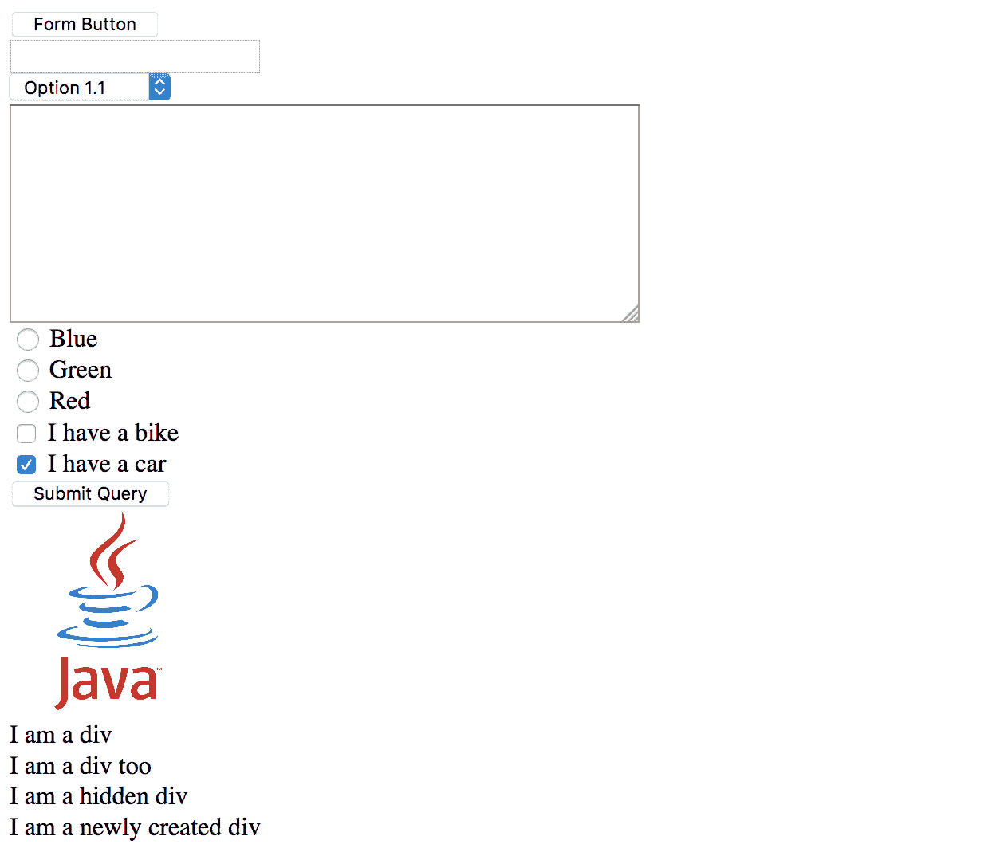](#)

为了在 Java 测试中使用这个页面，我们需要将它保存在`src/test/resources`目录中。这是找到资源文件的标准 Maven 目录。

这个目录还不存在，所以我们通过右击测试目录并选择新➜目录来创建它。

[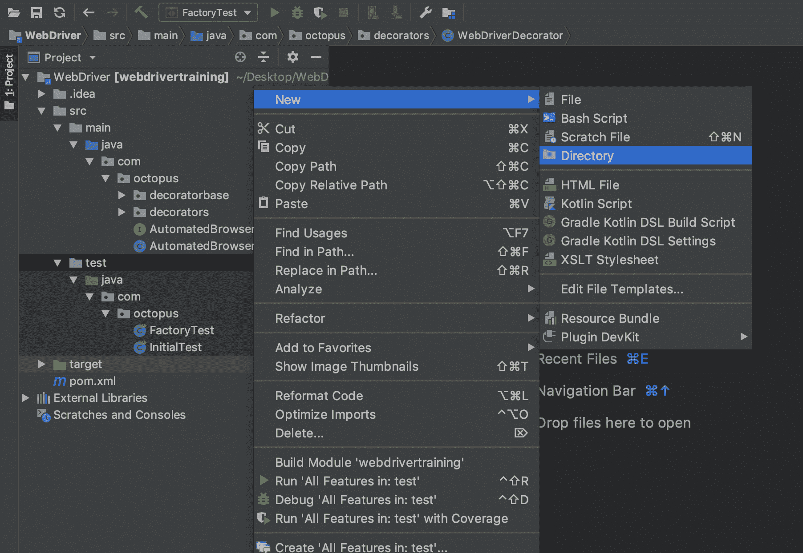](#)

输入名称 resources，然后单击`OK`按钮。

[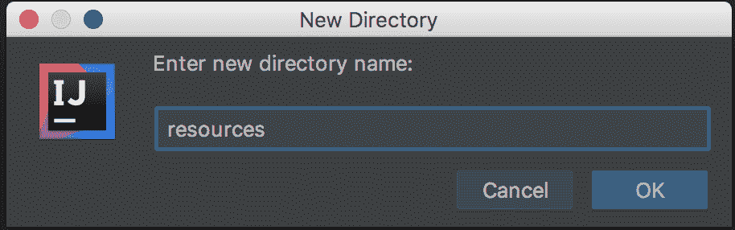](#)

正如我们已经多次看到的，在 Maven 项目中创建一个具有特殊意义的目录并不会自动更新 IntelliJ 项目。我们可以在下面的截图中看到,`resources`目录现在已经存在，但是在我们的项目中它看起来像一个普通的目录。

[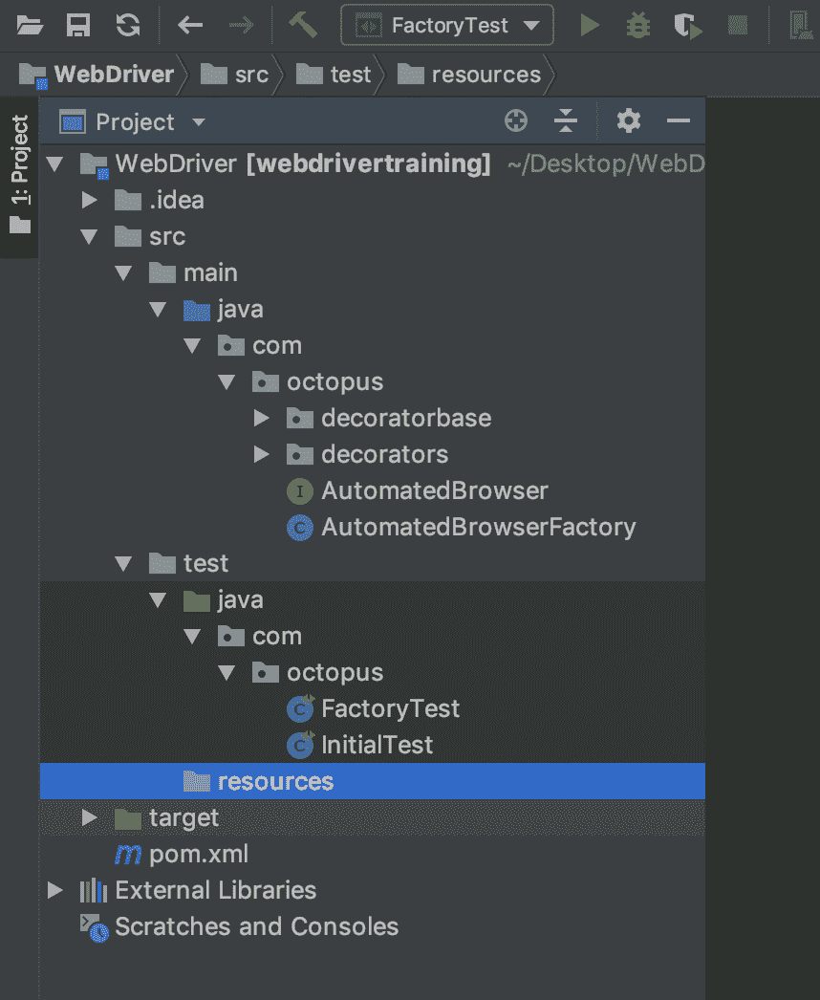](#)

要更新 IntelliJ 项目，打开`Maven Projects`工具窗口并点击`Reimport All Maven Projects`按钮。

[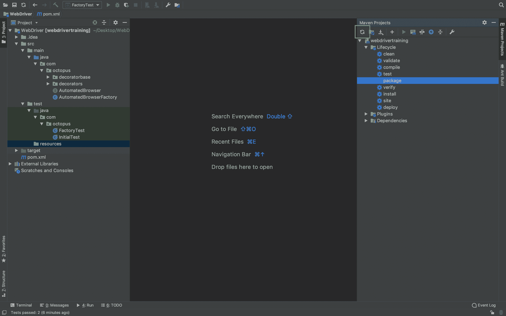](#)

目录的图标被更新，以反映这样一个事实，即它将保存像我们的示例 web 页面这样的文件。

[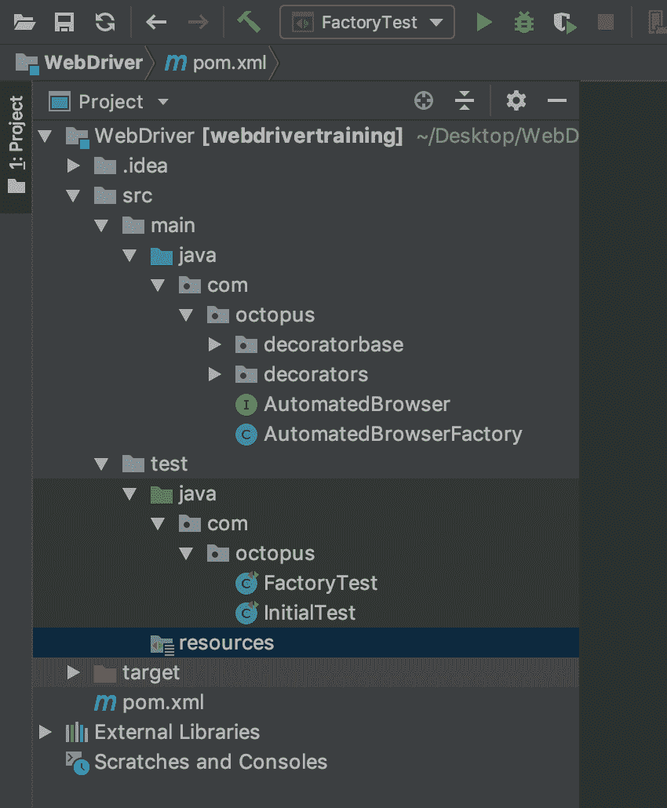](#)

一旦配置了`resources`文件夹，将 HTML 代码保存到一个名为`form.html`的文件中。

[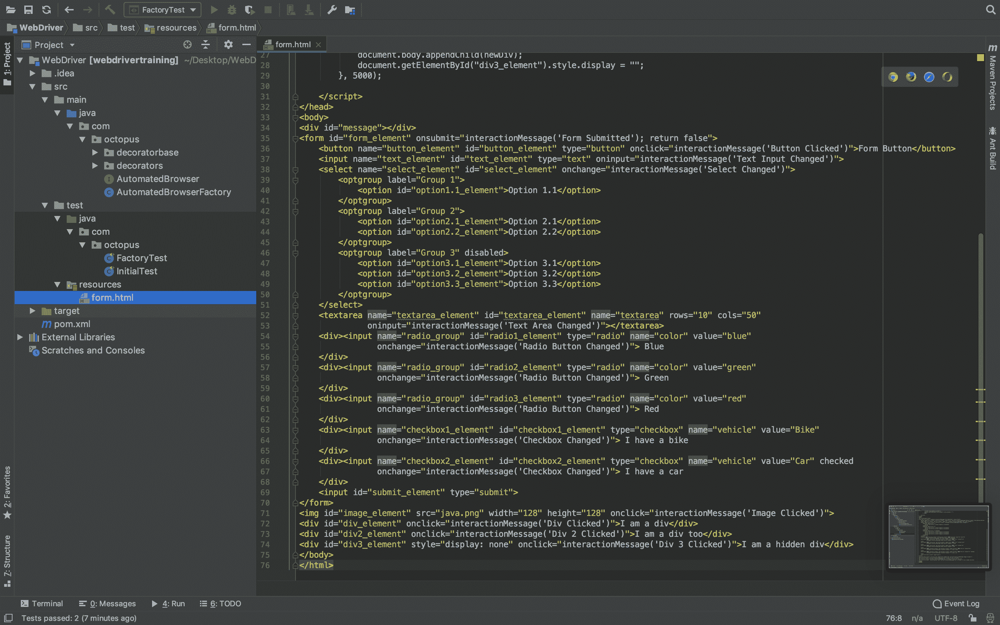](#)

我们现在已经完成了拼图的两个重要部分。首先，我们已经有了框架的雏形，它将允许我们创建灵活的`AutomatedBrowser`对象，通过这些对象我们可以与网页进行交互。第二，我们有一个样例 web 页面，其中包含了我们在编写 WebDriver 测试时可能会遇到的大多数元素。现在是时候写一些真正的 WebDriver 测试了。

让我们在类`FormTest`中创建一个测试方法`formTestByID()`，它将打开浏览器，打开我们的测试网页，然后再次关闭浏览器:

```
package com.octopus;

import org.junit.Test;
import java.net.URISyntaxException;

public class FormTest {

  private static final AutomatedBrowserFactory AUTOMATED_BROWSER_FACTORY = new AutomatedBrowserFactory();

  @Test
  public void formTestByID() throws URISyntaxException {
    final AutomatedBrowser automatedBrowser =
      AUTOMATED_BROWSER_FACTORY.getAutomatedBrowser("Chrome");

    try {
      automatedBrowser.init();
      automatedBrowser.goTo(FormTest.class.getResource("/form.html").toURI().toString());
    } finally {
      automatedBrowser.destroy();
    }
  }
} 
```

注意，我们可以通过调用`FormTest.class.getResource()`来访问样本 HTML 文件。因为我们将这个文件保存在标准目录`src/test/resources`下，Maven(以及通过扩展 IntelliJ)允许我们通过 Java 代码访问这个文件。以下代码返回样本 HTML 文件的完整 URL:

```
FormTest.class.getResource("/form.html").toURI().toString() 
```

现在让我们手动打开同一个网页。IntelliJ 为本地托管网页提供了便利的服务。当 HTML 文件在编辑器中打开时，可以通过单击屏幕右上角的快捷方式来访问它。

[](#)

点击 Chrome 浏览器图标会打开 Chrome 到一个类似[http://localhost:63342/web driver training/form . html？_ ijt = 2r 0 gmmveunmkptr 759 pintjfe 5](http://localhost:63342/webdrivertraining/form.html?_ijt=2r0gmmveunmkptr759pintjfe5)。这是一种快速简单的方法来查看我们的样本网页。

IntelliJ 生成的 URL 不是我们通过调用`FormTest.class.getResource()`得到的 URL。使用 IntelliJ 来托管 web 页面只是为了方便我们作为最终用户，但是我们在测试中不使用这个 URL。事实上，我们不能使用这个 URL，因为最后的查询字符串是随机生成的，会阻止任何其他用户或进程访问 IntelliJ 托管的页面。

我们要测试的第一件事是使用 WebDriver 点击页面顶部的按钮。

要与按钮交互，我们需要知道它的 ID。我们知道这个按钮的 ID 是`button_element`，因为我们编写了 HTML。但是，并不总是能够访问您将要测试的 web 应用程序的源代码。因此，我们将假设我们无法访问 HTML 源代码，而是使用 Chrome 提供的工具来查找这些信息。

在 Chrome 中加载页面后，右键单击按钮元素并单击`Inspect`选项。

[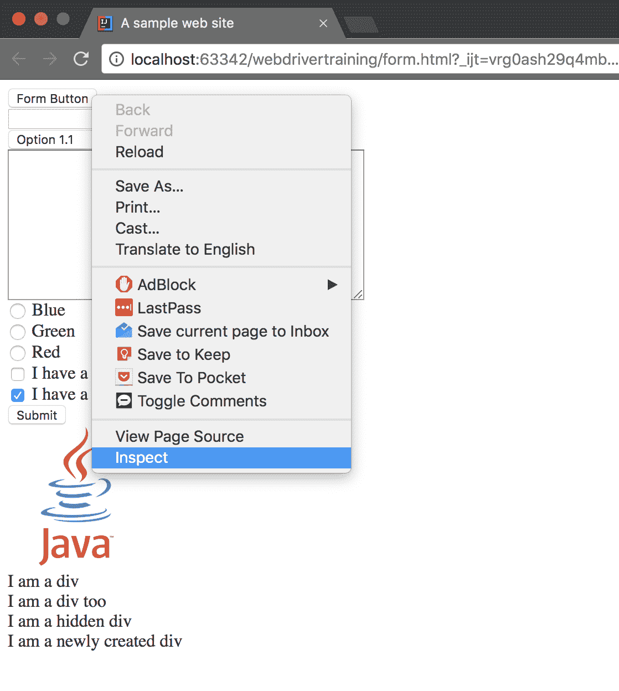](#)

这将打开 Chrome 的开发者工具，并高亮显示`Elements`标签中的按钮 HTML 元素。

当 JavaScript 调用添加、删除和更改元素时，显示在开发工具`Elements`选项卡中的 HTML 元素会实时更新。这意味着您将经常从开发人员工具中获得比仅仅查看 HTML 源代码更多的信息。

您可以通过右击显示`I am a newly created div`的文本并选择`Inspect`选项来亲自查看。这将显示作为`setTimeout()`方法调用的结果而创建的`<div>`元素。您将不会在 HTML 源代码中看到那个`<div>`元素，因为它是在运行时动态生成的。

[](#)

回到`<button>`元素，我们可以看到 ID 属性确实是`button_element`。

[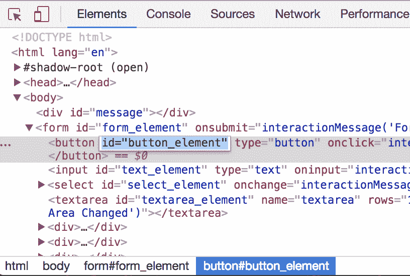](#)

既然我们知道了想要与之交互的元素的 ID，我们就可以开始构建我们的测试了。我们首先调用`clickElementWithId()`，传入我们想要点击的元素的 ID:

```
@Test
public void formTestByID() throws URISyntaxException {
  final AutomatedBrowser automatedBrowser = AUTOMATED_BROWSER_FACTORY.getAutomatedBrowser("Chrome");

  try {
    automatedBrowser.init();
    automatedBrowser.goTo(FormTest.class.getResource("/form.html").toURI().toString());
    automatedBrowser.clickElementWithId("button_element");
  } finally {
    automatedBrowser.destroy();
  }
} 
```

接下来，在`WebDriverDecorator`类中，我们需要添加一个`clickElementWithId()`方法的实现:

```
@Override
public void clickElementWithId(final String id) {
  webDriver.findElement(By.id(id)).click();
} 
```

当您将这段代码粘贴到`WebDriverDecorator`类中时，ItelliJ 将以红色显示`By`类。这是因为我们没有导入包含`By`类的包。

要解决这个问题，请将鼠标光标放在红色文本上，然后单击 ALT + Enter。这将显示一个带有`Import class`选项的上下文菜单。

[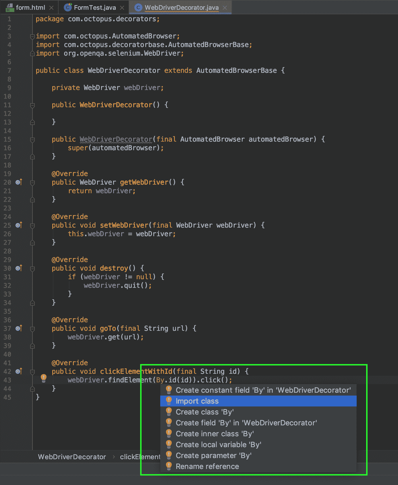](#)

IntelliJ 通常很擅长根据类的上下文来决定导入哪个包，在这种情况下，它会将`import org.openqa.selenium.By;`语句添加到类的顶部。

[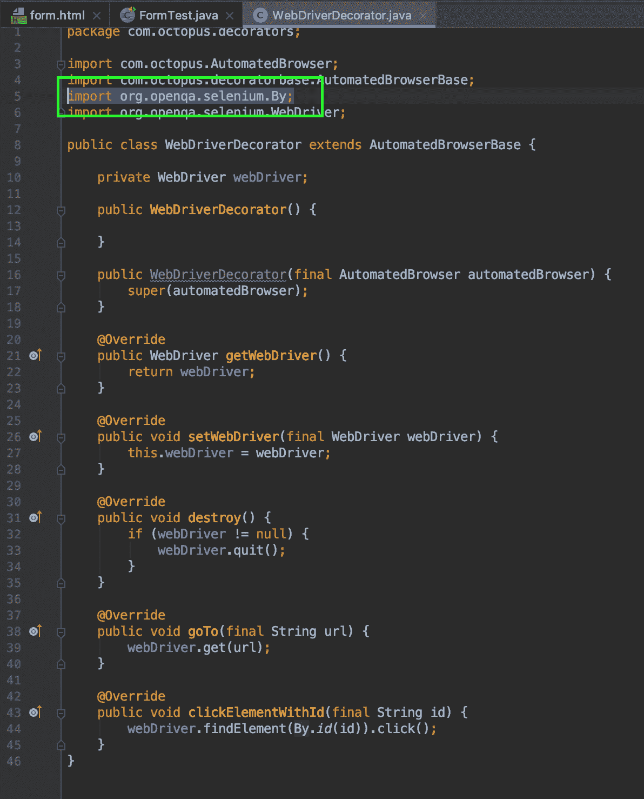](#)

`clickElementWithId()`方法做了三件重要的事情。

首先，它通过调用`By.id(id)`找到我们希望与之交互的元素。`By`类用于查找网页中的元素，并提供一系列方法来执行搜索。因为我们通过 ID 搜索元素，所以我们称之为`By.id()`。

其次，我们调用 web 驱动程序类上的`findElement()`方法来查找元素。

第三，我们获取由`findElement()`返回的元素并调用`click()`方法来模拟终端用户点击该元素。

定义如何用`By`类搜索元素，用`findElement()`方法找到元素，并调用类似`click()`的方法来模拟一个动作，这个过程是我们在构建测试框架时要反复重复的。

但是我们如何确定 WebDriver 真的点击了按钮呢？如果您回头看一下`form.html`页面的源代码，您会看到`<button>`元素具有属性`onclick="interactionMessage('Button Clicked')"`。这意味着当点击按钮时，用`'Button Clicked'`调用`interactionMessage()`方法，这又会在页面上显示文本`Button Clicked`。

然后，我们可以从保存消息`Button Clicked`的元素中提取文本，并验证它是否表达了我们期望它表达的内容。

为此，我们调用`getTextFromElementWithId()`方法，传入包含我们希望返回的文本的元素的 ID，在我们的例子中是保存我们希望验证的消息文本的`<div>`元素的 ID。然后，我们使用 JUnit 提供的`assertEquals()`来验证这个方法调用的结果:

```
@Test
public void formTestByID() throws URISyntaxException {
  final AutomatedBrowser automatedBrowser =
  AUTOMATED_BROWSER_FACTORY.getAutomatedBrowser("Chrome");

  try {
    automatedBrowser.init();
    automatedBrowser.goTo(FormTest.class.getResource("/form.html").toURI().toString());

    automatedBrowser.clickElementWithId("button_element");
    assertEquals("Button Clicked", automatedBrowser.getTextFromElementWithId("message"));
  } finally {
    automatedBrowser.destroy();
  }
} 
```

然后，`getTextFromElementWithId()`方法需要在`WebDriverDecorator`类中实现。

注意，`getTextFromElementWithId()`方法遵循与`clickElementWithId()`相同的模式。事实上，唯一的区别是我们在结果元素上调用了`getText()`，而不是`click()`:

```
@Override
public String getTextFromElementWithId(final String id) {
  return webDriver.findElement(By.id(id)).getText();
} 
```

这样，我们就成功地用 WebDriver 点击了一个元素，并验证了页面的响应符合我们的预期。

让我们继续用文本填充文本框和文本区域，并验证这些字段上的事件处理程序将预期的消息打印到页面上:

```
automatedBrowser.populateElementWithId("text_element", "test text");
assertEquals("Text Input Changed", automatedBrowser.getTextFromElementWithId("message"));

automatedBrowser.populateElementWithId("textarea_element", "test text");
assertEquals("Text Area Changed", automatedBrowser.getTextFromElementWithId("message")); 
```

然后，`populateElementWithId()`方法需要在`WebDriverDecorator`类中实现。在这种情况下，我们对返回的元素使用`sendKeys()`方法来填充文本:

```
@Override
public void populateElementWithId(String id, String text) {
  webDriver.findElement(By.id(id)).sendKeys(text);
} 
```

接下来，我们将从下拉列表中选择一个选项:

```
automatedBrowser.selectOptionByTextFromSelectWithId("Option 2.1", "select_element");
assertEquals("Select Changed", automatedBrowser.getTextFromElementWithId("message")); 
```

`selectOptionByTextFromSelectWithId()`方法与我们之前看到的模式略有不同。

`findElement()`方法返回`WebElement`接口的一个实例。`WebElement`接口反过来通过如下方法公开了一些常见的动作:

*   `click()`
*   `sendKeys()`
*   `clear()`
*   `submit()`
*   `getText()`

您可以通过查看 Javadoc API 文档获得这些方法的完整列表。

值得注意的是，这个动作列表中没有从下拉列表中选择选项的功能。为了与一个`<select>`元素交互，我们需要创建一个`Select`类的实例，它的构造函数接受由`findElement()`返回的`WebElement`。然后我们可以使用`selectByVisibleText()`方法，该方法选择带有相应文本的选项:

```
@Override
public void selectOptionByTextFromSelectWithId(String optionText, String selectId) {
  new Select(webDriver.findElement(By.id(selectId))).selectByVisibleText(optionText);
} 
```

点击单选按钮和复选框的方法与我们点击按钮的方法相同:

```
automatedBrowser.clickElementWithId("radio3_element");
assertEquals("Radio Button Changed", automatedBrowser.getTextFromElementWithId("message"));

automatedBrowser.clickElementWithId("checkbox2_element");
assertEquals("Checkbox Changed", automatedBrowser.getTextFromElementWithId("message")); 
```

我们不局限于与表单元素交互。`clickElementWithId()`方法同样适用于图像和普通旧 div 等元素:

```
automatedBrowser.clickElementWithId("image_element");
assertEquals("Image Clicked", automatedBrowser.getTextFromElementWithId("message"));

automatedBrowser.clickElementWithId("div_element");
assertEquals("Div Clicked", automatedBrowser.getTextFromElementWithId("message")); 
```

通过`formTestByID()`测试，我们已经成功地点击、检查、输入和选择了一个实时的交互式网页的选项，并验证了结果。简而言之，这就是编写 WebDrivers 测试的全部内容。然而，我们并不总是能够根据 ID 属性来定位元素。在这些情况下，WebDriver 提供了许多其他方法来定位 web 页面中的元素，接下来我们将讨论这些方法。

这篇文章是关于[创建 Selenium WebDriver 测试框架](/blog/selenium/0-toc/webdriver-toc)的系列文章的一部分。