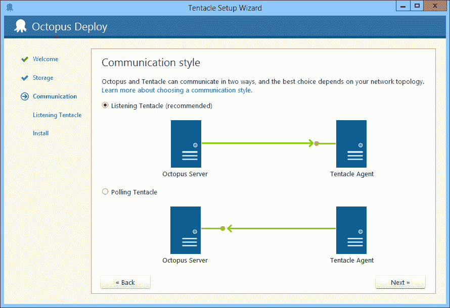

# Actors vs. RPC:为 Octopus 3.0 构建新的(旧的)传输层- Octopus Deploy

> 原文：<https://octopus.com/blog/actors-vs-rpc-in-octopus-3>

在 Octopus 1.0 中，我们使用 WCF 在 Octopus 服务器和触手之间进行通信。当 Octopus 服务器需要告诉触手做一些事情时，比如运行 PowerShell 脚本，它看起来像这样:

```
var client = clientBroker.Create<IJobService>("http://some-machine");
var ticket = client.RunScript("Write-Host 'Hello'; Start-Sleep -s 100; Write-Host 'Bye'");

do
{
    var status = client.GetJobStatus(ticket);
    log.Append(status.Log);
    Thread.Sleep(4000);

    if (IsCancelled()) 
    {
        client.Cancel(ticket);
    }
} while (status.State == JobStatus.InProgress);

log.Append("Script run complete"); 
```

这种 RPC 风格的编程工作得很好，但是它有一个限制:这意味着触手必须始终是 TCP 侦听器，而 Octopus 必须始终是 TCP 客户端。

在设计 Octopus 2.0 的时候，当时最大的特性要求是能够拥有轮询触角；实际上，颠倒了 TCP 客户机/服务器关系。



在上面的例子中，这意味着 Octopus 服务器需要以某种方式将一个命令排队让触手运行脚本，当触手轮询 Octopus 要做的任务时，它会找到这个命令并处理它。从概念上讲，它的意思大概是这样的:

```
var runScriptCommand = new RunScriptCommand("Write-Host....");
messageQueue.For("MachineA").Enqueue(runScriptCommand); 
```

使用消息将 TCP 客户机/服务器关系从代码中分离出来——我们将能够用 Octopus 编写代码来编排触角，而不需要大量的`if/else`条件来使它根据触角是监听还是轮询而不同地工作。由于轮询触角要求我们对消息进行排队以便稍后获取，我们也可以将它们用于监听触角。

围绕[构建基于消息和队列](http://www.enterpriseintegrationpatterns.com/)的分布式系统有大量的知识，所以一旦我们决定我们需要消息队列，那些模式和实践就成为我们思考的中心。我们在消息传递方面的大部分经验来自类似 NServiceBus 和类似的框架，我们已经多次将其付诸实践。

按照预期使用消息确实使编排代码变得更加复杂，我们的编排代码开始类似于 [NServiceBus sagas](http://docs.particular.net/nservicebus/sagas-in-nservicebus) :

```
void Handle(BeginScriptRun message)
{
    Send("MachineA", new RunScriptCommand("Write-Host ...."));
}

void Handle(JobStartedMessage message)
{
    State.Ticket = message.Ticket;
}

void Handle(CancelMessage message) 
{
    Send("MachineA", new CancelCommand(State.Ticket));
}

void Handle(ScriptOutputLogged message) 
{
    log.Append(message.Log);
}

void Handle(ScriptCompletedMessage message) 
{
    log.Append("Script run complete");
    Complete();
} 
```

脱离请求/响应 RPC 范式而使用消息传递似乎带来了许多好处:

1.  它可以更好地处理真正长时间运行的任务，因为您没有等待响应的线程被阻塞
2.  服务器正常运行时间是分离的——如果触手最初是离线的，但最终恢复在线，那么本例中运行的脚本可以完成
3.  它允许我们支持轮询和监听触角，因为我们的应用程序代码可以编写成与底层传输无关

随着时间的推移，我们的 NServiceBus 传奇类演变成了一个[演员](http://en.wikipedia.org/wiki/Actor_model)框架，类似于 [Akka](http://akka.io/) (尽管这是在[Akka.NET](https://github.com/akkadotnet/akka.net)开始之前大约六个月)。我们从 Akka 借用了一些概念，比如监督树，这使得错误处理变得更容易忍受。

这已经生产了 12 个月了。虽然它基本上运行良好，但我已经开始注意到这种面向参与者/消息的方法的许多缺点:

1.  actors 的单线程特性非常好，使并发变得很容易。然而，有时您确实需要某种互斥，但最终您不得不使用一些难看的消息传递方法来实现它。
2.  遵循代码并对其进行推理要困难得多。在 Visual Studio 中，查找哪个参与者处理哪个消息始终是一个两步导航过程。
3.  崩溃转储和堆栈跟踪变得几乎毫无用处。
4.  管理演员的寿命真的很难。上面例子末尾的那个调用很重要，因为它告诉我们什么时候可以清理这个 actor。很容易忘记调用这些函数(我是否也应该在取消消息处理程序中调用它？)
5.  错误处理同样令人讨厌。例如，在第一个代码示例中，如果远程机器出现故障，异常就会冒泡，或者用`try/catch`来处理。在第二个例子中，捕捉和处理这些错误是一个显式的步骤。
6.  向新开发人员教授这种编程风格要困难得多

当我查看 Octopus 1.6 中的编排代码时，它真的很容易推理和遵循。也许它不能很好地扩展，也许有太多的地方我们明确地处理线程或锁。但是堆栈跟踪是可读的，我可以很容易地浏览它。当阅读 2.0 中的部署编排代码时，我必须真正集中注意力。

事实证明，我提到的“服务器正常运行时间被分离”的好处对我们来说也不是很有用。如果触须离线，我们可能需要一些自动重试，比如 30 秒或几分钟。除此之外，我们真的不需要消息排队。如果我们在部署过程中，有一台机器离线，我们需要做出决定:要么跳过它，要么部署失败。我们不会等 6 个小时。这通常在消息传递框架中通过给予消息非常短的生存时间来处理，但是这仍然使异常处理过程变得复杂。

actors 的主要好处是，与直接使用线程/锁定原语相比，您可以用更简单的代码获得更好的并发性。然而，当我查看 Octopus 1.0 编排代码时，我们使用的原语如此之少，以至于 actor 方法变得不那么*简洁。这表明我们的问题域并不真正适合演员。虽然我们可能无法避免在某种级别上使用消息来处理轮询/监听配置，但请求/响应语义似乎更合适。*

那么，我们为章鱼 3.0 做些什么呢？我们将回归到与章鱼 1.0 风格非常相似的东西。不同之处在于，虽然从编码的角度来看，我们将使用请求/响应，但在这些代理之下，我们仍然允许轮询或监听触角:

*   如果触手正在监听，我们将打开一个`TcpClient`并连接。
*   如果触手正在轮询，我们将把响应放入队列，并在等待句柄上等待。当请求被拾取并且响应可用时，等待句柄将完成。

您可以将这看作是两层:传输层，其中任何一方都可以是`TcpClient/TcpListener`，以及位于顶层的逻辑请求/响应层。

我们新的通信栈将是开源的(并将建立在我不久前写的[大比目鱼](http://www.codeproject.com/Articles/554692/Halibut-a-secure-communication-stack-for-NET-Mono)的基础上)，随着它的发展，我会发布更多的细节。