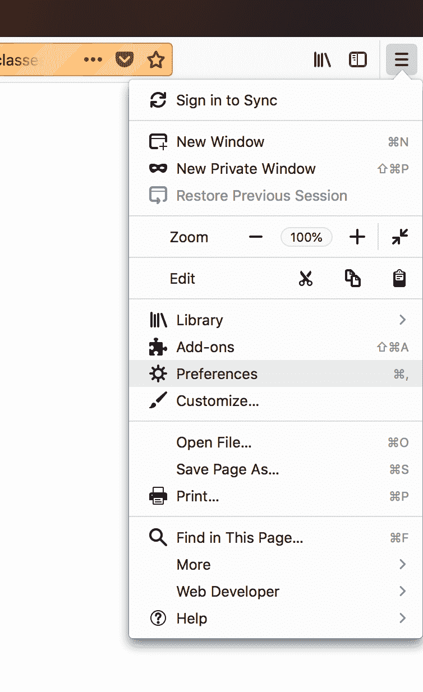
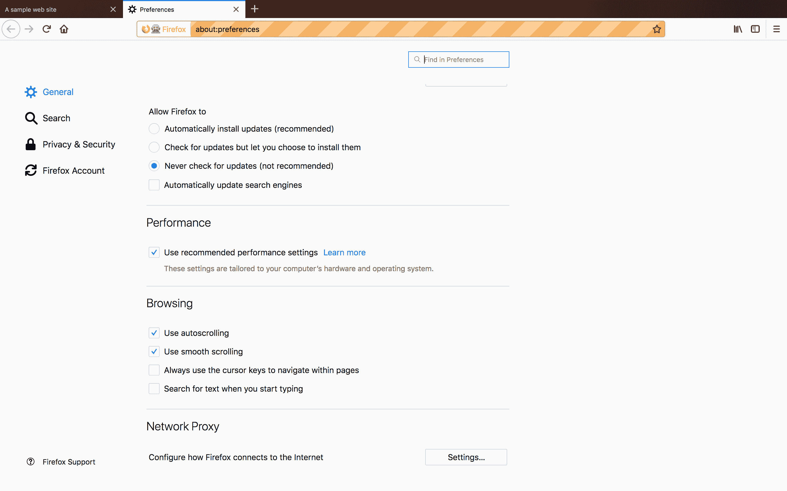
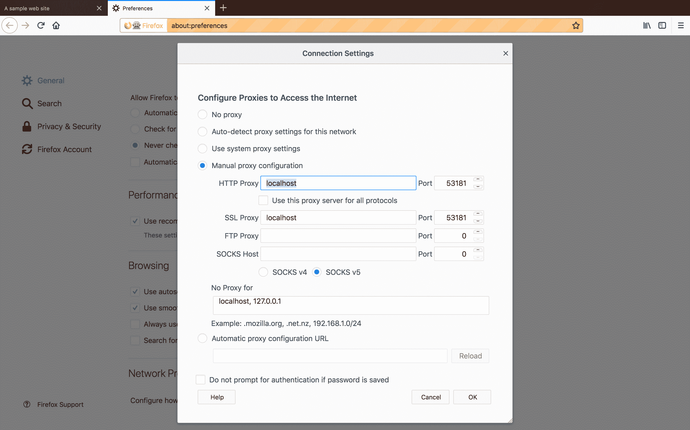

# Selenium 系列:添加 BrowserMob 代理- Octopus Deploy

> 原文：<https://octopus.com/blog/selenium/11-adding-the-browsermob-proxy/adding-the-browsermob-proxy>

这篇文章是关于[创建 Selenium WebDriver 测试框架](/blog/selenium/0-toc/webdriver-toc)的系列文章的一部分。

在这篇文章中，我们将添加对 BrowserMob 代理的支持，这是一个免费的开源 Java 代理服务器。然后，我们将使用 BrowserMob 保存一个包含测试期间所有网络请求的报告，并截取一些网络请求。

为了利用 BrowserMob 库，我们需要将它作为一个依赖项添加到 Maven `pom.xml`文件中:

```
<project 
xmlns:xsi="http://www.w3.org/2001/XMLSchema-instance"
xsi:schemaLocation="http://maven.apache.org/POM/4.0.0
http://maven.apache.org/xsd/maven-4.0.0.xsd">

  <!-- ... -->

  <properties>
    <!-- ... -->
    <browsermob.version>2.1.5</browsermob.version>
  </properties>

  <dependencies>
    <!-- ... -->

    <dependency>
      <groupId>net.lightbody.bmp</groupId>
      <artifactId>browsermob-core</artifactId>
      <version>${browsermob.version}</version>
    </dependency>
  </dependencies>
</project> 
```

BrowserMob 代理的一个实例将被一个名为`BrowserMobDecorator`的新装饰器创建和销毁:

```
package com.octopus.decorators;

import com.octopus.AutomatedBrowser;
import com.octopus.decoratorbase.AutomatedBrowserBase;
import net.lightbody.bmp.BrowserMobProxy;
import net.lightbody.bmp.BrowserMobProxyServer;
import org.openqa.selenium.Proxy;
import org.openqa.selenium.remote.CapabilityType;
import org.openqa.selenium.remote.DesiredCapabilities;

public class BrowserMobDecorator extends AutomatedBrowserBase {

    private BrowserMobProxy proxy;

    public BrowserMobDecorator(final AutomatedBrowser automatedBrowser) {
        super(automatedBrowser);
    }

    @Override
    public DesiredCapabilities getDesiredCapabilities() {
        proxy = new BrowserMobProxyServer();
        proxy.start(0);

        final DesiredCapabilities desiredCapabilities =
                getAutomatedBrowser().getDesiredCapabilities();

        final Proxy seleniumProxy = new Proxy();
        final String proxyStr = "localhost:" + proxy.getPort();

        seleniumProxy.setHttpProxy(proxyStr);
        seleniumProxy.setSslProxy(proxyStr);
        desiredCapabilities.setCapability(CapabilityType.PROXY, seleniumProxy);
        return desiredCapabilities;
    }

    @Override
    public void destroy() {
        getAutomatedBrowser().destroy();
        if (proxy != null) {
            proxy.stop();
        }
    }
} 
```

让我们来分解这个类中的代码。

在`getDesiredCapabilities()`方法中，我们创建了一个`BrowserMobProxyServer`类的实例，并调用它的`start()`方法。通过将`0`传递给`start()`方法，我们可以在任何可用的端口上公开代理:

```
proxy = new BrowserMobProxyServer();
proxy.start(0); 
```

WebDriver 代理配置信息保存在`Proxy`类的实例中:

```
final Proxy seleniumProxy = new Proxy(); 
```

然后，我们需要构建一个表示代理网络地址的字符串。因为代理将在本地运行，所以主机名将始终是`localhost`。

代理暴露的端口可以在每次测试运行时改变，因为我们用`0`调用了`start()`方法，表明 BrowserMob 代理应该使用一个可用的端口。我们可以通过调用`proxy`上的`getPort()`方法来获取被占用的端口。

这两个字符串组合在一起形成一个类似于`localhost:57470`的字符串:

```
final String proxyStr = "localhost:" + proxy.getPort(); 
```

然后我们配置`Proxy`对象将 HTTP 和 HTTPS 流量定向到本地代理:

```
seleniumProxy.setHttpProxy(proxyStr);
seleniumProxy.setSslProxy(proxyStr); 
```

接下来，我们得到一个`DesiredCapabilities`对象的副本。如果您还记得上一篇文章，该对象用于配置可应用于任何由 WebDriver 启动的浏览器的设置:

```
final DesiredCapabilities desiredCapabilities =
  getAutomatedBrowser().getDesiredCapabilities(); 
```

然后用`Proxy`实例配置`DesiredCapabilities`实例。

在之前的文章中，我们注意到`DesiredCapabilities`类本质上是一个键/值存储。现在你可以在实践中看到这一点，因为我们根据`CapabilityType.PROXY`值保存了`Proxy`实例。

`CapabilityType.PROXY`是设置为`proxy`的字符串常量，该值被所有浏览器识别为包含代理配置设置:

```
desiredCapabilities.setCapability(CapabilityType.PROXY, seleniumProxy); 
```

然后返回`DesiredCapabilities`实例，以便其他 decorators 可以添加到它，或者使用它来构建浏览器驱动程序:

```
return desiredCapabilities; 
```

更新`AutomatedBrowserFactory`类以创建`BrowserMobDecorator`类的新实例:

```
private AutomatedBrowser getChromeBrowser(final boolean headless) {
  return new ChromeDecorator(headless,
    new ImplicitWaitDecorator(10,
      new BrowserMobDecorator(
        new WebDriverDecorator()
      )
    )
  );
}

private AutomatedBrowser getFirefoxBrowser(final boolean headless) {
  return new FirefoxDecorator(headless,
    new ImplicitWaitDecorator(10,
      new BrowserMobDecorator(
        new WebDriverDecorator()
      )
    )
  );
}

private AutomatedBrowser getChromeBrowserNoImplicitWait() {
  return new ChromeDecorator(
    new BrowserMobDecorator(
      new WebDriverDecorator()
    )
  );
}

private AutomatedBrowser getFirefoxBrowserNoImplicitWait() {
  return new FirefoxDecorator(
    new BrowserMobDecorator(
      new WebDriverDecorator()
    )
  );
} 
```

现在我们的`AutomatedBrowserFactory`正在配置浏览器将流量传递给 BrowserMob 代理的实例。这不会改变测试的运行方式；代理被设计成对最终用户基本不可见，因此我们的测试将像以前一样运行。然而，如果我们愿意的话，我们现在有办法监控和拦截网络请求。

我们可以通过在测试运行后保持浏览器窗口打开来确认 BrowserMob 代理正在被创建。Firefox 特别容易看到代理设置，所以在下面的测试方法中，我们通过注释掉对`finally`块中`automatedBrowser.destroy()`的调用，在测试完成后让浏览器窗口保持打开:

```
@Test
public void formTestByIDFirefox() throws URISyntaxException {

  final AutomatedBrowser automatedBrowser =
    AUTOMATED_BROWSER_FACTORY.getAutomatedBrowser("Firefox");

  try {
    automatedBrowser.init();

    automatedBrowser.goTo(FormTest.class.getResource("/form.html").toURI().toString());

    automatedBrowser.clickElementWithId("button_element");
    assertEquals("Button Clicked", automatedBrowser.getTextFromElementWithId("message"));

    automatedBrowser.populateElementWithId("text_element", "test text");
    assertEquals("Text Input Changed", automatedBrowser.getTextFromElementWithId("message"));

    automatedBrowser.populateElementWithId("textarea_element", "test text");
    assertEquals("Text Area Changed", automatedBrowser.getTextFromElementWithId("message"));

    automatedBrowser.selectOptionByTextFromSelectWithId("Option 2.1", "select_element");
    assertEquals("Select Changed", automatedBrowser.getTextFromElementWithId("message"));

    automatedBrowser.clickElementWithId("radio3_element");
    assertEquals("Radio Button Changed", automatedBrowser.getTextFromElementWithId("message"));

    automatedBrowser.clickElementWithId("checkbox2_element");
    assertEquals("Checkbox Changed", automatedBrowser.getTextFromElementWithId("message"));

    automatedBrowser.clickElementWithId("image_element");
    assertEquals("Image Clicked", automatedBrowser.getTextFromElementWithId("message"));

    automatedBrowser.clickElementWithId("div_element");
    assertEquals("Div Clicked", automatedBrowser.getTextFromElementWithId("message"));
  } finally {
    //automatedBrowser.destroy();
  }
} 
```

测试完成后，它启动的 Firefox 浏览器仍会显示。然后从菜单中，我们可以选择`Preferences`选项。

[](#)

在首选项页面的底部是`Network Proxy`部分。点击`Settings...`按钮。

[](#)

这里我们可以看到我们在代码中定义的代理设置。这是对我们的代理已经通过 WebDriver 配置的确认。

[](#)

配置代理服务器使我们能够观察测试过程中的网络请求并与之交互，这是单独使用 WebDriver 无法做到的。下一步是公开对我们有用的 BrowserMob 代理的特性。但是在我们这样做之前，我们将看一看在配置代理时可能出现的常见错误配置，并了解如何调试显示的错误。

这篇文章是关于[创建 Selenium WebDriver 测试框架](/blog/selenium/0-toc/webdriver-toc)的系列文章的一部分。