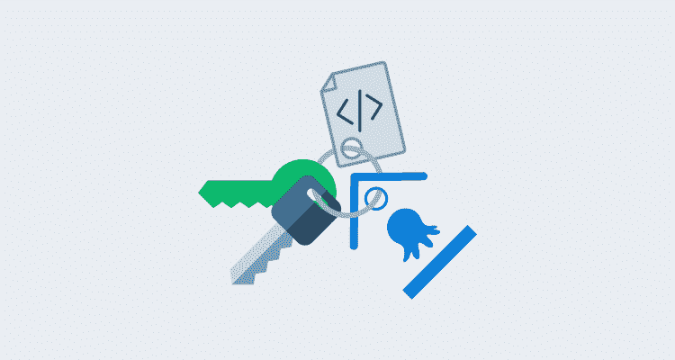
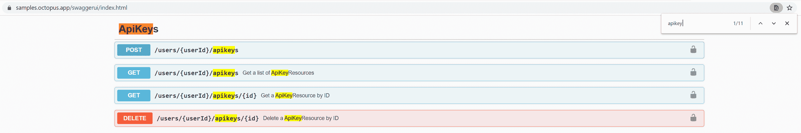
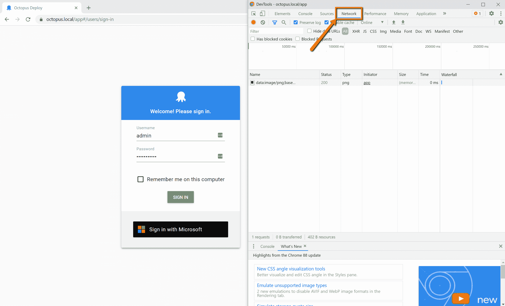
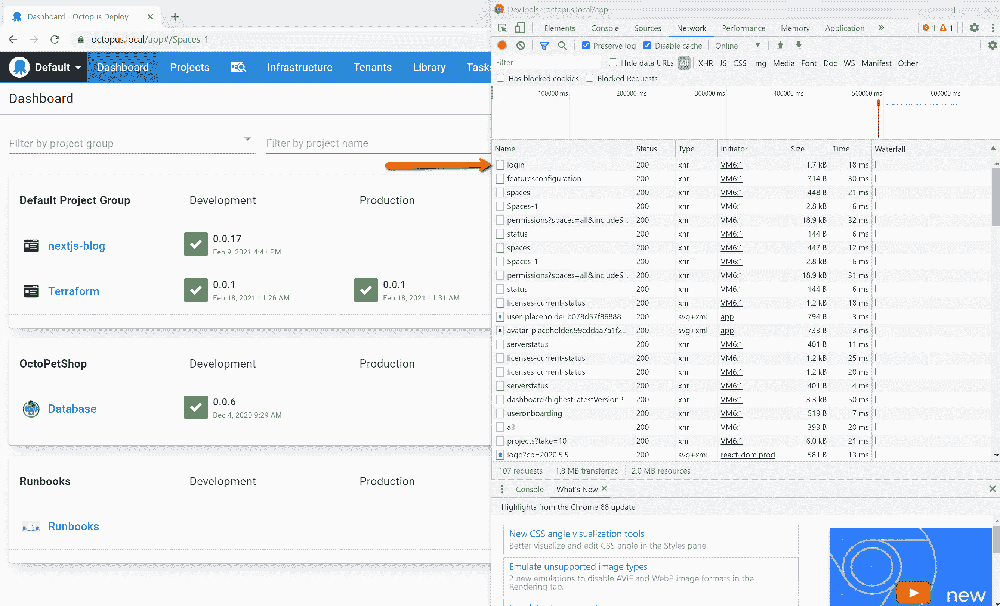
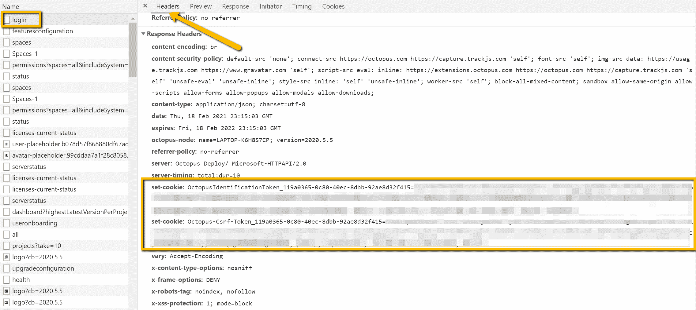
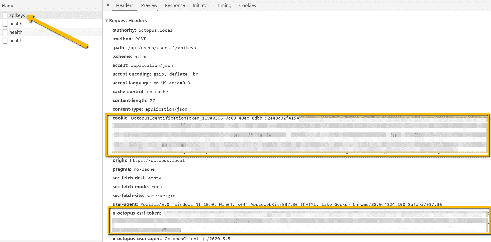

# 编写创建 Octopus API 密钥的脚本- Octopus Deploy

> 原文：<https://octopus.com/blog/apikey-creation-automation>

[](#)

Octopus 的高级用户应该已经熟悉了健壮的 Octopus REST API。Octopus 首先被设计成 API，所以你可以在 Octopus 门户网站中做任何事情，你都可以用 API 来做。然而，在与 API 交互之前，您需要创建一个 Octopus [API 键](https://octopus.com/docs/octopus-rest-api/how-to-create-an-api-key)。这些步骤需要人工完成，但是自动化这个过程是可能的。

在这篇博文中，我将通过脚本创建一个用于 Octopus REST API 的 API 键。

最终的脚本可以在 GitHub gist 中找到。

## Swagger API 文档

当我想用 Octopus API 实现自动化时，我首先去的地方是 Swagger docs。每个 Octopus 服务器都有一个内置的发布所有 API 文档的路径。只需将`/swaggerui`添加到您的 Octopus 服务器的基本 URL 路径中。比如:[samples.octopus.app/swaggerui](https://samples.octopus.app/swaggerui)。

生成的页面是由 API [资源](https://cloud.google.com/apis/design/resources)组织的，数量很多。让我们做一个`CTRL-F`来寻找`apikey`:

[](#)

ApiKeys: `POST /users/{userId}/apikeys`下的第一行允许我们为指定的用户创建一个新的 API 键。因为 Octopus 中的 API 键与 Octopus 用户相关联，所以这些键继承分配给该用户的权限。

在提供新的 API 键时，最好设置专用于特定功能或集成的 [Octopus 服务帐户](https://octopus.com/docs/security/users-and-teams/service-accounts)。

让我们假设我们知道我们的`{userId}`,并使用一个快速的一行 PowerShell cmdlet 来创建一个 API 密钥:

```
> Invoke-RestMethod -Method Post -Uri https://samples.octopus.app/api/users/Users-561/apikeys -Headers @{'X-Octopus-ApiKey'='API-XXXX...'} -Body (@{'Purpose'='Just blogging'} | ConvertTo-Json)

Id      : apikeys-I6D74k9rh7eyoqXDlqJCvlsVgU
Purpose : Just blogging
UserId  : Users-561
ApiKey  : API-XXXX...
Created : 2/18/2021 2:25:49 PM
Expires :
Links   : @{Self=/api/users/Users-561/apikeys/apikeys-I6D74k9rh7eyoqXDlqJCvlsVgU} 
```

您可能会注意到，在这个例子中，我们已经有了一个 API 来创建一个新的 API 键。

## 当您还没有 API 密钥时创建 API 密钥

假设您正在编写自动化程序来供应 Octopus 服务器本身。您已经使用 [Octopus Deploy Chocolatey 包](https://chocolatey.org/packages/OctopusDeploy/)、[Octopus.Server.exe 命令行工具](https://octopus.com/docs/octopus-rest-api/octopus.server.exe-command-line)，甚至新的 [Octopus Deploy Terraform 提供者](https://octopus.com/blog/octopusdeploy-terraform-provider)编写了脚本。您不希望在您的供应自动化过程中中断，因为您需要登录到您的 Octopus 服务器，创建一个 API 密匙，然后手动将密匙插入到自动化的其余部分。

当您在 Octopus 中创建新用户时，这些用户没有 API 密钥，但是 Octopus Web 门户允许他们在登录时创建 API 密钥。如果浏览器能做到，我们也能。以下是要做的事情:

1.  使用用户名和密码模拟浏览器登录。
2.  从 Octopus 服务器取回任何必要的 cookies。
3.  当创建用户的第一个 API 密钥时，使用 cookies 发出与浏览器相同的请求。

当您第一次[安装 Octopus 服务器](https://octopus.com/docs/installation#install-octopus)时，安装程序会要求您创建一个*本地系统帐户*或*自定义域帐户*。为简单起见，我们假设您有一个本地系统帐户。您也可以使用**Octopus.Server.exe**命令行界面的 [`admin`](https://octopus.com/docs/octopus-rest-api/octopus.server.exe-command-line/admin) 命令创建一个。

当你登录到你的 Octopus 门户网站时，你需要检查浏览器中发生了什么。让我们使用 [Chrome 内置的 DevTools](https://developers.google.com/web/tools/chrome-devtools) 。

1.  浏览你的八达通网站登入页面。
2.  在页面上点击右键，选择 **Inspect** ，或者使用热键 **Ctrl-Shift-i** 打开 DevTools。
3.  选择截图中显示的**网络**选项卡。
4.  输入用户名和密码后，点击**登录**。

[](#)

在 DevTools 窗口中，你应该看到 Chrome 记录了登录过程中发生的许多请求。这些请求包括必要的资产文件(js、css 等)。)、初始化 Octopus 仪表板的资源请求等等。向上滚动到序列的顶部，查找标记为**登录**的请求:

[](#)

点击**登录**请求。请求列表右侧将出现一个窗口，显示附加信息。该窗口有自己的一组选项卡，您需要选择**标题**。

滚动到 Headers 页面的底部会显示所使用的确切请求正文。当您在 PowerShell 中构建请求时，这将非常重要。检查**响应头**还会给您一些重要信息:

[](#)

Octopus 服务器在登录后向浏览器发回两个 **Set-Cookie** 头，浏览器将其存储在其 Cookie 存储器中。在对同一个域的后续请求中，浏览器被编程为在 **Cookie** 头中发送这些 Cookie。这就是 Octopus 服务器识别您的独特会话的方式。

让我们编写一些 PowerShell 来模拟这个过程的一部分:

```
$octopusUrl = 'https://samples.octopus.app'
$username = 'admin'
$password = 'your-password'

$loginPath = "$octopusUrl/api/users/login"

$response = Invoke-WebRequest -Method Post `
    -Uri $loginPath `
    -Body (@{'Username' = $username;'Password' = $password} | ConvertTo-Json) `
    -SessionVariable 'session' 
```

这里需要注意一些事情:

*   我们在这里使用`Invoke-WebRequest` cmdlet 而不是`Invoke-RestRequest`,因为我们需要直接访问响应头来获取 cookies。
*   `-SessionVariable`参数创建了一个类型为 [WebRequestSession](https://docs.microsoft.com/en-us/dotnet/api/microsoft.powershell.commands.webrequestsession?view=powershellsdk-7.0.0) 的变量`$session`，这使得获取 cookies 变得很容易，我们接下来会看到。
*   响应体包含了`User ID`，下一个请求也需要它。

让我们存储我们需要的变量:

```
$userId = ($response.Content | ConvertFrom-Json).Id
$csrfToken = $session.Cookies.GetCookies($loginPath) | Where-Object { $_.Name.StartsWith('Octopus-Csrf-Token') }
$sessionToken = $session.Cookies.GetCookies($loginPath) | Where-Object { $_.Name.StartsWith('OctopusIdentificationToken') } 
```

现在，您可以将这两个令牌添加到`Cookie`头中，并希望它能够工作。但是由于我们已经在使用 Chrome DevTools，我们可以记录生成 API 键的请求，并理解浏览器如何使用这些值。

在 Octopus 门户网站中，导航到您的个人资料页面，然后是**我的 API 密钥**页面。在 DevTools 仍然打开并记录的情况下，让我们创建一个 API 键并查找下面截图中显示的`apikeys` POST 请求。仔细看看请求头:

[](#)

如果比较您在登录请求后收到的两个`Set-Cookie`响应头，您可以看到浏览器是如何使用这些值的。现在您可以完成您的请求:

```
$headers = @{
    'Cookie' = $sessionToken.Name + '=' + $sessionToken.Value
    'X-Octopus-Csrf-Token' = $csrfToken.Value
}

Invoke-RestMethod -Method Post `
    -Uri "$octopusUrl/api/users/$userId/apikeys" ` # $octopusUrl is defined at the top of the script
    -Headers $headers `
    -Body (@{'Purpose'='Just Blogging'} | ConvertTo-Json) 
```

### 完整的剧本

```
$octopusUrl = 'https://samples.octopus.app'
$username = 'admin'
$password = 'your-password'

$loginPath = "$octopusUrl/api/users/login"

$response = Invoke-WebRequest -Method Post `
    -Uri $loginPath `
    -Body (@{'Username' = $username;'Password' = $password} | ConvertTo-Json) `
    -SessionVariable 'session'

$userId = ($response.Content | ConvertFrom-Json).Id
$csrfToken = $session.Cookies.GetCookies($loginPath) `
    | Where-Object { $_.Name.StartsWith('Octopus-Csrf-Token') }
$sessionToken = $session.Cookies.GetCookies($loginPath) `
    | Where-Object { $_.Name.StartsWith('OctopusIdentificationToken') }

$headers = @{
    'Cookie' = $sessionToken.Name + '=' + $sessionToken.Value
    'X-Octopus-Csrf-Token' = $csrfToken.Value
}

Invoke-RestMethod -Method Post `
    -Uri "$octopusUrl/api/users/$userId/apikeys" `
    -Headers $headers `
    -Body (@{'Purpose'='Automation'} | ConvertTo-Json) 
```

## 结论

为 API 密钥的创建编写脚本对于新的服务用户、提供 Octopus 实例或与 Octopus Terraform 提供程序一起使用非常有用。

使用 Chrome DevTools(或 Firefox、Edge 或 Safari 等效软件)是查看 Octopus 前端门户网站(一个单页 React 应用程序)和 Octopus REST API 之间的交互的强大方法。偶尔，您可能会发现 Swagger 文档只是稍微有些偏离，或者没有您需要的所有信息，使用浏览器的工具可以给您一个明确的答案。

有兴趣了解更多关于 Octopus REST API 的信息吗？查看我们最近的网络研讨会:[使用 Octopus API 通过自动化重复任务节省时间](https://www.youtube.com/watch?v=ACb2sHWoZto)。

愉快的部署！