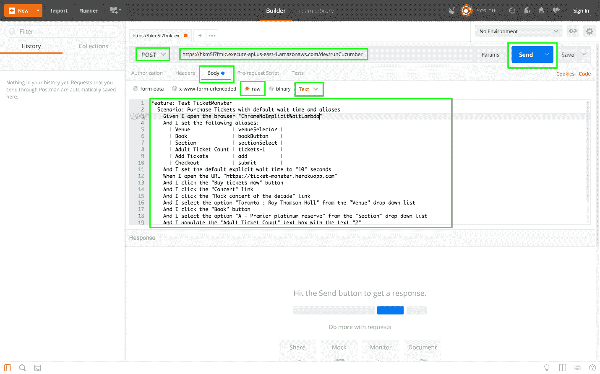
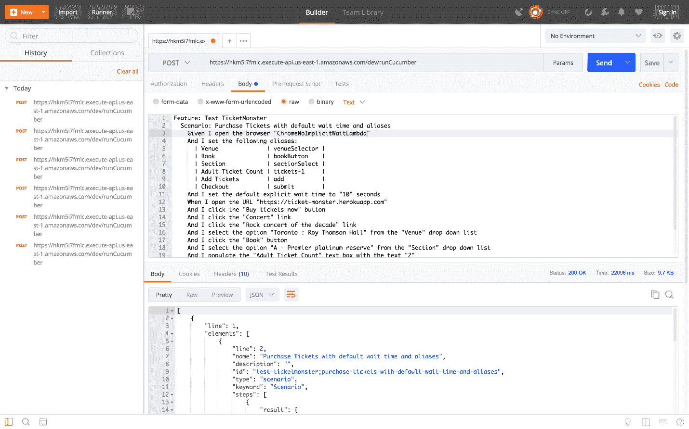
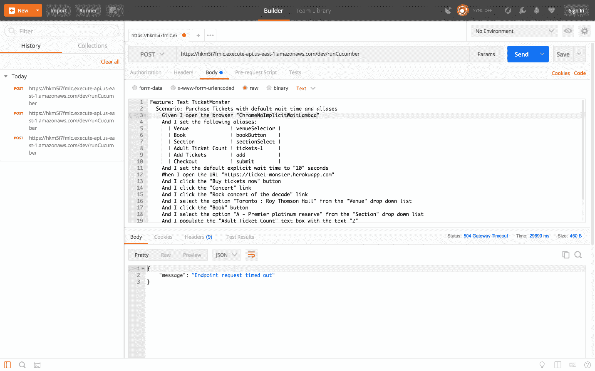
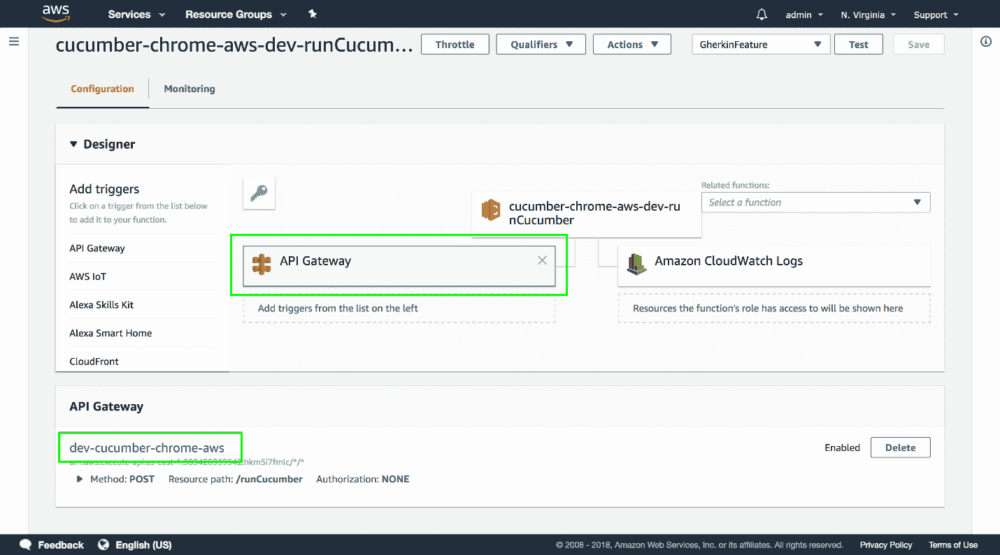
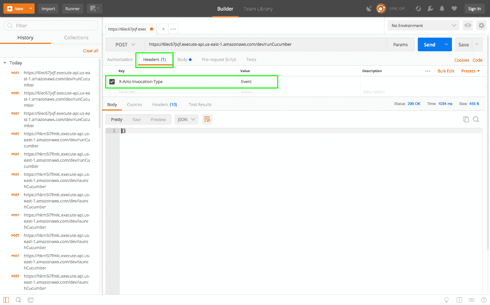

# Selenium 系列:异步 Lambdas - Octopus 部署

> 原文：<https://octopus.com/blog/selenium/33-asynchronous-lambdas/asynchronous-lambdas>

这篇文章是关于[创建 Selenium WebDriver 测试框架](/blog/selenium/0-toc/webdriver-toc)的系列文章的一部分。

我们现在有能力用 AWS Lambda 函数运行 Gherkin 特性。但到目前为止，我们不得不从 AWS 控制台触发测试。当我们测试 Lambda 工作时，这是好的，但是这不是一个非常方便的运行测试的方法。

为了允许在不使用 AWS Lambda 控制台的情况下执行测试，我们将在无服务器配置文件中配置一个 HTTP 事件。这个事件允许我们从 HTTP POST 请求中执行 Lambda 函数，这又允许我们使用任何标准的 HTTP 工具或库来触发测试。

为了配置 HTTP 事件，我们更新了`serverless.yml`文件:

```
service:
  name: cucumber-chrome-aws

provider:
  name: aws
  runtime: java8
  region: us-east-1

package:
  artifact: target/webdrivertraining-1.0-SNAPSHOT.jar

functions:
  runCucumber:
    handler: com.octopus.LambdaEntry::runCucumber
    timeout: 300
    memorySize: 512
    events:
      - http:
          method: post
          path: runCucumber
          integration: lambda
          request:
            parameters:
              headers:
                'X-Amz-Invocation-Type': true
            template:
              text/plain: "\"$util.escapeJavaScript($input.body).replaceAll(\"\\'\",\"'\")\""
          response:
            headers:
              Content-Type: "'application/json'"
            template: $util.parseJson($input.body) 
```

新的`events`部分添加了一个`http`事件。HTTP `method`是`post`，我们可以访问的`path`被称为`runCucumber`，因为这个事件触发了一个 Lambda 函数，所以`integration`被设置为`lambda`:

```
events:
  - http:
      method: post
      path: runCucumber
      integration: lambda 
```

当我们执行 HTTP POST 时，我们在请求体中传递将要运行的 Gherkin 特性文件。但是正如我们之前看到的，Lambda 函数期望所有输入都是 JSON 数据。在从控制台测试 Lambda 时，我们通过使用一个简单的 web 页面将纯文本转换为 JSON 字符串来解决这个需求。我们可以使用请求模板实现同样的转换。

这里我们已经配置了一个请求模板，当发出一个包含`text/plain`内容的请求时会用到这个模板。关键字`text/plain`是多用途互联网邮件扩展(MIME)类型，这是一种表示文档性质和格式的标准化方法:

```
request:
  template:
    text/plain: "\"$util.escapeJavaScript($input.body).replaceAll(\"\\'\",\"'\")\"" 
```

处理纯文本请求的模板，没有最外面的引号和里面的转义引号，是这样的:

```
"$util.escapeJavaScript($input.body).replaceAll("\'","'")" 
```

这个模板的目的与我们编写的将纯文本转换成 JSON 字符串的 web 页面相同。但是，这个模板是使用 Velocity 模板语言编写的，这是 AWS 使用的模板库。该模板的逻辑如下:

| 模式 | 意义 |
| --- | --- |
| `"` | 打印一个字面双引号 |
| `$util.escapeJavaScript($input.body)` | 从保存在`$input.body`中的请求中获取原始文本(即作为 HTTP POST 主体发送的文本)，并传递给`$util.escapeJavaScript()`函数。 |
| `.replaceAll("\'","'")` | `escapeJavaScript()`函数将转义单引号，这不是有效的 JSON。所以用单引号替换所有转义的引号。 |
| `"` | 打印一个字面双引号 |

作为响应，我们希望传回 Lambda 函数返回的 JSON。我们通过将`Content-Type`头设置为 MIME 类型`application/json`来确定响应返回 JSON。

我们再次使用模板来转换响应。该模板获取 Lambda 函数返回的 JSON 字符串，该字符串被公开为`$input.body`，并将其传递给`$util.parseJson()`函数，该函数将 JSON 解析为一个对象以返回给发送方:

```
response:
  headers:
    Content-Type: "'application/json'"
  template: $util.parseJson($input.body) 
```

通过对`serverless.yml`文件的这些更改，我们可以再次用无服务器部署命令重新发布 Lambda 函数。该命令的输出如下所示:

```
Serverless: Packaging service...
Serverless: WARNING: Function runCucumber has timeout of 300 seconds, however, it's attached to API Gateway so it's automatically limited to 30 seconds.
Serverless: Uploading CloudFormation file to S3...
Serverless: Uploading artifacts...
Serverless: Uploading service .zip file to S3 (22.67 MB)...
Serverless: Validating template...
Serverless: Updating Stack...
Serverless: Checking Stack update progress...
........................
Serverless: Stack update finished...
Service Information
service: cucumber-chrome-aws
stage: dev
region: us-east-1
stack: cucumber-chrome-aws-dev
api keys:
None
endpoints:
POST - https://hkm5i7fmlc.execute-api.us-east-1.amazonaws.com/dev/runCucumber
functions:
runCucumber: cucumber-chrome-aws-dev-runCucumber 
```

注意，日志文件显示了我们可以用来触发 HTTP 事件的端点的 URL。在上面的例子中，URL[https://hkm 5i 7 fmlc . execute-API . us-east-1 . amazonaws . com/dev/run cumber](https://hkm5i7fmlc.execute-api.us-east-1.amazonaws.com/dev/runCucumber)是我们将通过 HTTP POST 请求调用的，以执行一个小黄瓜特性。

要发出 HTTP 请求，我们将使用一个名为 Postman 的工具，你可以从 https://www.getpostman.com/下载。Postman 提供了一个简单的接口，我们可以用它来创建定制的 HTTP 请求，在这种情况下，我们将向上面找到的 URL 发出 POST 请求。

下面的屏幕截图显示了需要填写的重要字段，以便提出发布请求。

*   从选项卡顶部的下拉列表中选择`POST`。
*   在选项卡顶部的文本框中输入 URL。
*   选择`Body`选项卡。
*   选择`raw`选项。
*   从内容类型下拉列表中选择`Text`。
*   将小黄瓜特性粘贴到标签底部的文本区域。
*   点击`Send`按钮。

[](#)

如果你幸运的话，你可能会看到这个回复。

[](#)

我说幸运，因为您可能已经看到了`Endpoint request timed out`错误消息。

[](#)

那么`Endpoint request timed out`错误信息是什么意思呢？

这个错误是由于在 Lambda 函数前面提供 HTTP 端点所实现的服务的不同限制造成的。

如果您打开 Lambda 控制台并查看该函数，您可以看到一个名为 API Gateway 的服务位于 Lambda 函数的前面。

[](#)

API Gateway 是另一个用于构建 HTTP APIs 的 AWS 服务，它是无服务器应用程序在我们添加 HTTP 事件时构建的服务。API Gateway 接收我们的 HTTP 请求，用我们定义的模板转换它们，将它们传递给 Lambda 函数，转换 Lambda 函数的响应，并将结果传递回调用者。

然而，虽然 Lambda 函数可以运行 5 分钟，但是通过 API 网关发出的请求只能保持打开 29 秒。这些是 AWS 对这些服务施加的限制，我们没有扩展它们的选项。

当 API 网关调用的 Lambda 函数花费了超过 29 秒的时间来完成时，就会生成`Endpoint request timed out`错误消息。

这对我们来说是个问题，因为我们不太可能写出能在 29 秒内可靠完成的 WebDriver 测试。通常我们编写测试来完成 web 应用程序的整个旅程，这可能需要几分钟。那么如何才能克服 API Gateway 强加的 29 秒时间限制呢？

解决方案是异步运行我们的 Lambda。这意味着 API Gateway 启动 Lambda，但不等待返回值，而是直接向调用者返回一个空结果。这意味着我们不再受 Lambda 运行时间的限制，因为它是在后台运行的。

为了指示 API Gateway 异步调用 Lambda，我们需要传递值为`Event`的`X-Amz-Invocation-Type`头。

这里是新的`serverless.yml`文件:

```
service:
  name: cucumber-chrome-aws

provider:
  name: aws
  runtime: java8
  region: us-east-1

package:
  artifact: target/webdrivertraining-1.0-SNAPSHOT.jar

functions:
  runCucumber:
    handler: com.octopus.LambdaEntry::runCucumber
    timeout: 300
    memorySize: 512
    events:
      - http:
          method: post
          path: runCucumber
          integration: lambda
          request:
            parameters:
              headers:
                'X-Amz-Invocation-Type': true
              template:
                text/plain: "\"$util.escapeJavaScript($input.body).replaceAll(\"\\'\",\"'\")\""
          response:
            headers:
              Content-Type: "'application/json'"
            template: $util.parseJson($input.body) 
```

在以下配置中，我们定义了需要`X-Amz-Invocation-Type`标题(将该值设置为`true`意味着它是必需的):

```
request:
  parameters:
    headers:
      'X-Amz-Invocation-Type': true 
```

使用无服务器重新部署功能。更新后，通过点击`Headers`选项卡并添加一个带有关键字`X-Amz-Invocation-Type`和值`Event`的头，将`X-Amz-Invocation-Type`头添加到 Postman 中的 HTTP 请求。这个头和值对就是我们如何指示 API Gateway 以异步方式执行相关的 Lambda 函数。

将`X-Amz-Invocation-Type`头值设置为`RequestResponse`会恢复之前的默认同步行为，如果您确定您的测试将在 29 秒内完成，这可能会很有用。

在[https://docs . AWS . Amazon . com/API gateway/latest/developer guide/integrating-API-with-AWS-services-lambda . html 中更详细地记录了`X-Amz-Invocation-Type`头。](https://docs.aws.amazon.com/apigateway/latest/developerguide/integrating-api-with-aws-services-lambda.html)

[](#)

这个请求几乎会立即返回，并以一个空对象作为响应。

太好了，我们现在可以通过 HTTP 调用来运行 Gherkin 脚本，而不需要担心通过 API 网关发出的请求的时间限制。但是现在我们无法知道测试是通过了还是失败了。异步运行 Lambda 意味着我们得到一个空响应。由于来自`runCucumber`函数的响应从未被捕获，我们不再知道结果是什么。

这个难题的最后一部分是为`runCumumber`函数提供一种返回测试结果的方法，因为它是以异步方式调用的。

这篇文章是关于[创建 Selenium WebDriver 测试框架](/blog/selenium/0-toc/webdriver-toc)的系列文章的一部分。